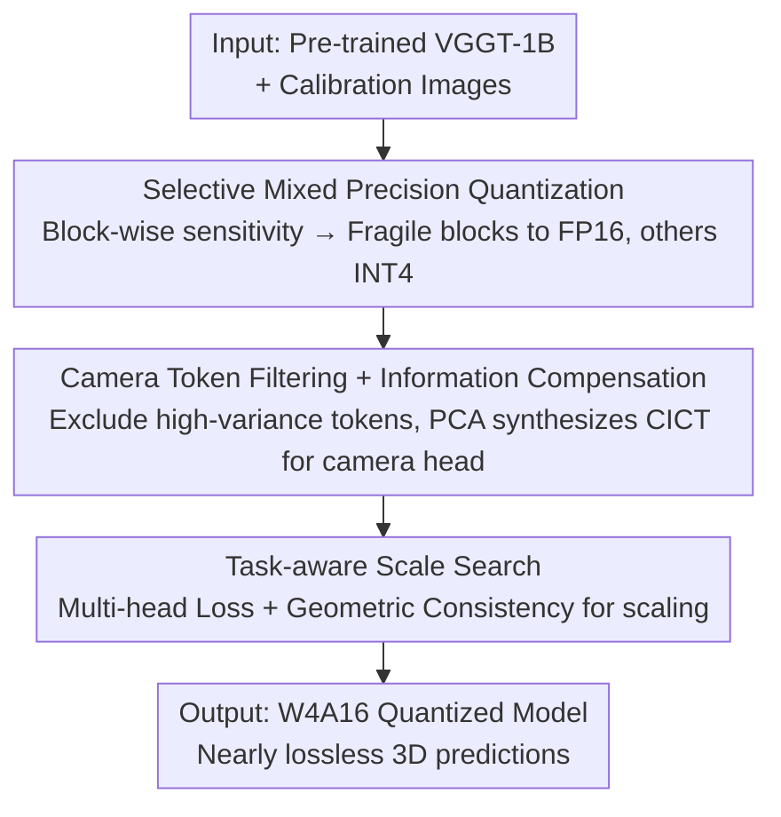

# QVGGT: Post-Training Quantized Visual Geometry Grounded Transformer

**Conference**: CVPR 2026  
**arXiv**: [2605.31124](https://arxiv.org/abs/2605.31124)  
**Code**: https://ddsacu.github.io/QVGGT/ (Project Homepage)  
**Area**: Model Compression / 3D Vision  
**Keywords**: Post-Training Quantization, VGGT, Mixed Precision, Camera tokens, Geometric consistency

## TL;DR
Targeting the 1.26B parameter feed-forward 3D reconstruction model VGGT, this paper proposes QVGGT, a geometry-aware post-training quantization framework. By utilizing "block-wise sensitivity mixed precision + camera token filtering compensation + task-aware scale search," it achieves nearly lossless performance under W4A16 (CO3Dv2 camera pose AUC@30 89.4 vs. FP16 89.5), while reducing memory by 3–4.9× and providing up to 2.8× hardware speedup.

## Background & Motivation
**Background**: Feed-forward methods that directly regress 3D attributes from images (e.g., DUSt3R, MASt3R) are replacing traditional iterative SfM/MVS optimization pipelines. VGGT represents the state-of-the-art in this direction, predicting camera parameters, depth maps, and point clouds in a single forward pass, unifying multi-view 3D perception into a single transformer.

**Limitations of Prior Work**: VGGT contains 1.26 billion parameters, resulting in high VRAM and compute requirements that hinder deployment on edge devices like drones or mobile AR. In model compression, pruning and distillation offer limited practical speedup on modern hardware, while quantization can simultaneously compress size and increase speed—yet **applying quantization to large-scale 3D reconstruction transformers remains virtually unexplored**.

**Key Challenge**: Directly applying mature PTQ methods from LLM/ViT (such as GPTQ, AWQ, SmoothQuant) to VGGT results in severe performance degradation (AWQ AUC@30 on CO3Dv2 collapses from 89.5 to 54.6 in W4A16). The root causes lie in the unique structure of 3D geometric transformers: ① quantization sensitivity varies significantly across transformer blocks; ② activation magnitudes of camera and register tokens are exceptionally large, dominating quantization scale estimation; ③ standard layer-wise reconstruction error does not equate to downstream 3D geometric quality.

**Goal / Core Idea**: Instead of treating VGGT as a generic transformer for uniform quantization, the authors decompose these three structural characteristics from a **geometry-aware perspective**. Fragile blocks are kept in higher precision; "troublemaking" camera tokens are filtered during calibration and their geometric information is compensated back; and a multi-head task loss combined with cross-head geometric consistency is used to select quantization scales, aligning the quantization objective with 3D reconstruction quality.

## Method

### Overall Architecture
QVGGT is a three-stage weight-only post-training quantization pipeline (focusing on weight quantization with activations remaining floating-point, defaulting to W4A16 per-group). Given a pre-trained VGGT-1B and a small batch of calibration images, it outputs a quantized lightweight model with nearly lossless 3D prediction heads. The three stages proceed as follows: first, **block-wise sensitivity analysis** determines which blocks remain FP16 and which are compressed to INT4; second, **camera/register token anomalies** are handled by filtering them during scale search and using PCA to synthesize a compensation token for the camera head; finally, **task-aware scale search** replaces the standard layer-wise reconstruction target with a multi-head loss and cross-head geometric consistency.

### Key Designs

**1. Selective Mixed Precision Quantization: High Precision for Fragile Blocks**

The authors conducted a fine-grained block-wise sensitivity analysis by quantizing individual Alternating-Attention (AA) blocks and observing the impact on downstream prediction heads. The conclusion was counter-intuitive: **the camera head has the strongest and most unstable dependency on block precision**. Certain blocks, once quantized, cause camera pose errors to skyrocket, while depth and point cloud heads remain relatively robust. Further linear-layer analysis revealed that attention projection layers have the lowest sensitivity, while the first FFN layer has the highest. Based on this sensitivity ranking, the 14th, 17th, and 23rd frame blocks and the 23rd global block were identified as fragile. For these, **only attention projection layers are quantized, while others remain FP16**; all other robust blocks undergo full INT4 quantization. This maximizes compression while shielding the most sensitive parts from quantization noise.

**2. Camera Token Filtering + Information Compensation (CIC): Removing Outliers from Calibration and Restoring Geometric Cues**

Sensitivity analysis identified the camera head as particularly fragile. Visualization revealed the culprits to be **camera tokens (the sole input to the camera head) and register tokens**, which exhibit activation magnitudes far exceeding image tokens. In activation-aware quantization, the scale $s$ is optimized to minimize:
$$\mathcal{L}(s)=\lVert Q(W\operatorname{diag}(s))\operatorname{diag}(s)^{-1}X-WX\rVert$$
where $X=[t_C;t_R;t_I]$ concatenates camera, register, and image tokens. When camera/register tokens have massive magnitudes, the optimization is "hijacked," tilting the scale towards these outliers and coarsening the resolution for other channels.

The solution is two-fold. **Filtering**: During calibration, only image tokens are used to search for scales, ensuring $s^*$ reflects the dynamic range of the majority. **Compensating (CICT)**: Removing camera tokens discards global geometric cues. Thus, the authors synthesize a compensation token from the calibration distribution. Specifically, top-$K$ principal components $U_K$ are extracted from centered camera tokens $X_c$. Each sample is projected $z^{(i)}=U_K^\top(x_c^{(i)}-\mu)$, and the mean projection $\bar z$ is used to reconstruct $\tilde x_{\text{CICT}}=\mu+U_K\bar z$. Its norm is then normalized to match image patches: $x_{\text{CICT}}=\tilde x_{\text{CICT}}\cdot\overline{\lVert x_p\rVert_2}/\lVert\tilde x_{\text{CICT}}\rVert_2$. During inference, this stable, dataset-level global geometric prior is appended to the sequence.

**3. Task-aware Scale Search: Using 3D Task Quality Instead of Layer-wise Error**

Standard quantization minimizes layer-wise output error, but numerical fidelity doesn't guarantee 3D accuracy, as VGGT heads are coupled via strict geometry. The authors replace the search objective with task-level goals. **Multi-head Loss**: Uses predictions and GT to calculate $L_{\text{camera}}$ (Huber loss $\lVert\cdot\rVert_\varepsilon$), $L_{\text{depth}}$, and $L_{\text{point}}$. **Geometric Consistency Loss**: Leverages natural redundancy—using predicted depth $\mathbf D$, intrinsics $\mathbf K$, and extrinsics $\mathbf E$ to back-project depth into a point cloud $\mathbf W^{\text{proj}}$, requiring it to match the direct point cloud output $\mathbf W^{\text{direct}}$:
$$\mathcal{L}_{\text{geom}}=\frac{1}{|\Omega|}\sum_{(u,v)\in\Omega}\lVert\mathbf W^{\text{direct}}-\mathbf W^{\text{proj}}\rVert_2$$
The final objective is $L_{\text{task}}(s)=L_{\text{recon}}+L_{\text{camera}}+\alpha L_{\text{depth}}+\beta L_{\text{point}}+L_{\text{geo}}$, where $\alpha=\beta=1$. This searches for scales that preserve cross-head 3D structural consistency.

### Loss & Training
The process is **training-free** (pure PTQ). Calibration and scale search were performed on an RTX 4090 (24GB). Images were sampled from CO3Dv2 and ScanNet. Quantization uses symmetric uniform quantization $Q(w)=\Delta\cdot\text{Round}(w/\Delta)$ with $\Delta=\max(|w|)/2^{N-1}$, configured as W4A16 per-group. The task-aware objective $L_{\text{task}}$ is used only for grid searching scales, not for weight updates.

## Key Experimental Results

### Main Results

Camera Pose Estimation (random 10 frames per scene, higher AUC@30 is better):

| Method | W/A | CO3Dv2 AUC@30 | Re10K AUC@30 | CO3Dv2 Latency |
|------|-----|---------------|--------------|-------------|
| Baseline | FP16 | 89.5 | 85.3 | 0.38s |
| SmoothQuant | W8A8 | 87.9 | 81.3 | 0.62s |
| QuantVGGT | W4A16 | 89.2 | 84.4 | - |
| GPTQ | W4A16 | 76.9 | 75.6 | 0.28s |
| AWQ | W4A16 | 54.6 | 59.2 | 0.28s |
| **QVGGT (Ours)** | W4A16 | **89.4** | **85.0** | **0.23s** |

General PTQ methods collapse under W4A16 (AWQ at 54.6), highlighting the difficulty of direct transfer. QVGGT is nearly lossless and provides the lowest latency (0.23s).

3D Reconstruction (Point cloud, lower Acc/Comp is better, higher NC is better):

| Method | W/A | 7-Scenes Acc↓ | 7-Scenes NC↑ | NRGBD Acc↓ | NRGBD NC↑ |
|------|-----|---------------|--------------|------------|-----------|
| Baseline | FP16 | 0.030 | 0.847 | 0.024 | 0.922 |
| SmoothQuant | W8A8 | 0.067 | 0.702 | 0.062 | 0.769 |
| GPTQ | W4A16 | 0.051 | 0.802 | 0.053 | 0.872 |
| AWQ | W4A16 | 0.043 | 0.819 | 0.047 | 0.891 |
| **QVGGT (Ours)** | W4A16 | **0.031** | **0.849** | **0.029** | **0.925** |

### Ablation Study

Component-wise ablation (Q=Naive Quant, S=Selective Mixed Precision, D=Token Filtering/Comp, T=Task-aware Search):

| Q | S | D | T | CO3Dv2 AUC@30↑ | NRGBD Acc Mean↓ |
|---|---|---|---|----------------|------------------|
| ✓ | – | – | – | 54.57 | 0.122 |
| – | ✓ | – | – | 80.76 | 0.057 |
| – | ✓ | ✓ | – | 85.91 | 0.054 |
| – | ✓ | ✓ | ✓ | **89.39** | **0.029** |

### Key Findings
- **Mixed Precision is most significant**: Naive quantization results in an AUC@30 of 54.57. Adding selective mixed precision jumps to 80.76 (+26 pts), proving that block-wise heterogeneity and protecting critical layers is the primary hurdle.
- **Incremental gains from all components**: Token filtering/compensation adds 5 pts (85.91), and task-aware search adds 3.5 pts to reaching 89.39.
- **Robustness to calibration size**: Performance remains stable from 16 to 128 images, making it practical for deployment.
- **Generalization**: RealEstate10K (not in calibration) achieved 85.0 (vs. FP16 85.3), indicating improvements stem from geometry-aware design rather than overfitting.

## Highlights & Insights
- **Diagnostic Quantization**: Rather than a uniform bit-width, the authors perform "check-ups" via sensitivity analysis to prescribe a mixed-precision recipe. This strategy is transferable to other multi-head/multi-task large models.
- **Dual-Phase Token Handling**: Treating camera tokens differently during calibration (as noise) and inference (as cues) is clever. The PCA-based CICT provides an elegant compromise to preserve information without polluting scale estimation.
- **Leveraging Geometric Redundancy**: VGGT’s redundant head designs (direct point cloud vs. back-projected) are repurposed as consistency constraints for quantization without extra cost.

## Limitations & Future Work
- **Weight-only (W4A16) limitations**: Only weights are quantized while activations remain FP16. More aggressive activation quantization (e.g., W4A4) remains unexplored.
- **Manual thresholds for mixed precision**: Fragile blocks are selected based on analysis; the automation of this process for different backbones was not detailed.
- **Dependence on GT for scale search**: Task-aware search depends on ground truth for calibration, making it less adaptable to scenes without geometric labels.

## Related Work & Insights
- **vs. QuantVGGT**: Both study VGGT PTQ. While QuantVGGT focuses on generic numerical stability (outlier smoothing), QVGGT emphasizes geometry-aware design by explicitly restoring camera token contributions and using geometric consistency to guide search.
- **vs. AWQ/GPTQ**: These generic LLM/ViT methods collapse on VGGT due to its specialized tokens and task sensitivity. QVGGT adapts the grid-search paradigm of AWQ for 3D reconstruction quality.

## Rating
- Novelty: ⭐⭐⭐⭐ One of the first PTQ works for 3D geometric transformers with structural-specific components.
- Experimental Thoroughness: ⭐⭐⭐⭐ Covered 4 benchmarks, 2 task types, and robust ablation, though activation quantization was not addressed.
- Writing Quality: ⭐⭐⭐⭐ Clear logic: motivation → diagnosis → method.
- Value: ⭐⭐⭐⭐ Enables 1.2B VGGT to run nearly lossless on consumer GPUs, highly practical for edge-side 3D perception.

<!-- RELATED:START -->

## Related Papers

- [\[ICLR 2026\] PTQ4ARVG: Post-Training Quantization for AutoRegressive Visual Generation Models](../../ICLR2026/model_compression/ptq4arvg_post-training_quantization_for_autoregressive_visual_generation_models.md)
- [\[ACL 2026\] Task-Stratified Knowledge Scaling Laws for Post-Training Quantized LLMs](../../ACL2026/model_compression/task-stratified_knowledge_scaling_laws_for_post-training_quantized_large_languag.md)
- [\[CVPR 2026\] Progressive Supernet Training for Efficient Visual Autoregressive Modeling](progressive_supernet_training_for_efficient_visual_autoregressive_modeling.md)
- [\[CVPR 2026\] VLM-PTQ: Efficient Post-Training Quantization for Large Vision-Language Models](vlm-ptq_efficient_post-training_quantization_for_large_vision-language_models.md)
- [\[CVPR 2026\] CAR-SAM: Cross-Attention Reconstruction for Post-Training Quantization of the Segment Anything Model](car-sam_cross-attention_reconstruction_for_post-training_quantization_of_the_seg.md)

<!-- RELATED:END -->
