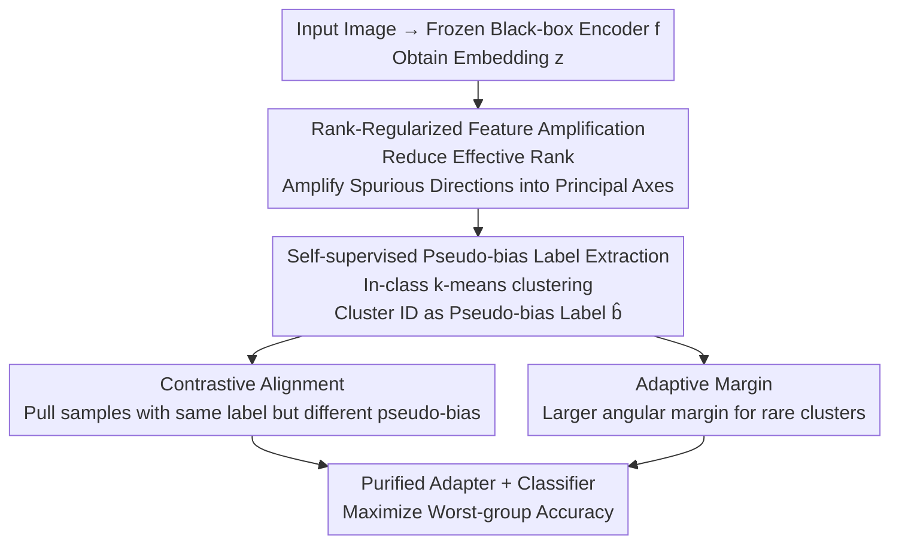

# Rank-Guided Pseudo-Bias Learning for Robust Black-Box Adaptation

**Conference**: CVPR 2026  
**Paper**: [CVF Open Access](https://openaccess.thecvf.com/content/CVPR2026/html/Dwivedi_Rank-Guided_Pseudo-Bias_Learning_for_Robust_Black-Box_Adaptation_CVPR_2026_paper.html)  
**Code**: None  
**Area**: Black-Box Adaptation / Group Robustness / Fairness  
**Keywords**: Black-box debiasing, Worst-group accuracy, Rank regularization, Pseudo-bias labels, Adaptive margin  

## TL;DR
PLD-Debias attaches a lightweight adapter to a completely frozen, parameter-invisible pre-trained vision encoder. It first "amplifies" latent spurious correlation directions via rank regularization and performs clustering to obtain pseudo-bias labels with 90%+ fidelity. Finally, it purifies representations using a dual loss approach of contrastive alignment and cluster-adaptive margins, achieving SOTA worst-group accuracy on CelebA, Waterbirds, and CMNIST without any group annotations.

## Background & Motivation
**Background**: Foundation models such as CLIP, DINOv2, and SAM are standardly used as frozen feature extractors. However, they inherit significant spurious correlations from pre-training corpora—for instance, binding "waterbirds" to "water backgrounds" or "blond hair" to "female." This causes a sharp drop in accuracy for minority sub-groups (e.g., blond males, waterbirds on land backgrounds). Data cited in the paper shows that CLIP zero-shot classification can drop by 80.7 percentage points on the worst group compared to the average.

**Limitations of Prior Work**: Traditional group robustness methods (Group-DRO, adversarial debiasing, LfF) assume that explicit group labels (e.g., gender, background) are available during training. In reality, these annotations are often unattainable due to privacy, cost, or because the encoder itself is a black-box API. Furthermore, retraining foundation models is computationally impractical.

**Key Challenge**: Debiasing under the extreme setting where "encoder parameters are inaccessible (black-box) + group labels are absent (unsupervised)" simultaneously. Existing unsupervised methods have gaps: JTT requires gradient-based retraining, which is incompatible with black-box APIs; Co-Adapt (Contrastive Adapter) only learns representations without correcting classification boundaries, leaving it sensitive to severe class imbalance; Cluster-Margin (CM) only expands decision margins without learning robust representations. No existing method simultaneously addresses representation learning and classification confidence recalibration.

**Key Insight**: The authors observe that since spurious features are "easily learned principal directions," one can do the opposite: actively use **rank regularization** to force the adapter's feature covariance to collapse onto a few principal directions. This intentionally amplifies spurious attributes, making them highly separable in the feature space. Once amplified, clustering can separate samples according to hidden biases with near-perfect accuracy.

**Core Idea**: The authors integrate "bias amplification → clustering for pseudo-labels → contrastive alignment + adaptive margin debiasing" into an end-to-end pipeline (PLD-Debias) that does not modify the backbone. It uses pseudo-bias labels driven by the adapter to substitute for real group annotations.

## Method

### Overall Architecture
The method aims to maximize worst-group accuracy (WG-Acc) using only a trainable adapter $g_\phi$ and classifier $h_\theta$ on top of a frozen black-box encoder $f$, without bias labels $b$. The pipeline consists of three sequential stages: **Stage 1** trains the adapter with rank regularization to amplify latent spurious directions into separable clusters; **Stage 2** performs k-means within each class on the amplified features to obtain pseudo-bias labels $\hat b_i$; **Stage 3** uses these pseudo-labels to execute both contrastive alignment loss and cluster-adaptive margin loss, purifying representations and tilting decision boundaries toward minority groups. The backbone remains frozen throughout, acting as a plug-and-play classifier adapter.

Given input $x_i$, the frozen encoder produces embedding $z_i = f(x_i)$. The adapter output is $u_i = g_\phi(z_i)$. Groups are defined as $G_{y,b} := \{i : y_i = y, b_i = b\}$. The robustness metric is:

$$\text{WG-Acc}(h) = \min_{(y,b)} \frac{1}{|G_{y,b}|} \sum_{i \in G_{y,b}} \mathbb{1}[h(g_\phi(z_i)) = y_i].$$

### Key Designs

**1. Rank-Regularized Feature Amplification: Actively "Enlarging" Spurious Directions to Eliminate Them**

Clustering directly on black-box features makes it difficult to separate bias groups because spurious signals are submerged within task-related signals. The authors' counter-intuitive approach is to amplify them first. Let the centered adapter output matrix for the current mini-batch be $U \in \mathbb{R}^{n \times p}$ (where each row $U_{i,:} = u_i - \bar u$). Define the diagonal matrix $D = \text{diag}(\frac{1}{n} U^\top U)$ and the normalized correlation matrix $C = D^{-1/2}(\frac{1}{n} U^\top U) D^{-1/2}$. The training objective is:

$$L_{\text{rank}} = L_{\text{CE}}(h_\theta(g_\phi(z_i)), y_i) - \lambda_{\text{rank}} \sum_{j \neq k} C^2_{jk}.$$

Note the sign: the penalty is $-\lambda_{\text{rank}} \sum_{j\neq k} C^2_{jk}$, which **rewards** high correlation between features and **encourages** the increase of off-diagonal energy. This squeezes variance into a few principal directions and reduces the effective rank. Based on the Davis–Kahan theorem, the authors demonstrate that the principal eigenvectors of the regularized correlation matrix align with the latent bias direction $v_b$. A larger eigengap makes the bias direction more identifiable. After several epochs, the penultimate activations of the adapter form clusters well-separated by bias. This step is the foundation of the pipeline, directly determining the fidelity of the subsequent pseudo-labels.

**2. Self-supervised Pseudo-bias Label Extraction: Clustering within Classes to Recover Group Signals**

After amplification, the authors perform k-means **separately within each task class $c$** (selecting $k$ via silhouette score on a held-out subset; typically $k \in \{4,6\}$). The cluster indices are used directly as pseudo-bias labels $\hat b_i$. Clustering within classes rather than globally ensures that the clustering captures "internal bias differences within a class" (e.g., male vs. female within the blond hair group) rather than the task classes themselves. The paper emphasizes that the preceding rank regularization improves the signal-to-noise ratio of bias features, making mis-clustering rare. Empirically, pseudo-labels match true bias annotations with >98% accuracy on CMNIST and >92% on Waterbirds, approaching oracle performance.

**3. Contrastive Alignment + Adaptive Margin: Dual-path Representation Purification and Boundary Recalibration**

Once pseudo-labels are obtained, two loss paths are used to eliminate residual spurious correlations. **Contrastive Alignment** constructs positive pairs $P = \{(i,j): y_i = y_j, \hat b_i \neq \hat b_j\}$ (same task label, different pseudo-bias) and negative pairs $N = \{(i,j): y_i \neq y_j\}$. The temperature-scaled supervised contrastive loss is:

$$L_{\text{con}} = -\frac{1}{|B|} \sum_{i \in B} \log \frac{\sum_{j \in P_i} \exp(\cos(u_i,u_j)/\tau)}{\sum_{j \in P_i \cup N_i} \exp(\cos(u_i,u_j)/\tau)}.$$

This explicitly pulls together samples with "consistent labels but different biases," collapsing the previously amplified spurious directions. **Adaptive Margin** then grants larger angular margins to rare bias clusters to balance decision boundaries. The margin $m^{\hat b}_c$ for class $c$ in pseudo-bias cluster $\hat b$ is sampled from a normal distribution:

$$m^{\hat b}_c \sim \mathcal{N}\!\left(1 - \frac{n^{\hat b}_c + \epsilon}{\sum_{c' \in C} n^{\hat b}_{c'} + \epsilon},\, \sigma\right),$$

where $n^{\hat b}_c$ is the number of samples for class $c$ in cluster $\hat b$. Fewer samples result in a mean closer to 1 and thus a larger margin. Plugging this into angular softmax, the logit becomes $\ell_{i,k} = s\cos(\theta_{i,k} + m^{\hat b_i}_k)$, where $\theta_{i,k} = \arccos\frac{w_k^\top u_i}{\|w_k\|\|u_i\|}$ and $s$ is a scaling factor, yielding the adaptive margin cross-entropy $L_{\text{AM}}$. This path compensates for the gaps in Co-Adapt and CM.

### Loss & Training
The training consists of two stages. **Stage 1** ($T_1=100$ epochs): Freeze the backbone and use $L^{(1)} = L_{\text{CE}} + \lambda_{\text{rank}} L_{\text{rank}}$ to amplify bias. Midway, perform in-class k-means to fix pseudo-labels. **Stage 2** ($T_2=100$ epochs): Use the joint objective:

$$L = L_{\text{AM}} + \lambda_{\text{con}} L_{\text{con}}$$

to train the adapter-classifier stack. Hyperparameters include $\tau=0.5$, $s \in \{8,12\}$, and $\sigma \in (0.10, 0.25)$, tuned on a balanced validation set. The paper also provides a theoretical decomposition, bounding the worst-group risk $R_{\max}(h_T) \le C_0(R_{\text{base}} + \varepsilon_{\text{clust}} + \alpha\lambda_{\text{con}} L_{\text{con}} + \Psi(m_{\min};\beta_{\min}) + \text{Opt}(T))$, illustrating how clustering error, cross-group alignment, adaptive margins, and optimization accuracy each contribute to robustness.

## Key Experimental Results

### Main Results
Experiments were conducted on three datasets (CelebA / Waterbirds / CMNIST) and three backbones (ResNet-18 / CLIP RN-50 / ViT-B/16), comparing against ERM, Co-Adapt, and Cluster-Margin (CM).

| Dataset | Backbone | Method | Worst Group↑ | Average↑ | Gap↓ |
|---------|----------|--------|--------------|----------|------|
| CelebA | ResNet-18 | ERM | 27.20 | 75.43 | 48.23 |
| CelebA | ResNet-18 | CM (Prev. SOTA) | 80.79 | 85.56 | 4.77 |
| CelebA | ResNet-18 | **Ours** | **83.10** | 85.42 | **2.32** |
| Waterbirds | ResNet-18 | CM | 80.29 | 84.56 | 4.27 |
| Waterbirds | ResNet-18 | **Ours** | **83.01** | 85.26 | **2.25** |
| Waterbirds | CLIP | **Ours** | **84.92** | 87.07 | **2.15** |

On CelebA, the worst-group accuracy of **Ours** is 44.2 points higher than ERM and 2.81 points higher than the Prev. SOTA CM, while reducing the Gap to 2.32%. On CMNIST-0.9 with a CLIP backbone, bias-conflicting accuracy reached 95.61% with a Gap of 1.01%. Even in the extreme CMNIST-0.995 setting (where ERM essentially fails on bias-conflicting samples), this method maintains its lead.

### Ablation Study

| Configuration | Waterbirds Worst Group | CMNIST-0.9 BCo | Notes |
|---------------|------------------------|----------------|-------|
| CE | 38.90 | 61.72 | Pure cross-entropy baseline |
| CE + Contrastive (CL) | 66.67 | 84.56 | Only contrastive loss, no margin |
| CM | 80.29 | 81.91 | Only adaptive margin |
| CM + CL (Full) | 83.01 | 89.14 | Both loss paths active |

| Dataset | ResNet | ViT | CLIP | Notes |
|---------|--------|-----|------|-------|
| Waterbirds | 93.62% | 80.58% | 92.43% | Pseudo-bias vs. Ground-truth Match Rate |
| CMNIST-0.9 | 98.99% | 93.51% | 99.56% | Same as above |
| CMNIST-0.995 | 99.92% | 99.25% | 99.84% | Same as above |

### Key Findings
- **Contrastive Loss is strong even alone**: Adding contrastive alignment to CE (without margins) jumps Waterbirds worst-group accuracy from 38.90% to 66.67%, and CMNIST-0.9 bias-conflicting accuracy from 61.72% to 84.56%, already surpassing Co-Adapt and CM. This indicates that the pseudo-label-driven contrastive formulation itself can learn fairer representations.
- **Dual-path complementarity**: Combining contrastive (representation learning) and adaptive margin (boundary correction) achieves the full effect, validating the motivation to address both.
- **Pseudo-labels approach oracle**: Compared to an oracle version using ground-truth bias labels, the pseudo-label version is only 2.79% lower on Waterbirds, essentially achieving oracle-level robustness for free.
- **Lower fidelity on ViT**: Fidelity on ViT (e.g., 80.58% on Waterbirds) is a relative weakness.

## Highlights & Insights
- **Counter-intuitive "amplify to eliminate" strategy**: While most debiasing methods try to suppress spurious features, this work first uses rank regularization to amplify them until they are separable, then clusters and purifies. Converting "hard-to-observe biases" into "explicitly clusterable groups" is the most clever step.
- **Pseudo-bias labels as substitutes**: High-fidelity (90%+) unsupervised pseudo-labels allow the most rigorous "no group labels + black-box" setting to reach near-oracle performance, which is highly practical for privacy-sensitive or API-only deployments.
- **Plug-and-play**: The entire process does not touch the backbone; it is merely a classifier adapter attached to a frozen foundation model, transferable to any downstream debiasing scenario involving frozen encoders.
- The perspective of rank regularization ("reducing effective rank = exposing dominant bias directions") can be transferred to other tasks requiring the "explicitation of hidden factors."

## Limitations & Future Work
- **Reliance on bias amplification**: The method assumes spurious directions are "easily learned principal directions." Whether it can amplify separable clusters in complex scenarios where biases are not dominant or are entangled remains questionable.
- **Sensitivity of $k$ in in-class clustering**: Selecting $k$ via silhouette scores may be unstable when group structures are not distinct. The lower fidelity on ViT indicates sensitivity to the backbone.
- **Large Gap persists on CMNIST-0.995**: In cases of extreme spurious correlation, ResNet-18 still shows a 25.42% Gap, suggesting robustness is far from saturated.
- Experiments focused on three classic benchmarks; generalizability to large-scale real-world scenarios needs further validation.

## Related Work & Insights
- **vs. Group-DRO / LfF**: These require explicit group labels; **Ours** substitutes them with unsupervised pseudo-labels, adapting to the no-annotation + black-box setting.
- **vs. JTT**: JTT identifies error samples via gradient-based retraining, which is incompatible with black-box APIs; **Ours** uses a pure adapter and does not touch the backbone.
- **vs. Co-Adapt (Contrastive Adapter)**: Co-Adapt uses internal predictions to guide contrastive learning and ignores boundary correction, making it sensitive to class imbalance; **Ours** adds adaptive margins to recalibrate classification confidence.
- **vs. Cluster-Margin (CM)**: CM only expands decision margins in the bias feature space and does not learn robust representations; **Ours** integrates contrastive alignment and adaptive margins for a complementary effect, surpassing CM in main experiments.
- **vs. Rank Regularization (RR)**: While RR uses high feature correlation to suppress rank and amplify spurious attributes, RR alone does not fix classification boundaries; **Ours** uses rank regularization as the first stage before applying the dual debiasing loss.

## Rating
- Novelty: ⭐⭐⭐⭐ A counter-intuitive pipeline of "amplifying then clustering," integrating existing components into an end-to-end black-box solution.
- Experimental Thoroughness: ⭐⭐⭐⭐ Three datasets, three backbones, ablation, pseudo-label fidelity, and oracle comparisons; however, benchmarks are somewhat traditional.
- Writing Quality: ⭐⭐⭐⭐ Clear methodology and comprehensive theoretical decomposition, though mathematical symbols require careful cross-referencing.
- Value: ⭐⭐⭐⭐ Practical for plug-and-play debiasing in "no group label + black-box" settings, especially for privacy-sensitive or API deployments.

<!-- RELATED:START -->

## Related Papers

- [\[CVPR 2026\] Bias In, Bias Out? Finding Unbiased Subnetworks in Vanilla Models](bias_in_bias_out_finding_unbiased_subnetworks_in_vanilla_models.md)
- [\[CVPR 2026\] Bias at the End of the Score](bias_at_the_end_of_the_score.md)
- [\[CVPR 2026\] Data-Centric Meta-Learning for Robust Few-Shot Generalization](data-centric_meta-learning_for_robust_few-shot_generalization.md)
- [\[CVPR 2026\] Revisiting Sparsity Constraint Under High-Rank Property in Partial Multi-Label Learning](revisiting_sparsity_constraint_under_high-rank_property_in_partial_multi-label_l.md)
- [\[NeurIPS 2025\] The Persistence of Neural Collapse Despite Low-Rank Bias](../../NeurIPS2025/others/the_persistence_of_neural_collapse_despite_low-rank_bias.md)

<!-- RELATED:END -->
