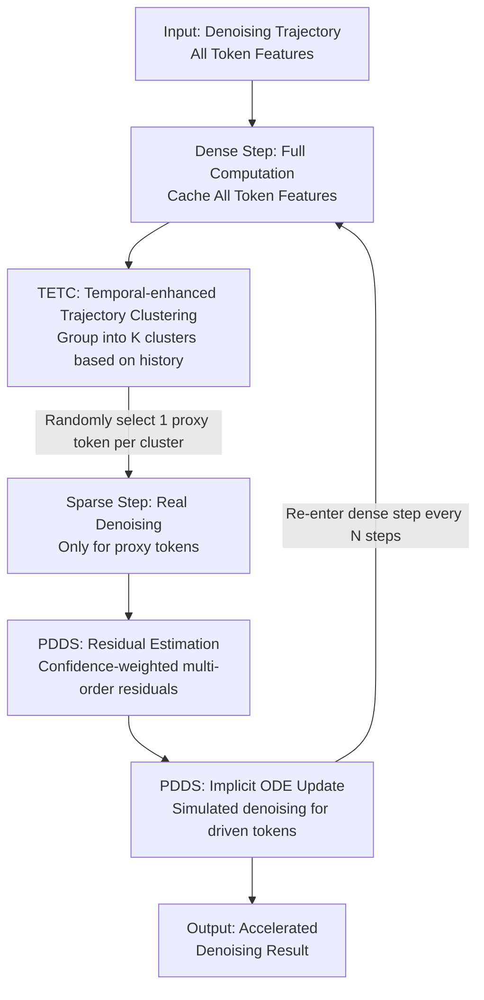

# ResCa: Residual Caching for Diffusion Transformers Acceleration

**Conference**: CVPR 2026  
**Paper**: [CVF Open Access](https://openaccess.thecvf.com/content/CVPR2026/html/Fang_ResCa_Residual_Caching_for_Diffusion_Transformers_Acceleration_CVPR_2026_paper.html)  
**Area**: Model Compression / Diffusion Model Acceleration  
**Keywords**: Diffusion Transformer Acceleration, feature caching, token reduction, proxy denoising, implicit ODE

## TL;DR
ResCa is a training-free diffusion Transformer acceleration framework: it clusters tokens according to "historical denoising trajectories," performs real denoising only for one "proxy token" per cluster, and uses its calculated multi-order residuals to "simulate" the denoising of other tokens in the same cluster. This maintains a denoising direction that is both "self-representative and updated," achieving up to 5.5× GFLOPs acceleration on FLUX with nearly zero loss in image quality.

## Background & Motivation

**Background**: Diffusion Transformers (DiT, FLUX, HunyuanVideo, etc.) have shown impressive performance in high-fidelity image/video generation. However, each denoising step requires processing all tokens through the entire network, leading to extremely high inference costs. Consequently, the community has developed three types of acceleration methods: reducing steps at the sampler level (DDIM, DPM-Solver), model-level pruning/quantization, and feature-level token reduction. Token reduction is particularly favored due to its "training-free, plug-and-play" nature, mainly following two paths: caching and merging.

**Limitations of Prior Work**: The authors attribute the failure of both paths to the "destruction of the denoising direction." Caching methods (ToCa, DuCa, TokenCache) directly reuse token features from the previous timestep; however, due to residual connections, the reused features do not actually stay static, resulting in a **non-updated** denoising direction. Merging methods (ToMeSD, ToMA, SDTM) combine similar tokens into one, sharing mixed features, which causes each token to follow someone else's direction, resulting in a **non-self** denoising direction. In either case, tokens skipped from computation fail to follow a trajectory that is both "self-representative" and "currently updated," thus damaging image quality. Hybrid methods (ClusCa) attempt to use both temporal caching and spatial similarity, but the weight of the spatial term is often too small to unlock its full potential.

**Key Challenge**: To save computation, one must skip the real calculation of most tokens. However, once skipped, the omitted tokens either use their old selves (non-updated) or current others (non-self), both of which deviate from the true trajectory obtained by full computation. Is it possible for skipped tokens to both retain their identity and obtain the current update information?

**Key Insight**: The authors conducted two sets of preliminary experiments to find a breakthrough. First, "where to find similar residuals": projecting high-dimensional feature trajectories into 3D visualizations revealed that clustering by "the entire historical trajectory" groups truly similar tokens together better than clustering by "last-step feature similarity" (the latter mis-clusters tokens with significantly different trajectories). Intra-cluster residual distances are indeed smaller under historical clustering. Second, "which order of residuals to use": denoting the feature itself as the 0-order residual, the difference between adjacent timesteps as the 1st-order, and subsequent differences as higher orders, it was found that the intra-cluster distances of 1st/2nd/3rd-order residuals are much smaller than the 0-order (which still encodes the token's own representation and high individual differences). Excessively high orders amplify noise, and the "usability" of a certain order residual can be linearly extrapolated from the trajectory relationship at the previous timestep.

**Core Idea**: A "proxy denoising" perspective is proposed—only one token per cluster is chosen as a "proxy" for real denoising. The multi-order residuals calculated from this proxy are treated as **direction refinement terms**, which are superimposed onto other tokens' **own** cached features to perform "simulated denoising." Thus, each skipped token uses its own cached features as the main direction (self component) and the proxy's current residual as correction (updated component), resulting in a trajectory that is both self-representative and updated.

## Method

### Overall Architecture
ResCa segments the entire denoising process into alternating **dense steps** and **sparse steps**, with a cache interval of $N$. In dense steps, all tokens pass through the full network to cache their respective features, and the TETC module clusters tokens into $K$ clusters based on historical trajectories. In the subsequent $N-1$ sparse steps, real denoising is performed only for one proxy token per cluster, while the remaining "driven tokens" are updated via the PDDS module using the proxy's residuals to simulate movement, skipping their actual forward passes. The entire pipeline is training-free and can be directly applied to DiT / FLUX / HunyuanVideo.

### Key Designs

**1. TETC: Temporal-enhanced Trajectory Clustering**

Preliminary experiments showed that clustering by last-step feature similarity (as merging methods do) mis-groups tokens with different trajectories, leading to reused residuals being dissimilar and introducing incorrect guidance. TETC switches to clustering by the entire historical trajectory, assigning more weight to more recent timesteps (as recent trajectories are more relevant for predicting future residuals). This involves three steps: first, calculating the pairwise cosine similarity matrix $\mathcal{S}_t=\frac{X_tX_t^\top}{\|X_t\|_2\|X_t^\top\|_2}$ for all tokens at each timestep $t$; second, incorporating history via temporal moving average to obtain cumulative similarity:

$$\tilde{\mathcal{S}}_t=\alpha_{\mathcal{S}}\cdot\mathcal{S}_t+(1-\alpha_{\mathcal{S}})\cdot\tilde{\mathcal{S}}_{t+1},$$

where $\alpha_{\mathcal{S}}$ controls the emphasis on recent timesteps; finally, performing K-medoids clustering under the $\tilde{\mathcal{S}}_t$ distance metric to minimize $\sum_{t}\sum_{k}\mathbb{I}(X_t\in C_k)\cdot(1-\tilde{\mathcal{S}}_t(X_t,C_k))$. K-medoids is chosen over K-means because it forces cluster centers to be actual tokens, allowing a cluster center to be naturally selected as the proxy token $p_k$ for each cluster $C_k$, with the rest being driven tokens $D_k=\{X_i\mid X_i\in C_k, X_i\neq p_k\}$. Using "trajectory similarity" as the clustering basis ensures the proxy residual can represent the entire cluster.

**2. Proxy-driven Residual Estimation: Integrating "Self-Residual" and "Proxy Future Residual"**

Once proxies are defined, the key is to safely "borrow" denoising information from the proxy to driven tokens without simple replication. ResCa recursively constructs multi-order residuals on proxy tokens as "derivative-like" descriptors: the 0-order is the feature itself $\mathcal{F}^{(0)}(p_t)=p_t$, and higher orders are obtained via finite differences $\mathcal{F}^{(m)}(p_t)=\mathcal{F}^{(m-1)}(p_t)-\mathcal{F}^{(m-1)}(p_{t+1})$. For each driven token, a **confidence** $\theta_t^{(m)}=\max\big(0,\cos(\mathcal{F}^{(m)}(p_t),\mathcal{F}^{(m)}(d_t))\big)\in[0,1]$ is calculated based on how well the $m$-th order residuals of the two trajectories align. This is used in a convex combination of the driven token's own residual and the proxy's residual at the next timestep to estimate the driven token's residual at $t-1$:

$$\hat{\mathcal{F}}^{(m)}(d_{t-1})=(1-\theta_t^{(m)})\cdot\mathcal{F}^{(m)}(d_t)+\theta_t^{(m)}\cdot\mathcal{F}^{(m)}(p_{t-1}).$$

Here, $\mathcal{F}^{(m)}(d_t)$ is the driven token's self-baseline direction (ensuring *self*), and $\mathcal{F}^{(m)}(p_{t-1})$ is the future correction calculated for the proxy (ensuring *updated*). $\theta_t^{(m)}$ acts as "adaptive trust": when trajectories align, it approaches 1, aligning strongly to the proxy's latest residual; when they differ, it reverts to using self-residuals, avoiding the forceful insertion of others' directions—directly addressing both "non-updated" and "non-self" issues.

**3. Implicit ODE Update: Plugging Estimated Residuals into Solvers**

The final step converts estimated residuals into actual token updates. The authors view driven token evolution as a backward-time ODE. Instead of explicitly modeling a continuous drift, they treat the estimated multi-order residuals $\{\hat{\mathcal{F}}^{(m)}(d_{t-1})\}$ as discrete approximations of time derivatives and apply the unit-step form of the implicit Taylor method for updates:

$$d_{t-1}=d_t+\sum_{m=1}^{M}\frac{1}{m!}\hat{\mathcal{F}}^{(m)}(d_{t-1}).$$

At $M=1$, it degrades to an implicit Euler step (ResCa-IE); these residuals can also be fed into standard implicit linear multi-step formats, such as BDF2 with unit step size (ResCa-IB), and higher-order $O$ implicit Taylor (ResCa-IT). The ingenuity lies in the fact that because residuals are derived from "estimated future states" rather than "reused historical states," the update enjoys the accuracy of high-order implicit solvers without additional diffusion model runs. This is the fundamental reason it outperforms TaylorSeer (historical extrapolation) and ClusCa (first-order hybrid).

### Loss & Training
ResCa is completely training-free and inserted during inference, with no trainable parameters or loss functions. Primary hyperparameters include cache interval $N$, number of clusters $K$, order of implicit method $O$, and temporal smoothing factor $\alpha_{\mathcal{S}}$. The IE, IB, and IT versions correspond to implicit Euler, BDF2, and Taylor respectively.

## Key Experimental Results

### Main Results
On FLUX.1-dev text-to-image (DrawBench 200 prompts, Image Reward / CLIP evaluation), ResCa achieves optimal quality at similar or higher acceleration ratios:

| Method | Attention | Latency(s)↓ | FLOPs(T)↓ | FLOPs Speedup↑ | Image Reward↑ | CLIP↑ |
|------|-----------|----------|-----------|------------|---------------|-------|
| FLUX.1-dev (50 steps) | ✔ | 25.82 | 3719.5 | 1.00× | 0.9898 | 19.761 |
| DuCa (N=5) | ✔ | 8.18 | 978.8 | 3.80× | 0.9955 | 19.314 |
| TaylorSeer (N=4,O=2) | ✔ | 9.24 | 1042.3 | 3.57× | 0.9857 | 19.496 |
| ClusCa (N=5,O=1,K=16) | ✔ | 8.12 | 897.0 | 4.14× | 0.9825 | 19.481 |
| **ResCa-IE (N=5,K=16)** | ✔ | 8.19 | 898.1 | 4.14× | **0.9958** | **19.537** |
| **ResCa-IT (N=6,O=2,K=16)** | ✔ | 7.17 | 749.5 | **4.96×** | 0.9937 | 19.452 |
| **ResCa-IB (N=7,K=16)** | ✔ | 6.82 | 675.2 | **5.51×** | 0.9889 | 19.441 |

Leading performance is also observed on DiT-XL/2 ImageNet 256×256 class-conditional generation (FID-50k):

| Method | FLOPs(T)↓ | Speedup↑ | FID↓ | sFID↓ |
|------|-----------|-------|------|-------|
| DDIM-50 steps | 23.74 | 1.00× | 2.32 | 4.32 |
| DuCa (N=3) | 9.54 | 2.49× | 2.85 | 4.64 |
| TaylorSeer (N=3,O=1) | 8.56 | 2.77× | 2.49 | 4.81 |
| **ResCa-IE (N=3,K=16)** | 9.20 | 2.58× | **2.37** | **4.63** |
| ClusCa (N=5,K=16) | 5.98 | 3.97× | 2.65 | 5.13 |
| **ResCa-IE (N=5,K=16)** | 5.99 | 3.96× | **2.62** | **5.08** |

On HunyuanVideo text-to-video (VBench, 946 prompts), ResCa-IE (N=6, K=32) achieves a 5.53× FLOPs speedup with a VBench score of 79.98, approximately 0.2% higher than TaylorSeer at a similar speedup ratio.

### Ablation Study
Ablation of residual order $O$ (DiT-XL/2, N=5):

| Config | FLOPs(T)↓ | FID↓ | sFID↓ |
|------|-----------|------|-------|
| DDIM-15 steps | 6.66 | 4.75 | 8.43 |
| ResCa-IT (O=1) | 5.99 | 2.62 | 5.08 |
| ResCa-IT (O=2) | 6.00 | **2.57** | 4.98 |
| ResCa-IT (O=3) | 6.00 | 2.58 | 5.02 |
| ResCa-IT (O=4) | 6.01 | 2.58 | 5.00 |

### Key Findings
- **Clustering methodology is critical**: Replacing feature similarity clustering with trajectory clustering noticeably eliminates overexposure and missing details (e.g., wheels, mouth details) in visualizations. The former reuses dissimilar residuals, injecting incorrect guidance—confirming the premise that "proxy residuals must represent the entire cluster."
- **First-order residuals are most cost-effective**: Moving from O=1 to O=2 slightly reduces FID (2.62→2.57), but higher orders (O=3/4) lead to a slight increase in FID and computational cost, as excessively high-order residuals amplify micro-changes and noise. The authors default to first-order for simplicity.
- **Sweet spot for cluster number K**: K=16 or K=32 achieves the best quality-efficiency trade-off on FLUX (N=8, O=1). Default K=16.
- **"Estimating future" outperforms "Reusing history"**: Compared to TaylorSeer's historical Taylor extrapolation and ClusCa's first-order hybrid, ResCa's implicit ODE based on future residual estimation consistently yields better quality, indicating that historical extrapolation is insufficient for non-stationary diffusion dynamics.

## Highlights & Insights
- **The "self & updated" 2D decomposition is elegant**: The authors abstract the failure of caching as *non-updated* and merging as *non-self*. Using "self-cached features as the main direction + proxy residuals as correction" addresses both dimensions simultaneously, providing a strong framework that targets the root cause.
- **Multi-order residuals + confidence gating is a transferable trick**: Using cosine alignment $\theta_t^{(m)}$ to adaptively decide between "trusting self vs. trusting neighbor" is essentially a soft-gated feature reuse mechanism that can be transferred to any neighborhood-feature-sharing scenario (e.g., inter-video frames, attention token reuse).
- **Directly feeding residuals as ODE derivatives**: Treating finite difference residuals as discrete approximations of time derivatives for implicit Euler/BDF2/Taylor allows the acceleration method to naturally inherit the precision of mature high-order numerical formats, making it an engineering-friendly design.

## Limitations & Future Work
- **Significant overhead**: The costs of K-medoids in TETC, per-order cosine confidence calculations, and implicit updates are non-trivial. Latency speedup (e.g., 3.15×) is often lower than FLOPs speedup (4.14×), indicating some clock gains are consumed by overhead. The paper lacks a thorough scalability analysis across different resolutions/sequence lengths.
- **Random proxy selection**: Selecting a random token from the cluster center as the proxy lacks a "most representative proxy" strategy. If a cluster is internally heterogeneous, a single random proxy may not represent it well; strategies for proxy selection were not ablated.
- **Unexplored stability boundaries**: While implicit ODEs remain effective at large intervals (N=8), the paper does not discuss when divergence occurs, and the joint sensitivity of $N, K, O, \alpha_{\mathcal{S}}$ is only partially analyzed.
- **Metric limitations**: Aggregated metrics like Image Reward / CLIP / VBench may not capture systemic losses in long-range semantic consistency or rare details, where qualitative evidence provided is limited.

## Related Work & Insights
- **vs. Caching Methods (ToCa / DuCa / TokenCache)**: They reuse previous token features, yielding non-updated directions; ResCa reuses proxy residuals with confidence weighting, preserving the "updated by current timestep" component.
- **vs. Merging Methods (ToMeSD / ToMA / SDTM)**: They merge similar tokens to share features, yielding non-self directions; ResCa allows each driven token to use its own cached feature as the primary direction, retaining self-identity.
- **vs. Dynamic Prediction (TaylorSeer / FoCa)**: They use historical extrapolation or ODE modeling to "predict" features, which is insufficient for non-stationary dynamics; ResCa uses current-step calculated proxy residuals for future correction, adding a "current timestep anchor" to historical extrapolation.
- **vs. Hybrid Methods (ClusCa / SDTM)**: They linearly weight temporal cache and spatial features; ResCa injects spatial (intra-cluster proxy) information more precisely via gated residuals and implicit ODEs.

## Rating
- Novelty: ⭐⭐⭐⭐⭐ The combination of "self & updated" proxy denoising, multi-order residual confidence gating, and residual-based implicit ODEs is a fresh perspective in caching acceleration.
- Experimental Thoroughness: ⭐⭐⭐⭐ Coverage of DiT/FLUX/HunyuanVideo and image/video tasks is comprehensive, although wall-clock breakdown and proxy selection strategy ablations are sparse.
- Writing Quality: ⭐⭐⭐⭐ Clear motivation from preliminary experiments and intuitive illustrations; dense equations but logical consistency.
- Value: ⭐⭐⭐⭐ Training-free, plug-and-play, near-lossless 5.5× acceleration offers direct practical value for diffusion model deployment.

<!-- RELATED:START -->

## Related Papers

- [\[CVPR 2026\] BinaryAttention: One-Bit QK-Attention for Vision and Diffusion Transformers](binaryattention_one-bit_qk-attention_for_vision_and_diffusion_transformers.md)
- [\[CVPR 2026\] SODA: Sensitivity-Oriented Dynamic Acceleration for Diffusion Transformer](soda_sensitivity-oriented_dynamic_acceleration_for_diffusion_transformer.md)
- [\[CVPR 2026\] Trainable Log-linear Sparse Attention for Efficient Diffusion Transformers](trainable_log-linear_sparse_attention_for_efficient_diffusion_transformers.md)
- [\[CVPR 2026\] PPCL: Pluggable Pruning with Contiguous Layer Distillation for Diffusion Transformers](ppcl_pluggable_pruning_dit_distillation.md)
- [\[CVPR 2026\] Saliency-Driven Token Merging for Vision Transformers](saliency-driven_token_merging_for_vision_transformers.md)

<!-- RELATED:END -->
