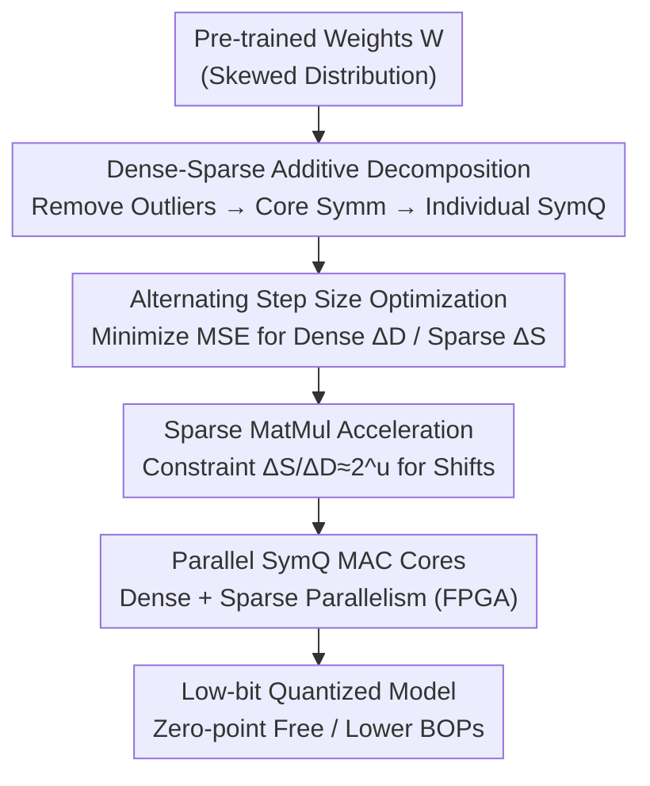

# Rethinking Asymmetric Quantization: Hidden Symmetry in Vision Model Weights

**Conference**: CVPR 2026  
**Paper**: [CVF Open Access](https://openaccess.thecvf.com/content/CVPR2026/html/Mori_Rethinking_Asymmetric_Quantization_Hidden_Symmetry_in_Vision_Model_Weights_CVPR_2026_paper.html)  
**Code**: To be confirmed  
**Area**: Model Compression  
**Keywords**: Post-training quantization, asymmetric quantization, sparse decomposition, zero-point overhead, vision models

## TL;DR
The authors discover that vision model weights are approximately symmetric after removing a few outliers. Based on this, they propose DASQ—decomposing weights into a "dense symmetric kernel + sparse outliers," both represented by symmetric quantization (SymQ). This eliminates the expensive zero-point of asymmetric quantization (AsymQ). DASQ outperforms existing PTQ methods on ImageNet/COCO with lower BOPs and achieves higher accuracy and lower power consumption on FPGAs.

## Background & Motivation
**Background**: In low-bit post-training quantization (PTQ), the mainstream approach for vision models is to use asymmetric quantization (AsymQ) for weights. This introduces a zero-point offset $z$ for each channel to fit skewed weight distributions, yielding higher accuracy than symmetric quantization (SymQ).

**Limitations of Prior Work**: Zero-point offsets are hardware-expensive. In the AsymQ dequantization formula, an extra term $-\Delta_x\Delta_{W_i} z_{W_i}(\mathbf{1}_m^T\mathbf{x}_q)$ appears. This either increases the multiplier bit-width from $k$ to $k+1$ (increasing circuit area by $\approx 1.3\times$) or requires an additional integer matrix multiplication. Since MAC arrays dominate accelerator area and power, this overhead reduces the energy efficiency of AsymQ.

**Key Challenge**: Worse yet, AsymQ does not truly "fit" the distribution perfectly. Because the zero-point is stuck between outlier regions and inlier regions, many quantization levels near the zero-point remain empty (Fig. 4a), wasting expressive power and dropping accuracy. Consequently, the gap between "high accuracy" and "hardware efficiency" remains unresolved in low-bit PTQ.

**Key Insight**: The authors revisit the weight distribution and make a key observation: weight asymmetry is almost entirely caused by a small number of sparse outliers. Once the top 1% outliers are removed, the remaining core distribution is approximately symmetric about zero across all output channels (Fig. 1). Using the "midpoint" $ (\max+\min)/2 $ to measure skewness, they found that as the outlier removal ratio increases, layer-wise midpoints approach 0 across various convolution/fully-connected layers and depths.

**Core Idea**: Since asymmetry is merely an "illusion caused by outliers," there is no need to force a zero-point. Weights are decomposed into a dense core and sparse outliers, both represented by hardware-efficient SymQ. The outlier term is computed in parallel via high-sparsity matrix multiplication, achieving a zero-point-free design without accuracy loss.

## Method

### Overall Architecture
DASQ (Dense and Additive Sparse Quantization) aims to accurately represent skewed distributions using SymQ without introducing zero-points. The core idea is to approximate each weight matrix $\mathbf{W}$ as the sum of a dense matrix and a sparse matrix: $\mathbf{W}\approx\hat{\mathbf{W}}_D+\hat{\mathbf{W}}_S$. The dense component $\hat{\mathbf{W}}_D$ uses low-bit SymQ to represent the symmetric kernel structure near zero, while the sparse component $\hat{\mathbf{W}}_S$ independently handles the extracted outliers. During inference, both components are executed **in parallel** via dense MAC and sparse MAC units. Due to extreme sparsity, the sparse MAC always finishes before and is masked by the dense MAC, avoiding extra latency on the critical path.

The pipeline consists of: identifying "hidden symmetry" → decomposing weights into dense/sparse SymQ matrices via alternating optimization → applying power-of-two constraints to convert sparse multiplication into shifts → executing in parallel on a dedicated FPGA architecture.

### Key Designs

**1. Dense-Sparse Additive Decomposition: Replacing One Zero-Point with Two SymQ Matrices**

The pain point is that applying SymQ to the entire skewed distribution forces the step size $\Delta$ to be stretched by outliers, magnifying quantization errors for the majority inlier weights. DASQ splits the matrix into a dense core and sparse outliers, independently quantized with SymQ:

$$\min_{\hat{\mathbf{W}}_D,\hat{\mathbf{W}}_S}\ \|\mathbf{W}-(\hat{\mathbf{W}}_D+\hat{\mathbf{W}}_S)\|^2\quad \text{s.t.}\ \tfrac{|\hat{\mathbf{W}}_S|_0}{nm}=1-p$$

where $p$ is the sparsity (ratio of zero elements). Intuitively, the dense component only quantizes within the narrow range of the "kernel structure" without empty levels; it fits the MSE better than 4-bit AsymQ even at very low bits (e.g., 2-bit + 1% outliers). The sparse component specifically recovers the excluded outliers. This step is the foundation of the "zero-point-free" approach.

**2. Alternating Optimization for Step Size: Iterative Convergence**

The challenge in decomposition is that the optimal step size depends on the outlier assignment, which in turn depends on the step size. DASQ decouples this via alternating optimization (Alg. 1): each round first fixes outliers and optimizes the dense step size $\Delta_D$ via grid search/per-channel MSE minimization; then, it uses a magnitude mask $\mathbf{M}(\mathbf{W},p)$ to select elements in the residual exceeding the $100p$ percentile threshold $\tau$ to form the sparse matrix and optimize $\Delta_S$. The dense part is then reconstructed as $\mathbf{W}_D=\mathbf{W}-\hat{\mathbf{W}}_S$ for the next iteration until convergence.

**3. Power-of-Two Acceleration for Sparse MatMul: Replacing Multiplications with Shifts**

During inference, dense and sparse MACs must run in parallel, but sparse cores are typically less efficient. To optimize, the $i$-th output is written as:

$$y_i\simeq\Delta_x\Delta_{D\,i}\Big\{[\mathbf{W}_{Dq}^T\mathbf{x}_q]_i+\tfrac{\Delta_{S\,i}}{\Delta_{D\,i}}[\mathbf{W}_{Sq}^T\mathbf{x}_q]_i+\tilde b_i\Big\}$$

The key is applying a power-of-two constraint to the step size ratio $\Delta_{S,i}/\Delta_{D,i} \simeq 2^u, u \in \mathbb{Z}^n$. This replaces the high-precision multiplication in the sparse branch with bit-shifts, making it faster than the dense branch. This is implemented via power-of-two projection during the alternating optimization.

### Loss & Training
DASQ is a PTQ method and does not require end-to-end retraining. It is compatible with existing PTQ pipelines—wherever a method uses AsymQ for weights, it can be replaced by DASQ's dual SymQ format. In experiments, CNNs use QDrop, while ViTs use RepQ-ViT and ERQ. Settings: sparse bit-width $k_S=4$, sparsity $p=0.98$ (ensuring BOPs are lower than AsymQ when $(1-p)k_S \le 1$). BOPs are measured as $\mathrm{BOPs}=(k_D+(1-p)k_S)\cdot k_A\cdot f$.

## Key Experimental Results

### Main Results
On ImageNet (ViT-B) and COCO (Mask R-CNN), DASQ consistently improves accuracy and reduces BOPs when integrated into existing PTQ frameworks:

| Task/Model | Config (W/A/SW) | Baseline | Baseline Metric | +DASQ | BOPs Change |
|-----------|--------------|------|----------|-------|-----------|
| ImageNet ViT-B | 3/4 | RepQ-ViT | 26.98% Top-1 | **75.24%** | 267.71G→206.14G |
| ImageNet ViT-B | 3/4 | ERQ | 72.37% | **78.44%** | 267.71G→206.14G |
| ImageNet ViT-B | 4/4 | ERQ | 78.67% | **80.04%** | 334.64G→273.07G |
| ImageNet ResNet-50 | 2/4 | QDrop | 70.08% | **72.63%** | 57.35G→39.76G |
| COCO Mask R-CNN (Swin-T) | 4/4 | RepQ-ViT | 36.1/36.0 (box/mask AP) | **41.5/39.1** | 2719.52G→2219.62G |

The most notable result is at W3/A4, where RepQ-ViT nearly collapses (26.98%) while DASQ boosts Top-1 by 48.26 percentage points.

### Ablation Study
FPGA measurements (Table 4) verify hardware feasibility: dense MAC throughput is fixed at 25.6 GOPs/s, while the sparse branch adds up to 1.6 GOPs/s in parallel at 95% sparsity.

| Config (W/A/SW) | Scheme | Vs. AsymQ | Description |
|--------------|------|-----------|------|
| 4/4/- | AsymQ | Baseline | 1-bit wider multiplier, more LUTs |
| 4/4/4 | DASQ | Top-1 up to +6.7%, lower power | No dense multiplier widening |
| 4/4/8 | DASQ | Higher accuracy, slightly more LUTs | Higher sparse bits, still efficient due to sparsity |

### Key Findings
- **Hidden Symmetry is Universal**: The layer-wise mean absolute midpoint $\mu_{|mr|}$ monotonically approaches zero as outliers are removed across CNNs and ViTs.
- **Sparse Branch is "Free"**: Due to extreme sparsity (98% zeros), the sparse MatMul finishes earlier than the dense one and is masked, meaning the zero-point removal does not shift costs elsewhere.
- **Depthwise Convolutions are Exceptions**: Since a $3\times3$ depthwise convolution has only 9 weights per channel, it cannot support dense/sparse decomposition. The authors keep AsymQ for these layers.

## Highlights & Insights
- The paper re-examines the default assumption that asymmetric quantization requires zero-points and provides a clean negative answer through the "hidden symmetry" observation.
- The "dense core + additive sparse" decomposition allows both paths to use hardware-efficient SymQ, utilizing power-of-two ratios to reduce sparse multiplications to shifts—a model for algorithm-hardware co-design.
- **Plug-and-play**: It acts as a "weight quantization replacement" for QDrop/RepQ-ViT/ERQ with minimal migration cost, making it highly friendly for engineering deployment.

## Limitations & Future Work
- **Channel Weight Limitation**: Depthwise convolutions cannot be decomposed due to insufficient weights per channel.
- **Dependency on High Sparsity**: The BOPs advantage relies on the assumption $(1-p)k_S \le 1$. If certain layers have less sparse outliers, the efficiency might decrease.
- **Hardware Verification**: Primarily tested on FPGA; verification on general-purpose GPUs/NPUs regarding the "free" masking of the sparse branch is required.

## Related Work & Insights
- **vs. AsymQ (RepQ-ViT / ERQ)**: Those methods use zero-points to fit skewed distributions at the cost of wider multipliers or extra MatMuls. DASQ explicitly decomposes the distribution, avoiding empty bins and extra hardware costs.
- **vs. Reconstruction PTQ (Adaround / QDrop)**: Those focus on minimizing reconstruction loss. DASQ is orthogonal, changing the underlying weight representation, and can be stacked on top of those methods.
- **vs. LLM Quantization**: LLMs are often memory-constrained, while vision models are compute-constrained (MAC-dominated). DASQ specifically targets MAC overhead, making it highly effective for vision tasks.

## Rating
- **Novelty**: ⭐⭐⭐⭐⭐ Redefines the problem via "hidden symmetry" and provides a self-consistent decomposition.
- **Experimental Thoroughness**: ⭐⭐⭐⭐ Covers classification, detection, and segmentation across multiple architectures and hardware, though GPU verification is limited.
- **Writing Quality**: ⭐⭐⭐⭐ Very clear logic from observation to motivation to method.
- **Value**: ⭐⭐⭐⭐⭐ Algorithm-hardware synergy that is plug-and-play with win-win results for accuracy and efficiency.

<!-- RELATED:START -->

## Related Papers

- [\[CVPR 2026\] Rethinking Token Reduction for Large Vision-Language Models](rethinking_token_reduction_for_large_vision-language_models.md)
- [\[CVPR 2026\] VLM-PTQ: Efficient Post-Training Quantization for Large Vision-Language Models](vlm-ptq_efficient_post-training_quantization_for_large_vision-language_models.md)
- [\[CVPR 2026\] CAR-SAM: Cross-Attention Reconstruction for Post-Training Quantization of the Segment Anything Model](car-sam_cross-attention_reconstruction_for_post-training_quantization_of_the_seg.md)
- [\[CVPR 2026\] LS-ViT: Least-Squares Hessian Based Block Reconstruction for Low-Bit Post-Training Quantization of Vision Transformers](ls-vit_least-squares_hessian_based_block_reconstruction_for_low-bit_post-trainin.md)
- [\[CVPR 2026\] Dual-branch Distilled Transformer for Efficient Asymmetric UAV Tracking](dual-branch_distilled_transformer_for_efficient_asymmetric_uav_tracking.md)

<!-- RELATED:END -->
