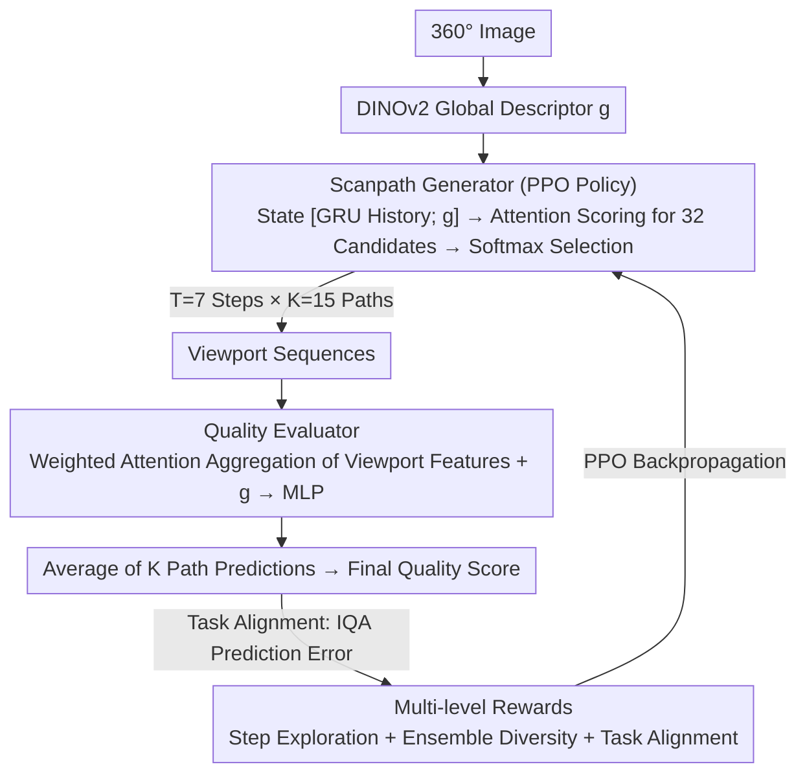

# RL-ScanIQA: Reinforcement-Learned Scanpaths for Blind 360° Image Quality Assessment

**Conference**: CVPR 2026  
**arXiv**: [2603.14297](https://arxiv.org/abs/2603.14297)  
**Code**: None  
**Area**: Model Compression  
**Keywords**: 360 image quality, reinforcement-learning, scanpath, blind IQA, PPO, active perception

## TL;DR

This paper proposes RL-ScanIQA, the first end-to-end framework for Blind 360° Image Quality Assessment (BIQA) based on Reinforcement Learning (RL). The core idea is to model scanpath generation as a sequential decision process, using the PPO strategy to learn task-driven viewing policies directly from quality assessment feedback, rather than relying on imitation learning from human fixation data. The framework consists of a scanpath generator and a quality evaluator that are jointly optimized, supplemented by multi-level rewards (step-level exploration, ensemble diversity, and task-alignment perception) and distortion-space data augmentation. It achieves SOTA performance and superior cross-dataset generalization on three benchmarks: CVIQD, OIQA, and JUFE.

## Background & Motivation

1.  **Viewport Constraints of 360° Images**: Panoramic images are experienced incrementally through limited viewports in immersive environments; thus, quality perception depends on the viewing trajectory rather than the full image.
2.  **Decoupling of Scanpaths and Quality Assessment**: Existing methods treat scanpath generation as an independent preprocessing step, which prevents end-to-end optimization and fails to align paths with IQA objectives.
3.  **Dependency on Human Fixation Data**: Previous methods require expensive human eye-tracking data for supervision, which may be biased toward salient content rather than quality-related regions.
4.  **ERP Projection Distortion**: Direct analysis on Equirectangular Projection (ERP) introduces spatial bias and ignores spherical geometric properties.
5.  **Limitations of Fixed Sampling Strategies**: Predefined viewport methods overlook the sequential nature of user exploration and content adaptivity.
6.  **Poor Cross-Dataset Generalization**: Distortion types vary significantly across datasets, causing fixed-strategy methods to suffer sharp performance drops in cross-domain scenarios.

## Method

### Overall Architecture

RL-ScanIQA addresses a specific characteristic of 360° images: they are viewed via a sequence of viewports, and quality perception is determined by the trajectory. Previous methods decoupled scanpath generation from assessment, leading to misalignment and heavy reliance on human gaze data. This work models scanpath generation as a sequential decision process. Using PPO, it learns a task-driven policy from IQA feedback, enabling joint optimization of the "Scanpath Generator" and "Quality Evaluator." This creates a closed loop: "where to look → scoring → reward → adjusting where to look."

### Key Designs

**1. Scanpath Generator: Modeling "Where to Look" as a PPO Policy**

The sphere is discretized into $8 \times 4 = 32$ candidate viewports ($90^\circ \times 90^\circ$ FOV), formulated as a finite-horizon MDP. The state $s_t = [h_{t-1}; g]$ concatenates the GRU hidden state $h_{t-1}$ with the DINOv2 global descriptor $g$. The action involves attention scoring over candidate features followed by a Softmax to select the next viewport. Optimization uses PPO with a clipped objective, GAE advantage estimation, and entropy regularization. Consequently, paths are not fixed but learned for the downstream IQA task. Intriguingly, RL-learned paths outperform human gaze trajectories (SRCC 0.724 → 0.816) because humans are distracted by saliency rather than quality-critical regions.

**2. Multi-level Rewards: Converting Sparse IQA Supervision into Dense Signals**

Training a policy solely on sparse quality error is difficult. This work decomposes rewards into three layers. The step-level exploration reward $r_t = \lambda_{\text{ent}} \cdot \mathcal{H}(x_t) + \lambda_{\text{ssim}} \cdot (1-\text{SSIM}) + \lambda_{\text{nov}} \cdot \delta_{\text{new}} + \lambda_{\text{eqb}} \cdot \mathcal{B}(x_t)$ uses entropy to guide toward textured areas, SSIM differences for diversity, novelty signals to prevent repetition, and equatorial bias to simulate human habits. The ensemble-level diversity reward $\mathcal{R}_{\text{div}} = \beta_{\text{cov}} \cdot \frac{|\cup_k S_k|}{X} - \beta_{\text{jac}} \cdot \text{Mean Jaccard Similarity}$ ensures $K$ paths cover more spherical area and punishes overlap. The task-level alignment reward is derived from IQA error, including MSE penalty $\mathcal{R}_{\text{mse}}$ and ranking reward $\mathcal{R}_{\text{rank}}$, pinning path generation to the quality prediction goal.

**3. Quality Evaluator: Attention-Weighted Multi-Viewport Aggregation**

The evaluator aggregates viewport features using attention weights $\alpha_t$, calculated via interaction between local features $f_t$ and global features $g$. The aggregated representation is concatenated with global features and passed through an MLP to regress the quality score. Predictions from $K$ paths are averaged. This mechanism forces the evaluator to prioritize viewports sensitive to distortion.

### Loss & Training

To enhance cross-dataset generalization, three additional constraints are added: consistency loss ensures stable predictions under weak augmentation; triplet loss constrains the score ranking of clear, lightly distorted, and heavily distorted images; and cross-ranking loss maintains relative quality relationships between augmented image pairs. This combination of distortion-space augmentation and ranking consistency is key to its cross-domain performance.

## Main Results

### Table 1: Intra-dataset Evaluation Results (SRCC / PLCC)

| Method | JUFE | OIQA | CVIQD |
|------|------|------|-------|
| NIQE (Handcrafted) | 0.552 / 0.592 | 0.745 / 0.736 | 0.893 / 0.872 |
| MC360IQA | 0.502 / 0.623 | 0.875 / 0.906 | 0.877 / 0.892 |
| Assessor360 | 0.489 / 0.510 | 0.979 / 0.945 | 0.958 / 0.963 |
| GSR-X | 0.843 / 0.857 | 0.922 / 0.937 | 0.805 / 0.957 |
| Q-Insight (LLM) | 0.557 / 0.412 | 0.643 / 0.795 | 0.872 / 0.801 |
| **RL-ScanIQA** | **0.816 / 0.902** | **0.941 / 0.967** | **0.970 / 0.970** |

> RL-ScanIQA achieves the highest PLCC across all datasets and the best SRCC on CVIQD. In JUFE, it leads significantly in PLCC (0.902 vs 0.857), demonstrating the advantage of RL policies under authentic distortion distributions.

### Table 2: Cross-dataset Evaluation Results (SRCC / PLCC)

| Method | Train:CVIQD → Test:OIQA/JUFE | Train:JUFE → Test:CVIQD/OIQA |
|------|---------------------------|---------------------------|
| Assessor360 | 0.853/0.632 — 0.887/0.749 | 0.617/0.724 — 0.405/0.499 |
| GSR-X | 0.804/0.765 — 0.831/0.694 | 0.782/0.732 — 0.733/0.611 |
| F-VQA(A) | 0.772/0.621 — 0.604/0.509 | 0.665/0.679 — 0.683/0.732 |
| **RL-ScanIQA** | **0.901/0.800 — 0.913/0.822** | **0.771/0.755 — 0.802/0.833** |

> Cross-dataset generalization significantly outperforms all competitors, validating the effectiveness of distortion augmentation and ranking consistency constraints.

## Highlights & Insights

1.  **First End-to-End RL-based 360° IQA Framework**: Jointly optimizes scanpath generation and quality assessment without requiring human eye-tracking data.
2.  **Sophisticated Multi-level Reward Design**: Systematically transforms sparse IQA supervision into dense shaping signals across step, ensemble, and task levels.
3.  **Counter-intuitive Finding**: RL-discovered paths outperform true human gaze trajectories (Table 3: 0.724 → 0.816 SRCC), indicating that humans prioritize salient content rather than quality-critical regions.
4.  **Robust Cross-domain Generalization**: The combination of distortion-space augmentation and ranking consistency loss allows for effective transfer across different distortion types.
5.  **Convincing Visualization**: High-quality images show uniform path coverage, while low-quality images exhibit paths focused on distorted regions.

## Limitations & Future Work

1.  **High Computational Overhead**: Inference requires $K=15$ paths $\times$ $T=7$ steps = 105 viewport feature extractions, limiting real-time application.
2.  **Coarse Viewport Discretization**: 32 candidate viewports may fail to precisely locate tiny distorted regions.
3.  **Limited Dataset Scale**: Panoramic IQA datasets (CVIQD, OIQA) are relatively small, containing only a few hundred images.
4.  **Fixed Feature Extraction**: Using a frozen DINOv2 might not be the most sensitive feature extraction scheme for subtle distortions.
5.  **MOS Dependence**: Training still requires precise Mean Opinion Scores (MOS), which are expensive to collect.
6.  **Hyperparameter Sensitivity**: The reward function and loss terms involve numerous weights (4 step-level + 2 diversity + 2 alignment + 5 loss weights), making tuning burdensome.

## Related Work & Insights

-   **2D BIQA**: BRISQUE (NSS), DBCNN, TreS, MANIQA (Transformer), Q-Insight (Multimodal RL + LLM).
-   **360° BIQA**: MC360IQA (Multi-branch CNN), VGCN (Graph Convolution), Assessor360/GSR-X/F-VQA (Decoupled scanpath modeling).
-   **RL in Vision Tasks**: Viewpoint planning, video summarization, attention selection; PPO shows robust performance with variance reduction and value guidance under sparse rewards.
-   **360° Visual Exploration**: Eye-tracking studies highlight human patterns like equatorial bias and salient object preference.

## Rating

| Dimension | Score (1-10) | Explanation |
|------|:-----------:|------|
| Novelty | 8 | First to introduce end-to-end RL to 360° IQA; the joint optimization paradigm is novel. |
| Technical Contribution | 8 | Well-designed multi-level rewards and effective cross-domain strategies. |
| Experimental Thoroughness | 7 | Covered three datasets with ablation studies, though dataset sizes are small. |
| Writing Quality | 8 | Clear structure, rich diagrams, and comprehensive comparisons. |
| Value | 7 | Growing demand for 360° IQA, though inference cost and hyperparameter counts may limit deployment. |
| **Total Score** | **7.6** | **An excellent work bringing active perception to 360° assessment; the end-to-end RL paradigm is insightful.** |

<!-- RELATED:START -->

## Related Papers

- [\[CVPR 2026\] Block-based Learned Image Compression without Blocking Artifacts](block-based_learned_image_compression_without_blocking_artifacts.md)
- [\[ICML 2026\] Efficient Learned Image Compression without Entropy Coding](../../ICML2026/model_compression/efficient_learned_image_compression_without_entropy_coding.md)
- [\[AAAI 2026\] DynaQuant: Dynamic Mixed-Precision Quantization for Learned Image Compression](../../AAAI2026/model_compression/dynaquant_dynamic_mixed-precision_quantization_for_learned_i.md)
- [\[CVPR 2025\] Learned Image Compression with Dictionary-based Entropy Model](../../CVPR2025/model_compression/learned_image_compression_with_dictionary-based_entropy_model.md)
- [\[CVPR 2026\] CARLoS: Retrieval via Concise Assessment Representation of LoRAs at Scale](carlos_retrieval_via_concise_assessment_representation_of_loras_at_scale.md)

<!-- RELATED:END -->
