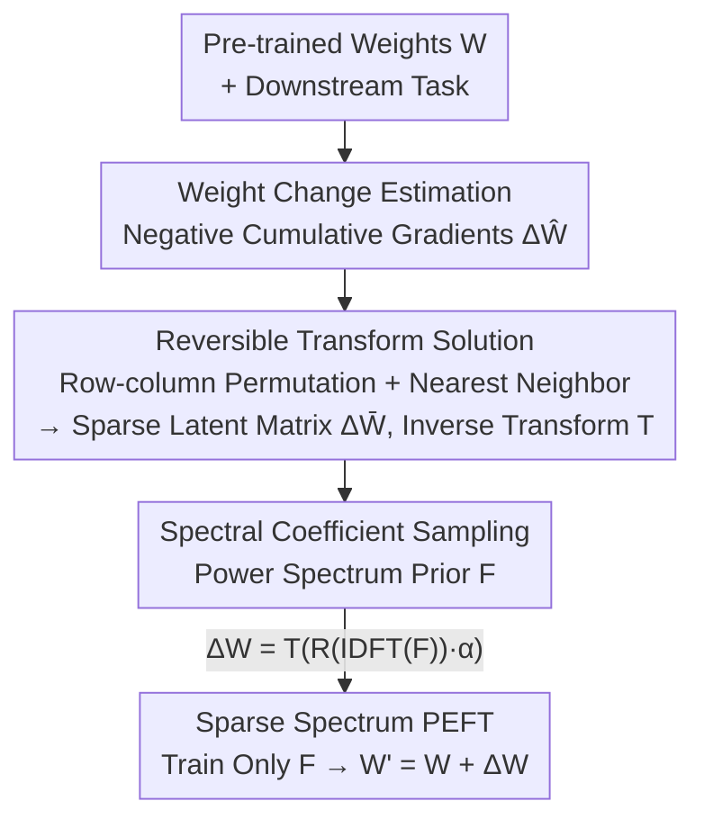

# S2FT: Parameter-Efficient Fine-Tuning in Sparse Spectrum Domain

**Conference**: CVPR2026  
**arXiv**: [2605.08589](https://arxiv.org/abs/2605.08589)  
**Code**: To be confirmed  
**Area**: Model Compression / Parameter-Efficient Fine-Tuning (PEFT)  
**Keywords**: PEFT, Fourier Transform, Sparse Spectrum, Row-column Permutation, Weight Change Modeling

## TL;DR
Addressing the issue that Fourier-based PEFT incorrectly assumes the weight change $\Delta W$ has a sparse spectrum (when it is actually close to a power-uniform distribution), S2FT first estimates $\Delta W$ and then uses row-column permutation to find a reversible transformation that maps it to a latent matrix $\Delta\bar W$ with a truly sparse spectrum. By training only a few spectral coefficients in this sparse domain, it outperforms baselines like FourierFT with only 0.08% parameters.

## Background & Motivation
**Background**: Adapting large models to downstream tasks via full fine-tuning is too costly, making PEFT the mainstream approach. LoRA models weight changes as the product of two low-rank matrices $\Delta W=AB$. FourierFT goes further by treating $\Delta W$ as a spatial matrix, initializing a complex spectral matrix $F$ (with only a few trainable coefficients), and reconstructing $\Delta W=\mathcal R(IDFT(F))\cdot\alpha$ via the Inverse Discrete Fourier Transform.

**Limitations of Prior Work**: The design of FourierFT relies on a critical assumption—that $\Delta W$ is smooth in the spatial domain and thus has a sparse spectrum, allowing a few coefficients to approximate it. However, this assumption has never been rigorously verified.

**Key Challenge**: Detailed spectral analysis of $\Delta W$ obtained from full fine-tuning of ViTs reveals that $\Delta W$ is chaotic in the spatial domain (containing various frequency components). Its power spectrum is **not sparse but close to a "power-uniform" distribution**, where energy is spread almost equally across all frequencies. Quantitatively, reducing the relative reconstruction error of $\Delta W$ to below 10% requires sampling over 90% of the spectral coefficients. This means a few coefficients cannot accurately model $\Delta W$, creating a performance ceiling for FourierFT.

**Goal**: Since PEFT on the uniform spectrum of $\Delta W$ is ineffective, can we find a latent matrix $\Delta\bar W$ with a **truly sparse** spectrum that can be losslessly transformed back to $\Delta W$?

**Key Insight**: The authors leverage a classical prior—**a matrix with a sparse spectrum is often locally smooth in the spatial domain**. Conversely, if a chaotic $\Delta W$ can be rearranged into a locally smooth matrix, its spectrum will become sparse, enabling modeling with a few low-frequency coefficients.

**Core Idea**: Find a reversible transform $T(\cdot)$ that maps a spectral-sparse latent matrix $\Delta\bar W$ to $\Delta W$, such that $W'=W+T(\mathcal R(IDFT(F))\cdot\alpha)$, performing PEFT in this sparse spectral domain. The key is that $T$ must increase smoothness, preserve neuron connectivity structure, and be reversible. The authors prove that **row-column permutation** satisfies all three criteria.

## Method

### Overall Architecture
The goal of S2FT is to perform Fourier-based PEFT in a latent space with a sparse spectrum to fully utilize a small number of coefficients. The workflow is: given pre-trained weights $W$ and a downstream task, **roughly estimate** the weight change $\Delta\hat W$ using accumulated gradients from a small batch of samples. Guided by $\Delta\hat W$, finding the reversible transform is modeled as a **row-column permutation** problem, solved via nearest neighbor search to obtain permutations $\pi_r, \pi_c$, the sparse latent matrix $\Delta\bar W$, and its inverse transform $T$. Finally, train a small number of spectral coefficients $F$ sampled via a **power spectrum prior**, and reconstruct $\Delta W$ through $T$ during training to inject it into $W$.

Note: Permutation only involves "re-indexing" rows and columns, making $T$ an inverse permutation index—$\Delta W[\pi_r,:][:,\pi_c]=\Delta\bar W$, with near-zero overhead (a single transform takes 0.02s). Estimation and permutation are performed only once before training and do not participate in backpropagation.

### Key Designs

**1. Weight Change Estimation: Using negative cumulative gradients as a prior to avoid full fine-tuning**

To find the appropriate transform $T$, one needs an approximation of $\Delta W$. While full fine-tuning to obtain $W'$ and calculating $\Delta\hat W=W'-W$ is ideal, it is expensive and contradicts the goal of PEFT. The authors observe that **an exact $\Delta W$ is not required; a rough approximation is sufficient to guide the permutation**. Thus, they use the **negative cumulative gradient** on a subset of the training set $\mathcal D_{sub}$:

$$\Delta\hat W=-\sum_{x\in\mathcal D_{sub}}\nabla\mathcal L_x(w_i)$$

Based on gradient descent, $\Delta W$ is inherently the weight update direction, and updating in the opposite direction of the cumulative gradient reduces downstream loss. Unlike GPS or SPT which use gradients to estimate **weight importance**, S2FT uses gradients to estimate the **pattern of weight changes**. Ablations (Table 6) show that replacing this step with accurate full fine-tuning estimation (even for 5 epochs) has almost no impact on final accuracy, confirming "rough estimation is enough."

**2. Reversible Transform: Converting "finding a transform" into row-column permutation**

Spectral sparsity ⇔ spatial local smoothness. Therefore, the transform must satisfy three conditions: ① Improved matrix smoothness after transform; ② Preservation of neuron connectivity (input-output dependency); ③ Reversibility. **Row-column permutation** fits perfectly: shuffling adjacent rows/columns to minimize differences improves smoothness (satisfies ①); swapping rows or columns only changes the indexing of input/output neurons without changing the connection $w_{ij}$ itself (satisfies ②); permutations are naturally reversible (satisfies ③).

The transform is formulated as a permutation optimization: in a fully weighted graph $\mathcal G$ where each node is a row (or column) of $\Delta\hat W$, and edge weight $\beta_{ij}$ is the Euclidean distance between rows $i$ and $j$, the goal is to find a permutation $\pi$ that minimizes the total distance between adjacent rows/columns:

$$\arg\min_{\pi\in\mathcal P_n}\sum_{k=1}^{n-1}\beta_{\pi_k,\pi_{k+1}}$$

Proposition 1 equates this spatial goal to the frequency domain: the sum of squared adjacent differences equals $\sum_u 8\sin^2(\frac{\pi u}{n})|DFT(\Delta\bar W)_u|^2$. Since the weight $8\sin^2(\frac{\pi u}{n})$ monotonically increases with frequency index $u$, **minimizing adjacent distance = suppressing high-frequency energy**, forcing energy toward low frequencies.

**3. Nearest Neighbor Search for Permutation: Greedy bypass for NP-hardness**

The permutation optimization in Eq. (5) is NP-hard (similar to the Traveling Salesman Problem). The authors use a greedy nearest neighbor search (Algorithm 1): starting from a random row $\pi_1$, each subsequent step picks the unvisited row with the smallest distance $\beta$ until all are sequenced. This is efficient and the inverse transform $T$ adds virtually no inference or storage cost.

**4. Power Spectrum Prior Sampling: Sampling coefficients according to the spectral distribution of $\Delta\bar W$**

Because the spectrum of S2FT is sparse, unlike the uniform spectrum of FourierFT, the sampling strategy must change. Empirically, S2FT performs best with a **low-frequency bias**, a consistency found across all tasks. To match the true distribution, the authors use the power spectrum of $\Delta\bar W$ as a prior, defining the probability of selecting a frequency $(u,v)$ as:

$$p(u,v)=\frac{\|DFT(\Delta\bar W)\|^\gamma_{(u,v)}}{\sum_{u,v}\|DFT(\Delta\bar W)\|^\gamma_{(u,v)}}$$

Where $\gamma$ controls distribution smoothness (empirically $\gamma=1.5$). This concentrates the coefficient budget on the most energetic frequencies.

### Loss & Training
No new loss terms are added; the original task-specific supervised loss is used. Only the sampled spectral coefficients $F$ are learnable. Forward passes use $W'=W+T(\mathcal R(IDFT(F))\cdot\alpha)$. Training for image classification uses AdamW with cosine decay for 100 epochs. While FourierFT uses 6,000 coefficients, S2FT uses only 3,000 yet achieves superior results.

## Key Experimental Results

### Main Results
Verified across image classification, image generation, NLU, and instruction fine-tuning. S2FT consistently outperforms FourierFT with approximately half the parameters.

| Task/Benchmark | Metric | FourierFT | S2FT (Same Param) | S2FT (Reduced Param) |
|-----------|------|-----------|-------------|---------------|
| VTAB-1k (ViT-B/16) | Mean Acc / Params% | 72.8 / 0.16 | 74.1 / 0.16 | 73.6 / **0.08** |
| FGVC (5 Datasets) | Mean Acc / Params% | 87.9 / 0.16 | 89.6 / 0.16 | 89.1 / **0.08** |
| GLUE (RoBERTa-base) | Avg / Params% | 85.0 / 0.02 | **85.6** / 0.02 | — |
| GLUE (RoBERTa-large) | Avg / Params% | 88.0 / 0.01 | **88.3** / 0.01 | — |
| Subject-driven Gen | DINO↑ / CLIP-I↑ / LPIPS↑ / Params% | 0.607 / 0.750 / 0.732 / 0.07 | 0.620 / 0.784 / 0.769 / **0.06** | — |
| Instruct (LLaMA2-13B) | MT-Bench / Vicuna | 5.82 / 7.92 | **5.89 / 7.94** | — |

Highlights: On VTAB, S2FT with 0.08% parameters (half of FourierFT) achieves 73.6 mean accuracy. On GLUE, RoBERTa-large with only 0.01% parameters achieves 88.3, exceeding full fine-tuning (88.2).

### Ablation Study

| Configuration | Metric (VTAB Mean Acc) | Description |
|------|--------------------------|------|
| S2FT (Full) | 73.6 | Power spectrum prior sampling |
| Random Sampling | 72.0 | Drop by 1.6%, strategy is vital |
| Low-frequency (LF) | 72.8 | Drop by 0.8%, better than random |
| Estimation Eq. 4 (Ours) | 73.6 | Negative cumulative gradient |
| Estimation (Full FT 5 ep) | 73.8 | Accurate prior only adds 0.2% |
| $\gamma=1.5$ (Default) | 73.6 | Optimal |

Training cost (Table 8, ViT-B): S2FT takes 4.2s/epoch, uses 8.5GB VRAM, and 0.08% parameters. Compared to FourierFT (4.0s / 8.7GB / 0.16%) and LoRA (3.8s / 9.7GB / 0.37%), it is the most parameter-efficient and memory-efficient.

### Key Findings
- **Sampling strategy is the second largest contributor**: Switching to random sampling leads to a 1.6% drop, showing the importance of targeting high-energy frequencies.
- **Estimation accuracy is largely irrelevant**: Rough estimation vs. 5-epoch full fine-tuning estimation differs by only 0.2%, as the method only needs coarse guidance for permutation.
- **$\gamma$ shows an inverted U-shape**: Accuracy rises until 1.5 and then drops as the distribution becomes overly peaked.

## Highlights & Insights
- **Refutation of a standard premise**: While Fourier PEFT assumes $\Delta W$ spectral sparsity, this paper proves it is power-uniform, providing a solid theoretical foundation for the proposed method.
- **Reduced "Finding Transform" to "Permutation"**: By identifying that row/column swaps do not affect connectivity weights, the authors satisfy three complex constraints simultaneously with zero inference overhead.
- **Theoretical grounding**: Proposition 1 bridges spatial adjacency and frequency suppression, transforming the intuition of "reordering for sparsity" into a provable conclusion.

## Limitations & Future Work
- **Greedy solution is sub-optimal**: The permutation optimization is NP-hard; the nearest-neighbor search provides only a local optimum.
- **Dependency on subset selection**: The impact of the size and quality of $\mathcal D_{sub}$ for cumulative gradient estimation is not exhaustively discussed.
- **Moderate gains**: Improvements over FourierFT on GLUE and LLaMA are marginal (often <1%), though parameter reduction is significant.

## Related Work & Insights
- **vs FourierFT**: Both use IDFT for $\Delta W$. S2FT outperforms by using row-column permutation to create a sparse latent matrix, allowing for more concentrated coefficient use.
- **vs LoRA variants**: While LoRA uses $AB$ with 0.2~0.5% parameters, S2FT operates at a much lower parameter scale (0.08%) while maintaining performance.
- **vs Selective PEFT**: Methods like GPS use gradients for **importance estimation**, whereas S2FT uses them for **pattern estimation**.

## Rating
- Novelty: ⭐⭐⭐⭐⭐ First to disprove the spectral sparsity of $\Delta W$ and construct a sparse domain via permutation.
- Experimental Thoroughness: ⭐⭐⭐⭐ Covers various tasks and comprehensive ablations, though lacks verification on extremely large-scale models.
- Writing Quality: ⭐⭐⭐⭐ Clear motivation and logical flow.
- Value: ⭐⭐⭐⭐ High utility for memory-sensitive deployment; the permutation-for-smoothness concept is highly transferable.

<!-- RELATED:START -->

- **FourierFT**: [2405.03003](https://arxiv.org/abs/2405.03003) - Leading Fourier-based PEFT baseline.
- **LoRA**: [2106.09685](https://arxiv.org/abs/2106.09685) - Foundational low-rank adaptation work.

<!-- RELATED:END -->

## Related Papers

- [\[ICLR 2026\] Memba: Membrane-driven Parameter-Efficient Fine-Tuning for Mamba](../../ICLR2026/model_compression/memba_membrane-driven_parameter-efficient_fine-tuning_for_mamba.md)
- [\[CVPR 2026\] ReFTA: Breaking the Weight Reconstruction Bottleneck in Tensorized Parameter-Efficient Fine-Tuning](refta_breaking_the_weight_reconstruction_bottleneck_in_tensorized_parameter-effi.md)
- [\[ACL 2025\] C3A: Parameter-Efficient Fine-Tuning via Circular Convolution](../../ACL2025/model_compression/parameter-efficient_fine-tuning_via_circular_convolution.md)
- [\[ACL 2025\] State-offset Tuning: State-based Parameter-Efficient Fine-Tuning for State Space Models](../../ACL2025/model_compression/state_offset_tuning_ssm_peft.md)
- [\[ICCV 2025\] Generalized Tensor-based Parameter-Efficient Fine-Tuning via Lie Group Transformations](../../ICCV2025/model_compression/generalized_tensor-based_parameter-efficient_fine-tuning_via_lie_group_transform.md)

<!-- RELATED:END -->
