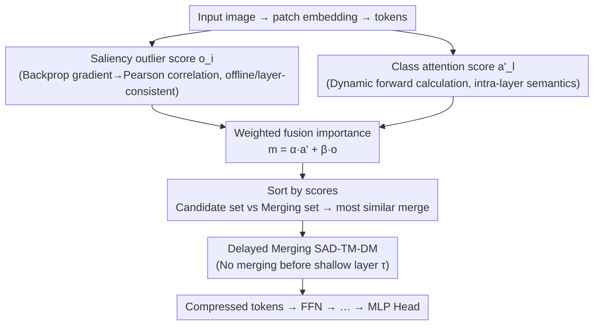

# Saliency-Driven Token Merging for Vision Transformers

**Conference**: CVPR 2026  
**Paper**: [CVF Open Access](https://openaccess.thecvf.com/content/CVPR2026/html/Xie_Saliency-Driven_Token_Merging_for_Vision_Transformers_CVPR_2026_paper.html)  
**Code**: TBD (Paper states it will be open-sourced)  
**Area**: Model Compression / ViT Acceleration  
**Keywords**: Token Merging, Vision Transformer, Saliency, Training-free acceleration, Class Attention  

## TL;DR
SAD-TM observes that existing token merging methods rely only on "current-layer" attention parameters, which fluctuate drastically across layers. It proposes a **cross-layer consistent** criterion using saliency (via backpropagation) to identify "saliency outlier" tokens that deviate from the global gradient direction. By fusing these with class attention and employing a "delayed merging" strategy that skips initial layers, it achieves almost lossless FLOPs reductions of 23%~45% on DeiT, MAE, and LV-ViT without training.

## Background & Motivation
**Background**: The computational cost of ViTs grows quadratically with the number of tokens. Acceleration primarily follows two paths: token pruning (directly discarding redundant tokens, which can lose information) and token merging (merging similar tokens, which is nearly lossless). Since ToMe, merging has become a mainstream lightweight acceleration method.

**Limitations of Prior Work**: Existing merging methods (ToMe, DTMFormer, IB-based, etc.) rely almost exclusively on **current-layer** attention parameters (key matrices, class attention, etc.) to determine token importance. However, these parameters for the same set of tokens **differ significantly across layers**. In shallow layers particularly, the Mean Squared Error (MSE) of class attention matrices between adjacent blocks can differ by several orders of magnitude. Consequently, merging based on single-layer criteria lacks global consistency, often incorrectly merging tokens in shallow layers and leading to unstable compression results.

**Key Challenge**: There is a direct conflict between the need for "stable merging criteria" and the "layer-wise fluctuation of attention parameters." Relying on a single layer cannot provide a cross-layer consistent measure of importance.

**Goal**: To find a **layer-agnostic and cross-layer consistent** token importance criterion, combine it with intra-layer dynamic semantic information for training-free merging, and avoid incorrect merges caused by unstable shallow attention.

**Key Insight**: The authors discover that saliency statistics directly characterize the causal relationship from model input to output, and this relationship does not depend on a specific layer. Thus, input-output level saliency outlierness can serve as a global prior.

**Core Idea**: Based on the observation that "saliency outlier tokens ≈ deviation from the global gradient direction ≈ safe to merge," the method fuses offline saliency priors with online class attention into a unified criterion and uses delayed merging to bypass shallow layer instability.

## Method

### Overall Architecture
SAD-TM retains the original patch embedding and MLP head of the ViT. It inserts a merging step after the MHSA of each Transformer block: $Z'_l \in \mathbb{R}^{N \times D}$ is compressed to $Z''_l \in \mathbb{R}^{(N(1-mr)) \times D}$ according to a merging rate $mr$ before entering the FFN. The criterion consists of two paths: **offline saliency outlier scores** $o_i$ (calculated via backpropagation → Pearson correlation → outlierness, layer-invariant and pre-computable) and **online class attention scores** $a'_l$ (calculated dynamically during the forward pass to capture intra-layer semantic correlation). These are weighted to obtain the final importance $m_{l,i}$, where tokens with lower scores are merged with priority. Finally, a **delayed merging strategy** (SAD-TM-DM) is applied, where merging is skipped for the first $\tau$ layers until attention stabilizes.

### Key Designs

**1. Saliency Outlier Score: A Layer-Consistent Training-Free Importance Prior**

This is the core solution to layer-wise criterion fluctuation. For each input patch $x_i$, the saliency is first calculated via backpropagation $s_i = \max(|\partial \mathcal{L}/\partial x_i|)$ (taking the maximum absolute gradient across channels). The saliency map for each patch is flattened into a vector to calculate pairwise Pearson correlation coefficients $r_{i,j}$. Outlierness is defined by the average correlation with all other patches: $o_i = \frac{1}{N-1}\sum_{j \neq i} r_{i,j}$. A lower $o_i$ indicates the patch deviates more from the overall saliency pattern—its gradient direction is inconsistent with the global trend. The authors argue that **high saliency outlierness = deviation from global gradient = redundancy = safe to merge**. This has two advantages: $o_i$ depends only on inputs and gradients, making it **inherently layer-independent**, and it can be **pre-computed offline**, adding zero inference overhead.

**2. Saliency + Class Attention Fusion: Offline Priors Meet Online Semantics**

Offline saliency alone is insufficient; runtime attention dynamics carry complementary semantic information. Class attention aggregates global info into the class token: $a_{class,l,h} = \mathrm{softmax}(Q_{l,h}K_{l,h}^\top/\sqrt{D})[0,1:]$, averaged across $H$ heads to get $a'_l$. The final importance is a weighted sum: $m_{l,i} = \alpha \cdot a'_{l,i} + \beta \cdot o_i$, where $\alpha + \beta = 1$. Tokens are sorted by $m_{l,i}$ in ascending order for merging. The merging process follows the "Candidate set $\mathcal{C}$ vs Merging set $\mathcal{M}$" approach: tokens in the merging set are fused with their most similar counterparts in the candidate set via weighted average: $t'_i, t'_j = \frac{m_i}{m_i+m_j}t_i + \frac{m_j}{m_i+m_j}t_j$.

**3. Delayed Merging Strategy (SAD-TM-DM): Waiting for Attention Stability**

Analysis shows that the MSE of class attention matrices between adjacent blocks is **much higher in shallow layers than deep layers**, often by several orders of magnitude. This suggests shallow attention is still exploring low-level features, making merging decisions unstable. SAD-TM-DM adds a simple rule: **no merging** for the first $\tau$ layers (maintaining $N$ tokens), and decreasing token counts as $N_l = N(1-(l-\tau)mr)$ starting from layer $\tau+1$. The value of $\tau$ is determined by an observation that "the number of unstable layers depends primarily on total model depth rather than specific architecture," allowing for depth-based estimation.

### Loss & Training
SAD-TM is **completely training-free**. It is applied directly to pre-trained ViTs without retraining or fine-tuning. $o_i$ is pre-computable. The only inference overhead is the weighted fusion and sorting of class attention. Hyperparameters include $\alpha, \beta, mr$, and $\tau$. Experiments were conducted on a single RTX 3090 with an inference batch size of 128.

## Key Experimental Results

### Main Results
On ImageNet, tested across DeiT-Tiny/Small/Base, MAE-Base/Large/Huge, and LV-ViT-S. Comparison includes ToMe, DynamicViT, EViT, Evo-ViT, DiffRate, Zero-TPrune, etc. Methods marked with `∗` require training/fine-tuning; SAD-TM is training-free.

| Model | Method | Top-1 Acc(%) | FLOPs Reduction(%) | Notes |
| :--- | :--- | :--- | :--- | :--- |
| DeiT-Small | Baseline | 79.87 | — | Original 4.6G |
| DeiT-Small | ToMe MC | 79.16 | 32.61 | Equal computation comparison |
| DeiT-Small | **SAD-TM** | **79.56** | 32.61 | Better than ToMe MC |
| DeiT-Small | **SAD-TM-DM** | **79.74** | 32.61 | Further Gain with Delayed Merging |
| DeiT-Small | SAD-TM | 79.15 | 45.65 | >79% even at high compression |
| DeiT-Tiny | Baseline | 72.17 | — | Original 1.3G |
| DeiT-Tiny | **SAD-TM** | **72.02** | 23.08 | Only 0.15% drop, nearly lossless |

**Ours Result**: On DeiT-Tiny, reducing 23.08% FLOPs results in a Top-1 accuracy nearly equal to the baseline (72.02 vs 72.17). On DeiT-Small, reducing 43.48% FLOPs results in only a 0.6% drop. Despite being training-free, it generally outperforms most pruning/merging methods that require training.

### Ablation Study
| Configuration | Key Metric | Description |
| :--- | :--- | :--- |
| Class Attention Only (≈ Existing) | Unstable token selection | Shallow layer MSE is orders of magnitude higher |
| + Saliency Outlier $o_i$ (SAD-TM) | Cross-layer consistency | Global criterion compensates for intra-layer instability |
| + Delayed Merging (SAD-TM-DM) | Further Acc Accuracy | Avoids the unstable shallow attention zone |

### Key Findings
- **Shallow layer class attention MSE is much larger than deep layers**: This empirical evidence explains why current-layer criteria fail and justifies the delayed merging strategy.
- **SAD-TM-DM consistently outperforms SAD-TM**: Bypassing shallow merging provides a stable accuracy boost at zero cost.
- **Saliency outlierness is "free"**: Since it is pre-computable, cross-layer consistency is achieved without increasing inference time.

## Highlights & Insights
- **From "Intra-layer" to "Input-Output" Criterion**: Using saliency outlierness to describe token consistency with the global gradient provides a layer-invariant importance signal. This logic can be transferred to any sparsification scenario where layer-wise criteria are inconsistent.
- **Counter-intuitive Logic**: While "saliency" usually means "importance," this paper treats high saliency outlierness as a redundancy signal (deviating from the main direction), providing a novel perspective.
- **Low-Cost, High-Gain Delayed Merging**: Simply skipping the first $\tau$ layers significantly stabilizes accuracy. Since $\tau$ is depth-dependent, it is easy to implement in engineering without architecture tuning.

## Limitations & Future Work
- Calculating saliency $o_i$ requires backpropagation. While pre-computable as a prior, its applicability to **online/streaming inputs** remains a question ⚠️.
- Sensitivity to hyperparameters $\alpha, \beta, \tau$ and transferability across architectures were not fully explored.
- The primary evaluation is on ImageNet classification; performance on dense tasks like detection/segmentation, where spatial structures are more sensitive to merging, is unseen.
- Direct comparison with other global-criterion methods like IB-based merging is limited.

## Related Work & Insights
- **vs ToMe / DTMFormer**: These rely on current-layer similarity and miss cross-layer consistency; SAD-TM uses offline saliency outlierness as a global prior.
- **vs Token Pruning**: Pruning loses information; SAD-TM (merging) is nearly lossless and outperforms many trained pruning methods despite being training-free.
- **vs IB-based Merging**: IB-based methods often require learned masks; SAD-TM uses training-free offline statistics, making it more lightweight.

## Rating
- Novelty: ⭐⭐⭐⭐ Saliency outlierness as a consistent criterion + delayed merging is a well-supported new perspective.
- Experimental Thoroughness: ⭐⭐⭐⭐ Covers DeiT/MAE/LV-ViT and many baselines, though limited to ImageNet classification.
- Writing Quality: ⭐⭐⭐⭐ The logical flow from observation to criterion to strategy is clear, supported well by Equation and MSE analysis.
- Value: ⭐⭐⭐⭐ Training-free, plug-and-play, and achieves 23%~45% FLOPs reduction with minimal loss; highly practical for ViT deployment.

<!-- RELATED:START -->

## Related Papers

- [\[CVPR 2026\] Co-Me: Confidence Guided Token Merging for Visual Geometric Transformers](co-me_confidence_guided_token_merging_for_visual_geometric_transformers.md)
- [\[CVPR 2026\] BinaryAttention: One-Bit QK-Attention for Vision and Diffusion Transformers](binaryattention_one-bit_qk-attention_for_vision_and_diffusion_transformers.md)
- [\[ICML 2026\] Saliency-Aware Model Merging](../../ICML2026/model_compression/saliency-aware_model_merging.md)
- [\[CVPR 2026\] HTTM: Head-wise Temporal Token Merging for Faster VGGT](httm_head-wise_temporal_token_merging_for_faster_vggt.md)
- [\[CVPR 2026\] LS-ViT: Least-Squares Hessian Based Block Reconstruction for Low-Bit Post-Training Quantization of Vision Transformers](ls-vit_least-squares_hessian_based_block_reconstruction_for_low-bit_post-trainin.md)

<!-- RELATED:END -->
