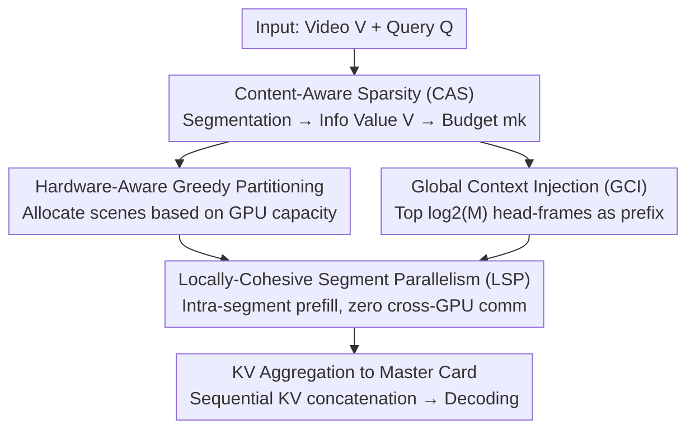

# SegMo: Co-Designing Content-Aware Sparsity and Locally-Cohesive Segment Parallelism for Efficient VLM Inference

**Conference**: CVPR 2026  
**Paper**: [CVF Open Access](https://openaccess.thecvf.com/content/CVPR2026/html/Li_SegMo_Co-Designing_Content-Aware_Sparsity_and_Locally-Cohesive_Segment_Parallelism_for_Efficient_CVPR_2026_paper.html)  
**Code**: https://github.com/LIHAOJUAN/SegMo  
**Area**: Model Compression / Efficient VLM Inference  
**Keywords**: Long Video Understanding, VLM Inference Acceleration, Content-Aware Sparsity, Segment Parallelism, Prefill Optimization

## TL;DR
SegMo addresses the token explosion and $O(N^2)$ prefill bottleneck in long-video VLMs. Through "algorithm-system co-design," it jointly optimizes *what to compute* (Content-Aware Sparsity, CAS) and *how to compute* (Locally-Cohesive Segment Parallelism, LSP). Leveraging the "local cohesion" property of VLM attention, it segments videos by scenes for parallel execution with zero cross-GPU communication during prefill. This achieves up to 12.00% accuracy improvement and up to 3.55× prefill acceleration across three long-video benchmarks.

## Background & Motivation
**Background**: VLMs are evolving from short clips to understanding hour-long videos. However, long videos generate visual tokens two to three orders of magnitude higher than LLMs—calculating 3600 frames at 576 tokens/frame results in over 2 million tokens. Given the $O(N^2)$ complexity of attention, the prefill stage becomes a significant computational bottleneck.

**Limitations of Prior Work**: Existing solutions fall into two categories, each with critical flaws. 1. **Blind Sparsification** (e.g., uniform frame downsampling): Key information in long videos may only exist in a 5-second segment; uniform sampling likely misses it, leading to catastrophic accuracy drops. 2. **Blind Parallelism**: Applying native LLM Tensor Parallelism (TP) or Sequence Parallelism (SP) to VLMs fails because these strategies rely on global all-to-all attention, which incurs unacceptable communication and memory overhead at the scale of VLM tokens.

**Key Challenge**: This creates a fundamental **accuracy-latency trade-off**—pursuing speed (blind sparsity) sacrifices accuracy, while pursuing accuracy (massive redundant frames + blind parallelism) explodes latency. The authors argue that this trade-off cannot be broken if sparsification and parallelism are treated as isolated problems.

**Key Insight**: The authors rely on two empirical observations of VLM attention. First, **Local Cohesion**: VLM attention is highly dense within semantic scenes but extremely sparse across scene boundaries (the diagonal block phenomenon in Figure 2). Second, **Layered Information Value**: Whether a scene deserves more frames depends on its *relevance* to the query and its internal *redundancy*.

**Core Idea**: Co-design "what to compute" and "how to compute" as a coupled unified problem. First, Use a sparsity strategy to produce an accurate, non-uniform, and "parallel-friendly" per-scene frame budget $\{m_k\}$. Then, the parallelism strategy uses this non-uniform load to dynamically calculate hardware-aware optimal partitions, breaking the accuracy-latency trade-off to achieve gains in both dimensions.

## Method

### Overall Architecture
SegMo is an end-to-end long-video VLM inference system. It takes "long video $V$ + user query $Q$" as input and produces an answer. It decomposes the traditional serial prefill into two stages: "content-aware sparsity" followed by "scene-based parallelism." Videos are split into $K$ semantically cohesive scene segments $C=\{C_1,\dots,C_K\}$ using PySceneDetect. A CPU engine calculates the "information value" for each segment to allocate frame budgets while constructing a lightweight global context. These loads are assigned to multiple GPUs, where each card performs vision encoding and parallel prefill only within its assigned scene segments (no inter-segment attention, zero cross-GPU communication). Finally, KV caches are aggregated to a master card in chronological order for decoding, while other cards simultaneously process the prefill for the next request.

The task is modeled as a **Makespan Minimization** problem: finding a partition $\pi=\{P_1,\dots,P_N\}$ to distribute $K$ scenes across $N$ GPUs, subject to the constraint that "all frames of the same scene must stay on the same GPU" and the partition must be hardware-aware. The load for each card $g_j$ is the sum of its scene frame counts $W(P_j)=\sum_{C_k\in P_j}\alpha\cdot m_k$. The end-to-end latency is approximated as:

$$L_{e2e}\approx \max_{j=1,\dots,N}\left(\frac{\sum_{C_k\in P_j}W(C_k)}{Cap(g_j)}\right)+T_{agg}$$

Since LSP eliminates cross-GPU communication during prefill and $T_{agg}$ (KV aggregation before decoding) is small and fixed under NVLink, the core optimization reduces to minimizing the makespan within the $\max$ term.

### Key Designs

**1. Content-Aware Sparsity (CAS): Balancing "Relevance + Redundancy"**

CAS avoids uniform downsampling through three steps. Step 1 uses PySceneDetect to segment the video. Step 2 calculates scores in two dimensions: **Query Relevance** $RL(Q,C_k)$ uses the first frame of each segment as a representative and calculates its CLIP relevance to the query, normalized via $RL(Q,C_k)=\frac{RL'(Q,C_k)-\min_k RL'(Q,C_k)}{\sum_k \{RL'(Q,C_k)-\min_k RL'(Q,C_k)\}}$. **Temporal Redundancy** $RD(C_k)$ is calculated using the Mean Absolute Difference of grayscale pixel intensities between the first and last frames, normalized to $[0,1]$ (High difference = high dynamics = more frames needed). These are combined into an **Information Value** $V(Q,C_k)=w\cdot RL(Q,C_k)+(1-w)\cdot RD(C_k)$ using hyperparameter $w$. Step 3 allocates the total budget $M_{max}$ proportionally to $V$. By using lightweight signals (CLIP + pixel diff) instead of heavy VLM-based reasoning for frame selection, it avoids high computational costs while remaining expressive.

**2. Locally-Cohesive Segment Parallelism (LSP): Zero Prefill Communication**

Addressing the bottleneck where global all-to-all attention leads to communication explosion, LSP leverages the observation that inter-segment (cross-boundary) attention is extremely sparse. By placing all frames of a scene $C_k$ on a single GPU and cutting at scene boundaries, each GPU performs prefill only on its segments. **Inter-segment attention is not calculated**, which eliminates cross-GPU communication overhead $L_{comm}$ during the compute-intensive prefill stage. This distinguishes SegMo from partial solutions that only parallelize vision encoders; SegMo treats scene segments as the shared independent unit for both sparsity and parallelism.

**3. Hardware-Aware Greedy Partitioning: Capacity-Proportional Loading**

Since LSP requires $K$ indivisible scenes to be distributed across $N$ potentially heterogeneous GPUs, SegMo uses a **hardware-aware greedy algorithm**. It calculates "ideal split points" proportional to each GPU's available capacity $Cap(g_j)$ (proxied by available VRAM). It then greedily assigns scenes: a segment is assigned to the current card or the next based on which keeps the cumulative load closest to the ideal split point. This ensures hardware utilization is maximized and makespan minimized.

**4. Global Context Injection (GCI): Head-Frames as Global Indices**

Segment parallelism loses global context since GPUs only see their assigned segments. To fix this, the authors observed **"head-frame primacy"**—the first frame of each scene consistently receives significantly higher attention scores (Red boxes in Fig 4). GCI selects the first frames of the top $\log_2 M$ scenes ranked by relevance and **prepends** this condensed global context sequence to the input of each parallel shard $P_j$. These few head-frames act as global indices, replacing the massive cost of maintaining a full global KV cache.

### System Optimization: Pipeline to Hide CAS Overhead
CAS introduces additional CPU overhead $T_{CPU}$. SegMo uses a producer-consumer multi-threaded scheduler to decouple CPU preprocessing from GPU computation. Two layers of optimization are applied: **Micro-latency hiding** (asynchronously merging $T_{CPU}$ into I/O-intensive video reading $T_{IO}$, where $T_{IO} > T_{CPU}$) and **Macro-pipelining** (overlapping $T_{Pre}$ of request $i+1$ with $T_{GPU}$ of request $i$).

## Key Experimental Results

Implementation uses PyTorch + HuggingFace Transformers, with a default 2×H100 (NVLink) setup. Models: MiniCPM-o 2.6 (8B) and Qwen2-VL-7B-Instruct. Benchmarks: LVBench, LongVideoBench, and Video-MME (videos ≥4 mins). Baseline: Uniform sampling + 2-GPU Data Parallelism.

### Main Results (Accuracy)

| Model / Setting | Benchmark | Baseline | SegMo (CAS) | SegMo (CAS+LSP) |
|------|------|------|------|------|
| Qwen2-VL-7B (32 frames) | LVBench | 32.44 | 44.44 (+12.00) | 40.75 (+8.31) |
| Qwen2-VL-7B (32 frames) | LongVideoBench(4-60m) | 45.68 | 49.54 (+3.86) | 50.23 (+4.55) |
| Qwen2-VL-7B (128 frames) | Video-MME(4-15m) | 63.00 | 69.46 (+6.46) | 66.22 (+3.22) |
| MiniCPM-o 2.6 (32 frames) | LVBench | 34.92 | 45.84 (+10.92) | 42.02 (+7.10) |
| MiniCPM-o 2.6 (32 frames) | LongVideoBench(4-60m) | 46.78 | 51.94 (+5.16) | 53.25 (+6.47) |

Accuracy gains are most significant on LVBench (+12.00% for Qwen2-VL at 32 frames) due to the high redundancy of 30–140 minute videos. While LSP introduces a slight drop compared to CAS-only due to discarded cross-segment context, results remain consistently higher than the baseline.

### Main Results (Latency, Qwen2-VL, TTFT)

| Benchmark | Baseline TTFT(s) | SegMo(CAS+LSP) TTFT(s) | Gain |
|------|------|------|------|
| LVBench (32 frames) | 2.627 | 0.930 | 2.83× |
| LVBench (64 frames) | 9.460 | 2.762 | 3.43× |
| LongVideoBench (32 frames) | 2.490 | 0.701 | 3.55× |
| LongVideoBench (64 frames) | 7.56 | 2.24 | 3.38× |

Using the same number of GPUs, SegMo reduces the Time-To-First-Token (TTFT) by 2.83×–3.55×, confirming that removing the communication bottleneck during prefill is highly effective.

### Ablation Study

| Experiment | Config | Key Metric | Note |
|------|------|---------|------|
| CAS weight $w$ | $w{=}0.0/0.5/0.8/1.0$ | LongVideoBench(64f): 49.65 / **51.83** / 50.12 / 50.58 | Peak at balanced $w{=}0.5$ |
| CAS weight $w$ | $w{=}0.0/0.5/0.8/1.0$ | Video-MME(128f): 68.05 / **69.00** / 66.09 / 66.67 | $w{=}0.5$ remains optimal |
| GCI | w/o GCI | LongVideoBench Overall 48.46 | Context loss due to parallelism |
| GCI | w/ GCI | LongVideoBench Overall 49.83 (+1.37) | +4.64 for medium segments; +10.71 for T2A tasks |

### Key Findings
- **$w=0.5$ is a robust optimum**: LongVideoBench favors "precise semantic matching" ($w=1$ better than $w=0$), whereas Video-MME favors "global coverage" ($w=0$ better than $w=1$). However, $w=0.5$ provides the best performance across both, indicating that relevance and redundancy are complementary.
- **GCI benefits complex cross-scene reasoning**: While the overall gain is +1.37%, GCI improves T2A (Task to Action) and E2O (Event to Object) tasks by +10.71% and +10.25% respectively, proving head-frames effectively act as global indices.
- **GCI peak depends on video length**: The gain peak is a function of the $\log_2 M$ budget; increasing the budget shifts the peak toward longer videos, representing an adjustable accuracy-compute trade-off.

## Highlights & Insights
- **"Local Cohesion" as the bridge**: The observation that attention is dense within segments but sparse across them serves as the anchor for both the sparsity unit (scene segments) and the parallelization boundary. This aligns computational load with the semantic structure of the data.
- **Cheap signals for frame selection**: Using CLIP and pixel differences instead of large VLM reasoning proves that inexpensive heuristics are sufficient for long-video sparsification, making it practical for production.
- **Head-frames as Global Sparse Priors**: Converting the "head-frame attention bias" into a $\log_2 M$ prefix allows the system to recover global context with minimal overhead, avoiding the storage of massive global KV caches.

## Limitations & Future Work
- **Dependency on Segmentation**: The method assumes videos can be cleanly split into semantically cohesive scenes. In videos with blurry transitions, continuous motion (long takes), or ill-defined boundaries, the "negligible inter-segment attention" assumption may fail.
- **Fixed GCI Budget**: The $\log_2 M$ budget is a heuristic; a method for adaptively adjusting GCI budget for ultra-long videos is currently missing.
- **Prefill-Centric Acceleration**: The focus is on prefill/TTFT. For ultra-long videos, the cost of concatenating global KV and the decoding latency (as well as tail latency from load imbalance) requires further study.
- **Hardware Assumptions**: Results rely on 2×H100 + NVLink. The performance on clusters without high-speed interconnects or with significantly more heterogeneous nodes remains to be verified.

## Related Work & Insights
- **vs. Uniform Sampling**: Baseline uniform sampling misses key frames and incurs high communication costs; SegMo wins on both accuracy and speed via non-uniform sampling and zero-communication parallelism.
- **vs. AKS / Q-Frame / FastVID**: These methods either target implicit structures, ignore temporal dynamics, or use query-agnostic pruning. SegMo's explicit two-dimensional (relevance + redundancy) approach is more precise.
- **vs. A.I.R.**: A.I.R. uses strong VLMs for frame selection which is computationally expensive; SegMo achieves similar effectiveness with much cheaper signals.
- **vs. TP/SP**: Native parallelisms fail at VLM token scales; SegMo eliminates prefill cross-GPU communication by cutting at scene boundaries.
- **vs. PEVLM / MERV**: Previous works either parallelize only on a single card or only parallelize the vision encoder. SegMo provides a complete end-to-end multi-GPU system solution.

## Rating
- Novelty: ⭐⭐⭐⭐ The co-design based on "local cohesion" is innovative; components like greedy partitioning and CLIP-based selection are combined effectively.
- Experimental Thoroughness: ⭐⭐⭐⭐ Extensive testing across two models and three benchmarks; however, lacks direct comparisons with frame-level methods like AKS/Q-Frame on the same hardware.
- Writing Quality: ⭐⭐⭐⭐ Clear logical flow from the makespan problem to design components. Figure 2-4 highlight insights effectively.
- Value: ⭐⭐⭐⭐ High practical value for long-video VLM deployment, offering 3.5× acceleration alongside accuracy gains.

<!-- RELATED:START -->

## Related Papers

- [\[CVPR 2026\] VLM-PTQ: Efficient Post-Training Quantization for Large Vision-Language Models](vlm-ptq_efficient_post-training_quantization_for_large_vision-language_models.md)
- [\[CVPR 2026\] Attention-aware Inference Optimizations for Large Vision-Language Models with Memory-efficient Decoding](attention-aware_inference_optimizations_for_large_vision-language_models_with_me.md)
- [\[CVPR 2026\] Content-Adaptive Hierarchical Hyperprior for Neural Video Coding](content-adaptive_hierarchical_hyperprior_for_neural_video_coding.md)
- [\[CVPR 2026\] CADC: Content Adaptive Diffusion-Based Generative Image Compression](cadc_content_adaptive_diffusion-based_generative_image_compression.md)
- [\[CVPR 2026\] Co-Me: Confidence Guided Token Merging for Visual Geometric Transformers](co-me_confidence_guided_token_merging_for_visual_geometric_transformers.md)

<!-- RELATED:END -->
