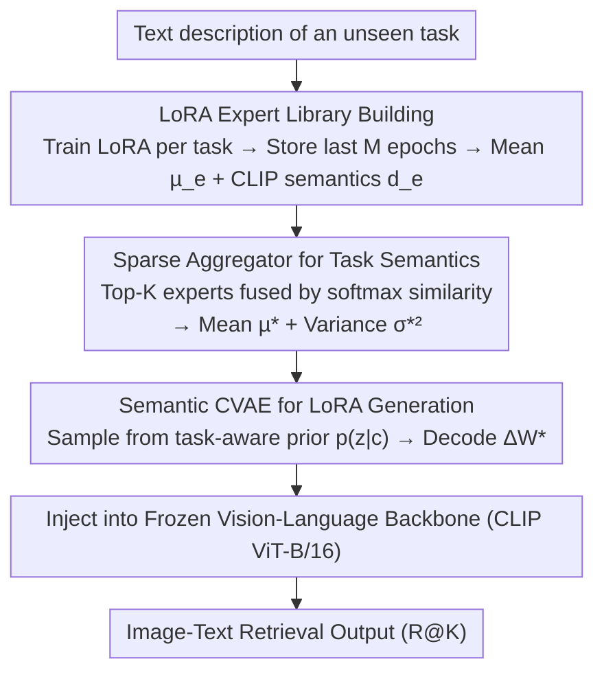

# SG-LoRA: Semantic-guided LoRA Parameters Generation

**Conference**: CVPR 2026  
**Paper**: [CVF Open Access](https://openaccess.thecvf.com/content/CVPR2026/html/Li_SG-LoRA_Semantic-guided_LoRA_Parameters_Generation_CVPR_2026_paper.html)  
**Code**: https://github.com/keepgoingjkg/SG-LoRA  
**Area**: Model Compression / LoRA Parameter Generation  
**Keywords**: LoRA Generation, Parameter-Efficient Fine-Tuning, Zero-Shot Open-world, Conditional VAE, Semantic Guidance

## TL;DR
SG-LoRA utilizes a textual task description as a "semantic bridge" to perform weighted aggregation of task semantics from a set of pre-trained expert LoRAs. It then directly samples and generates target LoRA parameters using a Conditional VAE (CVAE). This enables fine-tuning-free real-time model adaptation under conditions where **no target task data is available and the task space is open**, achieving or even surpassing the performance of task-specific fine-tuning (Oracle) in image-text retrieval.

## Background & Motivation

**Background**: Large-scale models rely on Parameter-Efficient Fine-Tuning (PEFT), such as LoRA, for low-cost adaptation to downstream tasks. A vast number of pre-trained LoRA modules have accumulated in the community. A natural question arises: can we "reuse/generate" LoRA weights directly to adapt to new tasks without fine-tuning from scratch? Existing research follows two paths: **merging** (deterministic fusion of existing LoRAs via coefficients) and **generation** (synthesizing new LoRA parameters using VAEs or Diffusion models).

**Limitations of Prior Work**: Merging methods support open worlds but rely on deterministic fusion, leading to poor diversity and difficulty in adapting to evolving user intentions. Furthermore, merging LoRAs from different tasks often leads to conflicts. Generative methods introduce randomness and better diversity but are typically built on a **closed-world assumption**—where training and testing tasks originate from similar distributions—failing when encountering task/domain shifts in a truly open task space.

**Key Challenge**: Real-world edge deployment scenarios simultaneously require "**no original data for target tasks** (due to privacy and compute constraints)" and an "**open-world task space** (unseen tasks may be unrelated to seen tasks)." Current paths only address one side of this problem.

**Goal**: The authors propose and formalize a new setting: **Zero-Shot Open-world Adaptation (ZSOA)**. Given a batch of LoRAs trained on seen tasks, the goal is to generate high-performance LoRAs for **any unseen task** without accessing its raw data during inference.

**Key Insight**: The authors draw inspiration from human analogical reasoning—identifying a British Shorthair based merely on a text description after seeing Birman or Egyptian Mau cats. By treating **textual descriptions** as a bridge connecting seen and unseen tasks, LoRAs for new tasks can be "interpolated by semantics" in the parameter space.

**Core Idea**: Task descriptions are encoded into semantic vectors using a frozen CLIP text encoder. These are used to select relevant experts from a library, which are then aggregated into a task semantic distribution. Finally, a CVAE samples the target LoRA conditioned on these semantics—replacing "**data-to-parameter**" fine-tuning with "**semantic-to-parameter**" generation.

## Method

### Overall Architecture
SG-LoRA splits the process of "creating a LoRA for an unseen task" into offline library construction and online generation. In the offline phase, task-specific LoRAs are trained for each seen task to form an expert library (each expert = mean parameters + CLIP semantic embedding). In the online phase, a text description of the unseen task is processed by a sparse aggregator to select the top-K relevant experts, fusing their semantics (mean and variance) based on similarity. This task semantic is then fed into a trained CVAE as a condition, sampling target LoRA parameters from a task-aware prior. These parameters are then injected into a frozen vision-language backbone for image-text retrieval. The entire inference pipeline requires only text input and never touches the target task data.

### Key Designs

**1. LoRA Expert Library Building: Distilling "Data Assets" into "Semantically Searchable Parameter Prototypes"**

Since ZSOA provides no target task data during inference, it must rely entirely on prior knowledge from seen tasks. The first step represents this knowledge in a compact, semantically retrievable form. For each seen task $T_n$, a task-specific LoRA is trained, and the parameters from the **last $M$ epochs** $\Delta\mathbf{W}_n = \{\Delta\mathbf{W}_n^m\}_{m=1}^M$ are saved. Retaining $M$ samples helps characterize the **distribution** of LoRA parameters rather than just a point estimate. Simultaneously, semantics $\mathbf{d}_n=f(T_n)$ are obtained via a frozen CLIP encoder. The library $\mathcal{W}_{\text{expert}}=\{(\boldsymbol{\mu}_e, \mathbf{d}_e)\}$ is formed by pairing the mean prototype $\boldsymbol{\mu}_e=\frac{1}{M}\Delta\mathbf{W}_e$ with the semantic embedding.

**2. Sparse Aggregator: Top-K Weighting + Variance Estimation via Law of Total Variance**

Simply aggregating all experts introduces noise or contradictory knowledge. The sparse aggregator selects only the top-K semantically relevant experts. For an unseen task embedding $\mathbf{d}^*$, cosine similarities with all experts are calculated, and weights $\alpha_k$ are derived via softmax with temperature $\tau$. The semantic mean is the weighted sum $\boldsymbol{\mu}^*=\sum_k \alpha_k\boldsymbol{\mu}_k$. Crucially, generative modeling requires variance; the authors use the **Law of Total Variance** to estimate the element-wise task variance:

$$
{\boldsymbol{\sigma}^*}^2=\sum_{k=1}^K \alpha_k\boldsymbol{\sigma}_k^2+\sum_{k=1}^K \alpha_k(\boldsymbol{\mu}_k-\boldsymbol{\mu}^*)\odot(\boldsymbol{\mu}_k-\boldsymbol{\mu}^*)
$$

The first term represents the weighted internal variance of each expert, and the second term represents the dispersion of expert means relative to the global mean. This allows the task semantic $c=\{\boldsymbol{\mu}^*, {\boldsymbol{\sigma}^*}^2\}$ to characterize both the "center" and "uncertainty" of the new task.

**3. Semantic-conditioned CVAE Generation: Turning Deterministic Fusion into Probabilistic Sampling**

With task semantic $c$, the CVAE samples LoRAs in the parameter space. Unlike standard VAEs where $p(z)=\mathcal{N}(0,I)$, this model uses a **semantic-aware prior** $p(z|c)$ (parameterized by MLPs), allowing each task to have its own prior distribution. The training minimizes the negative ELBO: $\mathcal{L}_{\text{CVAE}}=\mathbb{E}_{q(z|X,c)}[\|X-\hat{X}\|^2]+\lambda\cdot \text{KL}(q(z|X,c)\|p(z|c))$. During inference, parameters are directly sampled from $p(z|c)$, upgrading deterministic fusion to probabilistic sampling, which enhances parameter diversity and enables dynamic adaptation to user intent.

### Loss & Training
The training target is the negative ELBO described above. Default hyperparameters are $M=100$, $K=4$, and $\lambda=1$. The backbone is CLIP ViT-B/16, with rank-2 LoRAs injected into $W_q, W_k, W_v$ of each Transformer block. The CVAE encoder and prior network are two-layer ReLUs, and the decoder is a three-layer ReLU. Optimization is performed using Adam on an A6000 GPU.

## Key Experimental Results

### Main Results
Datasets include MS-COCO, OxfordPets, and Flowers102 (the latter two converted to retrieval tasks via Qwen2-VL). Metrics are R@1/5/10 for Image-to-Text (I2T) and Text-to-Image (T2I). Baselines include Zero-Shot CLIP, Model Soups, AdapterSoup, Top-K LoRA Weighted fusion, and Oracle (direct fine-tuning).

| Dataset | Metric | Zero-Shot CLIP | Top-K Weighted | SG-LoRA | Oracle |
|--------|------|----------------|----------------|---------|--------|
| MS-COCO | I2T R@1 | 66.43 | 71.55 | **74.31** | 72.45 |
| MS-COCO | T2I R@1 | 41.66 | 49.85 | **54.42** | 53.10 |
| OxfordPets | I2T R@1 | 40.45 | 53.96 | **57.15** | 55.84 |
| OxfordPets | T2I R@1 | 26.03 | 35.42 | 37.62 | **40.99** |

On MS-COCO and OxfordPets I2T R@1, SG-LoRA **outperforms the Oracle**. This is attributed to CVAE's efficient distribution modeling and the fact that Oracle fine-tuning is prone to overfitting on small image-text pairs, whereas SG-LoRA's data-free approach is more robust.

### Ablation Study
| Configuration | Egyptian Mau I2T R@1 | Persian I2T R@1 | Description |
|------|----------------------|-----------------|------|
| w/o Cat Experts | 36.08 | 44.00 | MS-COCO Cat experts removed from library |
| w/ Cat Experts | 37.11 | 47.00 | Highly semantically related Cat experts included |

### Key Findings
- **Semantic weighting is crucial**: AdapterSoup (top-K equal weighting) underperforms Top-K Weighted (softmax), showing that unrelated experts introduce noise; weighting by relevance is essential.
- **Library coverage determines the upper bound**: SG-LoRA trained on MS-COCO performs better on Flickr30K than when trained on OxfordPets, due to broader category coverage.
- **Expert relevance provides direct gains**: Adding experts highly related to the target (e.g., Cat experts for Egyptian Mau) consistently improves R@1.

## Highlights & Insights
- **Texts as bridges**: Converting open-world adaptation from "requiring data" to "requiring one task description" is highly practical for edge-side privacy and compute efficiency.
- **Law of Total Variance for uncertainty**: This approach elegantly incorporates both intra-expert variance and inter-expert dispersion into the conditioning signal, making CVAE sampling more representative of the new task's statistics.
- **From deterministic fusion to probabilistic sampling**: The semantic-aware prior $p(z|c)$ explains why the model can exceed Oracle performance (mitigating small-sample overfitting) and highlights the inherent advantages of parameter generation in terms of diversity.

## Limitations & Future Work
- Evaluation is primarily limited to **image-text retrieval**; its effectiveness across more structurally diverse tasks (e.g., detection, generation) remains unverified.
- Performance is heavily dependent on the **semantic coverage of the expert library**; quality drops significantly if no similar experts exist.
- A **uniform LoRA configuration** was used, which may limit the performance ceiling for certain specific datasets.
- Task descriptions were generated using a fixed template `a photo of a <class>`; the impact of description quality and expressiveness requires further systematic analysis.

## Related Work & Insights
- **vs. Merging (Model Soups / LoraHub / SemLA)**: These methods rely on deterministic fusion or require unknown task data/iterative loading. SG-LoRA uses data-free probabilistic sampling to enhance diversity.
- **vs. Generation (Neural Diffusion / Hyper-representation / ICM-LoRA)**: Previous generation work was mostly limited to small networks, unconditional setups, or closed-world augmentation. SG-LoRA is **conditional and designed for open-world** parameter generation for any unseen task.

## Rating
- Novelty: ⭐⭐⭐⭐⭐ Proposes and formalizes the ZSOA setting; the combination of semantic bridges, total variance conditioning, and semantic-prior CVAE is novel.
- Experimental Thoroughness: ⭐⭐⭐⭐ Covers in-dataset, cross-dataset, and general retrieval with multiple ablations, though task types are concentrated.
- Writing Quality: ⭐⭐⭐⭐ Clear motivation/analogy and complete formulas.
- Value: ⭐⭐⭐⭐ Real-time, data-free LoRA generation holds high practical value for edge deployment and privacy scenarios.

<!-- RELATED:START -->

## Related Papers

- [\[CVPR 2026\] TAS-LoRA: Transformer Architecture Search with Mixture-of-LoRA Experts](tas-lora_transformer_architecture_search_with_mixture-of-lora_experts.md)
- [\[ICML 2026\] A Language-Guided Bayesian Optimization for Efficient LoRA Hyperparameter Search](../../ICML2026/model_compression/a_language-guided_bayesian_optimization_for_efficient_lora_hyperparameter_search.md)
- [\[CVPR 2026\] Is Bin Generation Indispensable? A Bin-Generation-Free Dataset Quantization via Semantic Perspective](is_bin_generation_indispensable_a_bin-generation-free_dataset_quantization_via_s.md)
- [\[ACL 2026\] LoRA on the Go: Instance-level Dynamic LoRA Selection and Merging](../../ACL2026/model_compression/lora_on_the_go_instance-level_dynamic_lora_selection_and_merging.md)
- [\[ACL 2026\] SAMoRA: Semantic-Aware Mixture of LoRA Experts for Task-Adaptive Learning](../../ACL2026/model_compression/samora_semantic-aware_mixture_of_lora_experts_for_task-adaptive_learning.md)

<!-- RELATED:END -->
