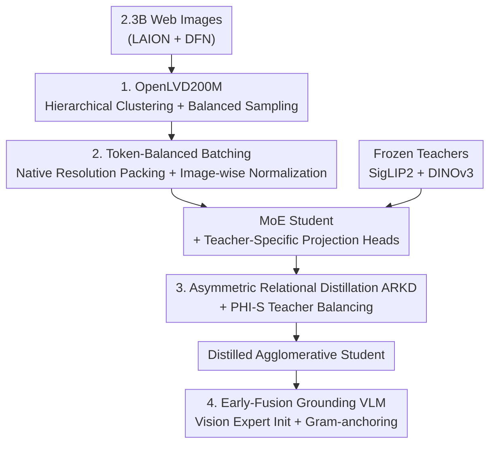

<!-- 由 tmp/gen_cvf_stubs.py 自动生成（CVF-only，无 arXiv） -->
# SigLino: Efficient Multi-Teacher Distillation for Agglomerative Vision Foundation Models

**Conference**: CVPR 2026  
**Paper**: [CVF Open Access](https://openaccess.thecvf.com/content/CVPR2026/html/Chaybouti_SigLino_Efficient_Multi-Teacher_Distillation_for_Agglomerative_Vision_Foundation_Models_CVPR_2026_paper.html)  
**Code**: Project page sofianchay.github.io/amoe (Releasing OpenLVD200M dataset + 5 distillation checkpoints)  
**Area**: Model Compression / Multi-Teacher Knowledge Distillation  
**Keywords**: Multi-Teacher Distillation, Agglomerative Vision Foundation Models, Relation Distillation, Token-Balanced Batching, MoE

## TL;DR
SigLino systematically studies the data efficiency of distilling multiple vision foundation models (SigLIP2 + DINOv3) into a single agglomerative student model. It proposes a three-part suite including asymmetric relation knowledge distillation (ARKD), token-balanced batching, and hierarchical clustering data filtering. Using only 200M images (approximately 1/4.7 of the token budget of RADIO), it outperforms the same-sized RADIOv2.5 in classification, retrieval, and segmentation. Furthermore, the resulting student is directly utilized to initialize the vision experts in early-fusion grounding VLMs.

## Background & Motivation
**Background**: Current methods for universal vision representations generally follow two paths. One is modular VLMs (combining a text-aligned vision encoder with an LLM), which excel at instruction following but are relatively weak on dense prediction tasks and are not naturally multimodal. The other path consists of specialized models trained with a single supervision source (e.g., pure contrastive or pure self-supervised learning), which optimize target tasks well but lack universality. Recently, a third path has emerged: **Agglomerative Vision Foundation Models (Agglomerative VFMs)**, which employ multi-teacher distillation to compress the capabilities of several complementary teachers into a single backbone, represented by AM-RADIO / RADIOv2.5.

**Limitations of Prior Work**: Although agglomerative distillation is promising, it is expensive. It typically requires massive training samples (RADIO uses ~1.1 trillion image tokens) and necessitates careful engineering to handle inconsistent teacher resolutions and balance multiple loss functions. Learning dynamics and data efficiency have rarely been systematically studied; typical approaches rely heavily on data scaling and manual loss tuning.

**Key Challenge**: The bottleneck of multi-teacher distillation does not lie in model capacity, but rather in three overlooked aspects: **the quality and distribution of training data**, **the stability of multi-resolution training**, and **the preservation of the teachers' relational geometric structure**. The teachers, SigLIP2 (strong image-text alignment but inseparable dense features) and DINOv3 (excellent dense features but performing image-text alignment post-hoc via LiT), possess massive statistical scale discrepancies. Naive sample-wise MSE matching is easily dominated by high-variance teachers or high-resolution images.

**Goal**: To train agglomerative VFMs with **higher data efficiency and better representation quality** under a standardized framework. This is dissected into three questions: (1) what data should be used to maximize efficiency; (2) how to perform stable training under native resolutions; and (3) how to align with teachers without destroying their clustering geometry.

**Key Insight**: Adapting mature "hierarchical clustering data filtering" from self-supervised learning into distillation; and introducing relational knowledge distillation (RKD, matching pairwise distances between samples) but modifying it to an "asymmetric" version to avoid harming kNN clustering by selectively pulling and pushing.

**Core Idea**: Utilizing a three-part suite of "data filtering + token-balanced batching + asymmetric relation distillation" to transform multi-teacher distillation from brute-force token scaling into a highly data-efficient, standardized formula, while using an MoE student to naturally accommodate complementary teacher signals for direct service to early-fusion grounding VLMs.

## Method

### Overall Architecture
The training of SigLino is organized across two sequential timelines. **Distillation Stage**: An image is fed simultaneously to two frozen teachers (SigLIP2, DINOv3) and an MoE student. The student outputs global CLS tokens, patch tokens, and register tokens, which are mapped to each teacher's embedding space via student-specific learnable projection heads. The loss simultaneously aligns representation categories across global (CLS/attention pooling), dense (patch), and register (DINOv3 only) markers, overlaid with an ARKD relational loss that matches pairwise geometries across samples. Prior to this, training data is filtered into OpenLVD200M via hierarchical clustering, and each batch packs multiple native-resolution images using token-balanced batching to normalize the loss by the token count of each image. **Downstream Stage**: The distilled student is used to initialize the vision experts of an early-fusion grounding MoE VLM, paired with Gram-anchoring to prevent dense features from degenerating during fine-tuning for referring expression comprehension and segmentation.

The entire pipeline forms a serial workflow: "Data Filtering -> Stable Batching -> Multi-Teacher Alignment Loss (with ARKD) -> MoE Student -> Downstream Grounding Initialization":

### Key Designs

**1. OpenLVD200M: Porting Self-Supervised Hierarchical Clustering Data Filtering to Multi-Teacher Distillation**

A major pain point is that web images naturally have long-tailed distributions. Random sampling causes common concepts to overwhelm fine-grained or long-tailed concepts, leading to poor distillation sample efficiency overheads. The authors borrow hierarchical clustering and balanced sampling used in DINOv3 training (originally a self-supervised learning technique) and apply it to distillation: from a pool of 2.3 billion images across LAION and DFN, DINOv3 ViT-B is used for encoding, uniformly downsampling to 1 billion images. A 4-level hierarchical clustering is run (with 20M, 500k, 50k, 20k centroids), and the remaining 1.7 billion images are allocated to first-level centroids. Finally, hierarchical sampling is executed to obtain a balanced 200M subset, OpenLVD200M. The authors also optimize the algorithm to reduce the required compute from an estimated 45 nodes to 12 A100 nodes. Why this works: evenly covering visual concepts exposes fine-grained/long-tailed categories sufficiently—in ablation studies, average image-text classification rises from 74.96 to 79.11 ($+4.15$), and the fine-grained FGVC-Aircraft dataset surges by $+18.64$. This proves that the "distillation data distribution" itself is a heavily underestimated lever.

**2. Token-Balanced Batching: Ensuring Multi-Resolution Training Does Not Collapse or Forget Low Resolutions**

A pain point in native resolution training is that the number of patches per image varies drastically (256x256 produces 256 patches, while 768x768 produces 2304 patches). Naive batching with a fixed number of images per GPU rank causes severe token imbalance across ranks, triggering high-norm gradients and training instability. The authors use FlexAttention to pack multiple images into a single sequence up to a fixed context length $C_{max}$ (up to 16 images per sequence) and apply an attention mask to block self-attention between images, aligning the token budget across ranks. This packing, however, introduces a new issue: because different sequences contain varying numbers of images, the loss must be correctly normalized to ensure unbiased gradients. The loss is normalized by the **number of tokens per image** before global averaging: patch loss $L^{(t)}_{patch}(q)=\frac{1}{N_q}\sum_{\omega=1}^{N_q}\|z^{(t,p)}_{q,\omega}-\hat z^{(t,p)}_{q,\omega}\|_2^2$, global aggregation $L^{(t)}_{global}=\frac{1}{B_{global}}\sum_{r,j,i}L^{(t)}(q)$, ensuring each image contributes equally regardless of its resolution. Consequently, this prevents forgetting low-resolution global features (even improving them) while boosting throughput from 7.5k to 20k tokens/s by greatly reducing padding—gaining both stability and efficiency.

**3. ARKD: Asymmetric Relation Knowledge Distillation, Aligning Image-Text Without Damaging Clustering**

A pain point is that performing only sample-wise one-to-one matching neglects the relative geometry across samples. The authors introduce Relational Knowledge Distillation (RKD, which matches pairwise distances of samples within a batch) and observe that it is highly useful for DINOv3's image-text alignment (since DINOv3 is aligned to text post-hoc via LiT, making image-text similarity scales only about 0.2 compared to SigLIP2's 0.9, and the relation loss acts as a regularizer to "enforce correct sample margins"). However, **standard RKD harms kNN clustering** because it excessively pushes/pulls samples that should remain relatively distant. The authors modify this to be **asymmetric**: using the median distance $m$ in the teacher's space within a batch as the decision boundary, pushing and pulling only when "they should be close or distant." Letting $\hat D^T_{ij},\hat D^S_{ij}$ denote normalized teacher and student distances, they define single-sided errors $\text{shrink}_{ij}=\max\{\hat D^S_{ij}-\hat D^T_{ij},0\}$, $\text{expand}_{ij}=\max\{\hat D^T_{ij}-\hat D^S_{ij},0\}$, and apply a binary gate $w_{shrink,ij}=\mathbb{1}\{\hat D^T_{ij}<m\}$:

$$L^{(t)}_{ARKD}=\frac{1}{B_{global}(B_{global}-1)}\sum_{i\neq j}\big[w_{expand,ij}\,h(\text{expand}_{ij})+w_{shrink,ij}\,h(\text{shrink}_{ij})\big]$$

where $h(\cdot)$ is the smooth-L1 loss. Ablations (Table 4) reveal that vanilla RKD improves DINOv3 image-text alignment from 63.71 to 77.48 but causes a drop in kNN; ARKD secures both the image-text gains (ensemble 80.21) and recovers kNN to 83.63, proving to be the optimal trade-off.

**4. MoE Student + Early-Fusion Grounding Initialization + Gram-anchoring**

Agglomerative distillation must absorb two types of heterogeneous teacher signals, a task for which MoE architectures are naturally suited due to their capacity for modality/capability specialization. The student is an 18-layer MoE (0.3B active / 0.6B total parameters, with 6 active out of 28 experts), paired with PHI-S teacher balancing. Since different teachers have vast discrepancies in variance and mean, standard MSE implicitly favors teachers with high variance. PHI-S standardizes each teacher's target via an invertible linear map, which is inverted back to the teacher's original space during inference (for DINOv3's second register, however, the authors skip PHI-S because its multimodal distribution cannot be reliably estimated). Downstream, the distilled student is used to initialize the vision experts of an early-fusion grounding MoE VLM, allowing image and text tokens to interact at every layer (unlike modular VLMs where image features meet text at a very late stage). To prevent dense features from degenerating during fine-tuning (where patch features collapse and look like the CLS token), the authors employ **Gram-anchoring** to constrain the Gram matrix of patches against the frozen distilled student: $L_{gram}=\frac{1}{B}\sum_b\frac{1}{N_b^2}\|K^S_b-K^T_b\|_F^2$, anchoring inter-sample geometry to preserve spatial coherence. As a result, grounding performance increases from 29.15 (training from scratch) to 57.49 with SigLino init, and further to 61.06 with Gram-anchoring (RefCOCO detection).

### Loss & Training
The per-image loss for each teacher is defined as $L^{(t)}(q)=L^{(t)}_{CLS}(q)+L^{(t)}_{patch}(q)+L^{(t)}_{reg}(q)$ (where the register term is only for DINOv3). The losses are globally averaged with equal weight for all images and then summed across all teachers: $L_{total}=\sum_t L^{(t)}_{global}$, with ARKD overlaid for each teacher: $L^{(t)}=L^{(t)}_{global}+L^{(t)}_{ARKD}$. Training is conducted in two stages: Stage 1 trains on OpenLVD up to 256x256 (50k steps) to rapidly learn global and dense representations; Stage 2 post-trains on 13M images (11.5M from SAM + 1.5M web images) up to 768x768 (90k steps), utilizing multi-resolution mixing (re-introducing 256x256 OpenLVD + native 256-384 sizes + high-resolution pool downsampled to 256/512) to prevent low-resolution forgetting caused by high-resolution distribution shift. Hardware: 4 nodes x 8 A100 GPUs.

## Key Experimental Results

### Main Results

Comparison under 512x512 resolution against same-scale RADIOv2.5 (macro average, Ensemble head):

| Task | Metric | SigLino-MoE-0.3-0.6B | SigLino-Dense-0.6B | RADIOv2.5-H (0.6B) |
|------|------|------|------|------|
| Image-Text Classification | Avg Top-1 | 84.13 | 84.40 | 82.26 |
| kNN Classification | Avg Top-1 | 88.06 | 90.70 | 85.12 |
| Retrieval MSCOCO5k | T2I@1 | 53.98 | 55.60 | 53.24 |
| Retrieval Flickr30k | I2T@1 | 94.30 | 94.20 | 93.50 |
| Linear Probe Segmentation ADE20k | mIoU | 52.23 | 52.95 | 51.37 |
| Linear Probe Segmentation Cityscapes | mIoU | 64.36 | 65.38 | 64.11 |

Crucially, SigLino only uses approximately 230 billion image tokens (0.23TT), which is **1/4.7** of RADIO's 1.1 trillion tokens, yet it outperforms it comprehensively on macro average. It even exceeds the two teachers themselves in ensemble evaluation. The ultra-sparse variant (top-2/28, with only 0.15B active parameters) still outperforms RADIOv2.5-H (83.10 / 89.80).

### Ablation Study

| Configuration | Image-Text Avg | kNN Avg | Description |
|------|---------|---------|------|
| Vanilla MT (no RKD) | 77.62 | 83.54 | Sample-wise matching only |
| RKD (Symmetric) | 79.49 | 82.61 | Image-text increases, but kNN drops |
| ARKD (Asymmetric) | 80.21 | 83.63 | Win-win for image-text and kNN |
| Random 200M | 74.96 | 82.66 | Randomly sampled data |
| OpenLVD200M | 79.11 | 85.08 | Hierarchical clustering filtering ($+4.15$ / $+2.42$) |

Ablation on grounding init (RefCOCO detection Acc@IoU0.5): Scratch 29.15 -> SigLino init 57.49 -> +Gram 61.06; multi-teacher (54.72) significantly outperforms single-teacher SigLIP2-only (40.69) / DINOv3-only (45.06).

### Key Findings
- **Data filtering is the biggest lever**: OpenLVD200M outperforms a randomly sampled counterpart of the same size by $+4.15$ on image-text tasks and by $+18.64$ on the fine-grained FGVC-Aircraft dataset, proving that "what data to feed" in distillation is heavily undervalued.
- **The asymmetry of ARKD is key**: Symmetric RKD sacrifices kNN, but adding median gating ensures adjustments are only made when necessary, resulting in a win-win for both image-text alignment and clustering. The gains mostly originate from DINOv3, which has weaker text alignment.
- **High cost-performance of MoE**: The MoE with 6 active experts nearly matches the fully dense version, halving active parameters; the ultra-sparse variant (0.15B active) still outperforms RADIOv2.5-H, providing the best efficiency-performance trade-off.
- **Gram-anchoring prevents degeneration**: During fine-tuning on global representations, patches tend to collapse toward the CLS token, blurring dense structures. Anchoring the Gram matrix recovers spatial coherence, as visualized in the PCA plots.

## Highlights & Insights
- **Migrating SSL data filtering to distillation**: Hierarchical clustering combined with balanced sampling is traditionally specialized for self-supervised learning; the authors demonstrate that it is equally crucial and yields even larger gains for multi-teacher distillation. This "data efficiency" paradigm can be directly ported to any distillation or pre-training pipeline.
- **Clever "asymmetry" of relational distillation**: Realizing that standard RKD harms clustering by indiscriminately pushing and pulling, the authors use the median distance in the teacher space as a gate to apply only unilateral constraint. This is a lightweight yet fundamental fix that can be readily applied to any scenario where relational or contrastive regularizers damage clustering structures.
- **Token-balanced batching** resolves the engineering bottleneck of "native resolution training instability" using FlexAttention packaging + image-wise token normalization, while simultaneously boosting throughput by nearly 3x—proving that stability and efficiency can be achieved in tandem.
- **Directly utilizing the distilled student as VLM vision experts**: Initializing the vision experts in early-fusion grounding VLMs with the distilled student bypasses the traditional modular stack of ViT -> LLM. This delivers strong grounding capability under limited annotations, offering end-to-end evidence for the "distillation as pre-training" paradigm.

## Limitations & Future Work
- The authors acknowledge that downstream grounding fine-tuning degrades dense features (causing patches to collapse toward CLS), requiring additional regularizers like Gram-anchoring. This indicates that distilled representations are not "maintenance-free" in generative/autoregressive VLM training.
- PHI-S fails to accurately model the multimodal distribution of DINOv3's second register, leading to an engineering compromise where the registers are excluded from PHI-S.
- Self-observations: The experiments only employ two teachers (SigLIP2 and DINOv3) at the ViT-L scale. When more teachers are present or capabilities conflict, whether ARKD and PHI-S remain stable has not been verified. Furthermore, the selection of OpenLVD200M uses DINOv3 encoders for clustering, which might implicitly inject "DINOv3 bias" into the data distribution.
- Future directions: Replace the median gate in ARKD with a learnable or adaptive threshold, or set distinct boundaries for different teachers; investigate how expert routing interacts with modality specialization under 3+ teachers.

## Related Work & Insights
- **vs. AM-RADIO / RADIOv2.5**: Both perform agglomerative multi-teacher distillation, but RADIO relies on scaling tokens (1.1TT) and handling resolution mode shifts. Conversely, this work focuses on data filtering, token-balanced batching, and ARKD, outperforming RADIO using only 1/4.7 of the tokens, underscoring "data and relational geometry" over "brute compute."
- **vs. RKD (Relational Knowledge Distillation)**: While RKD indiscriminately aligns pairwise sample distances, this paper shows it degrades kNN performance and proposes an asymmetric gated version (ARKD) to balance alignment and clustering.
- **vs. Modular Grounding VLMs (Florence-2 / VisionLLM v2)**: These rely on a modular stack of "vision encoder + sequence decoder / routing tokens." This work employs an early-fusion decoder-only model with MoE modality experts, allowing image and text to interact at every layer, which simplifies the modular stack.
- **vs. MoMa (Early-Fusion MoE)**: MoMa demonstrates that modality-specific experts are optimal for early fusion. This paper builds on this by initializing the vision experts with the distilled agglomerative student, pre-injecting "high-quality representations."

## Rating
- Novelty: ⭐⭐⭐⭐ Porting SSL data filtering to distillation and proposing asymmetric relational distillation are highly practical and precise innovations, though individual components build upon existing technologies (RKD, PHI-S, hierarchical clustering).
- Experimental Thoroughness: ⭐⭐⭐⭐⭐ Comprehensive coverage across classification, retrieval, segmentation, and grounding, with independent ablation studies for the three core designs, alongside open-sourcing the dataset and 5 checkpoints.
- Writing Quality: ⭐⭐⭐⭐ Well-structured with highly clear logic. Math notations are slightly dense, and some implementation details are relegated to the supplementary material.
- Value: ⭐⭐⭐⭐⭐ Successfully converts multi-teacher distillation from a brute-force token scaling process into a reproducible, highly data-efficient formulation, and links it directly to early-fusion VLMs. Both engineering and methodological contributions are highly valuable.

<!-- RELATED:START -->

## Related Papers

- [\[CVPR 2026\] Masking Teacher and Reinforcing Student for Distilling Vision-Language Models](masking_teacher_and_reinforcing_student_for_distilling_vision-language_models.md)
- [\[ICML 2026\] PRISM: Synergizing Vision Foundation Models via Self-Organized Expert Specialization](../../ICML2026/model_compression/prism_synergizing_vision_foundation_models_via_self-organized_expert_specializat.md)
- [\[CVPR 2026\] Collaborative Multi-Mode Pruning for Vision-Language Models](collaborative_multi-mode_pruning_for_vision-language_models.md)
- [\[ECCV 2024\] UNIC: Universal Classification Models via Multi-teacher Distillation](../../ECCV2024/model_compression/unic_universal_classification_models_via_multi-teacher_distillation.md)
- [\[CVPR 2026\] Teacher-Guided Routing for Sparse Vision Mixture-of-Experts](teacher-guided_routing_for_sparse_vision_mixture-of-experts.md)

<!-- RELATED:END -->
