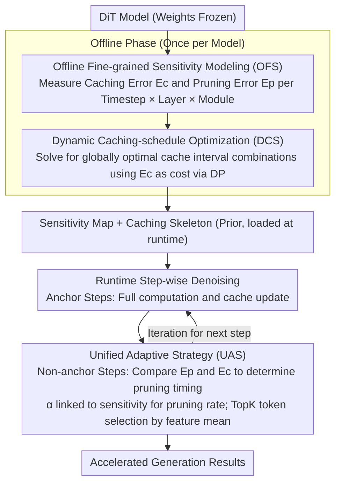

# SODA: Sensitivity-Oriented Dynamic Acceleration for Diffusion Transformer

**Conference**: CVPR2026  
**arXiv**: [2603.07057](https://arxiv.org/abs/2603.07057)  
**Code**: [leaves162/SODA](https://github.com/leaves162/SODA)  
**Area**: Model Compression  
**Keywords**: Diffusion Transformer, Training-free Acceleration, Caching, Pruning, Sensitivity Modeling, Dynamic Programming

## TL;DR

SODA is proposed to achieve high-fidelity generation under controllable acceleration ratios for Diffusion Transformers without training, utilizing offline fine-grained sensitivity modeling, dynamic programming for interval optimization, and a unified adaptive pruning strategy.

## Background & Motivation

**DiT Inference Efficiency Bottleneck**: While Diffusion Transformers perform excellently in image and video generation, the repetitive sampling steps and Transformer blocks result in low inference efficiency, hindering deployment.

**High Cost of Training-based Methods**: Acceleration methods such as distillation or fine-tuning require significant computational overhead and have limited generalization; researchers prefer training-free acceleration.

**Trade-offs between Caching and Pruning**: Caching is highly efficient but sacrifices fidelity; pruning is flexible but less efficient. Combining both can balance efficiency and quality.

**Prior Work Relies on Empirical Design**: Methods like ToCa and DuCa use fixed or heuristic configurations for caching intervals and pruning rates. These only capture coarse-grained sensitivity trends and fail to perceive fine-grained variations across timesteps, layers, and modules.

**Quality Degradation from Skipping High-Sensitivity Computations**: Heuristic schemes inevitably skip computations that are highly sensitive to acceleration, leading to a decline in generation fidelity.

**Poor Generalization**: Manually designed strategies depend on empirical experience and are difficult to transfer across different models.

## Method

### Overall Architecture

SODA aims to solve a long-avoided problem in training-free DiT acceleration: deciding which computations to skip. Previously, caching and pruning intervals were determined by fixed patterns or heuristics. However, DiT tolerance for "skipped" computations varies significantly across timesteps, layers, and modules—skipping a high-sensitivity computation causes image quality to collapse. SODA quantifies this tolerance as a look-up table prior to guide scheduling decisions. The pipeline involves three steps: the offline stage scans each model to build a "sensitivity map" (OFS); this map is used to formulate caching intervals as an optimization problem solved via dynamic programming for a global optimum (DCS); finally, at runtime, a layer-wise and module-wise comparison determines whether to prune or cache based on which path minimizes error (UAS). None of the three steps modify model weights; the offline phase runs once, and runtime overhead is negligible.

### Key Designs

**1. Offline Fine-grained Sensitivity Modeling (OFS): Quantifying "Indispensable Computations" as a Look-up Prior**

Heuristic methods inadvertently harm performance because they lack fine-grained sensitivity insights across timesteps, layers, and modules. OFS directly measures and stores these sensitivities. For caching, it defines the caching sensitivity error $\mathcal{E}_c(t,l,m,n) = 1 - \text{Cos}(\mathcal{D}_{t+n,l,m}(x), \mathcal{D}_{t,l,m}(x))$, measuring the Cosine deviation when reusing cached features from step $t+n$ at step $t$. This error is expanded across four dimensions: timestep $t$, layer $l$, module $m$, and interval $n$. For pruning, it symmetrically defines the pruning sensitivity error $\mathcal{E}_p(t,l,m,\alpha)$, characterizing the error caused by dropping tokens at rate $\alpha$. These errors are intrinsic model properties rather than sample noise: averaging over 100 random generations (10 for video models) yields a stable distribution. Thus, the sensitivity map is modeled once per model. Overhead is minimal—approximately 160s for DiT-XL/2 with only 0.56GB additional memory.

**2. Dynamic Caching-schedule Optimization (DCS): Finding Global Optimal Cache Intervals via DP**

With the sensitivity map, determining "where to cache" no longer requires guessing. SODA observes that this scheduling problem exhibits optimal substructure—the optimal caching plan from a given step forward depends only on the current step and the remaining budget. This is formulated as a dynamic programming recurrence:

$$dp[t][i+1] = \min_{n \in \mathcal{N}} \{\mathcal{E}_{dp}(t,n) + dp[t+n][i]\}$$

where $\mathcal{N}$ is the set of candidate intervals and $i$ is the remaining budget. Given an acceleration budget (total cache operations $N_s$), the algorithm backtracks from step $T$ to 1 to find the path with the minimum cumulative sensitivity error, determining specific caching timesteps and intervals. For example, if sensitivity is low in the middle steps, DP automatically extends intervals to save computation, while shortening them at sensitive ends to preserve quality. This is solved on the offline table and introduces no runtime overhead.

**3. Unified Adaptive Strategy (UAS): A Unified Sensitivity Metric for Pruning and Caching Decisions**

DCS establishes the caching skeleton, but UAS decides whether intermediate non-anchor steps should perform pruning or cache reuse. By using the same OFS metric for both, SODA ensures the path with the smaller error is chosen. For pruning timing, it only executes pruning if the pruning error $\delta_{t+1,l,m} = \mathcal{E}_p(t+1,l,m,\alpha)$ is smaller than the corresponding caching error $\mathcal{E}_c(t,l,m,n)$. For the pruning rate, intensities are linked to local sensitivity: $\alpha_{t+1,l,m} = \lambda \cdot \mathcal{E}_c(t,l,m,n) + \beta$, where $\lambda$ is a scaling coefficient and $\beta$ is a base rate adjusted to the budget. This ensures highly sensitive areas are pruned less aggressively. Tokens are selected using a feature mean TopK approach, ensuring compatibility with Flash Attention where attention weights are often inaccessible.

### Loss & Training

SODA is entirely training-free and introduces no additional loss functions. Its only "optimization objective" is current accumulated sensitivity error $dp[1][N_s]$ minimized via DCS, which is completed once during the offline phase.

## Main Results

| Model / Setting | Gain | FID↓ | sFID↓ | IS↑ | Description |
|---|---|---|---|---|---|
| DiT-XL/2 DDPM Original | 1.00× | 2.23 | 4.57 | 275.65 | — |
| ToCa (DDPM) | 2.75× | 2.58 | 5.74 | 256.26 | — |
| DuCa (DDPM) | 2.73× | 2.59 | 5.68 | 256.36 | — |
| **SODA (DDPM, $N_s$=72)** | **2.73×** | **2.47** | **5.09** | **262.30** | sFID reduced by 0.65, IS increased by 6+ |
| DiT-XL/2 DDIM Original | 1.00× | 2.25 | 4.33 | 239.97 | — |
| DuCa (DDIM) | 2.48× | 3.05 | 4.66 | 233.21 | — |
| **SODA (DDIM, $N_s$=18)** | **2.49×** | **2.75** | **4.56** | **235.65** | FID reduced by 0.30 |

| Model | Gain | FID-30K↓ | CLIP↑ | Description |
|---|---|---|---|---|
| PixArt-α Original | 1.00× | 28.10 | 16.29 | — |
| DuCa | 1.87× | 28.05 | 16.42 | — |
| **SODA ($N_s$=8)** | **1.88×** | **27.33** | **16.42** | FID reduction of 0.72 vs DuCa |
| **SODA ($N_s$=7)** | **2.21×** | **27.72** | **16.44** | Better than original even at higher acceleration |

### Ablation Study

| Configuration | FID↓ | sFID↓ | IS↑ |
|---|---|---|---|
| Vanilla (Fixed Cache) | 3.83 | 5.24 | 213.12 |
| OFS + DCS | 2.78 | 4.63 | 234.78 |
| OFS + UAS | 2.89 | 4.75 | 235.01 |
| **SODA (Full)** | **2.75** | **4.56** | **235.65** |

- DCS alone contributes a 1.05 reduction in FID and 21.66 increase in IS; UAS alone contributes a 0.94 reduction in FID and 21.89 increase in IS; combining both yields the best results.
- Cosine distance is superior to L1/L2 as a sensitivity metric.

### Key Findings

1. **Performance Gains at Low Acceleration**: At 1.55×, FID decreased from 2.23 to 2.21 (DDPM), suggesting that skipping redundant computations can stabilize denoising.
2. **High Consistency in Offline Modeling**: Offline sensitivity distributions align closely with runtime inference (Fig. 6), proving sensitivity is an intrinsic model property.
3. **Hyperparameter Robustness**: Within the range of $\lambda$ and $\beta$ changes, ΔFID ≤ 0.02 and ΔIS ≤ 2.2.
4. **Effective for Video Tasks**: In OpenSora, VBench scores dropped only 0.64% at 2.50× acceleration, outperforming ToCa/DuCa/PAB/FORA.

## Highlights & Insights

- First to push sensitivity modeling to the fine-grained level of timestep × layer × module and unify cache optimization via dynamic programming, theoretically guaranteeing global optimality.
- Pruning and caching decisions are unified through sensitivity error, adaptively preserving highly sensitive tokens, which eliminates manual design and enhances generalization.
- Offline modeling is a one-time process with extremely low cost (< 1 hour), requiring only 0.16MB of prior data at runtime with zero additional inference overhead.
- Cross-task generalization: The same framework is applicable to class-conditional image generation, text-to-image, and text-to-video without modification.

## Limitations & Future Work

- As a training-free method, acceleration gains still lag behind training-based methods like distillation.
- Integration with training techniques such as distillation has not yet been explored.
- Offline modeling is required once for every new model (though costs are low), so it is not entirely "plug-and-play."
- Token selection for pruning relies on feature mean heuristics, which may not be the optimal importance metric.
- The DP search space grows with the size of candidate cache intervals; solving efficiency needs attention in extremely large step scenarios.

## Related Work & Insights

- **Caching Acceleration**: FORA, FasterDiffusion, ToCa (ICLR 2025), DuCa — Reusing intermediate features based on temporal similarity, but using fixed or heuristic strategies.
- **Token Pruning**: ToMe, AT-EDM — Reducing redundancy based on token similarity, flexible but less efficient than caching.
- **Hybrid Caching + Pruning**: ToCa, DuCa — Performing full computation at anchor steps and pruning/caching at intermediate steps with manual strategies.
- **Sensitivity Analysis Inspiration**: Inspired by sensitivity analysis in LLM quantization (e.g., SqueezeLLM), extending multi-dimensional acceleration decision-making to diffusion models.

## Rating

- Novelty: ⭐⭐⭐⭐ — Combining sensitivity modeling with DP for caching optimization is novel, and unifying pruning/caching decisions is conceptually clear.
- Experimental Thoroughness: ⭐⭐⭐⭐⭐ — Extensive coverage across three models, three tasks, full ablations, offline analysis, and qualitative comparisons.
- Writing Quality: ⭐⭐⭐⭐ — Clear structure, problem-driven, and effective motivation visualization in Fig. 1.
- Value: ⭐⭐⭐⭐ — Practical and generalizable with open-source code, providing a direct contribution to the DiT acceleration community.

<!-- RELATED:START -->

## Related Papers

- [\[CVPR 2026\] ResCa: Residual Caching for Diffusion Transformers Acceleration](resca_residual_caching_for_diffusion_transformers_acceleration.md)
- [\[CVPR 2026\] HeSS: Head Sensitivity Score for Sparsity Redistribution in VGGT](hess_head_sensitivity_score_for_sparsity_redistribution_in_vggt.md)
- [\[CVPR 2026\] PPCL: Pluggable Pruning with Contiguous Layer Distillation for Diffusion Transformers](ppcl_pluggable_pruning_dit_distillation.md)
- [\[CVPR 2025\] TADFormer: Task-Adaptive Dynamic Transformer for Efficient Multi-Task Learning](../../CVPR2025/model_compression/tadformer_task-adaptive_dynamic_transformer_for_efficient_multi-task_learning.md)
- [\[CVPR 2026\] Batch Loss Score for Dynamic Data Pruning](batch_loss_score_for_dynamic_data_pruning.md)

<!-- RELATED:END -->
