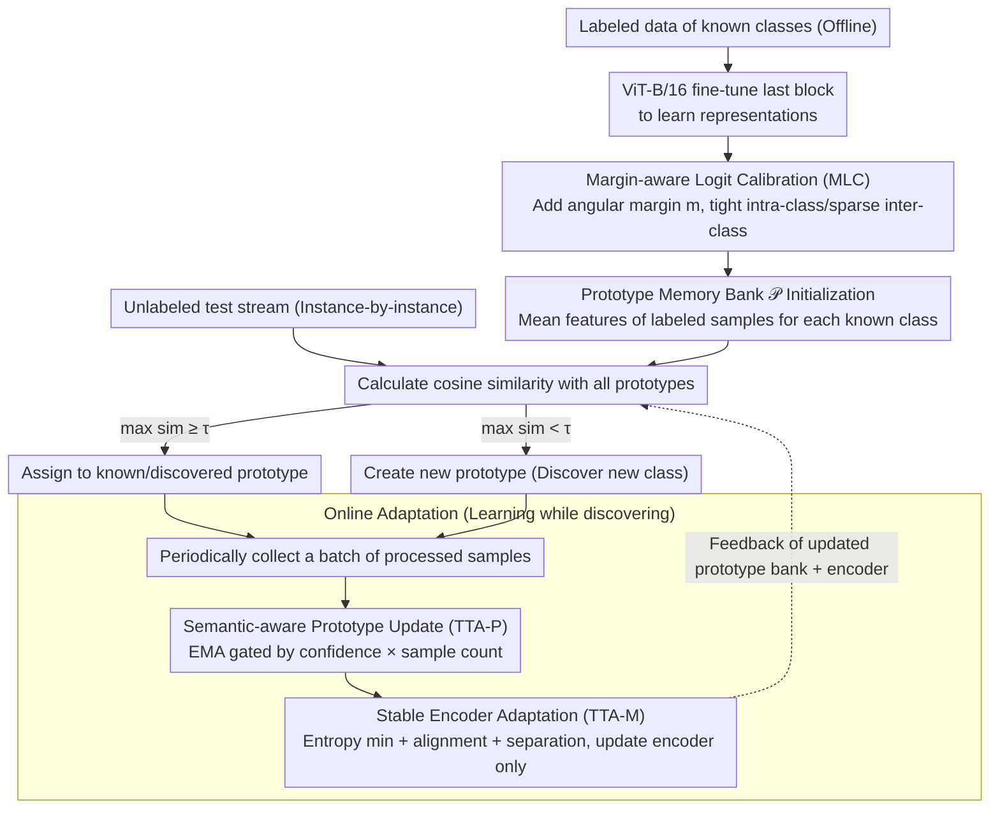

# TALON: Test-time Adaptive Learning for On-the-Fly Category Discovery

**Conference**: CVPR2026  
**arXiv**: [2603.08075](https://arxiv.org/abs/2603.08075)  
**Code**: [ynanwu/TALON](https://github.com/ynanwu/TALON)  
**Area**: Model Compression / Open-World Learning  
**Keywords**: On-the-Fly Category Discovery, Test-time Adaptation, Prototypical Learning, Category Explosion, Semantic Shift

## TL;DR

Ours proposes TALON, the first test-time adaptive framework for On-the-Fly Category Discovery (OCD). By utilizing semantic-aware prototype updates, stable encoder adaptation, and margin-aware logit calibration, it abandons hash encoding to model directly in continuous feature space, significantly mitigating category explosion and substantially improving new category discovery accuracy.

## Background & Motivation

1.  **Limitations of Closed-World Assumption**: Traditional visual recognition systems assume all categories are predefined, failing to discover new concepts or generalize beyond the training set.
2.  **OCD Task Definition**: On-the-Fly Category Discovery is an open-world setting closest to real-world scenarios—offline training uses only labeled data from known classes, while the online phase processes unlabeled data streams instance-by-instance, requiring simultaneous recognition of known classes and discovery of new ones.
3.  **Limitations of Prior Work (Hash Encoding)**: Existing OCD methods (SMILE, PHE) freeze the feature extractor and quantize features into binary hash codes as class prototypes. Quantization leads to information loss, degraded representation power, and magnified intra-class variance, resulting in **category explosion** (a single real class fragmented into multiple pseudo-classes).
4.  **Key Challenge (Static Inference)**: Both the encoder and prototypes remain fixed during the online phase, completely ignoring the learning potential from incoming data—this contradicts the "learning from discovery" philosophy.
5.  **Limitations of Prior Work (Generative Methods)**: Although DiffGRE uses diffusion models to synthesize new class samples, it projects features into lower dimensions, which remains fundamentally ineffective.
6.  **Key Challenge (Traditional TTA)**: Existing TTA methods (TENT, MEMO, etc.) target domain shift rather than semantic/label space shift, performing poorly or even degrading in OCD scenarios.

## Method

### Overall Architecture

TALON aims to correct two flaws in existing OCD methods: first, the quantization of features into binary hash codes for prototypes, which causes "category explosion"; second, the freezing of both the encoder and prototypes during the online phase, wasting the learning potential from new data. The proposed solution operates entirely in the continuous feature space (hash-free) and introduces Test-time Adaptation (TTA) to OCD. The pipeline consists of three steps: **Offline**, a ViT-B/16 (DINO/CLIP pre-trained, fine-tuning only the last transformer block) learns representations, while "Margin-aware Logit Calibration (MLC)" shapes the embedding space into a "tight intra-class, sparse inter-class" structure to reserve space for future new classes. **Online Inference** maintains a prototype memory bank $\mathcal{P}$, where known class prototypes are initialized with the mean features of labeled samples; each test instance is compared with all prototypes via cosine similarity—assigned to a prototype if the maximum similarity $\ge \tau$, or used to create a new prototype otherwise. **Online Adaptation** periodically recovers a small batch of processed samples to perform "Semantic-aware Prototype Updates (TTA-P)" by moving prototypes toward the mean of high-confidence samples to suppress outliers, followed by "Stable Encoder Adaptation (TTA-M)" for lightweight encoder updates. The updated prototype bank and encoder are fed back into the inference loop, forming a closed loop of "learning while discovering."

### Key Designs

**1. Margin-aware Logit Calibration (MLC): Reserving space for future new classes offline**

If offline training crowds known classes too tightly without sufficient inter-class distance, online new classes will lack space in the embedding space and easily confuse with known classes. MLC adds an angular margin $m$ to the cosine similarity between normalized features and class weights: $s \cos(\theta_{i,y_i} + m)$ is used for the ground truth logit, while others remain $s \cos\theta_{i,c}$. This increases inter-class angular distance from 27.98° to 74.15° and compresses intra-class distance from 64.55° to 35.83°. The offline loss is $\mathcal{L}_{\text{labeled}} = \mathcal{L}^{\text{sup}} + \lambda \mathcal{L}^{\text{ce-m}}$, where supervised contrastive learning pulls similar samples together and the calibrated cross-entropy enhances class-level discrimination. This effectively clears space in the embedding space in advance for subsequent new class discovery.

**2. Semantic-aware Prototype Update (TTA-P): Moving prototypes with high-confidence samples to suppress outliers**

If online-created prototypes are biased by outliers, pseudo-classes will persist. TTA-P calculates the average feature $\bar{\mathbf{z}}_j$ and confidence $\text{conf}_j$ for each batch of samples assigned to prototype $j$, updating via EMA with an adaptive step size: $\alpha_j = \eta \cdot \text{conf}_j \cdot \frac{n_j}{n_j + \kappa}$. This dual-gating mechanism ensures substantial updates only when confidence is high and samples are sufficient, whereas low-confidence or sparse samples cause minimal changes, preventing outliers from solidifying pseudo-classes. Known and new classes utilize different update rates and smoothing constants ($\eta$=0.06/0.3, $\kappa$=32/8).

**3. Stable Encoder Adaptation (TTA-M): Lightweight encoder updates without feature collapse**

Updating prototypes alone is insufficient; the encoder should also learn from the test stream, but improper updates cause feature collapse. TTA-M periodically collects small batches of test samples for lightweight gradient updates, combining three losses: entropy minimization $\mathcal{L}_{\text{ent}}$ for high-confidence predictions, alignment loss $\mathcal{L}_{\text{align}}$ to maintain consistency between feature means and stored prototypes, and separation loss $\mathcal{L}_{\text{sep}}$ to prevent different classes from collapsing. The total loss $\mathcal{L}_{\text{TTA}} = \mathcal{L}_{\text{ent}} + \beta_1 \mathcal{L}_{\text{align}} + \beta_2 \mathcal{L}_{\text{sep}}$ is backpropagated to the encoder only. The combination of immediate prediction and periodic updates allows the model to maintain real-time performance while continuously learning from discovery.

## Key Experimental Results

### Main Results (7 Benchmarks, Strict-Hungarian Protocol)

| Dataset | Method | All | Old | New |
|--------|------|-----|-----|-----|
| CIFAR-10 | PHE | 53.1 | 19.3 | 70.0 |
| CIFAR-10 | **TALON-DINO** | **65.0** | 46.1 | **79.3** |
| CIFAR-100 | PHE | 56.0 | 70.1 | 27.8 |
| CIFAR-100 | **TALON-DINO** | **64.7** | **77.4** | **39.3** |
| ImageNet-100 | PHE | 39.2 | 49.3 | 34.1 |
| ImageNet-100 | **TALON-DINO** | **82.6** | **92.0** | **63.4** |
| CUB-200 | DiffGRE+P | 37.9 | 57.0 | 28.3 |
| CUB-200 | **TALON-CLIP** | **45.5** | **60.7** | **37.8** |
| Stanford Cars | DiffGRE+P | 32.1 | 63.3 | 16.9 |
| Stanford Cars | **TALON-CLIP** | **53.5** | **74.2** | **43.6** |

On ImageNet-100, "All" accuracy surged from 39.2% to 82.6% (+43.4pp), indicating a highly significant improvement.

### Mitigation of Category Explosion (CUB-200 & Stanford Cars)

| Method | CUB #Cls (True 200) | SCars #Cls (True 196) |
|------|---------------------|----------------------|
| SMILE-64bit | 2910 | 4788 |
| PHE-64bit | 493 | 917 |
| **TALON** | **153** | **299** |

TALON provides the closest estimation of category counts to the ground truth, effectively mitigating category explosion.

### Ablation Study (CLIP backbone, Strict-Hungarian)

| Configuration | CUB All | SCars All |
|------|---------|-----------|
| Baseline | 44.5 | 47.8 |
| +MLC | 45.7 | 49.0 |
| +MLC+TTA-P | 46.7 | 52.7 |
| +MLC+TTA-M | 46.7 | 52.1 |
| **TALON (Full)** | **45.5** | **53.5** |

Each module contributes gains; MLC provides better initialization, while TTA-P and TTA-M provide complementary improvements.

### Comparison with Traditional TTA Methods (Stanford Cars)

| Method | All | New |
|------|-----|-----|
| Baseline+MLC+TENT | 48.1 | 39.2 |
| Baseline+MLC+OSTTA | 47.2 | 39.9 |
| **TALON** | **53.5** | **43.6** |

Traditional TTA methods are almost ineffective or even degrade performance in semantic shift scenarios.

## Highlights & Insights

- **First to introduce TTA to the OCD task**: Breaks the "frozen inference" paradigm to achieve "learning from discovery."
- **Hash-free framework**: Operates directly in the continuous feature space to preserve full representation power, completely avoiding category explosion caused by quantization.
- **Confidence-controlled adaptive prototype updates**: Balances update magnitude and stability through the $\text{conf} \times \frac{n}{n+\kappa}$ dual-gating mechanism.
- **Proactive shaping of the embedding space via MLC**: Reserves space for future new classes during the offline phase, validated by angular visualization (inter-class angular distance expanded from 28° to 74°).
- **Hyperparameter sharing**: Uses the same configuration across almost all datasets, demonstrating strong generalization.

## Limitations & Future Work

1.  **Sensitivity to threshold $\tau$**: New class discovery relies entirely on a cosine similarity threshold, which requires dataset-specific tuning (0.7 for DINO, 0.75 for CLIP).
2.  **Performance in CUB Ablation**: The full TALON configuration is slightly lower than +MLC+TTA-P on CUB, suggesting that model adaptation (TTA-M) may introduce slight noise in fine-grained datasets.
3.  **Residual bias in category count estimation**: Estimated 153 classes for CUB (True 200) and 299 for SCars (True 196), indicating both underestimation and overestimation.
4.  **Efficiency of instance-level online processing**: Maintaining a growing prototype memory bank and periodically updating the encoder involves computational overhead and memory growth that warrant attention in long-term streaming scenarios.
5.  **Lack of category merging mechanism**: No explicit strategy to merge or clean pseudo-class prototypes created erroneously in early stages.

## Related Work & Insights

| Dimension | SMILE/PHE (Hash methods) | DiffGRE (Generative methods) | **TALON** |
|------|---------------------|-------------------|-----------|
| Feature Space | Binary hash codes | Low-dimensional projection | Continuous feature space |
| Online Learning | ✗ Frozen | ✗ Frozen | ✓ Dual update (Encoder+Prototype) |
| Category Explosion | Severe (2^L expansion) | Moderate | Effectively mitigated |
| New Class Accuracy | Low | Moderate | Significantly improved |
| Extra Training Cost | None | Diffusion model training | Lightweight TTA |

## Rating

- Novelty: ⭐⭐⭐⭐ — First introduction of TTA to OCD; hash-free + dual-layer adaptation design is novel.
- Experimental Thoroughness: ⭐⭐⭐⭐ — 7 datasets, 2 backbones, 2 evaluation protocols, extensive ablations, and visualizations.
- Writing Quality: ⭐⭐⭐⭐ — Clear motivation, complete formulas, standard pseudocode.
- Value: ⭐⭐⭐⭐ — Substantial advancement for the OCD task; practical solution for mitigating category explosion.

<!-- RELATED:START -->

## Related Papers

- [\[CVPR 2026\] FOZO: Forward-Only Zeroth-Order Prompt Optimization for Test-Time Adaptation](fozo_forward-only_zeroth-order_prompt_optimization_for_test-time_adaptation.md)
- [\[ACL 2026\] Training-Free Test-Time Contrastive Learning for Large Language Models](../../ACL2026/model_compression/training-free_test-time_contrastive_learning_for_large_language_models.md)
- [\[ECCV 2024\] Category Adaptation Meets Projected Distillation in Generalized Continual Category Discovery](../../ECCV2024/model_compression/category_adaptation_meets_projected_distillation_in_generalized_continual_catego.md)
- [\[CVPR 2026\] Back to Source: Open-Set Continual Test-Time Adaptation via Domain Compensation](back_to_source_open-set_continual_test-time_adaptation_via_domain_compensation.md)
- [\[CVPR 2026\] Test-time Sparsity for Extreme Fast Action Diffusion](test-time_sparsity_for_extreme_fast_action_diffusion.md)

<!-- RELATED:END -->
