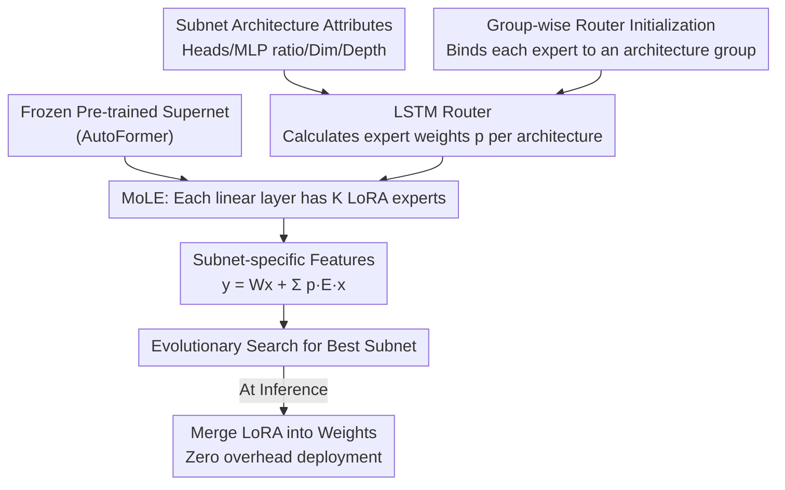

# TAS-LoRA: Transformer Architecture Search with Mixture-of-LoRA Experts

**Conference**: CVPR 2026  
**arXiv**: [2605.07256](https://arxiv.org/abs/2605.07256)  
**Code**: https://cvlab.yonsei.ac.kr/projects/TAS-LoRA/ (Project Page)  
**Area**: Model Compression / Neural Architecture Search / Parameter-Efficient Fine-Tuning  
**Keywords**: Transformer Architecture Search, weight-entangled supernet, feature collapse, LoRA Mixture-of-Experts, Router

## TL;DR
Addressing the persistent "feature collapse caused by shared weights" issue in one-shot Transformer Architecture Search (TAS), TAS-LoRA attaches a set of LoRA experts to a frozen supernet. An LSTM router, taking "architecture configurations" as input, dynamically combines experts for each subnet to learn subnet-specific features. Group-wise router initialization forces experts to differentiate from the early training stages. This approach consistently improves AutoFormer search results on ImageNet by 0.2~1.0 points across various scales with zero additional inference overhead.

## Background & Motivation
**Background**: Transformer Architecture Search (TAS) aims to automatically find optimal ViT structures for different hardware constraints, eliminating manual design. The **one-shot** method is most popular—it trains a "weight-entangled supernet" where all possible subnets share the same weights. During search, subnet performance is estimated directly using these shared weights, allowing deployment without retraining and resulting in extremely low costs (e.g., AutoFormer, ViTAS, FocusFormer, DYNAS).

**Limitations of Prior Work**: Weight-entangled supernets suffer from a long-overlooked "**feature collapse**" problem—different subnet architectures produce highly similar feature representations due to weight sharing. Authors observed that when sampling 6 random subnets from AutoFormer/DYNAS, the cosine similarity of their penultimate layer features is nearly 1. In contrast, when these 6 subnets are trained independently from scratch, similarity is significantly lower, and their top-1 accuracy consistently exceeds that of the corresponding subnets within the supernet (Table 1). This indicates that **optimal features should vary with architecture, but weight sharing flattens them**.

**Key Challenge**: Supernet optimization targets the total loss of all subnets, effectively "averaging" gradients. Consequently, shared weights only learn the "generalized features" common to all subnets, preventing individual subnets from fully exploiting their specific architectural traits (number of heads, MLP ratio, embedding dimension, depth). The "generality" of weight sharing inherently conflicts with the "specificity" of individual subnets.

**Goal**: Enable each subnet to learn its own unique features to alleviate feature collapse without undermining supernet efficiency or increasing inference overhead.

**Key Insight**: The authors leverage **LoRA** from parameter-efficient fine-tuning. By adding trainable low-rank incremental parameters to subnets, subnet-specific feature corrections can be superimposed onto frozen shared weights. Furthermore, LoRA can be merged into the weights during inference, resulting in zero extra cost. However, because the number of subnet configurations is astronomical (approx. $2\times10^8$ for AutoFormer-T), assigning independent LoRA to every subnet is infeasible.

**Core Idea**: Use a **limited set of LoRA experts + Router** (Mixture-of-LoRA-Experts, MoLE) to "dilute" the space. The router dynamically selects and weights experts based on the subnet's architecture configuration, allowing finite experts to cover the massive subnet space. Group-wise initialization ensures early expert diversity. This is the first application of MoLE in TAS.

## Method

### Overall Architecture
TAS-LoRA does not train the supernet from scratch; it attaches lightweight MoLE branches and a router to a **pre-trained and frozen** AutoFormer supernet. The process replaces the 4 linear layers in each Transformer block (2 for QKV projection, 2 for MLP) with MoLE layers, each equipped with $K$ LoRA experts. When training or searching a subnet, its architectural attributes (heads per block, MLP ratio, global embedding dimension, and depth) are fed into an **LSTM router**. The router outputs a set of expert weights $p^l$ for each linear layer, and the $K$ experts are weighted and summed onto the original linear layer output, providing specific feature correction. To prevent "equal treatment" of experts by the router early on, **group-wise router initialization** is introduced to bind each expert to a specific architecture group initially. After training, evolutionary search evaluates subnets under the "shared weights + LoRA correction" setting. For deployment, the selected subnet's LoRA experts are merged into the weights based on routing weights, ensuring zero inference overhead.

The workflow consists of five steps: "Input architecture → Router calculates weights → MoLE superimposes specific features → Evolutionary search selects subnet → Merge weights for deployment." The router and group-wise initialization are the core contributions:

### Key Designs

**1. MoLE: Using Finite LoRA Experts to Represent Massive Subnet Features**

The challenge is the explosion of subnets ($10^8$ level), making independent LoRA for each subnet impossible to store or train. MoLE replaces "one LoRA per subnet" with "global shared $K$ LoRA experts + dynamic per-subnet combination." Specifically, $K$ experts are assigned to each linear layer ($L=4B$ layers total, where $B$ is the number of blocks). The $k$-th expert in the $l$-th layer is parameterized in low-rank form $E_k^l = U_k^l D_k^l / r$ (where $r=8$). The router provides normalized weights $p^l=(p_1^l,\dots,p_K^l)$, $\sum_k p_k^l=1$. The output is:

$$y^l = W^l x^l + \sum_{k=1}^{K} p_k^l E_k^l x^l,$$

where $W^l$ represents the frozen original weights. This allows finite experts to generate diverse feature corrections through different weighted combinations, recovering subnet specificity while maintaining the efficiency of one-shot training.

**2. LSTM Router using "Architecture Config" instead of "Feature Maps": Zero Inference Overhead**

Existing MoLE methods in CV typically use **input feature maps** for routing, which leads to two issues: expert weights must be recomputed for every input (high overhead), and selected experts vary by input, preventing LoRA from being pre-merged. TAS-LoRA's key transition is **routing based on "architecture config"**. Since the architecture is fixed once a subnet is selected, the router only runs once per subnet regardless of input. Thus, LoRA can be merged beforehand, achieving zero inference overhead.

Architecture: Block-level attributes (heads, MLP ratio) and subnet-level attributes (embedding dim, depth) are encoded into vectors via a learnable block embedding layer. These are fed into a single-layer LSTM (hidden dim 128) to capture sequential dependencies between blocks, outputting hidden representations $h(b)\in\mathbb{R}^d$. All blocks are concatenated into $H\in\mathbb{R}^B\times d$, passing through a fully connected router head (weights $R\in\mathbb{R}^{4\times B\times d\times K}$, bias $c$) to get logits $O\in\mathbb{R}^{4B\times K}$. Softmax is applied along the expert dimension to get weight $P=\mathrm{softmax}(O,\dim{=}{-1})$. LSTM is used because optimal features of adjacent blocks have sequential correlations; independent scoring would lose this dependency.

**3. Group-wise Router Initialization: Forcing Expert Differentiation**

Early in training, routers tend to assign nearly equal weights to all experts, leading to redundant learning. While MoE often uses "auxiliary load balancing loss" to force different samples to select different experts, TAS-LoRA's router processes only **one subnet** at a time, making batch-level load balancing inapplicable.

The authors propose an alternative based on the observation that "structurally similar architectures tend to learn similar features." Blocks at the **same position** across different subnets are grouped by three attributes: heads, MLP ratio, and embedding dimension. The **number of experts $K$ is set equal to the number of groups** (12 for AutoFormer-T, 27 for S, 18 for B). During initialization, each group is assigned a dedicated router head. Bias $c_k'$ is set to a positive value $\beta$ ($\beta=3$) at the position corresponding to the group's designated expert $k$, while other parameters are nearly zero. Initially, the output depends only on the bias, forcing each group to its own expert to ensure early differentiation. As training progresses, the router dynamically adjusts these assignments.

### Loss & Training
No additional loss terms are introduced. The standard cross-entropy is used: $\theta^*=\arg\min_\theta \mathbb{E}_{\mathcal{N}_i\sim\mathcal{N}}[\mathcal{L}(\mathcal{N}_i;\theta)]$. Here $\theta$ (supernet weights) is frozen, and optimization targets LoRA experts + router $\phi$. Training lasts 50 epochs with batch size 1024. The first 5 epochs are **warm-up**, where the router is frozen and only LoRA experts are trained with AdamW (learning rate 1e-5 to 5e-4) to learn group-specific features. The remaining 45 epochs involve joint optimization of the router (using SGD, LR 1e-1, cosine decay) and experts. Evolutionary search finds $\mathcal{N}^*=\arg\min_{\mathcal{N}_i} L_\text{val}(\mathcal{N}_i;\theta,\phi)$.

## Key Experimental Results

### Main Results
Integrating TAS-LoRA into AutoFormer and DYNAS supernets on ImageNet shows consistent improvements across three scales with almost no change in parameters or FLOPs (LoRA is merged):

| Search Space | Method | Top-1 (%) | #Params | FLOPs |
|----------|------|-----------|---------|-------|
| Tiny | AutoFormer-Ti† | 74.7 | 5.9M | 1.3G |
| Tiny | **TAS-LoRA-Ti** | **75.7 ±0.1** | 5.9M | 1.3G |
| Tiny | DYNAS | 74.8 | 6.0M | 1.3G |
| Tiny | **TAS-LoRA + DYNAS** | **75.9 ±0.0** | 5.9M | 1.3G |
| Small | AutoFormer-S† | 81.6 | 22.9M | 5.1G |
| Small | **TAS-LoRA-S** | **81.9 ±0.1** | 22.9M | 5.0G |
| Base | AutoFormer-B† | 82.4 | 54.0M | 11.0G |
| Base | **TAS-LoRA-B** | **82.6 ±0.0** | 54.0M | 11.0G |

Improvement is **most significant (+1.0) in the Tiny space**, where limited capacity exacerbates feature collapse. It also works for DYNAS (+1.1), proving orthogonality to training strategies.

Transfer learning results across 5 downstream datasets also show improved generalization:

| Model | #Params | CIFAR-10 | CIFAR-100 | Flowers | Cars | INAT-19 |
|------|---------|----------|-----------|---------|------|---------|
| AutoFormer-S | 23M | 98.9 | 89.6 | 97.9 | 92.1 | 77.4 |
| PreNAS-S | 23M | 99.1 | 91.2 | 97.6 | 92.2 | 76.4 |
| **TAS-LoRA-S** | 23M | 99.1 | 91.0 | 98.2 | **92.3** | **78.0** |

### Ablation Study

| Config | Tiny | Small | Base | Description |
|------|------|-------|------|------|
| AutoFormer (Baseline) | 74.9 | 81.6 | 82.4 | Pure shared-weight supernet |
| TAS-LoRA + Random Init | 75.4 | 81.8 | 82.5 | MoLE added with random router init |
| TAS-LoRA + Group-wise Init | **75.7** | **81.9** | **82.6** | Full method |

A "vs. Full Fine-tuning" ablation shows that fine-tuning the entire supernet (without MoLE) for 50 epochs yields almost no gain, while TAS-LoRA consistently leads. This proves gains come from MoLE's subnet-specific features, not just extra training.

### Key Findings
- **MoLE provides the primary gain**: MoLE with random initialization already beats the baseline by 0.1~0.5 points, validating the direction of "recovering subnet-specific features." Group-wise init adds another 0.1~0.3.
- **Group-wise initialization reduces redundancy**: It results in lower cross-layer feature cosine similarity among LoRA experts compared to random initialization, ensuring diversity.
- **Full fine-tuning cannot solve feature collapse**: The lack of gain from full fine-tuning under the same budget suggests the issue is weight sharing flattening specificity, not insufficient training.
- **Small models benefit most**: Smaller representation capacity leads to more severe collapse, which TAS-LoRA mitigates significantly (Tiny +1.0 vs. Base +0.2).

## Highlights & Insights
- **Switching "input" from feature maps to architecture configurations** cleverly solves two MoLE pain points (per-input computation and unmergable weights). Since the subnet architecture is fixed, the router runs once, LoRA is merged, and inference is zero-overhead. This is the most brilliant design choice.
- **Personalizing NAS subnets via LoRA**: The supernet learns general features while LoRA experts learn subnet-specific ones. This division of labor fits perfectly with the one-shot TAS value proposition of "deployment without retraining."
- **First systematic quantification of feature collapse in TAS**: By using cosine similarity and independent training controls, the authors clearly characterize a phenomenon that was previously only an intuitive assumption.
- **Expert count = Architecture group count**: This alignment is elegant—expert granularity naturally corresponds to the discrete structure of the architecture space, giving group-wise initialization a clear target.

## Limitations & Future Work
- **Dependency on pre-trained supernet quality**: TAS-LoRA fine-tunes a frozen supernet; thus, the supernet's quality defines the performance ceiling. It was noted that some official supernets degrade under large parameter constraints.
- **Limited generalization across frameworks**: Validation was restricted to AutoFormer/DYNAS due to the lack of official implementations for FocusFormer/GLiT/ViTAS.
- **Modest absolute gains**: Gains on Small/Base are only 0.2~0.3. Reproducibility in larger or heterogeneous search spaces remains to be seen.
- **Hyperparameter overhead**: The router introduces several hyperparameters (rank $r$, $\beta$, grouping criteria, warm-up epochs) that may require tuning.

## Related Work & Insights
- **vs. MoS (Mixture-of-Supernets)**: MoS addresses gradient conflict by training multiple full supernets from scratch. TAS-LoRA targets "feature collapse" by training lightweight MoLE on a single pre-trained supernet at much lower cost.
- **vs. Conventional MoLE (Image MoE-LoRA)**: Traditional MoLE routers use feature maps and are not mergable. Ours uses architecture config for zero-overhead inference.
- **vs. UENSA (Feature collapse mitigation in CNNs)**: UENSA assigns parameters to specific architectures but only considers 5 candidates; it cannot scale to $10^8$ subnets. TAS-LoRA handles massive spaces via weighted expert combinations.
- **vs. AutoFormer / DYNAS**: TAS-LoRA acts as a plug-and-play enhancement layer on top of these weight-entangled supernets without altering their training paradigms.

## Rating
- Novelty: ⭐⭐⭐⭐ First to define and solve feature collapse in TAS. The "architecture-based routing" is clever, though LoRA/MoLE components are existing technologies.
- Experimental Thoroughness: ⭐⭐⭐⭐ Solid testing across scales and transfer sets, plus ablation on initialization. However, constrained to AutoFormer-style spaces.
- Writing Quality: ⭐⭐⭐⭐ Clear problem characterization (cosine similarity visualization) and motivation.
- Value: ⭐⭐⭐⭐ Plug-and-play, zero inference overhead, and orthogonal to different supernet training methods. Highly practical for the one-shot TAS community.

<!-- RELATED:START -->

## Related Papers

- [\[CVPR 2026\] Teacher-Guided Routing for Sparse Vision Mixture-of-Experts](teacher-guided_routing_for_sparse_vision_mixture-of-experts.md)
- [\[ICLR 2026\] LD-MoLE: Learnable Dynamic Routing for Mixture of LoRA Experts](../../ICLR2026/model_compression/ld-mole_learnable_dynamic_routing_for_mixture_of_lora_experts.md)
- [\[CVPR 2026\] SG-LoRA: Semantic-guided LoRA Parameters Generation](sg-lora_semantic-guided_lora_parameters_generation.md)
- [\[CVPR 2026\] LoPrune: Efficient Data Pruning for LoRA-Based Fine-Tuning of Vision Transformer](loprune_efficient_data_pruning_for_lora-based_fine-tuning_of_vision_transformer.md)
- [\[ACL 2026\] SAMoRA: Semantic-Aware Mixture of LoRA Experts for Task-Adaptive Learning](../../ACL2026/model_compression/samora_semantic-aware_mixture_of_lora_experts_for_task-adaptive_learning.md)

<!-- RELATED:END -->
