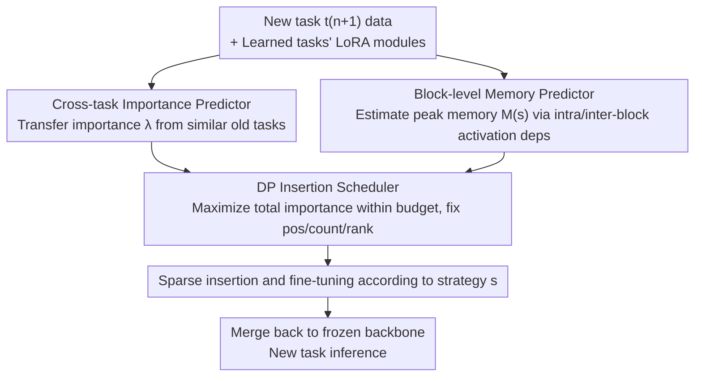

# TaskIT: Memory-Efficient Fine-Tuning of Multi-LoRA LLMs via Cross-Task Importance Transfer

**Conference**: CVPR 2026  
**Paper**: [CVF Open Access](https://openaccess.thecvf.com/content/CVPR2026/html/Fang_TaskIT_Memory-Efficient_Fine-Tuning_of_Multi-LoRA_LLMs_via_Cross-Task_Importance_Transfer_CVPR_2026_paper.html)  
**Code**: https://github.com/haojuns/TaskIT  
**Area**: Model Compression / LLM Efficiency  
**Keywords**: Multi-LoRA, Sparse Fine-Tuning, On-device Deployment, Cross-task Transfer, Memory Budget

## TL;DR
TaskIT adapts Multi-LoRA LLMs to new tasks on memory-constrained edge devices: it predicts the importance of each candidate LoRA position using "Cross-Task Transfer" without training any new modules, accurately estimates activation memory on Transformers using a "Block-level Memory Predictor," and finally selects LoRA positions, quantities, and ranks within a memory budget using a dynamic programming scheduler, achieving a superior accuracy-memory trade-off compared to Zero-FT, non-LoRA, and existing LoRA fine-tuning methods.

## Background & Motivation
**Background**: Edge AI increasingly adopts the "one frozen backbone + multiple task-specific LoRA modules" paradigm (multi-LoRA LLM). The backbone is deployed once, and each downstream task is customized via LoRA modules attached to the backbone. During inference, LoRA is merged back into the backbone; all tasks share the same re-computation, differing only in LoRA states. Apple's on-device models and the concept of treating a backbone as "firmware" for apps to extend via modules follow this route.

**Limitations of Prior Work**: Although LoRA minimizes trainable parameters, **fine-tuning still consumes significant memory**—it must store LoRA parameters, activations, gradients, and optimizer states. The paper highlights that compared to full fine-tuning of ViT-g, LoRA updates only 1.8% of parameters but still consumes 56% of peak memory. While freezing the backbone saves gradient and optimizer memory for those layers, it hardly reduces activation memory. Consequently, training a full set of LoRAs for every new task can easily exceed on-device memory, limiting the number of supported tasks.

**Key Challenge**: A natural memory-saving approach is **sparse insertion**—inserting and training only a small subset of modules at key positions. However, this faces two major hurdles: (1) **Importance must be known before insertion**—existing importance estimation (based on parameters/gradients) assumes candidate parameters already exist and have been trained. Training the full LoRA set first to measure importance defeats the purpose of sparse insertion. (2) **Transformer memory is difficult to model**—existing memory models assume memory grows linearly with layer number, which holds for sequential networks but is disrupted by multi-branch parallel projections (Q/K/V) in Transformer attention blocks.

**Goal**: Select and fine-tune LoRA modules for a new (unseen) task $t_{n+1}$ under a memory budget $M_B$ to maximize accuracy. This is formulated as a constrained knapsack optimization $\max_s s\cdot\lambda_{n+1}\ \text{s.t.}\ M(s)\le M_B$, where $s$ is the insertion strategy (rank of LoRA at each position, 0 means no insertion), and $\lambda_{n+1}$ is the importance vector of positions for the new task.

**Key Insight**: The authors observe a key phenomenon (Fig. 1 in the paper)—**related tasks induce similar LoRA importance distributions on the backbone**. Since previously learned tasks already have trained LoRAs, the importance for a new task can be transferred from "similar old tasks" without training new modules first.

**Core Idea**: Convert "pre-insertion importance prediction" into a **cross-task transfer** problem (the origin of Cross-Task Importance Transfer in the name), coupled with a block-level memory predictor tailored for Transformers and a dynamic programming scheduler. Together, these form a pipeline to maximize accuracy under memory constraints for sparse insertion.

## Method

### Overall Architecture
TaskIT determines which positions to insert, how many modules to use, and what ranks to assign for a new task given a memory budget. It decomposes this decision into three serial components: first, calculating **importance** for each candidate position (transferring from similar old tasks without training), then calculating **peak memory** for any given strategy (block-level modeling of Transformer activation dependencies), and finally feeding importance and memory into a **dynamic programming scheduler** to find a near-optimal strategy within the budget. Selected modules are then inserted, fine-tuned, and merged back into the frozen backbone for inference.

### Key Designs

**1. Cross-Task Importance Transfer: Predicting importance per position without training new modules**

The most difficult pain point is that "importance must be known before insertion." TaskIT calculates the importance of position $k$ for the new task $n+1$ as a similarity-weighted sum of the importances of $n$ learned tasks at the same position: $\lambda^k_{n+1}=\sum_{i=1}^{n}\phi(t_{n+1},t_i)\cdot\lambda^k_i$, where older tasks more similar to the new task contribute more. This requires two things to be done at low cost on-device.

First, **measuring module importance for learned tasks** $\lambda^k_i$. The authors use a forward-only activation ratio tailored for LoRA: $\lambda^k_i=\dfrac{\lVert x(w^k_i;d)\rVert_1}{\lVert x(W^k;d)\rVert_1+\epsilon}$, where the numerator is the output activation of the LoRA module $w^k_i$, and the denominator is the output activation of the frozen matrix $W^k$ (both using L1 norm on new task data $d$, with $\epsilon=10^{-8}$ for stability). "Relative contribution" is used because the LoRA output is added to the main matrix output; module importance depends on its proportion in the merged activation. Since it only requires a forward pass, it is more memory-efficient than gradient-based methods.

Second, **measuring similarity between new and old tasks** $\phi(t_{n+1},t_i)$. Ideally, this compares the cosine similarity between $x(\theta+w_i;d)$ and $x(\theta+w_{n+1};d)$, but $w_{n+1}$ is not yet trained. TaskIT approximates $x(\theta+w_{n+1};d)$ by **backtracing one optimization step in activation space**: first, obtain $x(\theta;d)$ via a frozen backbone forward pass, compute the new task loss $L$ through the decoder, backpropagate only to the activations to get $\nabla_{x(\theta;d)}L$, and take a small step $x^*(\theta+w_{n+1};d)=x(\theta;d)-\eta\,\nabla_{x(\theta;d)}L$. Each batch requires only one forward plus one lightweight backward pass to estimate task correlation before fine-tuning. Empirically, only tasks with similarity $>0.35$ are retained to ensure positive transfer.

**2. Block-level Memory Predictor: Accurately calculating Transformer activation dependencies**

The second pain point is "Transformer memory modeling dificultad." Peak memory occurs at the end of the forward pass, decomposed as $M(s)=M_{con}+M_w(s)+M_x(s)$: $M_{con}$ is the frozen backbone and runtime overhead (measured offline, independent of $s$), $M_w(s)$ is the memory for LoRA parameters/gradients/optimizer (estimated directly from parameter counts), and the challenge is the **activation memory** $M_x(s)=g_x(s)^\top m_x$ cached for backpropagation, where $m_x$ is the memory usage per activation and $g_x(s)\in\{0,1\}^{|X|}$ indicates which activations must be preserved.

Calculating $g_x(s)$ involves block-level dependency analysis on two levels: **Intra-block dependence**—in attention blocks, Q, K, and V are parallel branches interacting in the attention operator. To calculate $\nabla_{w_q}L$ when a module is inserted at $W_q$, the gradient flows back through FFN, $W_o$, and the attention operator, requiring $K, V$ and input activations $x_{in}$ to be cached. The authors derive cache masks for all six candidate insertion positions ($W_q, W_k, W_v, W_o, W^1_{FFN}, W^2_{FFN}$). **Inter-block dependence**—to propagate gradients from the loss back to a module in block $r$, activations from block $r+1$ to the decoder must be preserved (Q/K/V and attention weights of downstream blocks), while activations from blocks $1{\sim}r-1$ can be discarded after the forward pass. Combining candidate masks via bitwise mapping $g_x(s)=\bigvee_{k:s_k=1}g_x(k)$, and using one-time offline profiles of $\{g_x(k)\}$ and $m_x$, memory prediction becomes a cheap bitwise OR and dot product, fast enough for repeated evaluation by the DP scheduler.

**3. Dynamic Programming Insertion Scheduler: Maximizing importance within budget**

With importance and memory prediction, the optimal strategy $s$ must be chosen within budget $M_B$. The rank for each position is chosen from $R=\{0,2^0,\dots,2^6\}$ (upper limit 64, diminishing returns beyond). This is a knapsack variant, but the difficulty lies in the fact that the incremental memory $\Delta M$ for inserting at position $k$ depends on the **previous inserted position** $k_s$ (due to activation backprop paths), breaking the "item independence" assumption. TaskIT explicitly encodes the "last inserted position" into the DP state: let $P[k][M_b]$ be the maximum cumulative importance where the rightmost insertion is at $k$ and total memory $\le M_b$, with transition:

$$P[k][M_b]=\max_{r\in R,\,r>0,\;0\le k_s<k}\big(P[k_s][M_b-\Delta M]+h(r)\,\lambda^k_{n+1}\big)$$

where $h(r)=\sqrt{\ln(r)+1}/\sqrt{\ln(\max(R)+1)}$ is the normalized rank contribution, and $\Delta M=M(s_k)-M(s_{k_s})$ is the extra memory of inserting a rank $r$ module at $k$ given predecessor $k_s$. The budget is discretized into $U=500$ bins to balance accuracy and overhead. The final strategy is recovered by backtracking from $\max_{0\le k\le|K|}P[k][M_B]$. Compared to greedy search, DP more effectively utilizes the budget to maximize total importance.

### Loss & Training
TaskIT does not introduce new training losses—the selected sparse LoRA subset is fine-tuned using standard task losses while the backbone remains frozen. All memory savings come from the insertion strategy itself: with an 8 GB budget (typical for smartphones), DP selects positions, counts, and ranks. The backbone used is the 1.5B vision-language model Janus-Pro, extended to support Whisper-tiny / Kokoro-82M for audio; a warm-start protocol is used (base model already has LoRAs for several base tasks before adapting to new ones).

## Key Experimental Results

### Main Results
Cross-modal setup: The base model already has LoRAs for 5 base tasks (Classification, QA, Captioning, T2I, VQA), adapting to new Image / NLP / VL tasks under an 8 GB budget. TaskIT outperforms across the accuracy-memory trade-off.

| Baseline (Best in each group) | Gap relative to TaskIT | Description |
|--------|------|------|
| AdapterFusion (Best Zero-FT) | Avg. Acc **−10.4%** | Fails when new task is weakly related, and computing weights still takes 10.6 GB |
| UniPT (Best non-LoRA) | Acc **−1.5%**, Memory **+13.8%** | Uniform memory allocation, no importance modeling; requires 9.4× larger subnet to match TaskIT |
| AutoLoRA (Best LoRA) | Acc only **+0.3%**, TaskIT saves **45.5%** memory | AutoLoRA uses bi-level meta-learning for importance, incurring high memory overhead |

TaskIT specifics: Trainable parameters 16.8M, Image average acc 80.4% with only **7.8 GB** memory (within 8 GB budget); NLP avg 90.1% / 7.9 GB; VL avg 83.6% / 7.8 GB. In contrast, AutoLoRA achieves 80.7% on Image but requires 14.3 GB—Ours matches accuracy while nearly halving memory.

### Ablation Study
| Configuration | Trainable Params (M) | Memory (GB) | Acc (%) | Description |
|------|------|------|---------|------|
| w/o S (No task similarity, changed to uniform) | 16.8 | 7.6 | 75.3 | Acc drops 5.1%, proving similarity estimation is necessary |
| w/o I (No importance predictor, uniform importance) | 16.8 | 7.6 | 74.1 | Acc drops 6.3%, largest drop |
| w/o M (No block memory predictor, linear model) | 17.4 | **9.9** | 80.6 | Acc holds but **memory hits 9.9 GB, exceeding budget**; block profiler is key to compliance |
| w/o DP (DP replaced by greedy) | 9.1 | 7.9 | 77.5 | Greedy underutilizes budget, learns 7.7M fewer params, acc drops to 77.5% |
| **TaskIT (Full)** | 16.8 | 7.8 | **80.4** | — |

### Key Findings
- **Importance Predictor (I) contributes most**: Removing it drops accuracy by 6.3%, more than task similarity (S, drop 5.1%); predicting where to insert *before* insertion is the primary accuracy source.
- **Memory Predictor (M) governs "compliance" rather than "accuracy"**: Removing it slightly increases accuracy to 80.6%, but peak memory spikes to 9.9 GB, exceeding the 8 GB budget. Its value is in keeping the strategy valid.
- **Transfer adapts in continual learning**: When learning $t_5$–$t_{12}$ sequentially, newly learned tasks quickly become transfer sources (e.g., after learning $t_9$ audio captioning, $t_{12}$ text-to-audio gets 70%+ importance from $t_9$). If no task has similarity $\ge 0.35$ (e.g., first audio task $t_9$), TaskIT reverts to uniform importance, relying on the memory predictor and DP to stay within budget.

## Highlights & Insights
- **"Backtracing one optimization step in activation space"** to approximate activations for an untrained task: Using $x(\theta;d)-\eta\nabla_{x(\theta;d)}L$ to estimate $x(\theta+w_{n+1};d)$ elegantly solves the chicken-and-egg problem where similarity requires LoRA modules that haven't been trained yet, adding only one lightweight backward pass per batch.
- **Encoding "previous insertion position" into the DP state** directly addresses the non-independence of insertion memory in Transformers, utilizing the budget more effectively than greedy methods—a coupling often overlooked when applying knapsack to sparse neural network insertion.
- **Importance via "Relative Activation Ratio"** rather than absolute activation aligns with LoRA's structure (output added to main matrix), providing a small yet accurate metric for adapter-style modules.

## Limitations & Future Work
- **Dependence on existing similar tasks**: If a new task similarity falls below 0.35 for all old tasks (e.g., first instance of a new modality), transfer reverts to uniform importance, losing accuracy gains—cold-start scenarios remain a weakness.
- **Diminishing returns as budget tightens**: In continual learning, as $M_B$ drops from 12 GB to 8 GB, TaskIT's gain over vanilla LoRA narrows, suggesting benefits are limited under extremely tight constraints.
- **Offline one-time profiling**: Block masks $\{g_x(k)\}$ and $m_x$ assume offline measurements are accurate; major backbone changes or sequence length shifts require re-profiling. Rank sets, $h(r)$ normalization, the $0.35$ threshold, and $U=500$ are empirical settings (⚠️ refer to the original paper/appendix for specific values).

## Related Work & Insights
- **vs Sparse Update (e.g., importance via first/second order loss)**: These assume candidate parameters already exist and have been trained. TaskIT targets the "not yet inserted" setting, filling the gap with cross-task transfer.
- **vs Rank-Adaptive LoRA (AdaLoRA / AutoLoRA / NOAH)**: These adjust ranks layer-wise, giving higher ranks to important modules, but peak memory remains high (AutoLoRA's bi-level optimization is memory-heavy). TaskIT jointly optimizes rank, count, and position under explicit budget constraints, matching accuracy while nearly halving memory.
- **vs Memory Modeling (Linear Approximation)**: Prevailing methods assume activation memory decreases linearly with depth, failing for multi-branch attention. TaskIT's block-level modeling distinguishes between intra-block parallel and inter-block sequential dependencies for higher accuracy.

## Rating
- Novelty: ⭐⭐⭐⭐⭐ "Cross-task transfer for pre-insertion importance" is a significant advance for sparse updates; backtracing activations and block-level memory modeling are highly clever.
- Experimental Thoroughness: ⭐⭐⭐⭐ Covers cross-modal, unimodal, ablation, and continual learning, though mostly internal comparisons; lacks validation on larger-scale backbones.
- Writing Quality: ⭐⭐⭐⭐ Clear problem decomposition; the three components are well-defined, though some notation relies heavily on the appendix.
- Value: ⭐⭐⭐⭐⭐ Directly addresses memory bottlenecks in multi-LoRA deployment; matches SOTA accuracy while nearly halving memory, showing high practical value.

<!-- RELATED:START -->

## Related Papers

- [\[CVPR 2026\] LoPrune: Efficient Data Pruning for LoRA-Based Fine-Tuning of Vision Transformer](loprune_efficient_data_pruning_for_lora-based_fine-tuning_of_vision_transformer.md)
- [\[CVPR 2026\] Discovering Adaptive Task Dependencies for Efficient Multi-Task Representation Compression](discovering_adaptive_task_dependencies_for_efficient_multi-task_representation_c.md)
- [\[CVPR 2026\] Memory-Efficient Transfer Learning with Fading Side Networks via Masked Dual Path Distillation](memory_efficient_transfer_learning_with_fading_side_networks.md)
- [\[NeurIPS 2025\] EMLoC: Emulator-based Memory-efficient Fine-tuning with LoRA Correction](../../NeurIPS2025/model_compression/emloc_emulator-based_memory-efficient_fine-tuning_with_lora_correction.md)
- [\[CVPR 2026\] Frequency Switching Mechanism for Parameter-Efficient Multi-Task Learning](frequency_switching_mechanism_for_parameter-ecient_multi-task_learning.md)

<!-- RELATED:END -->
