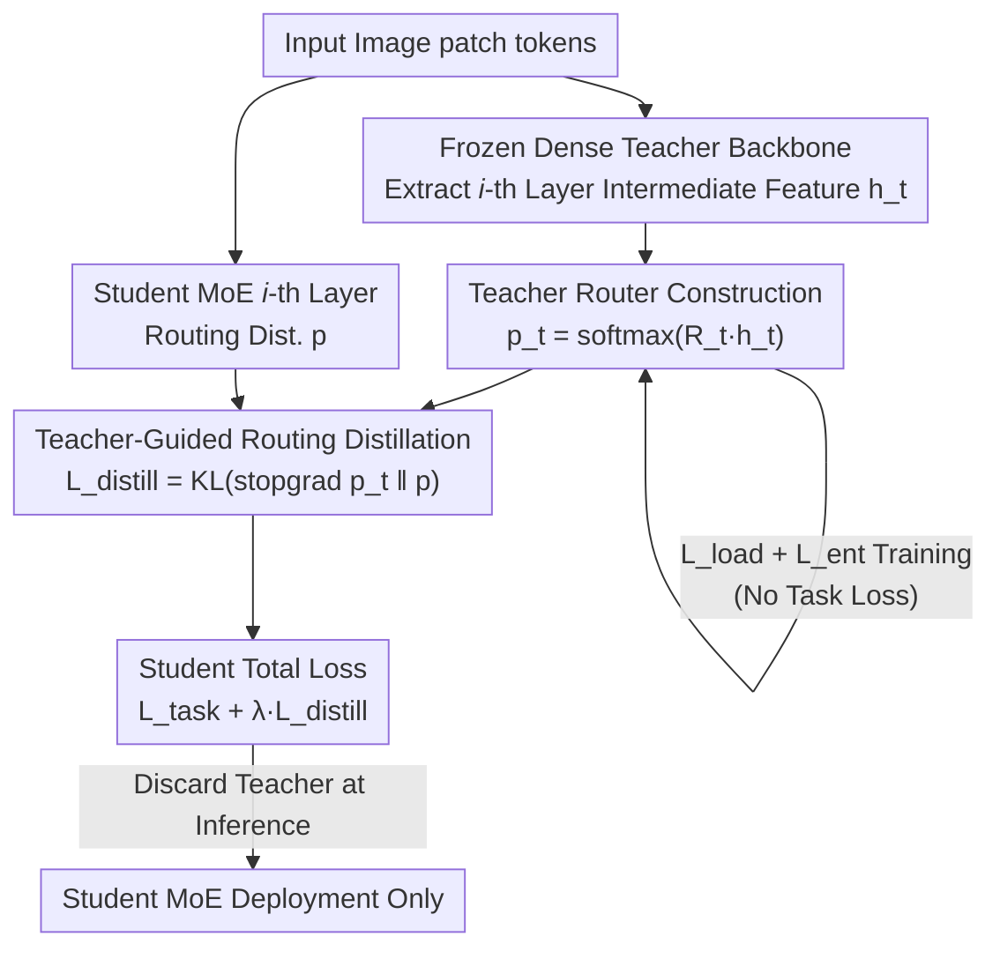

# Teacher-Guided Routing for Sparse Vision Mixture-of-Experts

**Conference**: CVPR 2026  
**Paper**: [CVF Open Access](https://openaccess.thecvf.com/content/CVPR2026/html/Kada_Teacher-Guided_Routing_for_Sparse_Vision_Mixture-of-Experts_CVPR_2026_paper.html)  
**Code**: None  
**Area**: Model Compression / Sparse Mixture-of-Experts  
**Keywords**: Sparse MoE, Routing Stability, Knowledge Distillation, Vision Transformer, Teacher Guidance

## TL;DR
A "teacher router" constructed from a frozen dense teacher model generates a stable expert assignment distribution. KL distillation is used to supervise the sparse MoE student's router, mitigating the "gradient only for selected experts" issue that causes routing fluctuation in early training. This achieves stable performance gains on ImageNet-1K / CIFAR-100 with zero additional inference overhead.

## Background & Motivation
**Background**: Sparse Mixture-of-Experts (Sparse MoE) is a mainstream method for increasing model capacity without increasing inference cost—each token activates only top-K experts, allowing capacity to scale while computation remains nearly constant. Originally popularized in Large Language Models, it has recently been adapted for vision (VMoE parallelizes patch tokens into MoE layers).

**Limitations of Prior Work**: Sparse MoE is notoriously difficult to train stably. The root cause is **gradient blocking**: only a few selected experts participate in the forward pass, meaning the router only receives informative gradients from these few selected paths during the backward pass, remaining nearly ignorant of unselected experts. This **local and sparse** feedback makes it difficult for the router to learn reasonable expert scores, especially in early training before experts have differentiated.

**Key Challenge**: Sparse feedback directly triggers **routing fluctuation**—the expert assigned to a fixed input changes frequently during training. This causes the same sample to be updated by different experts across iterations, preventing experts from specializing and leaving some experts chronically under-trained. Common load-balancing losses only ensure experts are used "evenly" but do not suppress temporal inconsistency, sometimes even exacerbating expert switching. Methods like StableMoE or HashMoE seek stability by **freezing or decoupling routing**, but sacrifice the ability for routing to adapt as representations evolve.

**Goal**: To provide the router with a global prior beyond the sparse activation path without freezing the target router, ensuring it receives dense and informative supervision from the early stages of training.

**Key Insight**: A pre-trained **dense teacher model** (non-MoE, where all parameters are updated at every step) possesses a well-structured intermediate feature space—exactly the "global, stable, and cross-expert" signal the router lacks.

**Core Idea**: Use intermediate teacher features to construct an auxiliary "teacher router" that produces a **balanced and confident** stable routing distribution. This distribution is then **KL-distilled** to the student router. This essentially injects a prior into the student router's softmax output, bypassing gradient blocking. The teacher is completely absent during inference, resulting in zero extra overhead.

## Method

### Overall Architecture
TGR-MoE does not modify the task objective but attaches a lightweight auxiliary teacher router to a **frozen dense teacher backbone**. During training, the student MoE performs a normal forward pass to obtain routing distributions $p^{(i)}$ for each MoE layer. Simultaneously, intermediate features $h_t^{(i)}$ are extracted from corresponding teacher layers and fed into the teacher router to calculate the teacher routing distribution $p_t^{(i)}$. The teacher router is trained using only load-balancing and entropy losses (bypassing task loss) to quickly converge to a stable distribution. The student router then mimics this distribution via KL divergence, added to the standard task loss. The teacher router and student MoE are **jointly trained**, but the teacher backbone is frozen, focusing optimization on the lightweight teacher router.

Note that the teacher router is **only responsible for providing supervision signals** and does not actually perform MoE routing. During inference, only the student remains; the teacher and its router are discarded.

### Key Designs

**1. Teacher Router Construction: Creating a "Routing" Bypass from Frozen Dense Intermediate Features**

To address the student router's lack of global prior, TGR-MoE attaches an auxiliary teacher router $R_t(\cdot)$ to a pre-trained dense backbone (DeiT-III pre-trained on ImageNet-21K). It takes the teacher's $i$-th layer intermediate representation $h_t$ and outputs expert assignment probabilities $p_t = \mathrm{softmax}(R_t(h_t)) \in \mathbb{R}^{N\times E}$. A critical design choice is **which layer's features** to use: experiments show that using the **last layer's** features causes accuracy to drop to 75.83% (lower than the VMoE baseline) because high-level representations are too abstract and task-specific. **Layer-aligned intermediate features** provide better structural matching and more effective supervision.

**2. Teacher Router Optimization: Forcing a "Balanced and Confident" Target Distribution**

The teacher router must act as a "gold standard"; the distribution should neither collapse to a few experts nor become a uniform blur. This method applies two losses—originally used to regularize target routers—specifically to the teacher router. The load-balancing loss $L_{\text{load}}$ minimizes the coefficient of variation across expert importance ($L_{\text{load}}(p)=\big(\mathrm{std}(\mathrm{Imp}(p))/\mathrm{mean}(\mathrm{Imp}(p))\big)^2 \propto \mathrm{var}(\mathrm{Imp}(p))$, where $\mathrm{Imp}_e(p)=\frac1N\sum_i p_{i,e}$), encouraging even usage. The entropy loss $L_{\text{ent}}(p)=-\frac1N\sum_i\sum_e p_{i,e}\log p_{i,e}$ prevents over-uniformity, encouraging **confident and discriminative** expert assignments. The teacher router objective is:

$$L_{\text{teacher}}=\sum_{i\in S_{\text{MoE}}}\Big(\lambda_{\text{load}}L_{\text{load}}(p_t^{(i)})+\lambda_{\text{ent}}L_{\text{ent}}(p_t^{(i)})\Big).$$

Importantly, this **does not optimize downstream task loss**. Its goal is not classification accuracy, but to use the teacher's semantic feature space to construct "balanced + confident" routing behaviors as a stable prior.

**3. Teacher-Guided Routing Distillation: Injecting Stable Distributions via KL + stop-gradient**

The student router $R_{\text{student}}$ learns by mimicking the teacher distribution. The distillation loss is defined as $L_{\text{distill}}(p,p_t)=\mathrm{KL}(\mathrm{stopgrad}(p_t)\,\|\,p)$. The `stopgrad` removes the teacher output from the computation graph. The student's total objective combines this with the task loss:

$$L_{\text{student}}=L_{\text{task}}+\frac{\lambda_{\text{distill}}}{|S_{\text{MoE}}|}\sum_{i\in S_{\text{MoE}}}L_{\text{distill}}(p^{(i)},p_t^{(i)}).$$

The elegance of this term is that it acts directly on the router's softmax output, providing informative supervision to **unselected experts that would otherwise receive no gradient**. This bypasses gradient blocking without freezing the student router, allowing it to adapt as representations evolve while being "tethered" by the teacher's prior.

> ⚠️ Regarding timing, analysis revealed a counter-intuitive conclusion: **distilling only during the first half of training and switching to pure task optimization in the second half** yields the best results. This suggests teacher guidance is most valuable during early routing instability; once experts stabilize, task gradients become more effective.

### Loss & Training
- Teacher side: $L_{\text{teacher}}=\lambda_{\text{load}}L_{\text{load}}+\lambda_{\text{ent}}L_{\text{ent}}$ (no task loss).
- Student side: $L_{\text{student}}=L_{\text{task}}+\lambda_{\text{distill}}\cdot L_{\text{distill}}$.
- Coefficients: $\lambda_{\text{load}}=0.005,\ \lambda_{\text{ent}}=0.005,\ \lambda_{\text{distill}}=5.0$.
- Backbone: DeiT; layers 8, 10, and 12 replaced with MoE. Teacher router targets the CLS token routing output. Optimizer: AdamW with cosine schedule, RandAugment/Mixup/CutMix. Student trained from scratch.

## Key Experimental Results

### Main Results
ImageNet-1K pre-training + downstream transfer, Top-1 Accuracy (%), K=1 setting:

| Scale | Model | ImageNet-1K | CIFAR-100 | Pets |
|------|------|-------------|-----------|------|
| Tiny | ViT (dense) | 74.62 | 85.43 | 89.86 |
| Tiny | VMoE | 77.85 | 86.20 | 89.82 |
| Tiny | SoftMoE | 79.31 | 86.80 | 91.91 |
| Tiny | **TGR-MoE (Ours)** | **78.78** | **87.03** | 91.78 |
| Small | VMoE | 82.63 | 88.68 | 93.31 |
| Small | **TGR-MoE (Ours)** | **83.34** | **90.26** | 93.79 |
| Base | VMoE | 83.97 | 89.04 | 93.79 |
| Base | **TGR-MoE (Ours)** | **85.46** | **91.07** | 94.63 |

TGR-MoE outperforms ViT and VMoE across all scales and is competitive with or superior to Expert Choice MoE and SoftMoE. For the Base scale, the gain over VMoE on ImageNet is +1.49%.

### Ablation Study
Expert count scaling (Tiny, ImageNet-1K, Top-1 %) — TGR-MoE's advantage is more pronounced at higher sparsity:

| Experts E | 4 | 8 | 16 | 32 | 64 | 128 |
|---------|------|------|------|------|------|------|
| VMoE | 76.18 | 77.39 | 77.85 | 78.41 | 78.74 | 79.38 |
| TGR-MoE | 76.59 | 77.81 | 78.78 | 79.35 | 79.95 | 80.36 |
| Gain | +0.41 | +0.42 | +1.07 | +0.94 | +1.21 | +0.98 |

Distillation timing and upper bound analysis (Tiny, 8 experts, ImageNet-1K):

| Configuration | Accuracy (%) | Description |
|------|---------|------|
| VMoE Baseline | 77.39 | Without teacher guidance |
| Distillation Only (Full) | 77.83 | Task supervision is not strictly required |
| Distillation (First half) + Task | **78.13** | Early strong guidance is optimal |
| Distillation + Task (Full) | 77.81 | Standard TGR-MoE |
| Student Route Inference | 74.84 | Pure imitation; student capacity insufficient |
| Teacher Route Inference | 80.19 | Theoretical upper bound (oracle) |

### Key Findings
- **Significant Increase in Routing Consistency**: VMoE still sees ~40% of expert assignments change mid-training. TGR-MoE reaches >70% consistency with the final assignment within 50 epochs; adjacent epoch consistency remains stable at ~0.8, whereas VMoE fluctuates between 0.5–0.6.
- **Stable Transfer**: Routing consistency between pre-training and CIFAR-100 fine-tuning is only 50.56% for VMoE, but 73.75% for TGR-MoE. Continuing TGR-MoE during fine-tuning (rather than just using it for initialization) yields the highest accuracy.
- **Sensitivity to Teacher Layer**: Using the last layer of the teacher causes accuracy to drop to 75.83%; layer-aligned intermediate features are essential.
- **Task Supervision is Optional**: Distillation alone (77.83%) outperforms the baseline, proving the teacher distribution is a sufficiently strong supervision signal.

## Highlights & Insights
- Redefines the "routing stability" problem as a "lack of global prior," elegantly solved using a **frozen teacher + lightweight bypass router**. This avoids the loss of adaptability found in StableMoE while maintaining zero inference cost.
- The teacher router **deliberately ignores task labels** to focus on load and entropy losses, serving as a "pure routing benchmark." This decoupled supervision design is highly effective.
- The "first-half distillation" phenomenon is insightful: strong guidance is needed when routing is chaotic, but task gradients should take over once experts have stabilized.
- The upper-bound analysis (80.19% teacher routing vs 77.81% student) identifies the capacity bottleneck of student routers, leaving room for future work on better routing imitation.

## Limitations & Future Work
- Requires a strong dense teacher from the same architecture family (e.g., DeiT-III). Feasibility is limited when no pre-trained teacher is available ⚠️.
- A 2.4% gap remains between the student and the teacher's routing upper bound, suggesting student routers are limited by representation capacity and layer-wise approximation errors.
- Experiments are focused on DeiT classification; performance on generative tasks, detection, or even larger scales is yet to be verified.
- The distillation phase switch (halfway vs. full) is currently empirical and lacks an adaptive criterion.

## Related Work & Insights
- **vs. StableMoE / HashMoE**: These fix routing to achieve stability but limit adaptation. TGR-MoE guides rather than freezes, balancing stability and adaptability.
- **vs. Read-ME / Dynamic Expert Specialization**: While these also distill into routers, their goal is model transformation or domain adaptation. TGR-MoE addresses discrete routing instability during the **pre-training phase**.
- **vs. Soft-MoE / DSelect-k**: These modify the routing function to smoothen gradients. TGR-MoE maintains standard top-K discrete routing and injects a prior, making it orthogonal and stackable.

## Rating
- Novelty: ⭐⭐⭐⭐ Uses dense teacher intermediate features as a routing prior to stabilize Sparse MoE training; original and orthogonal to continuous relaxation methods.
- Experimental Thoroughness: ⭐⭐⭐⭐ Three scales + multiple baselines + expert scanning + consistency/upper-bound analysis, though limited to DeiT classification.
- Writing Quality: ⭐⭐⭐⭐ Clear motivation and formulas; figures intuitively explain gradient blocking.
- Value: ⭐⭐⭐⭐ Practical plug-and-play improvement for Sparse MoE stability and accuracy with zero inference overhead.

<!-- RELATED:START -->

## Related Papers

- [\[CVPR 2026\] Masking Teacher and Reinforcing Student for Distilling Vision-Language Models](masking_teacher_and_reinforcing_student_for_distilling_vision-language_models.md)
- [\[ICLR 2026\] LD-MoLE: Learnable Dynamic Routing for Mixture of LoRA Experts](../../ICLR2026/model_compression/ld-mole_learnable_dynamic_routing_for_mixture_of_lora_experts.md)
- [\[ICML 2026\] Parameters as Experts: Adapting Vision Models with Dynamic Parameter Routing](../../ICML2026/model_compression/parameters_as_experts_adapting_vision_models_with_dynamic_parameter_routing.md)
- [\[CVPR 2026\] Enhancing Mixture-of-Experts Specialization via Cluster-Aware Upcycling](enhancing_mixture_of_experts_specialization_via_cluster_aware_upcycling.md)
- [\[CVPR 2026\] Distilling Balanced Knowledge from a Biased Teacher](distilling_balanced_knowledge_from_a_biased_teacher.md)

<!-- RELATED:END -->
