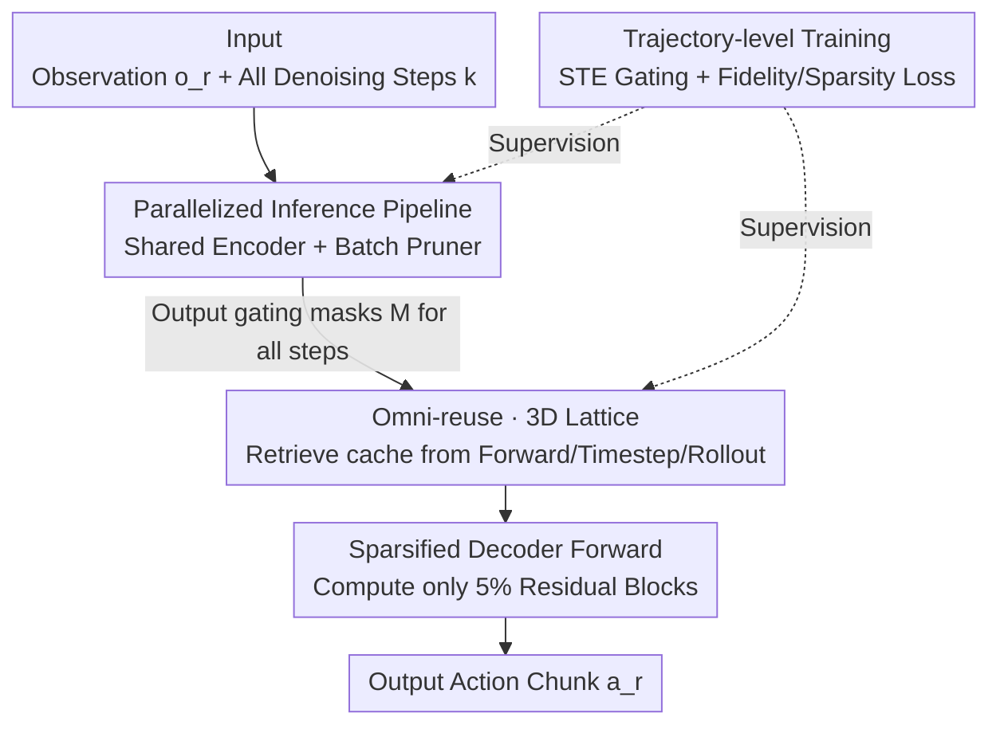

# Test-time Sparsity for Extreme Fast Action Diffusion

**Conference**: CVPR 2026  
**Paper**: [CVF Open Access](https://openaccess.thecvf.com/content/CVPR2026/html/Ji_Test-time_Sparsity_for_Extreme_Fast_Action_Diffusion_CVPR_2026_paper.html)  
**Code**: https://github.com/ky-ji/Test-time-Sparsity  
**Area**: Model Compression / Diffusion Acceleration / Robotic Action Policy  
**Keywords**: Action Diffusion, Test-time Sparsity, Feature Reuse, Inference Acceleration, VLA

## TL;DR
This paper proposes "test-time sparsity," utilizing a lightweight pruner with a shared encoder to dynamically predict residual blocks that can be pruned during each forward pass. Combined with an "omni-reuse" strategy that organizes historical features into a 3D lattice, it achieves 95% sparsity, a 92% reduction in FLOPs, and a 5× actual speedup in robotic action diffusion. This increases the inference frequency from 6Hz to 47.5Hz without a drop in success rate.

## Background & Motivation

**Background**: Action diffusion (e.g., Diffusion Policy, 3D Diffusion Policy, and VLA models like RDT-1B) has become the dominant action generation module for visuo-motor policies and dexterous manipulation due to its ability to model multi-modal action distributions through iterative denoising.

**Limitations of Prior Work**: Iterative denoising is inherently slow. Diffusion Policy runs at approximately 6Hz on consumer-grade GPUs, and 3D Diffusion Policy at about 5Hz, while many real-world tasks require 30Hz or higher—a gap of an order of magnitude. Existing acceleration approaches—reusing partial denoising results from the previous rollout (Falcon, Streaming Policy) or reusing intermediate features from the previous denoising step (EfficientVLA, BAC)—rely on **static, predefined reuse schedules**.

**Key Challenge**: Policies in open environments are dynamic—perceptions change, and multi-round interactions evolve, meaning the "sparsity pattern" of which computations to prune changes with each forward pass. Static schedules are naturally mismatched with this dynamic nature: fixed-interval reuse either prunes too aggressively, leading to performance drops (EfficientVLA drops to a 3% success rate on Kitchen), or prunes too conservatively, offering limited speedup.

**Key Insight**: The authors advocate for making pruning decisions **dynamically at test-time**. Before each model forward pass, a parameterized pruner predicts a binary pruning mask $M \in \{0, 1\}^{3L}$ ($L$ layers, with three residual blocks per layer: SA/CA/FFN) based on the current observation $o_r$ and denoising step $k$. Skipped residuals are compensated for using cached features (prune-then-reuse).

**Core Idea**: While test-time dynamic pruning is promising, it faces two bottlenecks: ① The overhead of redundant condition encoding and the pruning itself when inserted into the autoregressive denoising loop (the pruner alone takes 182ms, surpassing the 95ms decoding time after 95% sparsity) negates the saved computation; ② Retrieving cached features only from the "previous denoising step" is insufficient to constrain the massive pruning error at an aggressive 95% sparsity. This paper addresses the first bottleneck with a "parallelized inference pipeline" and the second with "omni-reuse."

## Method

### Overall Architecture
The method revolves around an Action Diffusion Transformer (condition encoder + decoder with SA/CA/FFN residual blocks). The goal is to compute only a small fraction of residual blocks during each denoising forward pass, substituting the rest with historical cache, without modifying the backbone or retraining the diffusion model. The pipeline consists of three components: a **parallelized inference pipeline** that decouples "encoding + pruning" from the denoising loop to compute all steps at once, reducing non-decoding overhead to milliseconds; an **omni-reuse + 3D lattice** strategy that selects optimal cache compensation from "current forward / previous step / previous rollout"; and **trajectory-level training** to learn the gating for "whether to compute and which direction to reuse."

### Key Designs

**1. Parallelized Inference Pipeline: Reducing pruner overhead from 182ms to 0.45ms**

The most counter-intuitive aspect of test-time pruning is that while pruning saves decoding time (705ms to 95ms), the pruner itself running repeatedly in the autoregressive loop takes 182ms, becoming a new bottleneck. The authors resolve this through three optimizations. First, **sharing the condition encoder between the pruner and the diffusion Transformer**: the pruner is instantiated as a lightweight Transformer decoder block that reuses high-level condition embeddings from the backbone, saving ~40ms. Second, **decoupling encoding and pruning from the denoising loop to compute all steps at once**. Since naïve one-time encoding for all steps loses accuracy, the authors rewrite the pruner as a bulk operation: sinusoidal position embeddings for all $K$ steps are calculated in parallel, then the time dimension $K$ is folded into the batch dimension $N$, allowing a single forward pass for all masks. Third, an **asynchronous pipeline**: the condition encoder and pruner use buffers to store embeddings and masks, followed by a "pure decoder loop." By observing that the pruner skips almost all redundant computation in early steps, it is overlapped with the first decoder step using parallel threads, hiding the overhead down to 0.45ms.

**2. Omni-reuse + 3D Lattice Modeling: Constraining 95% sparsity error with three-directional cache**

Reusing cache only from the "previous denoising step" fails at high sparsity. The authors observe that features across rollout iterations are highly similar, and when a feature is anchored, cached features from different directions align with it while offering complementary advantages (different approximation angles and shorter potential distances). To manage the massive volume of historical features, the authors build a **3D lattice** defined by three orthogonal indices—block index $b$, denoising step $k$, and rollout $r$. Each anchor feature sits at coordinates $(b, k, r)$. By keeping only the most recently updated candidate along each axis, each anchor gets exactly three candidates, keeping storage controllable. The reuse decision is integrated into the pruner output: for block $b$ at step $k$, the pruner outputs a 4D gating vector:

$$p_{b,k}=(p^C_{b,k},\,p^F_{b,k},\,p^T_{b,k},\,p^R_{b,k})$$

representing confidence for "recompute / reuse forward / reuse timestep / reuse rollout." During inference, $\arg\max$ discretizes this into mask $M_{b,k}$. The residual update is formulated as:

$$h^{\lceil b/3\rceil}_k=h^{\lceil b/3\rceil-1}_k+M^C_{b,k}d_{b,k}+M^F_{b,k}\varepsilon^F_b+M^T_{b,k}\varepsilon^T_b+M^R_{b,k}\varepsilon^R_{b,k}$$

where $d_{b,k}$ is the newly computed feature and $\varepsilon^F, \varepsilon^T, \varepsilon^R$ are the three caches. If $M^C_{b,k}=1$, all caches are refreshed with the new feature.

**3. Trajectory-level Training: Learning rollout reuse via multi-step supervision**

Per-forward supervision cannot learn cross-iteration strategies like "rollout reuse" because a single forward pass does not see the impact of subsequent iterations. The authors sample action trajectories and provide **step-by-step supervision** along the entire rollout. In each iteration $r$, the pruner predicts $M_r$, producing sparsified action $\hat a_r$. Gradients are backpropagated through each diffusion step. The non-differentiable $\arg\max$ is handled using a **Straight-Through Estimator (STE)**. The objective combines fidelity loss and sparsity regularization:

$$\mathcal{L}=\mathcal{L}_f+\mathcal{L}_s,\quad \mathcal{L}_f=\mathbb{E}_{(o_r,a^*_r)\sim\mathcal{D}_{ref}}\big[\lVert \pi^-(o_r,M_r)-a^*_r\rVert\big]$$

$$\mathcal{L}_s=\Big|\tfrac{1}{BK}\sum_{b=1}^{B}\sum_{k=1}^{K}p^c_{b,k}-(1-\rho)\Big|$$

where $\mathcal{L}_f$ pulls the sparsified actions toward reference actions $a^*_r$, and $\mathcal{L}_s$ drives the average "recomputation" ratio $p^c$ toward the target retention rate $1-\rho$. Only the pruner is trained (20 epochs, lr 1e-4), leaving the backbone frozen.

## Key Experimental Results

### Main Results
Comparison on Diffusion Policy (DDPM 100 steps) using Proficient Human (PH) data across 5 robomimic tasks (Success Rate % / Speedup, lower GFLOPS is better):

| Method | Sparsity | Lift | Can | Square | Transport | Tool | Avg | GFLOPS |
|------|--------|------|-----|--------|-----------|------|------|--------|
| Dense | 0 | 100 | 94 | 90 | 80 | 50 | 83 | 7.88 |
| EfficientVLA | 86 | 100 | 74 | 90 | 60 | 38 | 72 (3.46×) | 1.24 |
| L2C | 26 | 100 | 86 | 26 | 66 | 2 | 56 (1.28×) | 5.87 |
| BAC | 90 | 100 | 94 | 94 | 84 | 26 | 79 (3.68×) | 1.07 |
| **Ours** | 93 | 100 | 94 | 90 | 92 | 56 | **86 (4.86×)** | 0.68 |
| **Ours** | 95 | 100 | 88 | 92 | 94 | 48 | **84 (5.18×)** | 0.42 |

At 93% sparsity, the average success rate is 86, exceeding the Dense baseline's 83 with a 4.86× speedup. At 95% sparsity, a 5.18× speedup is achieved while maintaining performance on par with Dense. Comparisons on the multi-stage Kitchen task are more significant:

| Method | Sparsity | Kitp1 | Kitp2 | Kitp3 | Kitp4 | Avg | Speedup | GFLOPS |
|------|--------|-------|-------|-------|-------|------|------|--------|
| Dense | 0 | 100 | 100 | 100 | 100 | 100 | – | 113 |
| EfficientVLA | 86 | 20 | 2 | 0 | 0 | 3 | 3.60× | 13.81 |
| BAC | 90 | 100 | 98 | 94 | 82 | 93 | 3.90× | 15.83 |
| **Ours** | 93 | 100 | 100 | 100 | 100 | **100** | **5.90×** | 9.71 |
| **Ours** | 95 | 100 | 100 | 98 | 98 | 99 | 6.33× | 7.28 |

Ours maintains a perfect score of 100 at 93% sparsity on Kitchen with a 5.90× speedup, while EfficientVLA collapses to 3, confirming that static schedules cannot handle multi-stage task dynamics. Results also hold for DDIM, DPM-Solver, and RDT-1B.

### Ablation Study
Ablating "omni-reuse" directions on PH data at 93% sparsity (Success Rate %):

| Reuse Direction | Can | Transport | Tool | Square |
|----------|-----|-----------|------|--------|
| Dense | 94 | 80 | 50 | 90 |
| Forward Only | 86 | 4 | 50 | 18 |
| Timestep Only | 86 | 78 | 0 | 80 |
| Rollout Only | 10 | 70 | 32 | 80 |
| **Omni-directional** | **94** | **92** | **56** | **90** |

### Key Findings
- **All three directions are indispensable**: Each single-direction baseline has "fatal" tasks—Forward Only collapses on Transport, Timestep Only on Tool, and Rollout Only on Can. Omni-reuse achieves the best performance across all tasks, validating feature complementarity.
- **Pruner overhead is the bottleneck for deployment**: A naïve pruner's 182ms overhead exceeds the 95ms decoding time. The parallelized pipeline reduces this to 0.45ms; otherwise, dynamic pruning is only a theoretical improvement.
- **Dynamic masks change across rollouts**: Visualizations show significant variation in mask $M$ across rollout iterations, verifying the premise that test-time sparsity evolves with visuo-motor dynamics.

## Highlights & Insights
- **Precise framing of "Test-time Dynamic Sparsity"**: By linking dynamic environments to dynamic sparsity patterns, the failure of static schedules in multi-stage tasks becomes clear.
- **3D Lattice modeling is a transferable organization technique**: Consolidating massive history into three orthogonal axes with nearest-neighbor retrieval simplifies 50k–200k features into 3 candidates per anchor.
- **Operator parallelization as system optimization**: Rather than compromising accuracy with a lower-quality encoder, the authors use a bulk $N \times K$ forward pass to bypass the trade-off.
- **Efficient 4-way Gating**: A 4D gating vector combined with STE allows the model to simultaneously learn "whether to compute" and "which direction to reuse" in a compact manner.

## Limitations & Future Work
- **Bottlenecks in non-diffusion components**: On RDT-1B, end-to-end speedup is only 2.5× because heavy encoders like T5-XXL/SigLIP dominate the latency.
- **Tough tasks remain**: Even with omni-reuse, the Tool task success rate is limited at high sparsity, showing the robustness boundary for precision tasks.
- **Dependency on reference trajectories**: Trajectory-level training depends on the quality and availability of reference actions $a^*_r$.
- **Manual sparsity settings**: The target sparsity $\rho$ is manually tuned (80/90/93/95%) rather than adaptively determined based on task difficulty.

## Related Work & Insights
- **vs EfficientVLA / BAC (Static Reuse)**: These use fixed intervals and single-direction (timestep) reuse. This work uses dynamic masks and omni-reuse, preventing performance collapse in complex tasks like Kitchen.
- **vs L2C (Learned Offline Scheduling)**: L2C learns patterns but generates fixed offline schedules and computes features before reuse, yielding only 1.28× speedup. This work performs online pruning and hides overhead, reaching 5×.
- **vs Distillation (One-Step / Consistency Policy)**: Distillation requires retraining a new model; this work prunes the existing frozen backbone with a lightweight plugin.
- **vs Image Diffusion Cache (DeepCache, etc.)**: Image diffusion is a one-off generation suitable for simple heuristics; action diffusion is a closed-loop interaction where sparsity must evolve with the environment.

## Rating
- Novelty: ⭐⭐⭐⭐ The combination of test-time dynamic sparsity and 3D lattice omni-reuse is novel and practical for action diffusion.
- Experimental Thoroughness: ⭐⭐⭐⭐ Covers various models, samplers, and benchmarks. Directional ablation is compelling.
- Writing Quality: ⭐⭐⭐⭐ Clear logic connecting bottlenecks to design solutions; strong supporting visualizations.
- Value: ⭐⭐⭐⭐ Advancing action diffusion from 6Hz to 47.5Hz enables real-time control, which is highly valuable for VLA deployment.

<!-- RELATED:START -->

## Related Papers

- [\[CVPR 2026\] Back to Source: Open-Set Continual Test-Time Adaptation via Domain Compensation](back_to_source_open-set_continual_test-time_adaptation_via_domain_compensation.md)
- [\[CVPR 2026\] TALON: Test-time Adaptive Learning for On-the-Fly Category Discovery](talon_test-time_adaptive_learning_for_on-the-fly_category_discovery.md)
- [\[CVPR 2026\] Cross-Architecture Adaptation: Cloud-Edge Continual Test-Time Adaptation with Dynamic Sampling and Heterogeneous Distillation](cross-architecture_adaptation_cloud-edge_continual_test-time_adaptation_with_dyn.md)
- [\[CVPR 2026\] FOZO: Forward-Only Zeroth-Order Prompt Optimization for Test-Time Adaptation](fozo_forward-only_zeroth-order_prompt_optimization_for_test-time_adaptation.md)
- [\[CVPR 2026\] InstantViR: Real-Time Video Inverse Problem Solver with Distilled Diffusion Prior](instantvir_real-time_video_inverse_problem_solver_with_distilled_diffusion_prior.md)

<!-- RELATED:END -->
