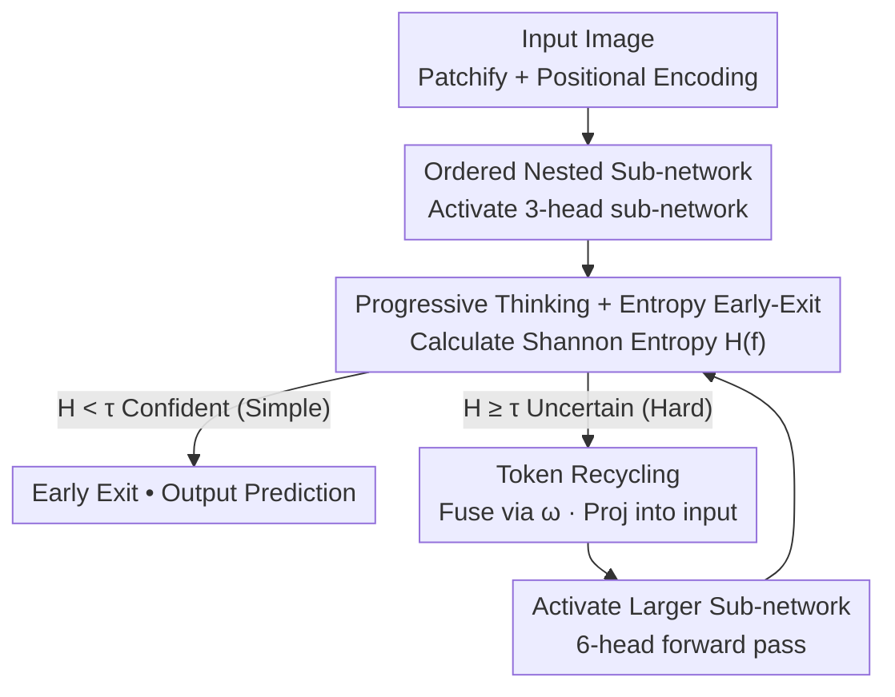

# ThinkingViT: Matryoshka Thinking Vision Transformer for Elastic Inference

**Conference**: CVPR 2026  
**Paper**: [CVF Open Access](https://openaccess.thecvf.com/content/CVPR2026/html/Hojjat_ThinkingViT_Matryoshka_Thinking_Vision_Transformer_for_Elastic_Inference_CVPR_2026_paper.html)  
**Code**: https://github.com/ds-kiel/ThinkingViT  
**Area**: Model Compression / Elastic Inference  
**Keywords**: Nested Transformer, Elastic Inference, Input-Adaptive Computation, Token Recycling, Entropy Early-Exit

## TL;DR
ThinkingViT integrates a progressive mechanism—"predict quickly with fewer heads, rethink by expanding the sub-network if uncertain"—into a nested ViT. By utilizing Token Recycling to feed features from previous stages into subsequent rounds, it outperforms nested baselines like MatFormer and HydraViT on ImageNet-1K by up to 2.0 p.p. under equivalent throughput.

## Background & Motivation
**Background**: While ViTs exhibit strong performance, their fixed computational budget makes it difficult to deploy a single set of weights across heterogeneous hardware ranging from servers to mobile devices. To achieve "elastic inference," recent works have introduced nested Transformers (e.g., MatFormer, HydraViT, SortedNet), which embed multiple weight-sharing sub-networks within one backbone. Inference-time sub-network selection based on hardware budgets avoids the need for retraining.

**Limitations of Prior Work**: Existing nested models treat **all inputs equally**. Identical compute is allocated whether an image contains a clear single object or a cluttered, occluded scene. Simple samples are over-computed, while complex samples lack sufficient capacity under tight resource constraints, hurting overall efficiency.

**Key Challenge**: Implementing "input-adaptive compute" typically requires a router to judge image difficulty. However, token-level lightweight MLP routers (like those in MoE) fail to capture global image complexity. Accurately estimating difficulty requires representation power close to a full classifier, yet adding a large independent router introduces significant overhead. The problem becomes: **how to achieve input-adaptive compute within a nested ViT without relying on an expensive independent router?**

**Key Insight**: Drawing inspiration from the "thinking" mechanism in LLMs (initial answer followed by refinement if uncertain), the authors observe a critical fact: in CV, **simply feeding ViT outputs back into the same network (naïve iteration) yields marginal gains** (Table 1: DeiT-Tiny saturates near 74% even when iterated to 5 GMACs). Therefore, "rethinking" must not only involve "thinking more" but "thinking more powerfully"—specifically, activating larger sub-networks in each subsequent round.

**Core Idea**: Use the model's own prediction confidence (entropy) as the sole scheduling signal. The model exits early if confident or activates more attention heads if uncertain. Previous stage features are reused via Token Recycling, effectively delegating the routing task to the model itself.

## Method

### Overall Architecture
ThinkingViT is built upon a standard ViT. After patchification and positional encoding, the model processes inputs through several **progressive thinking stages**. In the first stage, only a subset of the leading attention heads (e.g., 50%, or 3 heads) is activated to produce an initial prediction and a confidence score. If the Shannon entropy is below a threshold $\tau$ (the "Aha!" moment for simple samples), the model exits early. Otherwise, the stage's token features are merged back into the input via Token Recycling, and a larger sub-network (e.g., 100%, or 6 heads) performs another forward pass for a more refined prediction. This iterates until the confidence threshold is met or maximum capacity is reached. No independent router is used; elasticity is controlled by adjusting the entropy threshold $\tau$.

### Key Designs

**1. Ordered Nested Sub-networks: Partitioning ViT into "Increasing Importance" Tiers**

Elastic inference requires a single set of weights to function at multiple widths. If heads are randomly placed, the smaller sub-network might inherit "average" heads, leading to weak initial predictions. ThinkingViT follows the HydraViT approach by **inducing $n$ ordered nested sub-networks** $V_{d_1,h_1} \subset V_{d_2,h_2} \subset \dots \subset V_{d_n,h_n}$ within the backbone, where embedding dimensions $d_1 < d_2 < \dots < d_n$ and head counts $h_1 < h_2 < \dots < h_n$. Each sub-network consists of the **first $d_i$ embedding values and the first $h_i$ attention heads**. Slicing is applied across embedding layers, attention, MLP, and normalization. During training, the leading heads are forced to capture the **most critical** features, enabling the small sub-network (3 heads) to provide reasonable initial judgments—the foundation for saving compute via early-exit.

**2. Progressive Thinking + Entropy Early-Exit: "Aha!" Moments**

This is the core of input-adaptive compute. After receiving the softmax output $f_k$ at round $k$, the model measures confidence using Shannon entropy:

$$H(f_k) = -\sum_{c=1}^{C} f_k^{(c)} \log f_k^{(c)}$$

If $H(f_k) < \tau$ (a predefined threshold), the "Aha!" moment is triggered, and the current prediction is accepted. Otherwise, a larger sub-network is activated for refining. Crucially, "rethinking" involves **progressively expanding the attention heads** rather than just repeating the same computation, ensuring hard samples receive stronger representational capacity. Entropy proves to be as effective as more complex heuristics on ImageNet-1K while requiring no changes to the architecture or training.

**3. Token Recycling: Thinking on the Shoulders of Previous Rounds**

If the second stage re-processed the image from scratch, the representations from the previous round would be wasted. Token Recycling aligns the token features $z_L$ from the previous stage to the new dimension via projection and uses a **learnable scalar $\omega$** to control the amount of "recalled knowledge" added to the new input embeddings:

$$E_{d_j}^{\text{fused}} = \omega \cdot \text{Proj}_{d_i \to d_j}(z_L) + E_{d_j}(x)$$

This allows subsequent stages to refine predictions rather than starting from zero. The gains are significant: ThinkingViT achieves 81.44% with only 22.01M parameters, just 0.36 p.p. lower than DeiT-Base (86.6M), demonstrating that high accuracy stems from sufficient compute for hard samples and feature reuse rather than just model size.

### Loss & Training
During training, all $n$ thinking stages are executed, and the weighted sum of classification losses across stages is minimized:

$$L = \sum_{i=1}^{n} \alpha_i \cdot L_{\text{cls}}(V_{d_i,h_i}(x), y)$$

Where $\alpha_i$ controls the contribution of each sub-network. When the number of stages is small (two stages are often sufficient), joint optimization is straightforward. For larger $n$, the sandwich rule and random sub-network sampling are used to reduce training overhead. Models are initialized from pre-trained DeiT-Tiny and trained on ImageNet-1K (224×224).

## Key Experimental Results

### Main Results
Comparison with SOTA nested baselines on ImageNet-1K (3H→6H configuration):

| Metric | Gain vs Baseline | Notes |
|--------|------|------|
| Throughput (A100) | **+2.0 p.p.** | vs MatFormer / HydraViT / SortedNet / DynaBERT |
| GMACs | **+2.9 p.p.** | same as above |
| Parameter Efficiency | 81.44% @ 22.01M | Only 0.36 p.p. below DeiT-Base (86.6M), GMACs 5.85 vs 17.56 |

Counter-example showing naïve iteration does not yield gains (Table 1):

| Model | Depth | GMACs | Accuracy |
|------|------|-------|--------|
| DeiT-Tiny | 12 | 1.25 | 72.20 |
| + 1 iteration | 24 | 2.50 | 74.00 |
| + 2 iterations | 36 | 3.75 | 74.10 |
| + 3 iterations | 48 | 5.00 | 73.60 |

### Ablation Study
Trade-offs in thinking stage configurations (Figure 3):

| Configuration | Characteristics | GMACs | Note |
|------|------|-------|------|
| 3H→6H | Best accuracy/compute balance | 5.85 | Default for experiments |
| 2H→3H→6H | Widest GMACs coverage | — | Minor drop compared to 3H→6H |
| 3H→6H→12H | Highest final accuracy | 23.41 | Only +0.91 p.p. over 3H→6H; lower overall efficiency |

### Key Findings
- **Entropy is a reliable signal**: First-round entropy is left-skewed (early confidence) on simple datasets (ImageNet-V2) and right-skewed (triggering refinement) on hard datasets (ImageNet-A/-R). Load distributions indicate early-exit samples are rarely misclassified.
- **Enhanced Robustness**: Outperforms baselines across ImageNet-V2 / -ReaL / -R. On -ReaL/-Sketch/-R, it even surpasses DeiT-Base despite having much lower parameters (22.1M vs 86.6M) and GMACs (5.85 vs 17.56).
- **Transferable & Plug-and-play**: The backbone can be used for semantic segmentation (Segmenter on ADE20K / Cityscapes), outperforming DeiT-Small/Tiny backbones, and extends to hierarchical architectures like Swin.

## Highlights & Insights
- **"Thinking more powerfully" > "Thinking more"**: The failure of naïve iteration (Table 1) is a key insight. ThinkingViT equates "rethinking" with "increasing capacity," distinguishing it from LLM-style identical-layer iteration.
- **Internalizing the Router**: By using prediction entropy, the model avoids the overhead of an independent router and bypasses the difficulty of judging global image complexity with a tiny MLP.
- **Learnable Token Recycling**: Fusing cross-stage features with a learnable scalar effectively implements "progressive refinement + history reuse," a concept applicable to other multi-round frameworks like cascading detection or diffusion-based refinement.

## Limitations & Future Work
- Downstream verification's focus is currently on segmentation; tasks like DETR-style detection are left for future work.
- Entropy reliability might degrade in scenarios with extremely high class counts or poor calibration, necessitating potential investigation into more robust criteria.
- In worst-case scenarios (hard samples triggering all stages), total compute exceeds fixed-width models. The efficiency gain depends on the input distribution containing enough "simple" samples.
- The number of stages and expansion steps are hyperparameters that require tuning based on the dataset and deployment targets.

## Related Work & Insights
- **vs HydraViT / SortedNet (Nested Baselines)**: These methods slice the backbone but apply **fixed compute per input**. ThinkingViT uses the same slicing concept but adds input-adaptivity and cross-stage knowledge transfer.
- **vs MoE / Flextron (Routing Methods)**: These rely on token-level MLP routing which lacks global context and knowledge transfer between routing decisions. ThinkingViT uses self-entropy gating and reuses tokens across rounds.
- **vs Early-Exit (BranchyNet / ViT-EE)**: Standard early-exit uses multiple exits on a **fixed-width** model. ThinkingViT employs **increasing width** across iterations, which provides higher performance gains than simple early-exiting (Figure 8b).

## Rating
- Novelty: ⭐⭐⭐⭐ Combining progressive expansion, entropy self-routing, and token reuse into nested ViTs addresses the "vision iteration saturation" problem effectively.
- Experimental Thoroughness: ⭐⭐⭐⭐ Covers ImageNet variants, robustness, segmentation, Swin integration, and early-exit comparisons.
- Writing Quality: ⭐⭐⭐⭐ Clear logical progression regarding the necessity of capacity expansion over naïve iteration.
- Value: ⭐⭐⭐⭐ Plug-and-play, parameter-efficient, and highly practical for elastic deployment on heterogeneous hardware.

<!-- RELATED:START -->

## Related Papers

- [\[ICCV 2025\] EA-ViT: Efficient Adaptation for Elastic Vision Transformer](../../ICCV2025/model_compression/ea-vit_efficient_adaptation_for_elastic_vision_transformer.md)
- [\[CVPR 2026\] Edge-RecViT: Efficient Vision Transformer via Semantic-Refined Dynamic Recursion](edge-recvit_efficient_vision_transformer_via_semantic-refined_dynamic_recursion.md)
- [\[CVPR 2026\] LoPrune: Efficient Data Pruning for LoRA-Based Fine-Tuning of Vision Transformer](loprune_efficient_data_pruning_for_lora-based_fine-tuning_of_vision_transformer.md)
- [\[CVPR 2026\] TAS-LoRA: Transformer Architecture Search with Mixture-of-LoRA Experts](tas-lora_transformer_architecture_search_with_mixture-of-lora_experts.md)
- [\[CVPR 2026\] Dual-branch Distilled Transformer for Efficient Asymmetric UAV Tracking](dual-branch_distilled_transformer_for_efficient_asymmetric_uav_tracking.md)

<!-- RELATED:END -->
