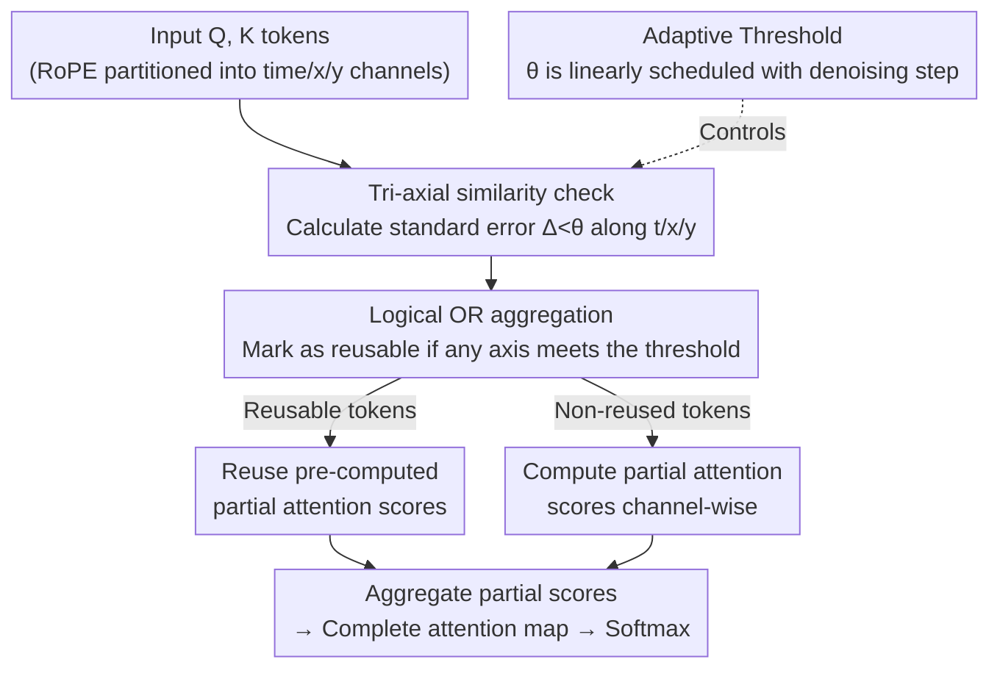

# TimeRipples: Accelerating vDiTs by Understanding the Spatio-Temporal Correlations in Latent Space

**Conference**: CVPR 2026  
**Paper**: [CVF Open Access](https://openaccess.thecvf.com/content/CVPR2026/html/Mao_TimeRipples_Accelerating_vDiTs_by_Understanding_the_Spatio-Temporal_Correlations_in_Latent_CVPR_2026_paper.html)  
**Code**: None  
**Area**: Model Compression / Diffusion Model Acceleration  
**Keywords**: Video Diffusion Transformer, Self-Attention Acceleration, Spatio-Temporal Correlation, Channel-Level Reuse, Adaptive Threshold

## TL;DR
This paper explains why various patterns emerge in video DiT (vDiT) attention maps by exploring the spatio-temporal correlation in the latent space. It reveals that these patterns are formed by the superposition of token spatio-temporal correlations across "time / x / y" channel groups partitioned by RoPE. Based on this, a lightweight method is proposed to reuse partial attention scores of similar tokens along the channel dimension. Additionally, an analytical model linking reuse ratio to error is introduced to adaptively select thresholds. This approach reduces attention computation by approximately 85% across 4 vDiTs, achieving up to 2.7× end-to-end acceleration with almost no quality loss in VBench (<0.06%).

## Background & Motivation
**Background**: Almost all current video generation models adopt the video diffusion transformer (vDiT) paradigm. However, the inference latency of vDiT is primarily consumed by two factors: the lengthy denoising steps and the computationally intensive self-attention. Profiling of four mainstream vDiTs (HunyuanVideo, Wan2.1, CogVideoX, Open-Sora-Plan) reveals that self-attention accounts for an average of 78% of the execution time, representing the primary bottleneck.

**Limitations of Prior Work**: Existing self-attention acceleration methods (such as MInference, SVG, tiling, masking, etc.) mostly transfer sparse attention techniques from LLMs directly—identifying sparse or unimportant positions in the attention map and skipping their computation. However, video data possesses a unique characteristic: inherent spatio-temporal correlation. Video compression (e.g., H.265 can achieve 10× lossless compression) has long leveraged this property for acceleration. Directly applying LLM sparse patterns to vDiTs ignores this correlation, causing these methods to either achieve negligible savings or suffer significant quality degradation on vDiTs.

**Key Challenge**: Prior works focus solely on the appearance of attention maps (such as spatial/temporal patterns as surface phenomena), treating these patterns as given facts to find sparsity without questioning how they actually arise. Without understanding the causal mechanism of these patterns, skipped computations might actually be crucial.

**Goal**: First, clarify the root cause of various patterns in vDiT attention maps. Then, design an extremely lightweight attention acceleration method tailored to the spatio-temporal structure of videos, and address the adaptive control problem of how much computation to save at each step.

**Key Insight**: Analyzing the attention computation of HunyuanVideo reveals a critical fact: attention map patterns do not emerge out of nowhere. Instead, they are the accumulated product of spatio-temporal correlations of Q and K along individual channels. Specifically, vDiTs widely utilize RoPE to partition the channel dimension into three groups based on semantics: temporal channels, x-directional channels, and y-directional channels (e.g., in HunyuanVideo, the first 16 dimensions encode time, the next 56 encode x, and the last 56 encode y). When spatial correlation dominates, values across frames are similar (allowing temporal reuse); when temporal correlation dominates, values within a frame are similar (allowing spatial reuse).

**Core Idea**: Since spatio-temporally similar tokens in the exact same channel cluster have nearly identical values, the partial attention scores of a token can be directly approximated using those of similar tokens—termed "reuse" rather than "skipping". This is paired with an analytical model that binds the reuse threshold to denoising steps, ensuring that the introduced error is controllable and consistent.

## Method

### Overall Architecture
TimeRipples aims to significantly reduce the computational cost of vDiT self-attention without retraining and with almost no quality loss. Its core paradigm shift is moving from "finding sparse positions in the attention map to skip" to "finding spatio-temporally similar tokens along channels to reuse their pre-computed partial attention scores." The entire pipeline is as follows: input Q and K tokens undergo a similarity check along three axes (time, x, and y) respectively, and the check results are aggregated using a logical OR to form a "reusable mask." Only non-reused tokens undergo actual channel-wise computation of partial attention scores, while reusable tokens directly copy previously computed scores. Finally, all partial scores are aggregated into a complete attention map before running standard Softmax. The strictness of the threshold for each step is guided by an adaptive formula bound to the denoising step.

### Key Designs

**1. Channel-Level Spatio-Temporal Correlation Analysis: Reducing attention patterns to the superposition of correlations on token channels**

Prior works only observed that vDiT attention maps exhibit two types of patterns, "spatial-varying" and "temporal-varying," speculating that they protect intra-frame spatial and inter-frame temporal information, without explaining their origin. This paper analyzes the attention computation of HunyuanVideo and concludes that patterns result from the synergistic effect of dominant channels in Q and K. When both Q and K show spatial correlation (the same pattern repeats across frames), the entire map is "spatial-dominant" with similar values across frames. When both Q and K show temporal correlation (frame means change, but intra-frame values remain relatively stable), the map is "temporal-dominant" with similar values within a frame. Furthermore, since vDiTs employ RoPE to group channels into time / x / y, the authors verified the causal linkage between channel groups and visual quality through an adversarial reuse experiment (forcing the second frame of every adjacent pair to reuse a specific channel group). Reusing temporal channels introduces temporal distortion, while reusing x/y channels produces stripe artifacts along the corresponding axis. This analysis provides the foundation for the subsequent reuse strategy: since patterns originate from spatio-temporal correlations on channels, modifications should be made in the channel dimension rather than searching for sparsity on the surface of attention maps.

**2. Channel-Level Token Reuse: Approximating attention with partial attention scores of similar tokens instead of crude skipping**

This is the execution core of the method, consisting of four steps. In the first step, Q and K undergo similarity checks along three axes respectively, where similarity is measured by the standard error within a window:

$$\Delta(a)=\sqrt{\sum_{i=0}^{K-1}(a_i-\bar a)^2/K},\quad \bar a=\sum_{i=0}^{K-1}a_i/K$$

where $a$ is a window of token channels and $K$ is the window size (set to 2 in experiments, i.e., comparing adjacent frames/rows/columns). If $\Delta$ on an axis falls below the threshold ($\theta_t,\theta_x,\theta_y$), the token pair is deemed reusable along this axis. In the second step, the results from the three axes are aggregated using a logical OR—if any axis satisfies the similarity condition, the token is marked as reusable, skipping its attention computation and applying the pre-calculated partial score instead. Third, only non-reusable tokens undergo the actual channel-wise Q·K dot product to compute partial scores (the white blocks in the figure represent saved operations). Fourth, all partial scores are aggregated into a complete attention map, which is then processed by Softmax as usual.

The fundamental difference (and the reason it is superior) compared to "token masking" is: masking directly treats unimportant tokens with values near zero as zero and skips them, which is equivalent to only "reusing" zero. In contrast, this method reuses the actual scores of similar tokens, covering the entire range. Comparing them at the same token saving rate shows that this method's MSE is an order of magnitude lower than both masking baselines (Fig. 7). This highlights the advantage of "reusing real values" over "discarding near-zero values."

**3. Adaptive Threshold Scheduling: Binding reuse thresholds to denoising steps to make errors consistent and controllable**

A higher reuse ratio leads to more savings but introduces larger errors, making the decision of threshold strictness for each layer and step a crucial question. The authors' key observation is that under a fixed reuse ratio, the generation quality is highly sensitive to the denoising step but almost insensitive to the custom prompt (as shown in Fig. 8 and Fig. 9, where the MSE trends of 10 prompts are highly consistent). This implies that a shared threshold schedule can be used across all prompts. Taking HunyuanVideo (50 steps) as an example, the MSE decreases monotonically from step 11 to 21 and remains flat from step 22 to 49. To ensure consistent introduced errors across steps, the threshold increases linearly with the steps:

$$\theta_{t,i}=(i-i_{\min})\cdot\frac{\theta_{t,\max}-\theta_{t,\min}}{i_{\max}-i_{\min}},\quad i\in[i_{\min},i_{\max}]$$

$i_{\min}=11,i_{\max}=21$ defines the linear scaling interval; the first 10 steps and the final step are kept untouched (early steps are highly sensitive to quality and should not be modified carelessly), while intermediate steps outside the interval use a fixed $\theta_{t,\max}$. The experiments also show that setting $\theta_t, \theta_x, \theta_y$ to the same value is more efficient and effective (see section 4.4 in ablation), so the three axes share a single threshold. This analytical model ensures that the error introduced by reuse remains consistent and controllable throughout the denoising process, preventing situations where some steps are overly aggressive while others are overly conservative.

### Loss & Training
This method is a **training-free inference-time acceleration** technique. It does not introduce any extra training or fine-tuning, directly acting on pre-trained vDiT self-attention. The only required "configurations" are 4 hyperparameters ($\theta_{t,\max},\theta_{t,\min},i_{\min},i_{\max}$) for each model, as shown in Tbl. 1 of the original paper (e.g., 0.2/0.5/10/20 for HunyuanVideo). The method is orthogonal to existing masking techniques and can be stacked (e.g., TimeRipples 75% + SVG70%).

## Key Experimental Results

### Main Results
On four vDiTs (HunyuanVideo, Wan2.1, CogVideoX, and Open-Sora-Plan), generation quality is evaluated using VBench (averaged over 16 dimensions, 950 prompts × 5 seeds), frame-level visual quality is evaluated via PSNR/SSIM/LPIPS, and performance is evaluated via latency/FLOPs/VRAM on a single H100 GPU. The table below excerpts representative results for HunyuanVideo:

| Method | VBench↑(%) | PSNR↑(dB) | LPIPS↓ | Latency↓(s) | Speedup↑ |
|------|-----------|-----------|--------|----------|-------|
| Original | 80.28 | - | - | 694.03 | - |
| ∆-DIT | 80.43 | 26.09 | 0.111 | 569.43 | 1.22× |
| MInference | 80.18 | 25.00 | 0.174 | 481.18 | 1.44× |
| SVG70% | 79.97 | 25.78 | 0.153 | 409.57 | 1.69× |
| **TimeRipples 75%** | 80.23 | **35.06** | **0.036** | 329.97 | 2.10× |
| **TimeRipples 85%** | **80.44** | 31.28 | 0.078 | 260.85 | **2.66×** |
| TimeRipples 75%+SVG70% | 79.84 | 26.17 | 0.142 | 285.86 | 2.43× |

Key observations: The VBench score of TimeRipples 85% (80.44) even slightly exceeds the original model (potentially due to regularization effects), and the latency drops from 694s to 261s. TimeRipples 75% achieves the best balance between quality and acceleration, with a PSNR of 35.06 dB that vastly outperforms the strongest baseline ∆-DIT (26.09 dB, over 9 dB gain). Similar trends are observed on the other three models (e.g., on CogVideoX, TimeRipples 80% achieves an 81.16 VBench score and a 2.31× speedup, while PAB collapses to 68.17 VBench). On average, it saves around 75% of attention computation, which is 5% higher than SVG70%, achieving up to 2.7× end-to-end speedup.

### Ablation Study
On HunyuanVideo, different variants are configured to roughly the same computation saving rate:

| Configuration | VBench↑ | PSNR↑(dB) | SSIM↑ | LPIPS↓ | Note |
|------|---------|-----------|-------|--------|------|
| Original | 80.28 | - | - | - | Original |
| TimeRipples 75% (Fixed) | 80.19 | 34.56 | 0.948 | 0.037 | Fixed threshold |
| TimeRipples 75% (Temp) | 80.13 | 32.44 | 0.933 | 0.050 | Temporal-only correlation |
| TimeRipples 75% (Spat+Temp) | 80.23 | 35.06 | 0.950 | 0.036 | Full (both spatio-temporal) |

### Key Findings
- **Adaptive threshold vs Fixed threshold**: While the fixed threshold already achieves an impressive VBench of 80.19 (far exceeding other baselines in Tbl. 2), the adaptive threshold further elevates the PSNR from 34.56 to 35.06, as it aligns better with the MSE sensitivity trend shown in Fig. 9.
- **Spatio-temporal dual dimensions vs Single dimension**: Using only the temporal dimension (Temp) yields a PSNR of just 32.44, whereas including the spatial dimensions boosts it to 35.06—demonstrating that a single dimension cannot unleash the full potential of token reuse.
- **Window size**: A window size of 2 serves as the optimal trade-off (Fig. 11); expanding it to 4 causes noticeable quality degradation due to excessive reuse, while exceeding 4 slows down acceleration as fewer tokens satisfy the reuse condition.
- **Channel-wise thresholds perform worse**: Tbl. 4 shows that setting thresholds for each channel individually (channel-wise) decreases the VBench score from 80.44 to 79.37 and the PSNR from 31.28 to 28.27, which confirms that sharing a single threshold schedule across the three axes is more robust.

## Highlights & Insights
- **"Explaining pattern formation" rather than "exploiting pattern surface"**: The most striking insight is tracing attention map patterns back to the superposition of spatio-temporal correlations on RoPE channel groups. This elevates an empirical observation to an actionable causal conclusion, providing theoretical backing for the reuse strategy rather than relying on another heuristic mask.
- **Intuition behind "reuse" over "skipping"**: Masking is equivalent to only reusing near-zero unimportant tokens, whereas this method reuses the actual scores of similar tokens, covering the entire range. Consequently, the MSE is an order of magnitude lower at the same computation saving rate.
- **The practical observation that "quality is sensitive to denoising steps but insensitive to prompts"**: This enables a single threshold schedule to be generalized across all prompts, eliminating the need for per-prompt tuning. This approach of identifying the truly decisive variables can be translated to other diffusion acceleration and scheduling problems.
- **Training-free + orthogonal to masking**: Requires no retraining and is stackable with methods like SVG, leading to exceptionally low engineering costs.

## Limitations & Future Work
- **Acceleration is a theoretical/estimated value**: Highly-optimized attention kernels like FlashAttention do not currently support such channel-level reuse, so the paper's reported speedup is based on estimated self-attention latency scaled down proportionally to the reduced FLOPs, rather than real-world wall-clock measurements on fused kernels. How to integrate the reuse mechanism with existing accelerators like FlashAttention is explicitly left as future work.
- **Only accelerates self-attention**: The method focuses strictly on self-attention computation, leaving the denoising steps unmodified, and does not deeply integrate with step-skipping methods (although it can be stacked with masking).
- **Dependence on RoPE channel semantic partitioning**: The method is premised on the architectural assumption that vDiT uses RoPE to group channels into time/x/y. Whether this holds for architectures that do not use RoPE or lack clear channel semantics is not discussed.
- **Hyperparameters must be tuned per model**: The four hyperparameters vary significantly across models (Tbl. 1). When adapting to a new model, tuning is still required, and there is currently no mechanism for automatic hyperparameter search.

## Related Work & Insights
- **vs SVG / MInference (Sparse Attention)**: These methods adopt sparse patterns from LLMs, using predefined or dynamic sliding windows, tiling, or masking to skip unimportant calculations in the attention map. This paper notes that this ignores the spatio-temporal correlation in videos. Instead, we propose channel-level reuse rooted in latent space correlations, achieving significantly higher quality at equivalent saving rates (HunyuanVideo PSNR 35.06 vs. 25.78 for SVG), and the two paradigms are orthogonal and combinable.
- **vs PAB / ToCa (Cross-Step Reuse)**: These methods reuse intermediate results across adjacent denoising steps, which requires substantial caching and brings notable memory overhead. In contrast, this work only reuses within the current self-attention layer, incurring nearly zero memory overhead and no reliance on cross-step similarity.
- **vs ToMe (Token Merging)**: ToMe reduces attention cost by shortening the token sequence, which alters the sequence itself. This work does not merge tokens or change sequences, instead only approximating scores along the channel dimension.
- **vs ∆-DiT (Block-level Reuse)**: ∆-DiT performs coarse, block-wise reuse, whereas this study performs fine-grained channel-level reuse bound to spatio-temporal axes, yielding superior visual quality (HunyuanVideo PSNR 35.06 vs. 26.09).

## Rating
- Novelty: ⭐⭐⭐⭐⭐ Tracing attention patterns to the underlying cause of channel-level spatio-temporal correlation offers a genuinely fresh perspective, and the strategy of reusing rather than skipping is grounded in robust logic.
- Experimental Thoroughness: ⭐⭐⭐⭐ Evaluated across 4 vDiTs, multiple baselines, with comprehensive ablation and sensitivity studies; however, acceleration is estimated and lacks wall-clock metrics on a fused kernel execution.
- Writing Quality: ⭐⭐⭐⭐ Logical progression from insight to idea to methodology, with very clear illustrative figures (e.g., Fig. 1/5/6).
- Value: ⭐⭐⭐⭐ Enhancing video generation efficiency is highly critical. Since the method is training-free and stackable, it holds high practical value, with the only hurdle being the current lack of custom GPU kernel implementations.

<!-- RELATED:START -->

## Related Papers

- [\[ACL 2026\] Enabling Agents to Communicate Entirely in Latent Space](../../ACL2026/model_compression/enabling_agents_to_communicate_entirely_in_latent_space.md)
- [\[ICCV 2025\] B-VLLM: A Vision Large Language Model with Balanced Spatio-Temporal Tokens](../../ICCV2025/model_compression/b-vllm_a_vision_large_language_model_with_balanced_spatio-temporal_tokens.md)
- [\[ICLR 2026\] LS-Merge: Merging Language Models in Latent Space](../../ICLR2026/model_compression/ls-merge_merging_language_models_in_latent_space.md)
- [\[NeurIPS 2025\] Learning to Factorize and Adapt: A Versatile Approach Toward Universal Spatio-Temporal Foundation Models](../../NeurIPS2025/model_compression/learning_to_factorize_and_adapt_a_versatile_approach_toward_universal_spatio-tem.md)
- [\[CVPR 2026\] Understanding and Enforcing Weight Disentanglement in Task Arithmetic](understanding_and_enforcing_weight_disentanglement_in_task_arithmetic.md)

<!-- RELATED:END -->
