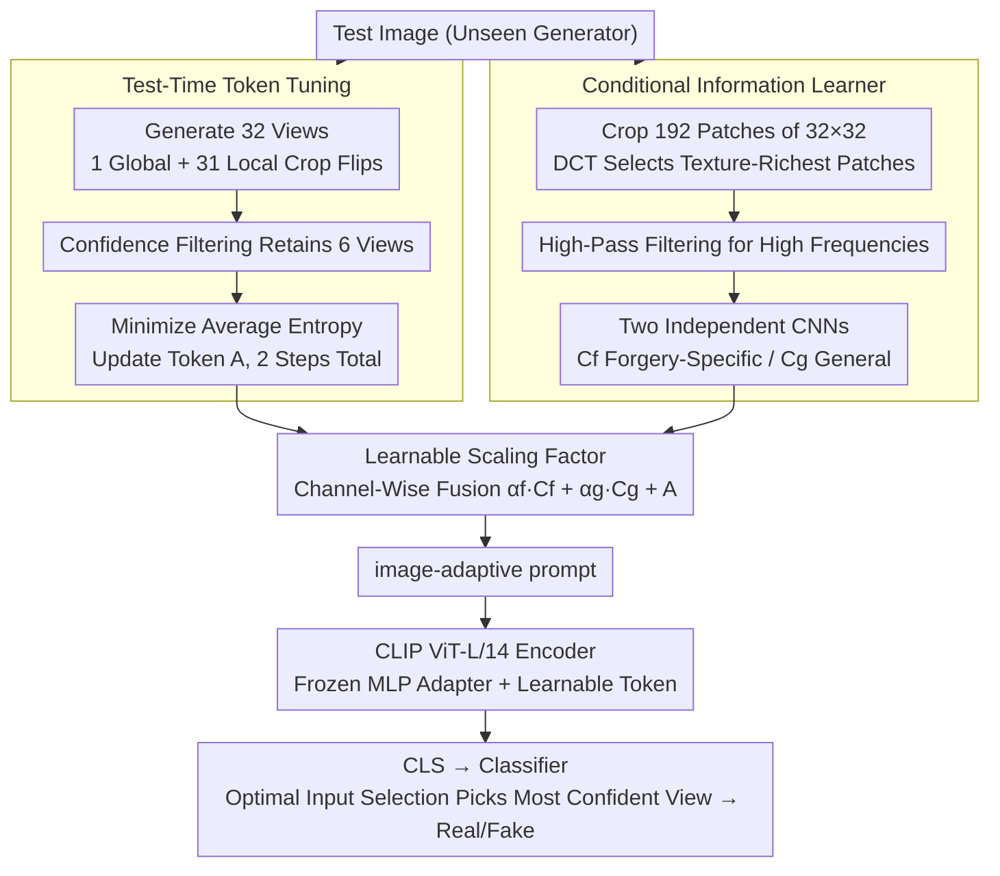

# Towards Generalizable AI-Generated Image Detection via Image-Adaptive Prompt Learning

**Conference**: CVPR 2026  
**arXiv**: [2508.01603](https://arxiv.org/abs/2508.01603)  
**Code**: Yes  
**Area**: Model Compression  
**Keywords**: AI-Generated Image Detection, Prompt Learning, Test-Time Adaptation, CLIP, Forgery Detection

## TL;DR

Ours proposes Image-Adaptive Prompt Learning (IAPL), which dynamically adjusts the prompts of the CLIP encoder for each test image during inference. By integrating test-time token tuning and a conditional information learner, it achieves strong generalization to unseen generators, reaching state-of-the-art (SOTA) performance with average accuracies of 95.61% and 96.7% on UniversalFakeDetect and GenImage, respectively.

## Background & Motivation

**Background**: AI-generated image detection is a prominent topic in the current security field. SOTA methods typically fine-tune vision foundation models like CLIP, leveraging their rich pre-trained knowledge to assist in detection. Existing methods such as UniFD, FatFormer, and C2P-CLIP fix all learnable parameters after training.

**Limitations of Prior Work**: Fixed-parameter models after fine-tuning struggle with domain shifts from unseen generators. Images produced by different generators vary significantly in texture, semantics, and forgery traces, which fixed parameters fail to capture as instance-level specific discriminative cues.

**Key Challenge**: Training data only covers limited generation methods (e.g., training only on ProGAN), while 19 different generators must be handled during inference. Fixed learned prompts only encode the forgery distribution of the training set and cannot adapt to new distributions.

**Goal**: (1) How can prompts dynamically adapt to each test image during inference? (2) How can image-specific forgery cues be extracted as conditional information? (3) How can instance-level adaptation be allowed while maintaining the stability of the detection backbone?

**Key Insight**: Introduce the idea of Test-Time Adaptation (TTA) into prompt learning—prompts are not only optimized during training but also continue to be tuned during inference based on multi-view consistency constraints of a single test image.

**Core Idea**: The prompt is composed of two parts: "fixed conditional information after training" and "dynamically adjusted test-time tokens during inference," fused via learnable scaling factors to achieve instance-level adaptation for the detector.

## Method

### Overall Architecture

The core problem IAPL addresses is that the model only sees a few generators (e.g., ProGAN) during training but faces 19 unseen generators during inference; fixed-parameter CLIP detectors fail when the distribution shifts. Its approach is to "split the prompt in two"—one half is fixed after training to provide stable forgery priors, while the other half is adjusted on-the-fly for each test image during inference to capture instance-level cues.

The entire pipeline is based on CLIP ViT-L/14. Three types of learnable components are inserted into the original encoder: MLP adapters inserted at $N_a=6$ equally spaced blocks, learnable tokens distributed from the 2nd to the $N_t=9$th block, and an image-adaptive prompt fed into the 1st block. The first two types are frozen after training to form a stable backbone; only the image-adaptive prompt continues to change according to the image during inference. When a test image arrives, it is processed through two parallel branches: the test-time token tuning branch tunes the tokens on-the-fly from multi-view consistency, and the conditional information learner branch extracts forgery cues from high-frequency textures. These are then fused into an image-specific prompt via learnable scaling factors and fed back into the 1st block. Finally, the CLS token passes through the classifier, and Optimal Input Selection chooses the most confident view for the real/fake decision.

### Key Designs

**1. Test-time token tuning: Enabling prompt adaptation to the current image during inference**

The greatest weakness of fixed parameters is the indecision when facing unseen generators—textures and forgery traces differ greatly across generators, and the prompt learned during training only encodes the training distribution. IAPL's approach is to open an unlabeled adaptation window during inference: generate $N_v=32$ views for a single test image (1 global + 31 local crops and flips), select the $m=6$ most confident views, and then perform target gradient updates for $T=2$ steps on the test-time tokens to minimize their average entropy:

$$L_{avg} = -\big(\bar{p}\log\bar{p} + (1-\bar{p})\log(1-\bar{p})\big)$$

where $\bar{p}$ is the average prediction of the 6 selected views. Minimizing this entropy forces the model to provide consistent and confident judgments across multiple views of the same image, thereby pulling the tokens toward the characteristics of the current image. Because the objective depends only on the prediction distribution itself and requires no labels, it can be run directly during the test phase, which is the root of its effectiveness on unseen domains.

**2. Conditional Information Learner: Digging for forgery traces from high-frequency textures that CLIP misses**

CLIP's pre-training emphasizes high-level semantics and is naturally insensitive to low-level forgery traces like frequency anomalies and pixel-level patterns, which are key to identifying generated images. The conditional information learner specifically fills this gap: it first divides the image into $N_p=192$ small $32\times32$ patches, selects the patch with the richest texture using DCT scores, applies a high-pass filter to retain high-frequency patterns, and passes it to two CNNs with the same structure but independent parameters—one outputs forgery-specific conditions $C_f$ (with auxiliary supervision, focusing on forgery discrimination), and the other outputs general conditions $C_g$ (unsupervised, capturing the general state of the image). The benefit of this separation is that forgery cues and general context are processed through separate channels without diluting each other; processing only one $32\times32$ patch also keeps the computational cost minimal.

**3. Learnable scaling factors: Fusion of two types of cues into the final prompt via channels**

Test-time tokens capture multi-view consistency cues, while conditional information captures high-frequency forgery cues. Since they have different scales and levels of importance, direct addition could cause strong signals to drown out weak ones. IAPL uses a set of channel-wise learnable coefficients $\alpha_f, \alpha_g$ to control the fusion ratio:

$$P = \{\alpha_f \cdot C_f + A[0,:],\ \alpha_g \cdot C_g + A[1,:]\}$$

Here $A$ refers to the adaptive tokens after test-time tuning. $\alpha$ learns the proportion of conditional information versus tokens for each channel during training, achieving fine-grained channel-level allocation rather than crude equal-weight addition.

### Mechanism

A complete example: A generated image from an unseen Midjourney source enters the pipeline. The conditional information learner first partitions it into 192 patches, locks onto the patch with the highest DCT score, and, after high-pass filtering, produces $C_f$ and $C_g$ via two CNNs. Simultaneously, the system generates 32 views of the image, filters out hesitant views based on current prediction confidence, and keeps the 6 most confident ones. It then performs two gradient updates on the test-time tokens with the goal of minimizing the average entropy of these 6 predictions—after updates, the model's real/fake judgments on these 6 views tend to converge. Then, the scaling factors fuse $\alpha_f C_f$, $\alpha_g C_g$, and the tuned tokens channel-wise into an image-adaptive prompt specific to this image, which is fed back into the first block of CLIP. Finally, the prediction with the highest confidence among all views is taken as the final result for the image (Optimal Input Selection). The entire process uses no labels; the prompt is "built on-the-fly" for this specific image.

### Loss & Training

The training objective is $L_{overall} = L_{cls} + L_{aux}$, where both terms are binary cross-entropy ($L_{aux}$ is the auxiliary supervision for the $C_f$ path). During the inference phase, the average entropy $L_{avg}$ is used for online tuning of the test-time tokens. Training takes only 1 epoch with a learning rate of $5\times10^{-5}$ on a single 3090 GPU; for inference, the test-time tuning learning rate is increased to $5\times10^{-3}$ and involves only 2 update steps, making the overhead controllable.

## Key Experimental Results

### Main Results (UniversalFakeDetect, trained on ProGAN 4-class, Acc%)

| Method | ProGAN | StyleGAN | BigGAN | LDM(200) | DALLE | GauGAN | mAcc |
|------|--------|----------|--------|----------|-------|--------|------|
| UniFD | 100.0 | 82.0 | 94.5 | 72.0 | 81.38 | 99.5 | 86.78 |
| FatFormer | 99.89 | 97.15 | 99.50 | 69.45 | 98.75 | 99.41 | 90.86 |
| C2P-CLIP | 99.98 | 96.44 | 99.12 | 93.29 | 98.55 | 99.17 | 93.79 |
| **Ours (IAPL)**| **100.0** | **98.90** | **99.65** | **95.35** | **98.90** | **99.55** | **95.61** |

### Ablation Study

| Configuration | mAcc | Note |
|------|------|------|
| Full IAPL | 95.61 | Complete method |
| w/o test-time tuning | 93.89 | Removing test-time tuning drops mAcc by 1.72 |
| w/o conditional info | 94.23 | Removing conditional info drops mAcc by 1.38 |
| w/o scaling factor | 94.67 | Removing scaling factor drops mAcc by 0.94 |
| w/o MLP adapter | 94.12 | Removing adapter drops mAcc by 1.49 |

### Key Findings

- Test-time tuning contributes the most (+1.72%), confirming the effectiveness of inference-time adaptation.
- T-SNE visualizations qualitatively show that features of unseen forged images processed by IAPL are closer to seen forged images and further from real images.
- On the GenImage dataset, training on SD v1.4 achieved 96.7% mAcc, showing good generalization to unseen generators like Midjourney and ADM.
- Training efficiency is extremely high, requiring only 1 epoch of training and 2 steps of tuning during inference.

## Highlights & Insights

- **Inference-time prompt adaptation**: Combining test-time adaptation with prompt learning for forgery detection is a novel integration. Each image receives a customized prompt, which adapts better to unseen domains than fixed prompts.
- **High-frequency texture conditioning**: Extracting high-frequency conditional information from the patch with the highest DCT score cleverly compensates for CLIP's semantic bias with minimal computational cost (only one 32x32 patch).
- **Extremely low training cost**: Only 1 epoch + a single 3090 GPU, which is much more economical than similar methods (e.g., FatFormer requires multiple epochs and larger hardware).

## Limitations & Future Work

- Test-time tuning during inference introduces additional latency: generating 32 views + 2 gradient update steps might be a bottleneck for real-time applications.
- Conditional information is only extracted from a single texture-rich patch, potentially missing forgery cues distributed elsewhere.
- Accuracy still fluctuates (68-95%) on low-level forgery methods like SITD and SAN, suggesting that conditional information is insufficient for certain forgery types.

## Related Work & Insights

- **vs C2P-CLIP**: C2P-CLIP injects category concepts via contrastive learning, but the prompt is fixed after training. IAPL introduces additional inference tuning, increasing mAcc from 93.79% to 95.61%.
- **vs FatFormer**: FatFormer uses frequency analysis to enhance adapters, but prompts remain fixed. IAPL's dual approach of dynamic prompts and conditional information performs better.
- **vs TPT/R-TPT**: Ours draws on the idea of test-time prompt tuning but adds a conditional information branch specific to forgery detection, making it more effective than pure TPT.

## Rating

- Novelty: ⭐⭐⭐⭐ Combining test-time adaptation with prompt learning for forgery detection is a novel combination.
- Experimental Thoroughness: ⭐⭐⭐⭐⭐ Two major standard datasets, 19+ generators, and complete ablation studies.
- Writing Quality: ⭐⭐⭐⭐ Method descriptions are clear and illustrations are intuitive.
- Value: ⭐⭐⭐⭐ Significant reference value for the practical application of AI-generated content detection.

<!-- RELATED:START -->

## Related Papers

- [\[AAAI 2026\] Your AI-Generated Image Detector Can Secretly Achieve SOTA Accuracy, If Calibrated](../../AAAI2026/model_compression/your_ai-generated_image_detector_can_secretly_achieve_sota_accuracy_if_calibrate.md)
- [\[CVPR 2026\] CADC: Content Adaptive Diffusion-Based Generative Image Compression](cadc_content_adaptive_diffusion-based_generative_image_compression.md)
- [\[ICML 2026\] Images as Tables: In-Context Learning with TabPFN for Low-Data Detection of AI-Generated Images](../../ICML2026/model_compression/images_as_tables_in-context_learning_with_tabpfn_for_low-data_detection_of_ai-ge.md)
- [\[NeurIPS 2025\] AI-Generated Video Detection via Perceptual Straightening](../../NeurIPS2025/model_compression/ai-generated_video_detection_via_perceptual_straightening.md)
- [\[CVPR 2026\] What Matters in Practical Learned Image Compression](what_matters_in_practical_learned_image_compression.md)

<!-- RELATED:END -->
