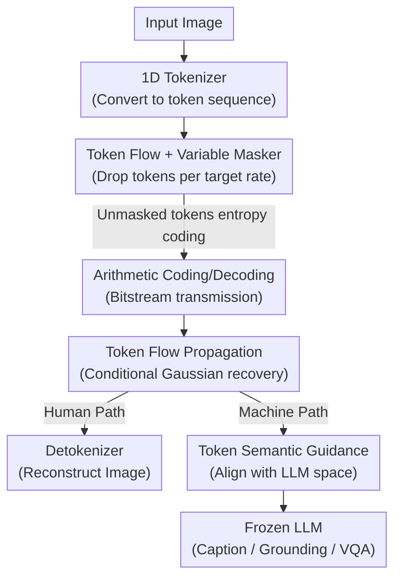

# Towards Unified Human Perception and Machine Understanding: Token Flow Guided Compression Framework

**Conference**: CVPR 2026  
**Paper**: [CVF Open Access](https://openaccess.thecvf.com/content/CVPR2026/html/Xu_Towards_Unified_Human_Perception_and_Machine_Understanding_Token_Flow_Guided_CVPR_2026_paper.html)  
**Area**: Model Compression / Image Compression  
**Keywords**: Image Compression, Coding for Machine Vision, 1D token, Variable Bitrate, LVLM

## TL;DR
TFGC compresses images into 1D token sequences and utilizes the "token flow" phenomenon for variable bitrate masking combined with conditional Gaussian prediction to reconstruct missing tokens. Through a semantic guidance module, Large Vision-Language Models (LVLMs) directly consume the compressed tokens without decoding back to pixels, achieving superior human perception and machine understanding (caption/grounding/VQA) at ultra-low bitrates (0.02–0.06 bpp).

## Background & Motivation
**Background**: As Large Vision-Language Models (LVLM) become the primary consumers of imagery, the goal of image compression is shifting from "pixel fidelity for humans" towards "semantic fidelity for machine understanding." Traditional learned compression (autoencoder-based, such as ELIC) is trained by minimizing $R+\lambda D$, surpassing traditional codecs like BPG/VVC; however, they optimize for pixel-level distortion and require retraining or separate weights for each bitrate point.

**Limitations of Prior Work**: Existing approaches suffer from three major issues. First, fixed bitrates: changing rates necessitates switching models. While works like QVRF/Hanyue address variable bitrates, they still target image reconstruction quality. Second, the "reconstruct-then-understand" paradigm: recent works incorporating semantic priors still require decoding images before feeding them to LVLMs. This creates a modality gap between perception and understanding; at ultra-low bitrates, semantics degrade sharply, hindering downstream inference. Third, Vector Quantization (VQ) methods transmit discrete token indices but rely on dense 2D token grids, limiting compression flexibility.

**Key Challenge**: At ultra-low bitrates, latent representations lose semantic correlation and fail to separate meaningful content from redundant visual details. Furthermore, achieving flexible bitrate control often sacrifices semantic consistency, making it difficult to satisfy both requirements simultaneously.

**Key Insight**: The authors represent images as **1D token sequences** (rather than 2D grids). Through token perturbation experiments, they discovered a property termed **token flow**: the holistic property of 1D tokens means the sequence collectively carries the image's semantics and structure. Coupled with self-attention in the tokenizer, information propagates globally for contextual recovery. Deleting "uninformative" tokens causes significantly less damage than inserting an equivalent number of "obstruction" tokens, as the remaining valid tokens allow the global context to "flow" back into missing positions.

**Core Idea**: Given that token flow can propagate context from unmasked to masked tokens, variable bitrates can be achieved by masking a portion of tokens and using conditional prediction to recover the missing ones. A semantic guidance module then aligns reconstructed tokens directly with the LLM's language space, eliminating the machine-side requirement for image decoding.

## Method

### Overall Architecture
TFGC aims to provide **a single model and a single token flow that serves both human perception and machine understanding with adjustable bitrates**. The framework is a token-level "mask-transfer-recover-dual output" pipeline consisting of four components: (1) a 1D tokenizer–detokenizer for visual tokenization and reconstruction; (2) Token Flow Propagation (TFP) for variable bitrate control; (3) Token Semantic Guidance (TSG) for semantic alignment; and (4) a frozen LLM for downstream understanding.

On the encoder side, the image is converted into a 1D token sequence by the tokenizer. A **variable token masker** removes a controllable proportion of tokens based on the target bitrate; the remaining unmasked tokens are entropy-coded into a bitstream. On the decoder side, the arithmetic decoder restores the unmasked tokens, which are fed into the TFP module to predict missing tokens and reconstruct the full sequence. The reconstructed tokens follow two parallel paths: (i) the detokenizer reconstructs the image for human perception; (ii) the TSG module performs semantic adaptation for direct consumption by the LLM. Fewer tokens lead to a shorter bitstream and lower bitrate (e.g., 0.06 / 0.04 / 0.02 bpp), all covered by a single model.

### Key Designs

**1. Token Flow Phenomenon + Variable Token Masking: Sequence Holism as a Rate Knob**
To achieve variable bitrates, the simplest method is dropping tokens—but how to recover them stably was previously unclear. The authors confirmed the **holistic property** of 1D tokens via perturbation: replacing tokens at the end of a sequence with random codebook samples ("obstruction tokens") caused severe reconstruction failure at higher insertion rates (11%–20%). Conversely, deleting "uninformative tokens" caused much less damage because the remaining tokens carry global features that "flow" context back (token flow), whereas obstruction tokens inject conflicting noise. This observation supports "masking for rate control": the variable token masker drops tokens based on the target bpp, coding only the remainder. One model covers 0.06/0.04/0.02 bpp.

**2. Token Flow Propagation (TFP): Modeling Reconstruction as Conditional Gaussian Sampling**
The sequence is split into unmasked $x_u=(x_1,\dots,x_n)$ and masked $x_m=(x_{n+1},\dots,x_N)$ parts. Existing token prediction methods (using a single learnable token or fixed tokens with position encodings) are **static**—they are context-independent, forcing the model to learn a generic distribution that weakens the information flow. The authors proved this via KL divergence: given the true distribution $P(x)=P(x_u)P(x_m\mid x_u)$, static filling corresponds to $Q(x)=P(x_u)F(x_m)$. The divergence simplifies to:

$$D_{KL}(P\,\|\,Q)=\mathbb{E}_{x_u\sim P(x_u)}\big[D_{KL}\!\big(P(x_m\mid x_u)\,\|\,F\big)\big].$$

Unless $x_u$ and $x_m$ are independent, any context-independent $F$ results in a significant positive divergence. Thus, TFP directly models the conditional distribution $P(x_m\mid x_u)$. Assuming a multivariate Gaussian joint distribution, the conditional solution is $P(x_m\mid x_u)=\mathcal{N}(\mu_{m|u},\Sigma_{m|u})$, where $\mu_{m|u}=\mu_m+\Sigma_{mu}\Sigma_{uu}^{-1}(x_u-\mu_u)$ is an affine function of $x_u$. TFP parameterizes the mean and scale via networks $\mu_\theta(x_u)$ and $\sigma_\theta(x_u)$, using reparameterization to sample:

$$\hat{x}_m=\mu_\theta(x_u)+\sigma_\theta(x_u)\odot y,\quad y\sim\mathcal{N}(0,1).$$

In implementation, masked positions are initialized with $y$. Unmasked tokens pass through LayerNorm and self-attention to propagate information, and an MLP predicts the parameters to map $y$ into "condition-mapped tokens" $\hat{x}_m$. Unlike static filling, these tokens **change with the context**, preserving the token flow.

**3. Token Semantic Guidance (TSG): Direct Token Consumption for LLMs**
Traditional paradigms require image reconstruction before feeding into LVLMs, which is redundant and introduces a modality gap. Furthermore, tokens optimized for reconstruction are **vision-oriented and lack explicit alignment with the LLM's language space**. TSG injects CLIP-style semantic priors to project tokens into a language-compatible embedding space. An MLP projects reconstructed tokens to the LLM's dimension, followed by TSG layers (Norm + Self-Attention + Residual MLP) to align semantics. These "semantically guided tokens" are then concatenated with text prompts for the frozen LLM. This shifts the information flow from "vision-centric reconstruction" to "language-centric reasoning."

### Loss & Training
TFGC decouples "human perception" and "machine understanding" into two stages to avoid compromises.

**Human Path (TFP Optimization)**: Using TiTok-sl256 as the base 1D tokenizer/detokenizer, the codebook is frozen. Only the encoder, decoder, and TFP are trained with $L_{TFP}=\alpha L_2+\beta L_{\text{perceptual}}+\gamma L_{\text{adv}}$ ($\alpha{=}1.0,\beta{=}1.1,\gamma{=}0.1$).

**Machine Path (TSG Optimization) — Progressive Semantic Alignment (PSA)**: To stabilize high-dimensional mapping, a two-stage process is used while freezing other components. Stage I (Semantic Anchoring): The original image passes through a frozen LVLM visual encoder+adapter to obtain reference features $F_{VE}$. TSG outputs $F_{TSG}$ are aligned via MSE loss $L_{PSA1}$ as a warm-up prior. Stage II (Instruction Alignment): Focus shifts to functional alignment. $F_{TSG}$ is concatenated with text tokens for next-token prediction using $L_{PSA2}$ (Cross-Entropy + Semantic Regularization). Based on InternVL2-1B, training uses 380,000 image-text pairs from COCO, RefCOCO, and VQA datasets.

## Key Experimental Results

### Main Results
Machine tasks include captioning (MSCOCO/Flickr30k, ROUGE-L), grounding (RefCOCO/RefCOCOg, Acc@0.5), and VQA (VQAv2/OKVQA, Acc) across 0.06/0.04/0.02 bpp.

| Bitrate | Method | Var. | Param | MSCOCO Cap | RefCOCO Gnd | VQAv2 |
|------|------|:---:|------|:---:|:---:|:---:|
| 0.06 bpp | VVC | – | – | 33.44 | 26.53 | 52.14 |
| 0.06 bpp | TiTok-sl256 | ✗ | 330M | 42.31 | 51.24 | 64.28 |
| 0.06 bpp | FlexTok | ✓ | 950M | 39.10 | 57.00 | 59.22 |
| 0.06 bpp | **Ours** | ✓ | 332M | **49.94** | 61.49 | 66.41 |
| 0.02 bpp | TiTok-bl128 | ✗ | 390M | 41.43 | 48.86 | 62.09 |
| 0.02 bpp | **Ours** | ✓ | 332M | **48.32** | **54.96** | **62.37** |

Perception metrics (ImageNet, PSNR/SSIM for fidelity + LPIPS/DISTS for perception):

| Bitrate | Method | PSNR↑ | SSIM↑ | LPIPS↓ | DISTS↓ |
|------|------|:---:|:---:|:---:|:---:|
| 0.06 bpp | VVC | 24.46 | 0.68 | 0.40 | 0.29 |
| 0.06 bpp | **Ours** | 22.09 | 0.62 | **0.12** | **0.11** |

Complexity (256×256, P-Param denotes "parameter count per bitrate point"):

| Method | Enc.(ms) | Dec.(ms) | Total Params | P-Param |
|------|:---:|:---:|------|------|
| DiffEIC | 114 | 1621 | 1380M | 1380M |
| FlexTok | 223 | 920 | 950M | 4M |
| **Ours** | **13** | **38** | 332M | **3M** |

### Ablation Study

| Config | Metrics | Description |
|------|---------|------|
| w/o TFP → w/ TFP | PSNR 20.42→20.69 | Conditional sampling improves both objective and perceptual metrics. |
| w/o TSG → w/ TSG | VQAv2 40.83→58.11 | Replacing TSG with an equivalent MLP causes massive performance drops. |
| Stage I Only | RefCOCO 23.53 | Semantic anchoring alone results in poor grounding. |
| Stage II Only | MSCOCO 41.18 | Instruction alignment alone weakens captioning/VQA. |
| $L_{PSA1}+L_{PSA2}$ | MSCOCO 50.10 | Two-stage synergy achieves the best overall results. |

### Key Findings
- **TSG is the primary driver for machine understanding**: Removing it drops RefCOCO from 48.95 to 30.12, proving that explicit semantic alignment is more critical than parameter count.
- **PSA stages are complementary**: Stage I focuses on feature similarity while Stage II focuses on function; combined, they maximize performance across all task types.
- **Ultra-low bitrate advantage**: At 0.02 bpp, where traditional codecs lose high-level semantics, Ours maintains high scores (MSCOCO 48.32), addressing the "semantic collapse" pain point.
- **Scalability and Efficiency**: Only 3M additional parameters are needed per bitrate point. With 13ms encoding and 38ms decoding, it is an order of magnitude faster than generative codecs like DiffEIC.

## Highlights & Insights
- **The "token flow" observation is elegant**: Using perturbation experiments to visualize "sequence holism" and deriving variable rate control from it is a prime example of "insight-driven" design.
- **Mathematical grounding**: Modeling missing token recovery as conditional Gaussian sampling and using KL divergence to prove that static filling ruins global structure provides a rigorous theoretical foundation.
- **"No decoding for machines" paradigm**: Enabling LLMs to consume token streams directly avoids the modality gap and saves computation. The "token as interface" concept is highly transferable to other unified vision-communication systems.

## Limitations & Future Work
- **Gaussian Assumption**: Multivariate Gaussian distributions are an approximation for solvability. Real-world token distributions are more complex, potentially limiting expressiveness for intricate textures.
- **Pixel Fidelity Trade-off**: While leading in perceptual metrics (LPIPS), Ours lags behind VVC in PSNR (e.g., 22.09 vs 24.46), which might be a drawback for precision-sensitive fields like medical imaging.
- **LVLM Dependence**: TSG/PSA are currently aligned with InternVL2-1B. The generalizability to other LLMs without retraining TSG remains to be explored.
- **Future Directions**: Exploring more flexible conditional sampling (e.g., Normalizing Flows or Diffusion) and cross-LLM semantic alignment for plug-and-play capability.

## Related Work & Insights
- **vs. Traditional/Learned Codecs**: Traditional codecs optimize for pixel distortion and fixed rates; Ours targets semantic fidelity and provides variable rates, significantly outperforming VVC at ultra-low bitrates.
- **vs. Variable Bitrate Compression (FlexTok, etc.)**: Others typically use static or heuristic handling for missing tokens; Ours uses TFP to **predict** missing tokens via conditional Gaussian modeling while adding minimal parameters.
- **vs. "Reconstruct-then-understand" (DiffEIC)**: These models decode to images first, which is slower (1621ms vs Ours 38ms) and introduces a modality gap that Ours bypasses.

## Rating
- Novelty: ⭐⭐⭐⭐⭐ The "token flow" discovery combined with conditional Gaussian completion and direct LLM feeding creates a cohesive and innovative framework.
- Experimental Thoroughness: ⭐⭐⭐⭐ Strong dual-path evaluations and ablations, though wider LVLM generalization tests would be beneficial.
- Writing Quality: ⭐⭐⭐⭐⭐ Excellent motivation-to-theory-to-method chain.
- Value: ⭐⭐⭐⭐ Highly practical for bandwidth-constrained "human-machine co-use" scenarios like satellite links or edge devices.

<!-- RELATED:START -->

## Related Papers

- [\[ICLR 2026\] UniFlow: A Unified Pixel Flow Tokenizer for Visual Understanding and Generation](../../ICLR2026/model_compression/uniflow_a_unified_pixel_flow_tokenizer_for_visual_understanding_and_generation.md)
- [\[CVPR 2026\] IF-Prune: Information-Flow Guided Token Pruning for Efficient Vision-Language Models](if-prune_information-flow_guided_token_pruning_for_efficient_vision-language_mod.md)
- [\[CVPR 2026\] Decompose, Mix, Adapt: A Unified Framework for Parameter-Efficient Neural Network Recombination and Compression](decompose_mix_adapt_a_unified_framework_for_parameter-efficient_neural_network_r.md)
- [\[CVPR 2026\] OneSparse: A Unified Framework for Sparse Activation Layers in Vision Models](onesparse_a_unified_framework_for_sparse_activation_layers_in_vision_models.md)
- [\[ICLR 2026\] Reference-Guided Machine Unlearning](../../ICLR2026/model_compression/reference-guided_machine_unlearning.md)

<!-- RELATED:END -->
