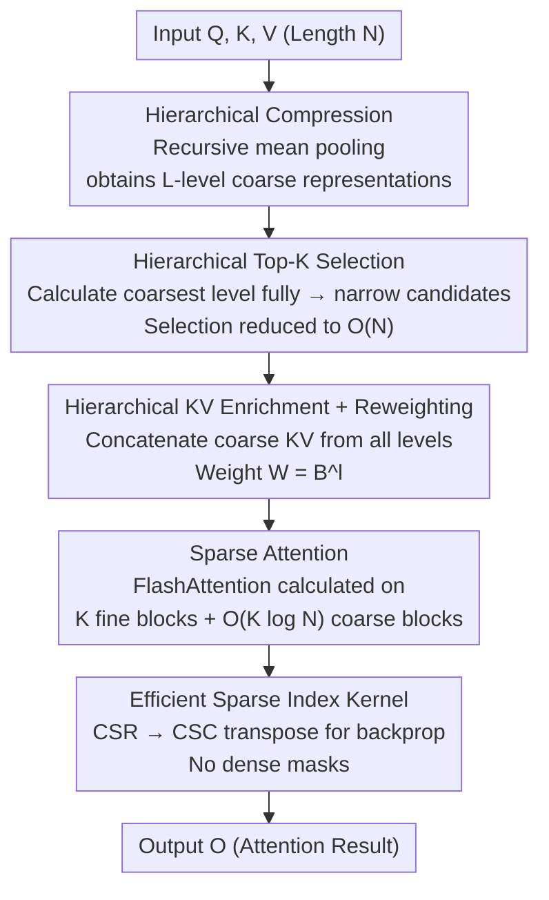

# Trainable Log-linear Sparse Attention for Efficient Diffusion Transformers

**Conference**: CVPR 2026  
**Paper**: [CVF Open Access](https://openaccess.thecvf.com/content/CVPR2026/html/Zhou_Trainable_Log-linear_Sparse_Attention_for_Efficient_Diffusion_Transformers_CVPR_2026_paper.html)  
**Area**: Model Compression / Efficient Attention / Diffusion Transformers  
**Keywords**: Sparse Attention, Diffusion Transformer, Log-linear Complexity, Long Sequences, GPU Kernels

## TL;DR
LLSA extends the "single-level coarse selection" of Top-K sparse attention into a "multi-level coarse-to-fine" hierarchical structure, reducing the complexity of both the block selection and attention phases from $O(N^2)$ to log-linear. Combined with a sparse indexing backpropagation kernel that avoids constructing dense masks, it achieves a 28.27× inference speedup and 6.09× training speedup on 256×256 pixel DiTs without degrading generation quality.

## Background & Motivation
**Background**: Diffusion Transformers (DiTs) are the primary backbones for current visual generation, but their full self-attention scales with $O(N^2)$ relative to the token length $N$. As resolution increases (e.g., FLUX with 4096 tokens, or video DiTs with hundreds of thousands), attention becomes the absolute bottleneck. A mainstream acceleration approach is **Top-K sparse attention**: first compress tokens in each block into coarse tokens, calculate similarities between these coarse tokens, and select only the K most relevant key blocks for each query block to perform actual attention.

**Limitations of Prior Work**: Existing methods (such as VSA and SLA) suffer from two inherent flaws. First, **the block selection phase still exhibits quadratic complexity**. Since there remain $T=N/B$ coarse tokens after compression, calculating pairwise similarities yields $O(T^2)=O(N^2/B^2)$. For long sequences, this $O(N^2)$ term outweighs the linear term of the actual attention, dragging the overall complexity back to quadratic. Second, **K must increase as sequences lengthen** to maintain quality, further pushing up overhead.

**Key Challenge**: The root cause lies in the **single-level design**, which uses only a fixed-granularity coarse view to summarize the global structure. As sequences lengthen, a single coarse granularity becomes insufficient to represent the global context, leading to either more expensive selection ($O(N^2)$) or the need for progressively larger K values.

**Goal**: To decouple both the selection and attention phases from quadratic complexity while maintaining global context and generation quality even with small K. Additionally, to provide a GPU kernel that achieves the theoretical complexity (especially for backpropagation).

**Key Insight**: Instead of a single coarse view, $O(\log N)$ **hierarchically coarsening** levels are used to represent the global structure. This follows the theoretical observation established by works like H-Transformer and Multi-resolution Attention that dense attention matrices can be approximated by hierarchical coarse attention matrices. This paper engineers this observation for extremely long-sequence DiT training.

**Core Idea**: Utilize "hierarchical coarse-to-fine Top-K selection" to reduce selection to $O(N)$, and use "hierarchical KV enrichment + reweighting" to recover global information lost to sparsification via coarse tokens from various levels. This maintains quality with small K. The mechanism is implemented with a pure sparse-indexed kernel (no mask construction), ensuring both forward and backward passes are log-linear.

## Method

### Overall Architecture
LLSA aims to reduce the $O(N^2)$ complexity of Top-K sparse attention to $O(N \log N)$. It follows the three-step skeleton of Top-K sparse attention—**compression → Top-K selection → sparse attention**—but "hierarchicalizes" every step. Compression evolves from a single layer to $L = \lfloor \log_B N - 1 \rfloor$ layers of recursive mean pooling. Selection changes from "choosing once at a coarse layer" to "starting from the coarsest layer and progressively narrowing the candidate range using indices selected in the previous level." In the attention phase, beyond the finest tokens, selected coarse KV tokens from all levels are concatenated (KV Enrichment) and weighted by block size (KV Reweighting) to compensate for global information loss. Finally, the algorithm is supported by a GPU kernel that operates directly on sparse indices for both forward and backward passes, avoiding $T \times T$ dense masks.

### Key Designs

**1. Hierarchical Top-K Selection: Reducing Selection to $O(N)$**

The primary bottleneck is that single-level Top-K calculates pairwise similarities between $T=N/B$ coarse tokens, yielding $O(T^2d) + O(T^2K) = O(N^2B^{-2}(d+K))$, which dominates the algorithm for long sequences. LLSA performs **hierarchical compression**: $Q, K, V$ are the finest level $Q^{(0)}$, recursively downsampled by mean pooling with block size $B$. A coarse token at level $l$ summarizes $B$ tokens from level $l-1$, resulting in a pyramid $Q^{(l)}, K^{(l)}, V^{(l)} \in \mathbb{R}^{N/B^l \times d}$. Selection proceeds **from the coarsest to the finest level**: at the coarsest level $L$, all pairwise similarities $S^{(L)} = Q^{(L)}K^{(L)\top}$ are calculated to find the Top-K. These K selected indices mean that for each query block in the next level, only $KB$ key candidates remain. From then on, each level only calculates similarities and performs sparse Top-K within the $KB$ candidates selected by the previous level.

This reduces complexity to linear because level $l$ only requires score calculations between $N/B^{l+1}$ query blocks and $KB$ candidates. The sum across levels is a geometric series:

$$\sum_{l=0}^{L-1} O\!\left(\frac{N}{B^{l+1}}KB\right) = O\!\left(NK\sum_{l=0}^{L-1}B^{-l}\right) = O(NK),$$

The series $\sum B^{-l} < \frac{B}{B-1}$ converges to a constant independent of $N, K$. This shifts the selection phase from quadratic to linear—the fundamental difference between LLSA and single-level Top-K methods.

**2. Hierarchical KV Enrichment: Maintaining Global Context with Small K**

Selecting only K fine blocks for attention discards significant global information, forcing prior methods to use large K at high costs. LLSA instead **concatenates the coarse $K^{(l)}_i, V^{(l)}_i$ tokens selected at each level during Step 1 into the key/value set for each query block**, attending to them alongside the finest $K^{(0)}, V^{(0)}$. Coarse tokens carry multi-granularity global context, filling the information gap caused by sparsification. Since there are $O(\log N)$ levels and each level adds $O(K)$ coarse tokens, the total enrichment is only $O(K \log N)$, keeping attention complexity at $O(NK \log N)$. A hyperparameter $L_e$ controls the number of enriched levels ($L_e=L$ by default).

This is critical for performance: experiments show LLSA with $K=8$ **outperforms** the baseline with $K=32$ in both quality and efficiency, as it captures global context via coarse tokens rather than brute-force K. The total complexity is $O(NK \log N)$.

**3. KV Reweighting: Fair Representation for Coarse Tokens**

KV Enrichment has a risk: a coarse token summarizes $B^l$ fine tokens, but in softmax attention, it receives the same weight as a single fine token, leading to an undervaluation of information. The authors assume the fine tokens corresponding to a coarse token can be roughly recovered via nearest-neighbor upsampling. Therefore, each token's importance should be proportional to the block size it represents. Specifically, $K^{(l)}, V^{(l)}$ are multiplied by a weight $W^{(l)} = B^l$. This step adds zero training overhead but significantly boosts quality—in ablation studies, Top-K + KV Enrichment achieved a 26.09 FID, which dropped to 24.18 with reweighting, **surpassing even full attention (24.91)**.

**4. Sparse Index Backprop Kernel without Dense Masks: Realizing Log-linear Speedup**

To ensure theoretical complexity translates to actual speed, a specialized **backpropagation** kernel is required. While the forward pass is query-major (replacing dense iterations in FlashAttention with sparse gathers), backpropagation for keys/values is key-major, requiring an inverse index of "which query blocks selected each key." Prior methods (SLA/VSA) maintained a $T \times T$ sparse mask, dragging complexity back to $O(T^2)$.

LLSA utilizes a **CSR → CSC sparse matrix transposition** strategy (Alg. 2): query indices for each key are compressed into a variable-length flat vector $I_q \in \mathbb{R}^{TK}$, with cumulative offsets $C \in \mathbb{R}^{T+1}$ marking start/end positions for each key. This involves two scans—first counting selections per key to determine $C$, then writing inverse mappings into $I_q$. Because K is small, atomic collision probabilities are negligible. With the key-major $(I_q, C)$, KV gradients are accumulated via Sparse-Dense Matrix Multiplication (SpMM) without constructing masks. In benchmarks, this backprop kernel maintains **near-constant throughput** across varying sequence lengths.

### Loss & Training
LLSA, being an attention mechanism, adopts standard diffusion/flow-matching objectives without additional losses. To apply it to 2D pixel DiTs (no patching, no VAE), three engineering items were added: **Index Reordering** (grouping spatially adjacent pixels into continuous tokens using $2^i$ patch sizes for effective 1D pooling); **Noise Rescaling** (compensating for higher resolution SNR needs by introducing $s=n/64$ in flow-matching $x_t=(1-t)x_0+s \cdot t\epsilon$); and **Low-resolution Pre-training**.

## Key Experimental Results

### Main Results
Evaluated on FFHQ 128×128 / 256×256 using a DiT-S backbone, compared against trainable Top-K sparse attentions VSA and SLA. Baselines were given larger K (K=20 for 128, K=32 for 256), while LLSA used K=8 for a conservative evaluation. Throughput is $10^3$ pixel tokens/sec on an H200.

| Dataset | Method | FID↓ | Training Throughput↑ |
| :--- | :--- | :--- | :--- |
| FFHQ-128 | Full Attention | 24.91 | 188.88 |
| FFHQ-128 | VSA | 26.91 | 421.02 |
| FFHQ-128 | SLA | 25.73 | 365.48 |
| FFHQ-128 | **LLSA** | **24.37** | **436.40** |
| FFHQ-256 | Full Attention | 38.77 | 61.64 |
| FFHQ-256 | VSA | 40.69 | 341.94 |
| FFHQ-256 | SLA | 39.98 | 304.85 |
| FFHQ-256 | **LLSA** | **39.29** | **375.34** |

On ImageNet-256 using the PixelFlow multi-stage pixel diffusion model (replacing full attention only in the highest resolution stage) for 10 epochs:

| Method | FID↓ | Inception Score↑ | Throughput (img/s)↑ |
| :--- | :--- | :--- | :--- |
| VSA | 23.59 | 64.07 | 32.30 |
| SLA | 22.58 | 65.31 | 29.81 |
| **LLSA** | **20.41** | **73.21** | **34.16** |

LLSA achieved the best FID and highest throughput across both benchmarks, even with the disadvantageous smaller K setting.

### Ablation Study
DiT-S + 128×128 FFHQ, default K=8, B=16, 20 epochs.

| Configuration | FID↓ | Throughput↑ | Explanation |
| :--- | :--- | :--- | :--- |
| Full Attention | 24.91 | 188.88 | Reference |
| Top-K (L=1) | 28.21 | 483.91 | Pure single-layer sparse; significant quality drop |
| + KV Enrichment (Le=1) | 26.09 | 302.92 | Global context added; FID recovers |
| + KV Reweighting | 24.18 | 302.92 | Outperforms full attention |
| Top-K (L=2) | 27.98 | 500.38 | Multi-level; throughput increases |
| + KV Enrichment (Le=2) | 25.31 | 436.40 | — |
| + KV Reweighting | 24.37 | 436.40 | Final multi-level configuration |

| Experiment Group | Key Comparison | Conclusion |
| :--- | :--- | :--- |
| Block Size | B=16 vs. B=64 | Large B has higher throughput but much lower quality; B=16 is used as selection overhead is already reduced. |
| Top-K Size | LLSA(K=8) vs. Baselines | LLSA K=8 (FID 24.37) outperforms baseline K=32 (25.88). |

### Key Findings
- **KV Enrichment + Reweighting is key to quality recovery**: Pure Top-K FID was 28.21, which improved to 26.09 with enrichment and 24.18 with reweighting, eventually surpassing full attention.
- **Small K is sufficient due to hierarchy**: Hierarchical KV enrichment allows K=8 to outperform single-layer baselines with K=32.
- **Efficiency gains scale with length**: At long sequences, the hierarchical L=2 configuration avoids quadratic costs; the backprop kernel throughput remains stable.
- **Overall Speedup**: Achieves 28.27× inference speedup and 6.09× training speedup for DiT (256×256, 65,536 tokens).

## Highlights & Insights
- **Engineering theoretical hierarchical approximation for long-sequence DiTs**: While Multi-resolution Attention proposed hierarchical Top-K theoretically, LLSA provides a high-performance GPU implementation for trainable block-sparse attention.
- **Simultaneous complexity reduction for both selection and attention**: Unlike works that only linearize attention but ignore $O(N^2)$ selection, LLSA addresses both to ensure true log-linear scaling.
- **Zero-cost KV Reweighting**: Simply weighting coarse tokens by $W=B^l$ pushed quality beyond full attention, a trick transferable to any sparse attention using pooled tokens.
- **CSR → CSC Sparse Index Backprop**: This avoids the $O(N^2)$ dense mask bottleneck, decoupling throughput from sequence length—a generic solution for accelerating trainable sparse attention.

## Limitations & Future Work
- **Validated primarily on pixel-space image generation** (FFHQ, ImageNet-256); more evidence is needed for video or latent-space models (FLUX, Wan). 
- **Reliance on spatial locality**: Hierarchical compression assumes pooling groups similar tokens. While reordering handles 2D images, 3D video or irregular modalities might require redesigned grouping.
- **Hyperparameter sensitivity**: Configuration of L, $L_e$, K, B, and noise rescaling $s$ depends on tuning for different resolutions.
- The assumption that "coarse token ≈ nearest-neighbor upsampling" may be inaccurate in high-frequency detail regions.

## Related Work & Insights
- **vs. VSA / SLA**: These are single-layer block selection methods. LLSA outperforms them by making the selection phase $O(N)$ and using KV enrichment to maintain quality with fewer tokens, while avoiding additional attention branches.
- **vs. Multi-resolution Attention**: Shares the hierarchical Top-K concept but provides the necessary high-performance block-sparse implementation for modern DiT training.
- **vs. Static Log-linear Attention (H-Transformer, etc.)**: These use predefined spatial masks; LLSA is **dynamic and content-aware**, better suited for the shifting attention patterns in diffusion models.

## Rating
- Novelty: ⭐⭐⭐⭐ Engineers hierarchical approximation into a trainable, long-sequence implementation; identifies and solves the "selection phase bottleneck."
- Experimental Thoroughness: ⭐⭐⭐⭐ Good ablation studies across attention types and block sizes, though limited to image generation.
- Writing Quality: ⭐⭐⭐⭐ Clear complexity derivations, pseudocode, and kernel details.
- Value: ⭐⭐⭐⭐ The log-linear backprop kernel is a highly practical component for accelerating long-sequence DiT training.

<!-- RELATED:START -->

## Related Papers

- [\[ICLR 2026\] SLA: Beyond Sparsity in Diffusion Transformers via Fine-Tunable Sparse–Linear Attention](../../ICLR2026/model_compression/sla_beyond_sparsity_in_diffusion_transformers_via_fine-tunable_sparselinear_atte.md)
- [\[CVPR 2026\] BinaryAttention: One-Bit QK-Attention for Vision and Diffusion Transformers](binaryattention_one-bit_qk-attention_for_vision_and_diffusion_transformers.md)
- [\[ICLR 2026\] FASA: Frequency-Aware Sparse Attention](../../ICLR2026/model_compression/fasa_frequency-aware_sparse_attention.md)
- [\[ICML 2026\] Token Sparse Attention: Efficient Long-Context Inference with Interleaved Token Selection](../../ICML2026/model_compression/token_sparse_attention_efficient_long-context_inference_with_interleaved_token_s.md)
- [\[CVPR 2026\] Otil: Accelerating Diffusion Model Inference via Communication-Efficient Multi-GPU Parallelism](otil_accelerating_diffusion_model_inference_via_communication-efficient_multi-gp.md)

<!-- RELATED:END -->
