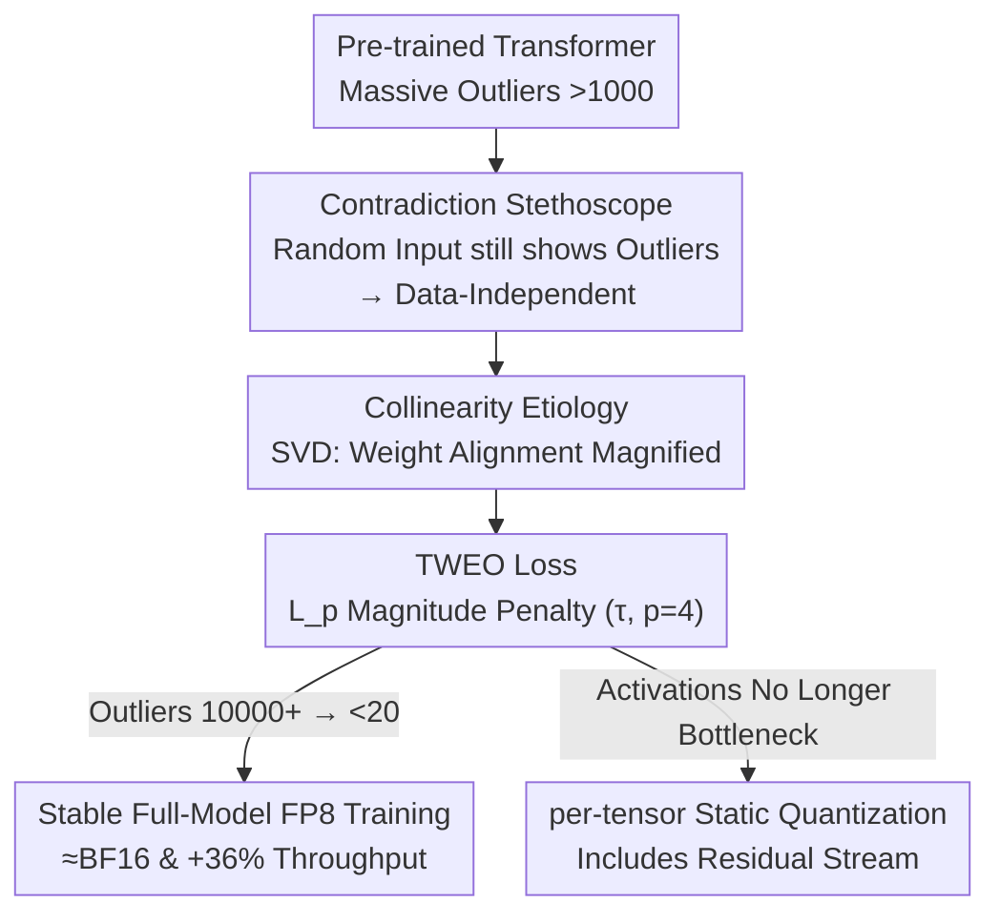

# TWEO: Transformers Without Extreme Outliers Enables FP8 Training And Quantization For Dummies

**Conference**: CVPR 2026  
**Paper**: [CVF Open Access](https://openaccess.thecvf.com/content/CVPR2026/html/Liang_TWEO_Transformers_Without_Extreme_Outliers_Enables_FP8_Training_And_Quantization_CVPR_2026_paper.html)  
**Code**: TBD  
**Area**: Model Compression  
**Keywords**: FP8 Training, Activation Outliers, Static Quantization, Regularization Loss, Transformer

## TL;DR
This paper proposes TWEO, a "non-intrusive" method that reduces extreme activation outliers in Transformers from 10,000+ to below 20 using a single regularization loss term. By utilizing counterfactual experiments and SVD analysis, it proves that extreme outliers are "mechanical artifacts" of weight collinearity rather than being data-driven. Consequently, an $L_p$ loss is designed to directly penalize activation magnitudes, enabling full-model FP8 pre-training (without complex mixed-precision engineering or architectural changes) to converge stably at BF16 levels with a 36% throughput increase, while making simple per-tensor static quantization (including residual streams) feasible for the first time.

## Background & Motivation

**Background**: Modern chips natively support FP8 (8-bit floating point) computation. Combined with libraries like Transformer Engine, this theoretically doubles training throughput and significantly reduces memory bandwidth requirements. However, reaping these benefits requires activation values to fit within the narrow dynamic range of FP8 (E4M3 is only $\pm 448$).

**Limitations of Prior Work**: In practice, Transformer training produces "massive outliers" (magnitudes $>1000$, sometimes exceeding 10,000), which exceed the FP8 range. This causes two issues: (1) In native low-bit training, outliers cause numerical overflow, leading to loss spikes and training collapse. (2) In post-training quantization (PTQ), outliers force a wide quantization range, creating a poor trade-off between clipping and rounding errors—experiments show that zeroing just 0.1% of outliers can increase validation perplexity by 600–1000%. Existing solutions either keep sensitive modules (embedding, norm, MoE gate) in BF16 using complex mixed-precision engineering (as in DeepSeek-V3) or modify architecture (adding register tokens, changing softmax, or modifying activation functions). These are either engineering-intensive or intrusive and lack generality.

**Key Challenge**: All existing solutions are built on the consensus assumption that extreme outliers are data-driven and unavoidable (stemming from token frequency, special tokens, or no-op attention). If they are "unavoidable," the only option is to "bypass" them. This paper questions that premise: if outliers are not caused by data, the "bypass" paradigm is fundamentally misdirected.

**Key Insight**: The authors conducted a counterfactual test—if inputs are replaced with completely random tokens/pixels (removing all semantics, frequency, and spatial structure), do outliers persist? The result: pre-trained models produce extreme outliers ($>1000$) even with random inputs, while randomly initialized models fed with real data keep activation magnitudes below 10. This indicates the root of outliers lies in the **trained weights**, not the input semantics. The presence of outliers in ViTs, which lack high-frequency special tokens, further supports this.

**Core Idea**: Since outliers are "mechanical artifacts" of weight structure (collinearity), the solution should be "mechanical." Instead of modifying the architecture, a loss term is used during training to directly penalize excessive activation magnitudes, effectively preventing the formation of outliers at the root. This is TWEO (Transformers Without Extreme Outliers).

## Method

### Overall Architecture

The logic of TWEO follows a chain: "prove the cause, cure the root, and reap the benefits." First, a **Contradiction Stethoscope** is used for counterfactual experiments to prove outliers are data-independent. Second, **SVD Collinearity Analysis** identifies the mechanical cause (alignment of weight singular vectors with inputs). Third, a **TWEO Loss** is designed as a regularization term to penalize activation magnitudes of Transformer block outputs. The resulting "outlier-free model" provides two downstream benefits: **Stable Full-Model FP8 Training** and **Feasible Per-Tensor Static Quantization** (including residual streams).

The method requires no architectural changes or additional modules, allowing it to be integrated into any Transformer variant across vision and language modalities.

### Key Designs

**1. Contradiction Stethoscope: Falsifying "Data-Driven Outliers"**

Existing methods assume outliers are caused by input data (token frequency, etc.). The Contradiction Stethoscope uses a falsification test (Assumption 1): replace inputs with random samples (e.g., uniform sampling from the vocabulary for LLMs, uniform pixels for ViTs). If outliers remain at similar scales, data attributes are not necessary for their generation.

Experiments (e.g., Qwen2.5-0.5B) show: (1) Pre-trained model + real data $\rightarrow$ outliers $>1000$; (2) Random model + real data $\rightarrow$ magnitudes $<10$; (3) Pre-trained model + random input $\rightarrow$ outliers $>1000$. Conclusion: outliers are tied to **trained weights**, not input semantics (Assumption 2).

**2. Collinearity Etiology: SVD Reveals Multiplicative Amplification**

The authors focus on the MLP layer. Approximating an MLP as $y = BAx$ (ignoring the activation function), they analyze when $y_k$ becomes an outlier. Performing SVD on the up-projection matrix $A = \sum_{i} s_i u_i v_i^T$:

$$y_k = w^T A x = \sum_{i=1}^{d_1} s_i (w^T u_i)(v_i^T x)$$

where $w^T$ is the $k$-th row of the down-projection matrix $B$. Outliers occur when the row vector $w$ of $B$ aligns with a left singular vector $u_i$ of $A$ (making $w^T u_i$ large) and the input $x$ aligns with the corresponding right singular vector $v_i$ (making $v_i^T x$ large). The product magnifies $y_k$ into an extreme outlier.

**3. TWEO Loss: Soft Thresholds and High Powers for Accurate Suppression**

TWEO adds a regularization term to the task loss: $\mathcal{L}_{\text{total}} = \mathcal{L}_{\text{task}} + \lambda(t)\,\mathcal{L}_{\text{TWEO}}$. It monitors the final output activation $A^{(l)}$ of each block $y = x + \text{MLP}(\text{LN}(x))$:

$$\mathcal{L}_{\text{TWEO}} = \frac{1}{L}\sum_{l=1}^{L}\mathbb{E}\left[\left(\frac{|A^{(l)}|}{\tau+\epsilon}\right)^p\right]$$

where $\tau > 0$ is a soft threshold (default $2-5$) and $p=4$ is the power. The high power $p=4$ creates a non-linear division of labor: when $|A| = 0.5\tau$, the penalty is negligible ($(0.5)^4 = 0.0625$); when $|A| = 10\tau$, the penalty is massive ($(10)^4 = 10,000$). TWEO precisely suppresses the extreme tail of the distribution without affecting normal activations.

**4. Quantizable Residual Streams**

By eliminating outliers at the root, TWEO enables simple AbsMax symmetric static quantization ($s = \max(|X|) + \epsilon, X_q = \text{round}(X/s \cdot Q_b)$). Crucially, this allows for **quantizing the residual stream** itself. Baseline models collapse when the residual stream is quantized (PPL jumps from 14.81 to 1876.70), whereas TWEO models maintain stable PPL (13.06/12.63).

## Key Experimental Results

### Main Results

On vision tasks (ImageNet, Swin/ViT), TWEO suppresses peak outliers by two orders of magnitude with negligible accuracy loss:

| Model | Arch Change? | Top-1 (%) | Peak Outlier (Training) | Outlier (Post-training) |
|------|---------|-----------|----------------|--------------|
| Swin-T Baseline | - | 81.2 | 1556 | 534 |
| Swin-T TWEO | No | 81.4 | **22** | **15** |
| ViT-B Baseline | - | 81.3 | 1579 | 106 |
| ViT-B TWEO | No | 81.3 | **38** | **16** |

For LLMs, standard FP8 training collapses, while TWEO converges stably at all scales:

| Model | Params | PPL (FP8) | PPL (BF16) | Peak Outlier |
|------|------|-----------|------------|----------------|
| GPT2 Baseline | 124M | 169.81 | 20.04 | 823 |
| GPT2 +TWEO | 124M | **19.26** | 18.68 | **17** |
| GPT2-xl Baseline | 1.5B | 93.28 | 13.84 | 32889 |
| GPT2-xl +TWEO | 1.5B | **12.58** | 12.39 | **19** |

### Ablation Study

8-bit AbsMax PTQ results (T=per-tensor, C=per-channel, K=per-token):

| Model | Method | W8(T)A8(T) | W8(C)A8(K) |
|------|------|------------|------------|
| GPT-2 XL (1.5B) | Default | 1872.83 (Collapse) | 14.81 |
| GPT-2 XL (1.5B) | TWEO | **13.09** | 12.63 |

### Key Findings

- **Peak Outliers govern Stability**: Reducing peak magnitudes to $\le 20$ directly correlates with FP8 training stability.
- **Activation vs. Weight Quantization**: In TWEO models, per-token activation quantization A8(K) performs better than per-channel weight quantization W8(C).
- **Redundancy of Complex Methods**: On TWEO models, SmoothQuant provides almost no additional gain over simple AbsMax, making complex "difficulty transfer" methods unnecessary.

## Highlights & Insights

- **Reframing the Problem**: Instead of finding better ways to "bypass" outliers, TWEO proves they can be eliminated at the source.
- **Closed-loop Logic**: The Contradiction Stethoscope (data-independence) + SVD analysis (mechanical cause) + $L_p$ loss (targeted cure) form a robust logical chain.
- **Unlocking Residual Stream Quantization**: Converting the residual stream to a quantizable format eliminates the need for BF16 $\leftrightarrow$ int8 conversions, directly benefiting low-latency inference.

## Limitations & Future Work

- **Scale**: Validated up to 7B parameters; performance on 700B+ models is unconfirmed.
- **From-scratch Focus**: primarily tested for training from scratch; "post-hoc" outlier removal via fine-tuning is listed as future work.
- **Simplified SVD**: The analysis ignores non-linear activation functions, though the authors argue this does not invalidate the "root cause" conclusion.

## Related Work & Insights

- **vs. DeepSeek-V3**: DeepSeek-V3 uses complex mixed-precision for sensitive layers and fine-grained tile-wise quantization. TWEO enables full Linear + LayerNorm blocks to be FP8 using simple delayed scaling.
- **vs. Architecture Modification**: TWEO is non-intrusive and cross-modal, unlike methods that add register tokens or modify softmax.
- **vs. PTQ Difficulty Transfer (SmoothQuant, etc.)**: These methods transfer difficulty from activations to weights. TWEO removes the difficulty entirely, making simple per-tensor quantization sufficient.

## Rating
- Novelty: ⭐⭐⭐⭐⭐ 
- Experimental Thoroughness: ⭐⭐⭐⭐ 
- Writing Quality: ⭐⭐⭐⭐⭐ 
- Value: ⭐⭐⭐⭐⭐ 

<!-- RELATED:START -->

## Related Papers

- [\[CVPR 2026\] LS-ViT: Least-Squares Hessian Based Block Reconstruction for Low-Bit Post-Training Quantization of Vision Transformers](ls-vit_least-squares_hessian_based_block_reconstruction_for_low-bit_post-trainin.md)
- [\[CVPR 2025\] Q-DiT: Accurate Post-Training Quantization for Diffusion Transformers](../../CVPR2025/model_compression/q-dit_accurate_post-training_quantization_for_diffusion_transformers.md)
- [\[CVPR 2026\] BinaryAttention: One-Bit QK-Attention for Vision and Diffusion Transformers](binaryattention_one-bit_qk-attention_for_vision_and_diffusion_transformers.md)
- [\[CVPR 2026\] ResCa: Residual Caching for Diffusion Transformers Acceleration](resca_residual_caching_for_diffusion_transformers_acceleration.md)
- [\[CVPR 2026\] Saliency-Driven Token Merging for Vision Transformers](saliency-driven_token_merging_for_vision_transformers.md)

<!-- RELATED:END -->
