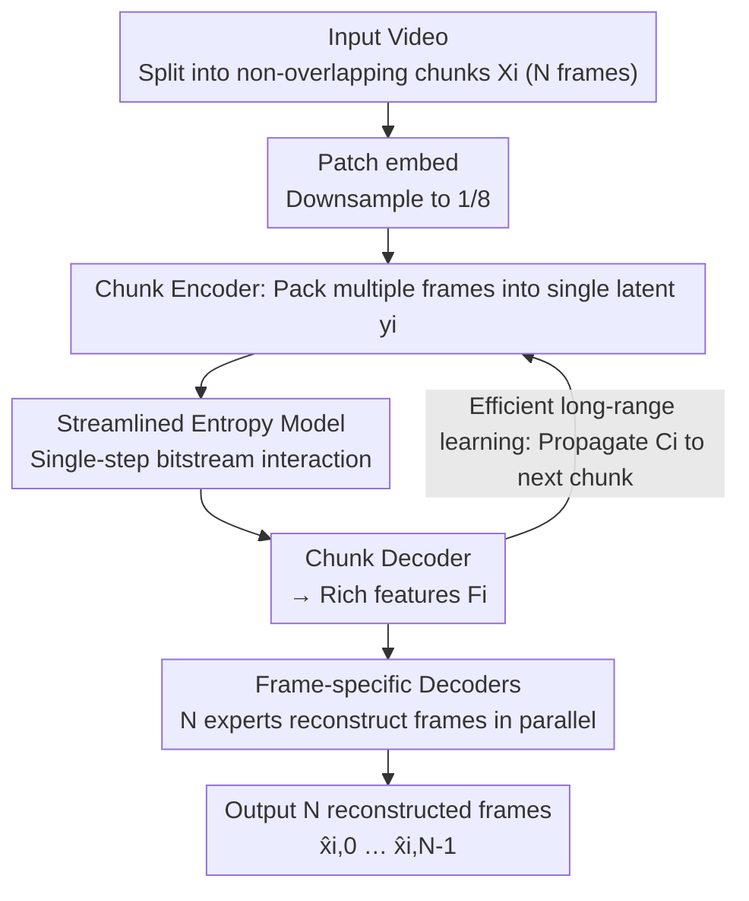

# Ultra-Fast Neural Video Compression

**Conference**: CVPR 2026  
**arXiv**: [2606.04410](https://arxiv.org/abs/2606.04410)  
**Code**: https://github.com/microsoft/DCVC (Available)  
**Area**: Model Compression / Neural Video Coding  
**Keywords**: Neural video coding, chunk coding, frame-specific decoder, entropy coding acceleration, rate-distortion-complexity trade-off

## TL;DR
This paper proposes DCVC-UF, which introduces a "chunk coding" paradigm that encodes multiple frames into a single compact latent and decodes them back in parallel. By completely removing frame-by-frame motion estimation and utilizing frame-specific decoders and single-step entropy decoding, it achieves 371 encoding / 274 decoding FPS at 1080p on a 4090 GPU, while saving 42.2% bitrate compared to VTM(LD), advancing the SOTA in the rate-distortion-complexity trade-off for neural video coding.

## Background & Motivation
**Background**: Neural video codecs (NVC) have achieved compression rates surpassing traditional standards like H.266/VTM. The DCVC series, which implicitly models inter-frame temporal correlation through feature propagation in latent space, has become the SOTA. To match the 33.8% bitrate gain of hierarchical-B coding in traditional codecs, recent NVCs have also adopted bidirectional reference hierarchical structures.

**Limitations of Prior Work**: Although these methods achieve high compression rates, their **computational and engineering complexities are too high for rapid deployment**. They still rely on **frame-by-frame** processing: each frame must be aligned with reference frames using explicit motion vectors (MV). Motion vectors can only describe pixel displacement between two frames and fail to capture long-range correlation across multiple frames; MVs must be recomputed whenever the reference frame changes; MVs fail during complex motion or new content, consuming extra bitrate and maximizing system complexity (memory I/O, function calls, CPU-GPU synchronization). Another direction, such as INR or Gaussian Splatting-based online overfitting, offers fast decoding but requires optimizing for each video individually, resulting in encoding FPS as low as $10^{-3}$.

**Key Challenge**: The frame-by-frame and explicit motion paradigm tightly couples "compression rate" with "actual throughput." High compression requires complex motion modules, but the resulting operator count, memory movement, and synchronization overheads are precisely the bottlenecks for actual speed. Furthermore, frame-by-frame latent representation causes training costs for long videos to expand linearly with the number of frames, limiting the exploitation of long-range temporal information.

**Goal**: Remove explicit motion and process multiple frames in parallel chunks to (1) significantly increase codec throughput, (2) model long-range temporal information more efficiently, and (3) simplify the bitstream interaction in entropy coding.

**Key Insight**: The authors draw inspiration from "spatial-temporal autoencoders" in video generation—compressing raw pixels into compact latents—and combine this with the motion-vector-free approach of DCVC-RT. Early spatial-temporal autoencoder-based NVCs only learned correlations within a single chunk while ignoring inter-chunk correlations, leading to limited compression rates. This work aims to recover long-range inter-chunk temporal information while maintaining parallelism.

**Core Idea**: Replace frame-by-frame coding with **chunk coding**—packaging $N$ consecutive frames into a single compact latent for joint encoding and parallel decoding. Temporal correlation is implicitly learned via inter-frame interaction modules, reconstructions are handled by frame-specific decoders, and bitstream interaction for entropy decoding is compressed into a single step.

## Method

### Overall Architecture
DCVC-UF is built upon the DCVC series. Its core is partitioning the video into **non-overlapping chunks**, each containing $N$ frames. For a chunk $X_i=\{x_{i,0},\dots,x_{i,N-1}\}$: it is first downsampled to 1/8 resolution via patch embedding, then fed into a chunk encoder conditioned on the **temporal chunk context** $C_i$. The encoder distills the spatial-temporal information into a single compact latent $y_i$. After quantization to $\hat{y}_i$, the entropy model converts it into a bitstream. Decoding reverses this: $\hat{y}_i$ is parsed from the bitstream and fed into a chunk decoder to obtain rich features $F_i$. $F_i$ is then used by $N$ **frame-specific decoders** to reconstruct each frame $\{\hat{x}_{i,0},\dots,\hat{x}_{i,N-1}\}$ in parallel. Simultaneously, $F_i$ is **propagated to the next chunk** as the new temporal context $C_{i+1}$, enabling long-range temporal transfer across chunks. Parallel processing within the chunk is the source of high throughput. This inherits the "motion-free" advantage of DCVC-RT and amplifies it into "high throughput."

The chunk size is adjustable: $N=8$ provides High-Throughput (HT) mode (with intra-chunk latency similar to hierarchical-B); $N=1$ degrades to single-frame chunks, equivalent to Low-Latency (LD) mode.

### Key Designs

**1. Chunk Coding: Packaging multiple frames into a single latent to remove frame-by-frame motion**

To address the slow and complex "frame-by-frame + explicit motion" paradigm, this work encodes $N$ consecutive frames into **one** compact latent $y_i$ and decodes them all simultaneously. This step directly eliminates the repetitive motion estimation, motion entropy coding, and motion compensation between frame pairs used in DCVC-RT, along with their associated memory I/O and function call overheads—the primary bottlenecks for real-world speed. Spatial-temporal correlations within the chunk are implicitly modeled by **inter-frame interaction modules** (instead of MVs describing only two frames), allowing the model to automatically learn more flexible multi-frame correlations. Ablations show that introducing chunk coding alone (without frame-specific decoders) increases decoding from 105.3 FPS to 349.1 FPS.

**2. Frame-specific Decoders: An "expert" for each temporal position**

If a single uniform decoder were used to reconstruct all frames in a chunk, it would act as a "jack-of-all-trades," struggling to reconstruct the 0th and 7th frames simultaneously despite large content differences. This work **assigns a specific decoder to each frame index** within the chunk. The chunk decoder first produces rich features $F_i$ containing all spatial-temporal information, then $N$ decoders work in parallel, each responsible only for its corresponding frame position. This design is conceptually similar to a Mixture-of-Experts—each decoder is a "specialist" for its temporal position. Benefits include: (1) each decoder only learns patterns relevant to its position, simplifying optimization; (2) it fits the parallel chunk processing naturally; (3) parameter utilization is more efficient, focusing capacity on position-specific difficulties. Ablations show that adding frame-specific decoders on top of chunk coding recovers the bitrate saving from 10.1% to 25.3% while maintaining 343.2 FPS.

**3. Streamlined Entropy Model: Decoupling scale and mean for single-step bitstream interaction**

Previous quadtree partition entropy coding split latents into four partitions, where decoding each partition depended on decoded partitions to estimate distribution parameters (mean $\mu$, scale $\sigma$), requiring **four steps** of repeated bitstream interaction: multiple arithmetic decoding calls, memory I/O, and expensive sync between arithmetic decoding and neural inference. The key insight here is: **arithmetic coding only depends on scale**. The encoder quantizes $\hat{r}_i=\text{round}(y_i-\mu_i)$ and uses $\sigma_i$ for arithmetic coding; the decoder uses only $\sigma_i$ to recover $\hat{r}_i$, finally calculating $\hat{y}_i=\hat{r}_i+\mu_i$. The mean $\mu$ is merely a post-hoc shift of the distribution center and is independent of the bitstream interaction. Consequently, mean and scale estimation are **decoupled**: the parameter estimation network takes $s_i$ (derived from hyper-prior $\hat{z}_i$ and context $C_i$) as input and predicts $\mu_i^0$ for the first partition and **all scales $\sigma_i$ for all four partitions** in a single forward pass. Since decoding only needs the scale, arithmetic decoding for all four partitions can be merged into a **single step**. The mean still uses four-step progressive estimation to maintain spatial-channel correlation modeling, but it does not touch the bitstream and runs entirely on the GPU without synchronization. This streamlined model pushes decoding from 343.2 to 453.3 FPS.

**4. Efficient Long-range Temporal Learning: Single latent enables long video training**

DCVC-FM demonstrated that increasing training sequences from 7 to 32 frames significantly improves compression. However, in frame-by-frame methods, each frame needs an independent latent, causing training memory/compute costs to explode with frame count. Chunk coding compresses $N$ frames into one latent, **vastly reducing the total latent volume per video**. With a batch size of 1 at $512\times512$ resolution, a 24GB GPU can train on up to 1024 frames. Longer training contexts benefit both chunk latent generation and entropy distribution estimation—the model learns repeating textures, scene structures, and motion laws across multiple chunks. Propagated $C_i$ carries key information forward. Ablations show that extending training sequences to 128 frames increases bitrate savings from 23.4% to 31.6% without affecting decoding FPS.

### Loss & Training
Two network scales are provided: DCVC-UF (HT-S/HT-L). HT uses a chunk size $N=8$, while LD uses $N=1$. Training follows DCVC-FM: initial training on 7-frame Vimeo-90k, followed by fine-tuning on longer sequences generated from raw Vimeo videos. Although chunk coding theoretically supports $512\times512$ training with 1024 frames, current fine-tuning uses 128-frame sequences due to the difficulty of collecting enough high-quality long videos. Speed measurements use serial chunk-by-chunk encoding; cross-chunk pipeline parallelism (overlapping inference and entropy coding) is not yet enabled, suggesting further speedup potential.

## Key Experimental Results

### Main Results
BD-Rate (%) is measured against VTM-17.0 (LD) as the anchor, using YUV420, full frames, and PSNR evaluation. Negative values indicate bitrate savings. Speed is measured on a 1080p 4090 GPU using real bitstream I/O.

| Method | Avg BD-Rate | Enc FPS | Dec FPS | Latency Category |
|------|------|------|------|------|
| VTM-17.0 (LD) | 0.0 (Anchor) | 0.01 | 23.6 | LD |
| DCVC-RT | −21.0 | 118.8 | 105.3 | LD |
| **DCVC-UF (LD)** | −9.5 | **313.6** | **353.8** | LD |
| VTM-17.0 (Hier-B) | −33.8 | 0.01 | 23.1 | Relaxed |
| **DCVC-UF (HT-S)** | −31.6 | **655.9** | **453.3** | Relaxed |
| **DCVC-UF (HT-L)** | **−42.2** | **371.1** | **273.6** | Relaxed |

Key points: HT-L saves 42.2% bitrate on average, surpassing VTM(Hier-B)'s 33.8%, with a maximum latency of only 7 frames (chunk=8), far less than VTM's 31 frames. If VTM(Hier-B) is restricted to GOP=8, its savings drop to 23.7%, highlighting the efficiency of chunk coding. The LD version is faster than DCVC-RT by over $3\times$, though with lower compression.

### Complexity & Scalability
MACs measured at 1080p with VTM-17.0 (LD) as the anchor:

| Model | Avg BD-Rate | MACs/Frame | Params |
|------|------|------|------|
| DCVC-FM | −21.3% | 2642G | 18.3M |
| DCVC-RT | −21.0% | 385G | 20.7M |
| DCVC-UF (LD) | −9.5% | 170G | 9.7M |
| DCVC-UF (HT-S) | −31.6% | 211G | 81.2M |
| DCVC-UF (HT-L) | −42.2% | 343G | 120.5M |

HT-S achieves 31.6% savings with only 211G MACs/frame, much lower than DCVC-FM's 2642G. Scalability across GPU generations is strong: DCVC-UF (HT-S) reaches **1415.1 Enc / 945.8 Dec FPS** at 1080p on a B200, setting a new NVC speed record. Performance scales automatically from 2080Ti to B200 without specialized engineering.

### Ablation Study
Baseline is DCVC-RT, cumulative rows lead to DCVC-UF (HT-S), 4090 GPU:

| ID | Configuration | BD-Rate | Dec FPS |
|------|------|------|------|
| A | DCVC-RT (Baseline) | −21.0% | 105.3 |
| B | A + Chunk Coding (No frame-specific dec) | −10.1% | 349.1 |
| C | B + Frame-specific Decoders | −25.3% | 343.2 |
| D | C + Streamlined Entropy Model | −23.4% | 453.3 |
| E | D + 128-frame Training → HT-S | −31.6% | 453.3 |

### Key Findings
- **Chunk coding is the speed engine**: Row B increases decoding from 105.3 to 349.1 FPS (~3.3×), but using a unified decoder causes the rate to regress from −21.0% to −10.1%, proving that one decoder for all temporal positions is costly.
- **Frame-specific decoders recover compression**: Row C improves BD-Rate from −10.1% to −25.3% with negligible speed loss (343.2 FPS), proving vital for the chunk paradigm.
- **Streamlined entropy model provides pure speed**: Row D pushes decoding to 453.3 FPS with minor BD-Rate change (−23.4%), validating the single-step interaction strategy.
- **Long video training is a "free" compression boost**: Row E jumps from 23.4% to 31.6% savings just by training on 128-frame sequences with no impact on FPS, verifying chunk coding's ability to learn long-range temporal features.

## Highlights & Insights
- **The observation that "bitstream only depends on scale" is clever**: Since the mean only shifts the distribution center and can be applied after decoding, estimating all scales at once allows merging four arithmetic decoding steps into one. This leverages a simple probabilistic fact for tangible speedup—a trick transferable to any Gaussian entropy model.
- **Latency as a "tunable knob"**: The same framework switches between low-latency ($N=1$) and high-throughput ($N=8$) via chunk size, allowing one model to cover both RTC and offline storage scenarios.
- **Frame-specific decoders as temporal MoE**: Splitting one general decoder into specialists for each temporal position is the precise antidote to the compression loss of the chunk paradigm, keeping parameters focused where they matter most.
- **Single latent unlocks long video training**: By reducing the latent footprint, sequences can be extended from dozens to thousands of frames, activating long-range temporal information as a low-cost source of compression gain.

## Limitations & Future Work
- **Fixed chunk size**: As acknowledged by the authors, this might not be optimal for videos with varying temporal characteristics; future work could explore content-adaptive chunking.
- **Long video data bottleneck**: While the framework supports 1024-frame training, lack of high-quality long video datasets limited current fine-tuning to 128 frames.
- **No cross-chunk pipeline parallelism**: Speed is measured serially. Overlapping inference and entropy coding across chunks could make it even faster than the reported conservative FPS.
- **High-quality range regression**: At >40 dB, it is still surpassed by VTM(Hier-B). While this range is beyond human perception, it remains a gap for extreme offline quality requirements.
- **HT mode introduces latency**: $N=8$ adds up to 7 frames of latency, forcing real-time low-latency scenarios to use the LD version, which has significantly lower compression (−9.5% vs −21.0%).

## Related Work & Insights
- **vs. DCVC-RT/FM**: These used frame-by-frame latent propagation; RT removed explicit motion. UF upgrades this to "chunk parallel + single latent," resulting in massive throughput gains (RT 105 FPS → UF 273~453 FPS) and better compression (−42.2% vs −21%).
- **vs. Hierarchical-B NVCs**: Conventional NVCs mimic traditional B-frame structures with explicit MVs, which increases overhead. UF uses implicit chunk-based learning to remove motion, achieving lower latency (7 vs 31 frames) and higher efficiency.
- **vs. INR / Gaussian Splatting**: Those require slow per-video optimization ($10^{-3}$ encoding FPS). UF is fast for both and requires no per-video optimization.
- **vs. Early Spatial-Temporal Autoencoders**: Previous works ignored inter-chunk correlations. UF incorporates inter-frame interaction, frame-specific decoders, and cross-chunk condition propagation ($C_i$) to recover efficiency.

## Rating
- Novelty: ⭐⭐⭐⭐ Chunk coding paradigm + scale/mean decoupled single-step entropy decoding is a clear and effective shift.
- Experimental Thoroughness: ⭐⭐⭐⭐⭐ 6 datasets, 5 GPU generations, 4 resolutions, and exhaustive ablation across rate-distortion-complexity.
- Writing Quality: ⭐⭐⭐⭐⭐ Clear motivation, tight alignment with figures, and insightful technical derivations.
- Value: ⭐⭐⭐⭐⭐ Pushing NVC to hundreds of FPS at 1080p (and thousands on B200) is a critical step toward real-world deployment. Code is open-sourced.

<!-- RELATED:START -->

## Related Papers

- [\[CVPR 2026\] Perceptual Neural Video Compression with Color Separation and Rank Chain](perceptual_neural_video_compression_with_color_separation_and_rank_chain.md)
- [\[CVPR 2026\] Content-Adaptive Hierarchical Hyperprior for Neural Video Coding](content-adaptive_hierarchical_hyperprior_for_neural_video_coding.md)
- [\[CVPR 2026\] Real-Time Neural Video Compression with Unified Intra and Inter Coding](real-time_neural_video_compression_with_unified_intra_and_inter_coding.md)
- [\[CVPR 2026\] Ultra-Low Bitrate Perceptual Image Compression with Shallow Encoder](ultra-low_bitrate_perceptual_image_compression_with_shallow_encoder.md)
- [\[CVPR 2025\] Towards Practical Real-Time Neural Video Compression](../../CVPR2025/model_compression/towards_practical_real-time_neural_video_compression.md)

<!-- RELATED:END -->
