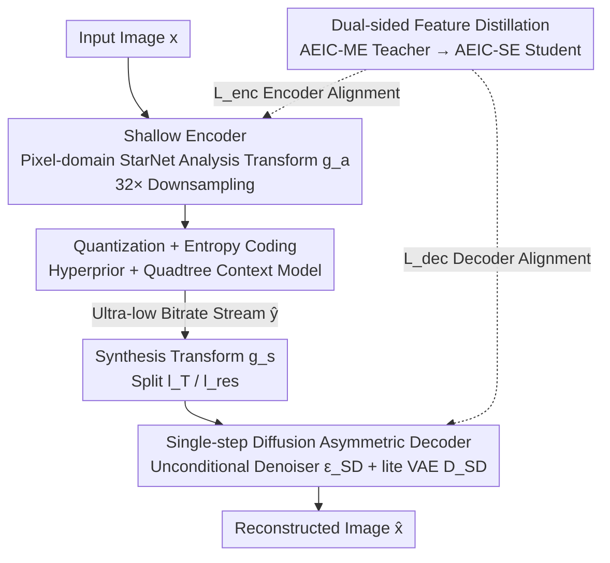

# Ultra-Low Bitrate Perceptual Image Compression with Shallow Encoder

**Conference**: CVPR 2026  
**Paper**: [CVF Open Access](https://openaccess.thecvf.com/content/CVPR2026/html/Zhang_Ultra-Low_Bitrate_Perceptual_Image_Compression_with_Shallow_Encoder_CVPR_2026_paper.html)  
**Code**: https://github.com/LuizScarlet/AEIC  
**Area**: Model Compression / Image Compression  
**Keywords**: Ultra-low bitrate compression, Shallow encoder, Single-step diffusion decoding, Feature distillation, Asymmetric encoding-decoding

## TL;DR
This paper proposes AEIC, an asymmetric extreme image compression framework. It theoretically demonstrates that "at ultra-low bitrates (<0.05 bpp), latent variable variance is naturally small, making heavy encoders unnecessary." Consequently, the encoding side is implemented as a shallow pixel-domain convolutional network with only 0.94M parameters, while all generative capacity is offloaded to a single-step diffusion decoder. Using dual-sided feature distillation to transfer knowledge from a moderate encoder to the shallow encoder, the method achieves 35.8 FPS real-time encoding on 1080P images—approximately 19x faster than similar extreme compression methods—while leading in perceptual metrics (LPIPS/DISTS/FID/KID).

## Background & Motivation

**Background**: Ultra-low bitrate image compression (bits per pixel bpp < 0.05) targets scenarios with highly constrained bandwidth and transmitter computing power, such as edge devices and IoT terminals. At such bitrates, pixel-level fidelity is impossible. Prevailing learned methods abandon pixel-domain reconstruction and instead map images into a generative latent space—typically using a pre-trained Stable Diffusion VAE or 1-D tokenizer/VQ-VAE as the encoder, followed by a secondary latent encoder for transform coding and entropy modeling, paired with powerful diffusion/Transformer decoders to push perceptual quality.

**Limitations of Prior Work**: This paradigm is too computationally heavy on the encoding side. A pre-trained generative encoder (often >40M parameters) plus a secondary latent encoder creates a "multi-encoder" structure with massive compute and memory overhead. The problem is that ultra-low bitrate scenarios typically involve "weak transmitters and strong receivers" (e.g., mobile uploads to the cloud). Encoding speed and model size are the true bottlenecks, yet existing methods place the heaviest computation at the encoder, making deployment on weak devices unrealistic.

**Key Challenge**: The research community assumes that "to obtain a compact representation aligned with human perception in latent space, a large encoder is mandatory." However, transmitter power budgets do not align with this heavy encoder assumption. In other words, the cost of perceptual quality has been improperly allocated to the encoding side.

**Goal**: Split the problem into two sub-questions: (1) Is a heavy encoder actually necessary at ultra-low bitrates? (2) If a shallow encoder can be used, how can its lost expressive power be compensated to prevent reconstruction collapse?

**Key Insight**: The authors start with the relationship between bitrate and latent variance. The intuition is: the lower the bitrate, the less information needs to be encoded, and the narrower the range of latent values becomes. Encoding this compact information does not require a deep network. This observation fundamentally challenges the necessity of "heavy encoders."

**Core Idea**: Replace the "symmetric heavy encoder" with an "asymmetric" structure. The encoder uses a shallow convolutional network directly in the pixel domain for analysis transformation, while the decoder uses single-step diffusion to handle all generative responsibilities. Dual-sided distillation is used to pour knowledge from a moderate encoder into the shallow encoder to bridge the capacity gap.

## Method

### Overall Architecture

The core of AEIC (Asymmetric Extreme Image Compression) is the complete asymmetry of compute: the encoder is as light as possible (shallow StarNet convolutional network, direct pixel-domain to latent), while the decoder offloads generative quality to single-step diffusion. Given an input image $x$, the shallow analysis transform $g_a$ compresses it into compact latents $y$ with 32× spatial downsampling; $y$ is quantized to $\hat{y}$, and Gaussian entropy parameters $(\mu,\sigma)$ are estimated via a "hyperprior + quadtree-partitioned context model" followed by arithmetic coding. The decoder first uses a synthesis transform $g_s$ to recover and split two sets of latents, which are reconstructed into $\hat{x}$ via a single-step denoiser $\epsilon_{SD}$ and a lightweight VAE decoder $\mathcal{D}_{SD}$.

The pipeline can be expressed as:

$$y = g_a(x), \quad \hat{y} = \text{quantize}[y-\mu]+\mu$$
$$l_T, l_{res} = \text{split}[g_s(\hat{y})], \quad l_0 = \epsilon_{SD}(l_T), \quad \hat{x} = \mathcal{D}_{SD}(l_0 + l_{res})$$

The framework has two variants differing only in the encoder: AEIC-ME (moderate encoder, 3.09M) and AEIC-SE (shallow encoder, 0.94M), obtained by adjusting StarBlock layers and channel dimensions at each downsampling stage and entropy model depth/width (see table). The decoders are shared. AEIC-SE is the primary target for weak devices, while AEIC-ME serves as the distillation teacher.

| Variant | $g_a$ Depth | $g_a$ Stage Dimensions | Entropy Model Depth/Dim | Encoding Params |
|------|-----------|----------------|----------------|---------|
| AEIC-ME (Teacher) | 2 | (64,128,192,256,320) | 4 / 960 | 3.09M |
| AEIC-SE (Student) | 1 | (32,64,128,192,256) | 3 / 512 | 0.94M |

### Key Designs

**1. Shallow Encoder: Proving deep encoders are unnecessary via rate-variance analysis**

This design directly addresses the "heavy encoder" pain point and provides theoretical support. In the discrete case, a codebook $\mathcal{C}=\{c_1,\dots,c_M\}$ of size $M$ represents a maximum bitrate $R=\log_2 M$; if exhaustive search encoding is used, the complexity is $O(M)=O(2^R)$. Thus, as the bitrate $R$ decreases, the search space and encoding complexity decrease **exponentially**. Generalizing to the continuous case: for a Gaussian latent $z\sim\mathcal{N}(\mu,\sigma^2)$, differential entropy $h(z)=\frac{1}{2}\log(2\pi e\sigma^2)$. The entropy (bitrate) **depends only on the variance** $\sigma^2$. Therefore, ultra-low bitrates imply very small latent variance and a narrowed value range, equivalent to a discrete codebook with fewer elements. Since the information to be encoded is naturally compact, a deep and expensive encoder is unnecessary.

Based on this, the authors built the analysis transform $g_a$ using StarNet (StarBlock) in the pixel domain to learn the mapping from "pixels to ultra-low bitrate latents" directly. Experiments show that the latent variance ranges produced by AEIC-ME/SE fall in the same interval as StableCodec and DLF, but with encoding MACs/pixel reduced by one to two orders of magnitude.

**2. Single-step Diffusion Asymmetric Decoder: Offloading generation to the decoder while maintaining speed**

The shallow encoder loses representation capacity, which must be recovered by the decoder. However, if the decoder is slow, the system remains impractical. The authors fine-tuned SD-Turbo via LoRA into a **single-step** decoder with two key optimizations. First, the diffuser is made unconditional: transmitting text prompts in image compression consumes extra bitrate, and research shows prompts contribute little compared to information already in the latent code. Thus, the text encoder, timestep embeddings, and all cross-attention layers in the SD-Turbo denoiser are removed, simplifying the single-step de-noising from $l_0=[l_T-\sqrt{1-\bar\alpha_T}\cdot\epsilon_{SD}(l_T,c,T)]/\sqrt{\bar\alpha_T}$ to $l_0=\epsilon_{SD}(l_T)$. Second, a dual-branch decoder is used: the synthesis transform $g_s$ output is split into $l_T$ (texture generation) and $l_{res}$ (structural residual). $l_T$ passes through the denoiser and is element-wise added to $l_{res}$ before entering the VAE decoder. Finally, as the VAE decoder is the bottleneck for latency, the original SD-Turbo VAE channels are pruned by 50% to create a lite version.

**3. Dual-sided Feature Distillation: Transferring knowledge to both student ends**

The shallow encoder has limited capacity, and training AEIC-SE from scratch leads to significant degradation (LPIPS BD-rate +8.47%, DISTS +23.75%). AEIC-ME acts as a teacher for "dual-sided" distillation. The encoder distillation term $\mathcal{L}_{enc}$ aligns four intermediate latents—$g_a$ output $y$, hyper-analysis $h_a$ output $z$, hyper-synthesis $h_s$ output $\phi$, and quantized $\hat{y}$. A one-layer learnable projection $f(\cdot)$ aligns feature dimensions:

$$\mathcal{L}_{enc} = \|y^{tea}-f(y^{stu})\|_2^2 + \|z^{tea}-f(z^{stu})\|_2^2 + \|\phi^{tea}-f(\phi^{stu})\|_2^2 + \|\hat{y}^{tea}-f(\hat{y}^{stu})\|_2^2$$

The decoder distillation term $\mathcal{L}_{dec}$ aligns the dual-branch latents $l_T$, $l_{res}$, the denoised result $l_0$, and intermediate features $h_n$ from $\epsilon_{SD}$ blocks:

$$\mathcal{L}_{dec} = \|l_T^{tea}-f(l_T^{stu})\|_2^2 + \|l_{res}^{tea}-f(l_{res}^{stu})\|_2^2 + \|l_0^{tea}-f(l_0^{stu})\|_2^2 + \sum_n \|h_n^{tea}-f(h_n^{stu})\|_2^2$$

### Loss & Training

The objective is the standard rate-distortion target $\lambda R(\hat y,\hat z)+D(x,\hat x)$, where $D=\gamma_1\|x-\hat x\|_2^2+\gamma_2 L_p(x,\hat x)+\gamma_3 L_s(x,\hat x)$ includes reconstruction, perceptual (LPIPS), and semantic (DISTS) losses. Training is progressive:

- **Teacher AEIC-ME**: Stage 1 uses a relaxed bitrate constraint $\lambda_{S1}$ (~0.05 bpp) for stable training. Stage 2 uses a larger $\lambda_{S2}$ (0.005–0.035 bpp) with adversarial loss $L_{adv}$ and edge-aware DISTS for ultra-low bitrate supervision.
- **Implicit Rate Pruning**: Converging first at a relaxed bitrate (Stage 1) then sharply increasing the constraint in Stage 2 allows the encoder to explore rich transforms before adapting to extreme bitrates.
- **Student AEIC-SE**: Stage 1 adds $\beta_1 L_{enc}$ to help the shallow encoder, and Stage 2 adds $\beta_2 L_{dec}$ to guide decoder convergence ($\{\beta_1,\beta_2\}=\{0.5,0.001\}$).
- **High-Resolution Fine-tuning (HRF)**: AEIC-SE is fine-tuned (Stage 3) on 1024×1024 patches for 5K iterations to improve generalization on 1080P/2K images.

## Key Experimental Results

### Main Results: Encoding Complexity and Latency

| Method | Type | Encoding Params(M) | Enc MACs(K)/px | 1080P Enc Latency(RTX 4090D) | Enc FPS |
|------|------|-----------|----------------|--------------------------|---------|
| DLF | Ultra-low Br | 437.35 | 1915.35 | 508.1 ms | — |
| StableCodec | Ultra-low Br | 102.23 | 2537.51 | 538.4 ms | — |
| EVC-Small | Normal (Efficient) | 11.64 | 71.12 | 35.3 ms | — |
| AEIC-ME (Ours) | Ultra-low Br | 55.91 | 204.26 | 58.7 ms | 17.0 |
| **AEIC-SE (Ours)** | Ultra-low Br | **16.10** | **46.02** | **27.9 ms** | **35.8** |

AEIC-SE's encoding complexity is on par with the real-time normal bitrate codec EVC-Small but significantly lighter than all ultra-low bitrate peers. It achieves 35.8 FPS real-time encoding on 1080P, a speedup of 18.2× / 19.3× over DLF and StableCodec respectively. Both AEIC variants can process whole 1080P images on a GTX 1080Ti (11GB) without tiling. In rate-perceptual curves, AEIC leads significantly in all perceptual metrics while maintaining competitive distortion metrics.

### Ablation Study

**Spatial Compression Ratio (AEIC-ME, anchor=StableCodec, Kodak BD-rate ↓ lower is better)**

| Ratio | PSNR | MS-SSIM | LPIPS | DISTS |
|--------|------|---------|-------|-------|
| 64× | +14.30 | -4.54 | -6.97 | -6.95 |
| **32×** | -2.21 | -4.85 | **-13.67** | **-24.91** |
| 16× | -5.53 | -8.00 | -1.91 | -9.03 |

**Dual-sided Distillation (DIV2K 768×512, BD-rate ↓ lower is better, anchor=AEIC-ME)**

| Configuration | LPIPS | DISTS | FID |
|------|-------|-------|-----|
| AEIC-SE (No Distill) | +8.47 | +23.75 | +22.10 |
| + $\mathcal{L}_{enc}$ | +3.92 | +7.68 | +4.75 |
| + $\mathcal{L}_{enc}$ + $\mathcal{L}_{dec}$ | +0.60 | +2.55 | +2.98 |

### Key Findings
- **32× is the sweet spot for ultra-low bitrate**: 16× favors distortion at the cost of bitrate, while 64× loses too much spatial info; 32× balances rate/distortion/perception best.
- **Both distillation terms are essential**: Adding $\mathcal{L}_{enc}$ alone slashes DISTS BD-rate from +23.75% to +7.68% (the shallow encoder is the main bottleneck); $\mathcal{L}_{dec}$ then closes the remaining gap to under 3%.
- **HRF primarily saves 2K images**: On 768×512 patches, AEIC-SE is already close to AEIC-ME, but HRF provides significant gains (especially DISTS) at 2K resolution, compensating for the shallow encoder's generalization limits.

## Highlights & Insights
- **Theoretical Grounding**: Using the "Bitrate $\rightarrow$ Variance $\rightarrow$ Complexity" chain, the authors prove that heavy encoders are unnecessary at ultra-low bitrates, falsifying a common assumption in the field.
- **Asymmetric System Design**: By allocating expensive compute to the strong receiver rather than the weak transmitter, this provides a paradigm for any "unbalanced compute" scenario like cloud-edge collaborative inference.
- **Unconditional Diffusion Trick**: Pruning text encoders and cross-attentions saves bitrate and simplifies de-noising into a single forward pass, a useful technique for any compression task using pre-trained generative models.
- **Intermediate Feature Alignment**: Aligning $y, z, \phi, \hat{y}$ at the encoder and $l_T, l_{res}, l_0$ plus UNet blocks at the decoder with learnable projections is a robust way to bridge capacity gaps.

## Limitations & Future Work
- **Teacher Dependence**: AEIC-SE requires a pre-trained AEIC-ME for distillation. The training pipeline is long (multiple stages for both teacher and student).
- **Decoder is Still Heavy**: While the encoder is 16M parameters, the decoder remains a ~1B parameter diffusion+VAE model. The "lightness" applies only to the encoder.
- **Ultra-low Bitrate Specificity**: The theory holds only when bitrates are extremely low. At higher bitrates, the shallow encoder's capacity deficit would become a performance bottleneck again.
- **Future Work**: Exploring self-distillation or online distillation to bypass the teacher training stage, and lightweighting the decoder for a "weak-weak" end-to-end chain.

## Related Work & Insights
- **vs. StableCodec / DLF**: These use heavy pre-trained encoders + secondary latent encoders, resulting in >100M encoder parameters. AEIC uses a shallow pixel-domain encoder + single-step diffusion decoder, reducing parameters to 16M and speeding up by 19× with better perceptual quality.
- **vs. EVC**: EVC achieves 30 FPS through sparse architectures but focuses on normal bitrates and distortion preservation. AEIC brings real-time encoding to the ultra-low bitrate perceptual domain.
- **vs. PerCo / DiffEIC**: These use multi-step (20/50 steps) diffusion with massive latency (OOM on 1080P is common). AEIC uses single-step unconditional diffusion to make decoding feasible while retaining quality.

## Rating
- Novelty: ⭐⭐⭐⭐⭐ Proving deep encoders are unnecessary via rate-variance theory is a paradigm-shifting insight.
- Experimental Thoroughness: ⭐⭐⭐⭐ Coverage of three datasets and various metrics is strong, though cross-bitrate generalization could be more detailed.
- Writing Quality: ⭐⭐⭐⭐⭐ The logic from motivation to theory to method is clear and well-illustrated.
- Value: ⭐⭐⭐⭐⭐ First scheme to achieve SOTA perceptual quality and real-time encoding at ultra-low bitrates, with direct utility for edge/IoT devices.

<!-- RELATED:START -->

## Related Papers

- [\[CVPR 2026\] Ultra-Fast Neural Video Compression](ultra-fast_neural_video_compression.md)
- [\[CVPR 2026\] Distributed Image Compression with Multimodal Side Information at Extremely Low Bitrates](distributed_image_compression_with_multimodal_side_information_at_extremely_low_.md)
- [\[CVPR 2026\] Perceptual Neural Video Compression with Color Separation and Rank Chain](perceptual_neural_video_compression_with_color_separation_and_rank_chain.md)
- [\[CVPR 2026\] What Matters in Practical Learned Image Compression](what_matters_in_practical_learned_image_compression.md)
- [\[CVPR 2026\] CADC: Content Adaptive Diffusion-Based Generative Image Compression](cadc_content_adaptive_diffusion-based_generative_image_compression.md)

<!-- RELATED:END -->
