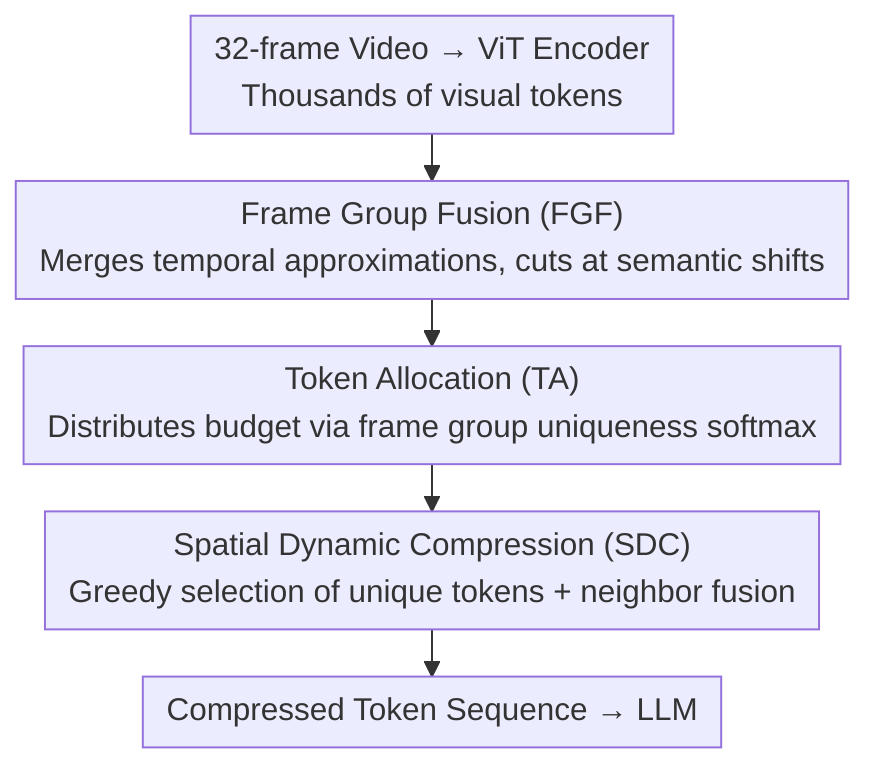

# UniComp: Rethinking Video Compression Through Informational Uniqueness

**Conference**: CVPR 2026  
**arXiv**: [2512.03575](https://arxiv.org/abs/2512.03575)  
**Code**: [TimeMarker-LLM/UniComp](https://github.com/TimeMarker-LLM/UniComp)  
**Area**: Model Compression  
**Keywords**: Visual token compression, informational uniqueness, video understanding, MLLM efficiency, plug-and-play

## TL;DR

Ours proposes UniComp, a video token compression framework based on informational uniqueness (rather than attention). By utilizing frame group fusion, token allocation, and spatial dynamic compression, it maximizes the preservation of unique information across temporal, spatial, and global dimensions. It outperforms uncompressed baselines even when retaining only 10% of tokens.

## Background & Motivation

**Background**: Multimodal Large Language Models (MLLMs) encounter significant computational bottlenecks when processing video, as a 32-frame video can generate thousands of visual tokens. Existing compression methods like VisionZip and HoliTom primarily rely on attention scores for importance evaluation and token selection.

**Limitations of Prior Work**: Attention-based methods face three issues: (1) Saliency bias leads to high redundancy among selected tokens; (2) They tend to overlook fine-grained details; (3) Information loss is severe under aggressive compression. Furthermore, FastVid and HoliTom require tuning over 5 hyperparameters, while DyCoke requires modifying internal LLM attention layers, hindering cross-architecture migration.

**Key Challenge**: High attention does not equate to informational uniqueness. Tokens with high attention may be highly similar; retaining them does not maximize information fidelity. The essence of compression should be to preserve irreplaceable information rather than the most salient information.

**Goal**: Under a limited computational budget, how to select the token subset that best represents the overall visual information, such that the information of discarded tokens can be reconstructed from the retained tokens.

**Key Insight**: From an information theory perspective, compression is modeled as minimizing conditional entropy $H(\mathcal{X}|\mathcal{S})$. This derives a theoretical connection between the reconstruction error upper bound and token uniqueness.

**Core Idea**: Replace attention scores with "informational uniqueness" measured by cosine distance as the token importance metric, combined with greedy selection and neighborhood fusion to achieve optimal information compression.

## Method

### Overall Architecture

UniComp aims to solve the problem where 32-frame videos generate thousands of visual tokens for MLLMs, necessitating significant reduction while avoiding the redundancy issues of traditional attention-based selection. The pipeline is placed after the ViT encoder and before the LLM, handling compression across temporal, global, and spatial levels: Frame Group Fusion (FGF) merges temporally redundant frames, Token Allocation (TA) distributes the token budget based on "group uniqueness," and Spatial Dynamic Compression (SDC) selects the most irreplaceable tokens within each frame and fuses their neighbors. The resulting compressed token sequence is fed directly to the LLM without modifying internal structures.

The unified metric across all modules is "informational uniqueness"—features that are more orthogonal (lower cosine similarity) are considered more unique. The theoretical starting point models compression as minimizing conditional entropy $H(\mathcal{X}|\mathcal{S})$. The retention set $\mathcal{S}$ must allow the information of discarded tokens to be reconstructed as accurately as possible. The reconstruction error upper bound is controlled by the "minimum uniqueness distance from each discarded token to the retention set," providing a theoretical basis for the greedy strategy of "selecting the most unique and fusing the most similar." The serial relationship of the modules is as follows:

### Key Designs

**1. Frame Group Fusion (FGF): Merging temporally redundant frames**

Videos contain many adjacent frames describing the same static scene. FGF performs average pooling on each frame to obtain a global descriptor and scans the sequence: if the uniqueness $u(f_t, f_r) < U_f$ (sufficiently similar) between the current frame and the group leader, it is merged. Once the threshold is exceeded, a new group is started. Each group is represented by a mean-pooled feature. This allows static shots to be compressed into a few groups while preserving fine-grained details at semantic shifts (cuts or actions).

**2. Token Allocation (TA): Distributing budget by group uniqueness**

After fusion, the total budget $\text{TOKEN}_{max}$ must be distributed. TA quantifies the uniqueness of each fused frame relative to others:

$$U_t = 1 - \frac{1}{K_f}\sum_s \cos(f_t, f_s)$$

$U_t$ is mean-normalized and multiplied by $\sqrt{K_f}$ to amplify inter-group differences. Finally, it is converted to a budget ratio via softmax:

$$K_t = \left\lfloor \frac{e^{U_t}}{\sum_s e^{U_s}} \cdot \text{TOKEN}_{max} \right\rfloor$$

Unique scenes critical for video understanding receive more tokens, while repetitive background frames receive fewer.

**3. Spatial Dynamic Compression (SDC): Selecting irreplaceable spatial tokens**

After receiving the token quota, SDC decides which spatial tokens to retain within a frame. It calculates an intra-frame uniqueness matrix and performs greedy selection: the most unique token is added to the retention set, and tokens with uniqueness distance $< U_c$ are marked as redundant and merged into the retained token. This process minimizes the reconstruction error upper bound:

$$\mathcal{E}(\mathcal{S}) \leq 2\sum_j \min_{i \in \mathcal{S}} u_{ij}$$

Selecting unique tokens and absorbing neighbors greedily lowers this bound, minimizing information loss.

### A Complete Example

> ⚠️ The following numbers are for illustrative purposes and not directly from the text.

Assume an input of 32 frames with 196 tokens per frame (6272 total), targeting 10% retention. FGF scans and finds the first 12 frames are static, merging them into 1 group, while the middle action segment is cut into 5 groups, and the end into 2 groups—32 frames contract to 8 fused frames. TA calculates uniqueness: action groups get high $U_t$ and are allocated hundreds of tokens, while the static opening gets fewer. SDC then picks the most unique tokens in each frame and fuses similar neighbors until the quota is filled. The 6272 tokens are reduced to ~600 for the LLM.

### Loss & Training

UniComp is a training-free, plug-and-play method with only 2 hyperparameters: the frame group fusion threshold $U_f$ and the spatial compression threshold $U_c$. Default values are transferable across ViT and LLM architectures. Uniqueness is computed using the Key features from the last layer of ViT attention.

## Key Experimental Results

### Main Results (32-frame input, LLaVA-OneVision-7B)

| Method | Retention Ratio | LongVideoBench | EgoSchema | MLVU | VideoMME | Average | Relative to Baseline |
|------|---------|---------------|-----------|------|---------|------|---------|
| Vanilla | 100% | 56.3 | 60.4 | 64.7 | 58.4 | 59.95 | 100% |
| VisionZip | 25% | 56.5 | 60.3 | 64.8 | 58.2 | 59.95 | 100% |
| HoliTom | 25% | 56.7 | 61.2 | 64.7 | 58.6 | 60.30 | 100.6% |
| **UniComp** | **25%** | **57.6** | **61.6** | **65.0** | **58.9** | **60.78** | **101.4%** |
| VisionZip | 10% | 49.3 | 58.0 | 59.7 | 53.4 | 55.10 | 91.9% |

### Ablation Study

| Configuration | LongVideoBench | VideoMME | Description |
|------|---------------|---------|------|
| Full UniComp | 57.6 | 58.9 | Complete model |
| w/o FGF | 56.8 | 58.2 | Removing FGF drops performance by 0.8 |
| w/o TA | 57.0 | 58.5 | Removing TA drops performance by 0.6 |
| w/o SDC fusion | 56.5 | 57.8 | Removing neighborhood fusion drops performance by 1.1 |

### Key Findings

- UniComp exceeds the uncompressed baseline (101.4%) at 25% retention, suggesting compression removes redundant information that interferes with the LLM.
- It maintains ~100% baseline performance at 10% retention, while VisionZip drops to 91.9%.
- The method is plug-and-play and effective across LLaVA-OV, LLaVA-Video, and Eagle2.5 architectures.

## Highlights & Insights

- **Informational Uniqueness vs. Attention**: The perspective shift is significant—high-attention tokens may be similar, while high-uniqueness tokens ensure diverse information coverage.
- **Theory-Practice Loop**: Deriving the connection between reconstruction error and uniqueness from conditional entropy minimization provides an elegant, theory-driven design.
- **Compression Outperforming Baseline**: This suggests that redundant visual tokens can act as noise, and selective filtering can be beneficial.

## Limitations & Future Work

- Uniqueness based on cosine distance might misjudge tokens with similar directions but different semantics.
- Sequential scanning in FGF may not handle flashbacks or non-linear narratives optimally.
- Only 2 hyperparameters might require fine-tuning in extreme scenarios.

## Related Work & Insights

- **vs. VisionZip**: VisionZip selects tokens by attention and drops to 91.9% at 10% retention; UniComp remains at ~100%, showing the advantage of uniqueness in extreme compression.
- **vs. HoliTom/DyCoke**: These require modifying internal LLM structures, whereas UniComp operates on ViT outputs, making it more universal.

## Rating

- Novelty: ⭐⭐⭐⭐⭐ Informational uniqueness perspective is a new theoretical contribution.
- Experimental Thoroughness: ⭐⭐⭐⭐ Extensive benchmarks and detailed ablations across multiple models.
- Writing Quality: ⭐⭐⭐⭐⭐ Clear theoretical derivation and compelling motivation.
- Value: ⭐⭐⭐⭐⭐ Plug-and-play capability combined with performance gains makes it highly practical.

<!-- RELATED:START -->

## Related Papers

- [\[CVPR 2026\] Ultra-Fast Neural Video Compression](ultra-fast_neural_video_compression.md)
- [\[CVPR 2026\] Generative Video Compression with One-Dimensional Latent Representation](generative_video_compression_with_one-dimensional_latent_representation.md)
- [\[CVPR 2026\] Perceptual Neural Video Compression with Color Separation and Rank Chain](perceptual_neural_video_compression_with_color_separation_and_rank_chain.md)
- [\[CVPR 2026\] Real-Time Neural Video Compression with Unified Intra and Inter Coding](real-time_neural_video_compression_with_unified_intra_and_inter_coding.md)
- [\[ICLR 2026\] Taming Momentum: Rethinking Optimizer States Through Low-Rank Approximation](../../ICLR2026/model_compression/taming_momentum_rethinking_optimizer_states_through_low-rank_approximation.md)

<!-- RELATED:END -->
