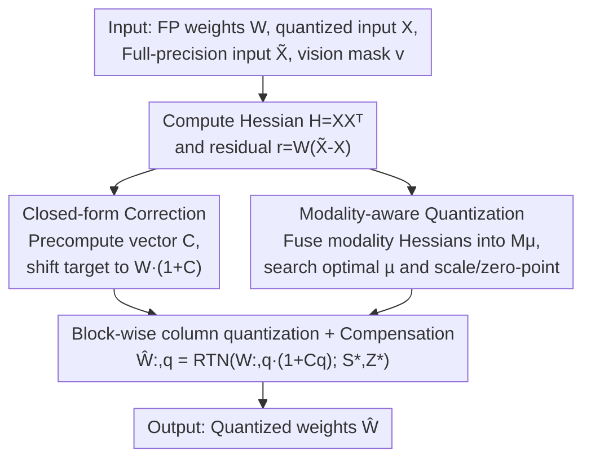

# VLM-PTQ: Efficient Post-Training Quantization for Large Vision-Language Models

**Conference**: CVPR 2026  
**Paper**: [CVF Open Access](https://openaccess.thecvf.com/content/CVPR2026/html/Deng_VLM-PTQ_Efficient_Post-Training_Quantization_for_Large_Vision-Language_Models_CVPR_2026_paper.html)  
**Code**: TBD  
**Area**: Model Compression  
**Keywords**: Post-Training Quantization, Vision-Language Models, Weight Compensation, Asymmetric Calibration, Modality-aware

## TL;DR
VLM-PTQ observes two overlooked issues when migrating weight compensation quantization methods like GPTQ/GPTAQ to Vision-Language Models: "round-to-nearest" is sub-optimal under asymmetric targets, and vision/text channels are treated indiscriminately. The paper uses a closed-form correction term to shift the quantization target to the true optimum and redistributes channel weights using a modality-aware importance vector. This significantly improves 3-bit/2-bit quantization accuracy across 1B~72B VLMs with negligible overhead.

## Background & Motivation
**Background**: Deploying large models is costly, making quantization the most practical compression method. Post-Training Quantization (PTQ) has become mainstream as it requires no retraining and only a single calibration on a frozen network. The "weight compensation" family is particularly effective: GPTQ uses Hessian information for column-wise weight quantization and compensates for errors in unquantized weights; GPTAQ further introduces **asymmetric calibration**, requiring the quantized layer to fit the "original full-precision input" $\tilde X$ rather than the "quantized previous-layer input" $X$, suppressing error accumulation across layers. These methods perform well on text-only LLMs.

**Limitations of Prior Work**: The authors find that **applying these methods to VLMs without modification reveals two issues**. First, under asymmetric targets, directly performing RTN (round-to-nearest) on full-precision weights at each step is **not the optimal solution**—the residual causes the true optimal quantization target to shift. Second, all input channels are **treated equally** when calculating quantization parameters. However, vision and text tokens in VLMs have vastly different statistical distributions and information densities. Since the Hessian is calculated across all tokens, the modality with higher statistics dominates the parameters, detrimental to critical channels of the other modality.

**Key Challenge**: The two core components of weight compensation quantization—the "quantization target point" and "channel importance"—were designed under the single-modality assumption of LLMs. In natively multi-modal VLMs with asymmetric residuals, these assumptions no longer hold.

**Goal**: Without changing the weight compensation framework or increasing retraining costs, the paper aims to (1) shift the quantization target to the true optimum under asymmetric targets and (2) allow channel importance to explicitly distinguish between vision and text modalities.

**Key Insight**: The authors solve for the continuous optimum analytically by differentiating the GPTAQ column-wise loss function and then determining the discrete lattice point. Simultaneously, they calculate separate Hessians for both modalities and fuse them into an importance vector with an adjustable coefficient.

**Core Idea**: By adding two small patches—a "closed-form correction term" and "modality-aware importance"—weight compensation quantization is recalibrated from being "designed for LLMs" to being "designed for VLMs," requiring only a few lines of code change with almost no extra overhead.

## Method

### Overall Architecture
VLM-PTQ does not start from scratch but embeds two patches into the layer-wise quantization loop of GPTAQ. For each linear layer, the inputs are full-precision weights $W$, quantized inputs $X$, full-precision inputs $\tilde X$, and a binary mask $v$ marking each token as vision or text; the output is the quantized weight $\hat W$. Procedurally: the whole-layer Hessian $H=XX^\top$ and residual information are calculated as in GPTAQ, with two additional steps—**pre-computing a per-channel closed-form correction vector $C$** (shifting the target from $W_{:,q}$ to $W_{:,q}\cdot(1+C_q)$) and **fusing per-modality Hessians into a modality-aware importance vector $M_\mu$** (used to search for better scale/zero-point parameters). Quantization then proceeds column-wise with error compensation, applying the correction and modality-aware parameters at each step.

### Key Designs

**1. Closed-form Correction: Shifting the target to the true optimum under asymmetric targets**

This addresses the first limitation: directly performing RTN on original weights under asymmetric calibration is sub-optimal. The authors substitute the GPTAQ compensation $\Delta w$ back into the Lagrangian to obtain the column-wise loss $L_q$. Besides the standard $(\hat w_q-w_q)^2/H^{-1}_{qq}$ term, it includes a cross-term coupled with the residual $r$. Differentiating with respect to $\hat w_q$ and setting it to zero yields a continuous optimum that is not $w_q$, but:

$$\hat w_q^{*} = w_q + r X^\top H^{-1}_{:,q}.$$

The optimal target includes a correction $\delta = r X^\top H^{-1}_{:,q}$. Completing the square for $L_q$ results in $\frac{1}{H^{-1}_{qq}}[\hat w_q-(w_q+\delta)]^2+\text{const}$. Thus, the discrete optimal solution is $\hat w_q^{\text{opt}}=\mathrm{RTN}(w_q+\delta)$. 

To compute this efficiently, the residual is decomposed as $r=W\Delta X$ (where $\Delta X=\tilde X-X$). Leveraging the independent structure of weight rows, the per-row correction simplifies to a scalar factor shared across rows, resulting in a pre-computed correction vector:

$$C = \mathrm{diag}(\Delta X X^\top H^{-T})\odot\mathrm{diag}(H^{-T}),$$

Finalizing the quantization as $\hat W_{:,q}=\mathrm{RTN}(W_{:,q}\cdot(1+C_q))$. Since $\Delta X X^\top$ is already computed in the residual decomposition, extracting diagonal elements is $O(n^2)$, adding almost no cost. It succeeds by **precisely compensating for the target shift caused by residuals**.

**2. Modality-aware Quantization: Distinguishing vision and text channel scales**

This addresses the second limitation: the disparity in information density between modalities in VLMs. Using the vision mask $v$, the input activations are split to compute separate Hessians: $H_v=X_{:,v}X_{:,v}^\top$ and $H_l=X_{:,\neg v}X_{:,\neg v}^\top$. Diagonal elements yield per-channel importance $H_v^{\text{diag}}$ and $H_l^{\text{diag}}$, fused via:

$$M_\mu = \mu\cdot H_v^{\text{diag}} + (1-\mu)\cdot H_l^{\text{diag}},$$

where $\mu\in[0,1]$ is a **layer-wise** "modality-aware coefficient." $M_\mu$ acts as the weight in the reconstruction objective for searching scale $S$ and zero-point $Z$: $S^*,Z^*=\arg\min_{S,Z}\sum_n \frac{M_\mu^n}{n}\lVert W_n-\mathrm{RTN}(W_n;S,Z)\rVert_2^2$. The coefficient $\mu$ is determined through a **lightweight grid search** on a small calibration batch that minimizes the reconstruction error $\lVert W\tilde X-\hat W_\mu X\rVert_2^2$.

### Loss & Training
The two patches are integrated into a per-layer quantization algorithm (Algorithm 1). First, whole-layer and per-modality Hessians are calculated, followed by inverse Cholesky decomposition. The correction vector $C$ and modality-aware vector $M_\mu$ are pre-computed, and $\mu^*, S^*, Z^*$ are searched. Finally, quantization proceeds block-by-block and column-by-column, using $\hat W_{:,j}=\mathrm{RTN}(W_{:,j}\cdot(1+C_j);S^*,Z^*)$ and compensating for errors $E_{:,j}=(W_{:,j}-\hat W_{:,j})/L_{jj}$. Calibration follows GPTAQ settings using 128 randomly sampled image-text pairs from an improved COCO Caption (ShareGPT4V).

## Key Experimental Results

Models include Qwen2.5-VL-3B/7B/72B-Instruct and InternVL3-1B/14B/38B-Instruct. Only the language model component of the VLM is quantized. Evaluation uses the LMMs-Eval framework across 8 benchmarks (ChartQA, DocVQA, MME-RealWorld EN/CN, OCRBench, ScienceQA, SeedBench 2 Plus, TextVQA).

### Main Results: Weight-only Quantization (W3/W2)

| Model | Setting | GPTQ | GPTAQ | Ours | FP16 |
|------|------|------|-------|-----------|------|
| Qwen2.5-VL-7B | 3bit Avg | 63.8 | 65.0 | **71.3** | 77.2 |
| Qwen2.5-VL-7B | 2bit Avg | 42.0 | 43.1 | **48.4** | 77.2 |
| InternVL3-14B | 3bit Avg | 67.0 | 69.7 | **76.0** | 78.2 |
| InternVL3-38B | 2bit Avg | 59.4 | 62.9 | **69.4** | 80.2 |
| Qwen2.5-VL-72B | 3bit Avg | 68.1 | 71.2 | **76.9** | 78.2 |

At 3-bit, Ours approaches FP16 performance: the 72B model retains 98.3% of FP16 performance. Gains are most significant in text-heavy tasks, e.g., 7B DocVQA increases from 87.6 to 92.3. At 2-bit, the advantage is clearer, with 7B MME-RealWorld CN rising from 5.3 to 20.3.

### Main Results: Weight + Activation Quantization (W2A8KV8)

| Model | GPTQ | GPTAQ | Ours | FP16 |
|------|------|-------|-----------|------|
| Qwen2.5-VL-7B | 38.0 | 39.3 | **44.6** | 77.2 |
| InternVL3-14B | 45.0 | 46.1 | **55.0** | 78.2 |
| InternVL3-38B | 54.2 | 57.3 | **64.1** | 80.2 |
| Qwen2.5-VL-72B | 52.9 | 55.9 | **63.2** | 78.2 |

Under combined quantization, Ours consistently outperforms GPTAQ by 5-9 percentage points. The 72B model retains 80.8% of FP16 performance even with 2-bit weights.

### Ablation Study (Qwen2.5-VL-7B, W3A16)

| Configuration | MME EN | Avg | VRAM | Time |
|------|-------|-----|------|------|
| GPTQ | 38.4 | 63.8 | 0.5GB | 748s |
| GPTAQ (Baseline) | 38.4 | 65.0 | 0.7GB | 921s |
| GPTAQ + C (Correction only) | 40.6 | 66.2 | 0.7GB | 955s |
| GPTAQ + M.5 (Fixed µ 0.5) | 49.2 | 69.8 | 0.7GB | 970s |
| GPTAQ + Mµ* (Adaptive µ) | 50.4 | 70.4 | 0.9GB | 1008s |
| Ours (C + Mµ*) | **51.3** | **71.3** | 0.9GB | 1020s |

### Key Findings
- **Complementary Components**: Adding correction C to GPTAQ yields +1.2 Gain with zero overhead; adding modality-aware vector M yields +5.4 Gain. Combined, they achieve +6.3 Gain, reaching 92.3% of FP16 performance.
- **Adaptive µ is Essential**: Fixing µ at 0.5 for all layers reaches 69.8, while layer-wise adaptive search reaches 70.4—indicating that different layers (e.g., q/k/v proj) have varying sensitivities to vision/text tokens.
- **Minimal Overhead**: Calibration time for the full method increases from 921s (GPTAQ) to 1020s (+99s), and VRAM increases from 0.7GB to 0.9GB (+0.2GB), offering high cost-performance for a 7.5 point accuracy gain over GPTQ.

## Highlights & Insights
- **Elegant Closed-form Solution**: By differentiating the loss for asymmetric targets, it proves RTN is sub-optimal and provides a pre-computable correction vector $C$ to move the target to the theoretical optimum.
- **Precise Diagnosis of Modal Imbalance**: It identifies the flaw in the "joint Hessian calculation" assumption and fixes it via modality-split Hessians and a per-layer µ.
- **Engineering Friendly**: Both patches integrate into existing GPTQ/GPTAQ loops with minimal code changes and reuse variables already computed in the pipeline.

## Limitations & Future Work
- **Language-only Quantization**: To ensure fair comparison, only the LLM backbone is quantized; the vision encoder and adapter remain FP16.
- **Grid Search for µ**: µ is determined via a grid search with ~6 candidates per layer. Search granularity and calibration sample representability might affect stability.
- **Modality Mask Dependency**: Requires explicit knowledge of which tokens are vision or text, which might not apply to architectures without clear boundaries.
- **No Inference Benchmark**: The paper reports quantization accuracy and calibration overhead but lacks end-to-end inference speed or real-world VRAM usage during deployment.

## Related Work & Insights
- **vs GPTQ**: GPTQ uses column-wise quantization with symmetric calibration. Ours inherits the block Cholesky process but shows that its RTN point is sub-optimal under asymmetric targets and lacks modality awareness.
- **vs GPTAQ**: GPTAQ is the direct baseline. Ours proves GPTAQ remains at a sub-optimal point due to RTN and is "modality-blind."
- **vs Distribution-shaping PTQ (SmoothQuant, Rotation, etc.)**: Those methods modify activation/weight statistics. Ours belongs to the complementary weight compensation family, and the modality-aware channel importance could theoretically be used alongside distribution-shaping methods.

## Rating
- Novelty: ⭐⭐⭐⭐ Solid insights on recalibrating weight compensation for VLMs, though built upon GPTAQ.
- Experimental Thoroughness: ⭐⭐⭐⭐⭐ Covers multiple families, broad scales, and 8 benchmarks with detailed ablations.
- Writing Quality: ⭐⭐⭐⭐ Clear derivations with visualization support.
- Value: ⭐⭐⭐⭐ High practical value for VLM deployment due to low overhead and significant accuracy gains.

<!-- RELATED:START -->

## Related Papers

- [\[CVPR 2026\] LS-ViT: Least-Squares Hessian Based Block Reconstruction for Low-Bit Post-Training Quantization of Vision Transformers](ls-vit_least-squares_hessian_based_block_reconstruction_for_low-bit_post-trainin.md)
- [\[AAAI 2026\] Post Training Quantization for Efficient Dataset Condensation](../../AAAI2026/model_compression/post_training_quantization_for_efficient_dataset_condensation.md)
- [\[CVPR 2026\] CAR-SAM: Cross-Attention Reconstruction for Post-Training Quantization of the Segment Anything Model](car-sam_cross-attention_reconstruction_for_post-training_quantization_of_the_seg.md)
- [\[CVPR 2026\] Rethinking Token Reduction for Large Vision-Language Models](rethinking_token_reduction_for_large_vision-language_models.md)
- [\[CVPR 2026\] Attention-aware Inference Optimizations for Large Vision-Language Models with Memory-efficient Decoding](attention-aware_inference_optimizations_for_large_vision-language_models_with_me.md)

<!-- RELATED:END -->
