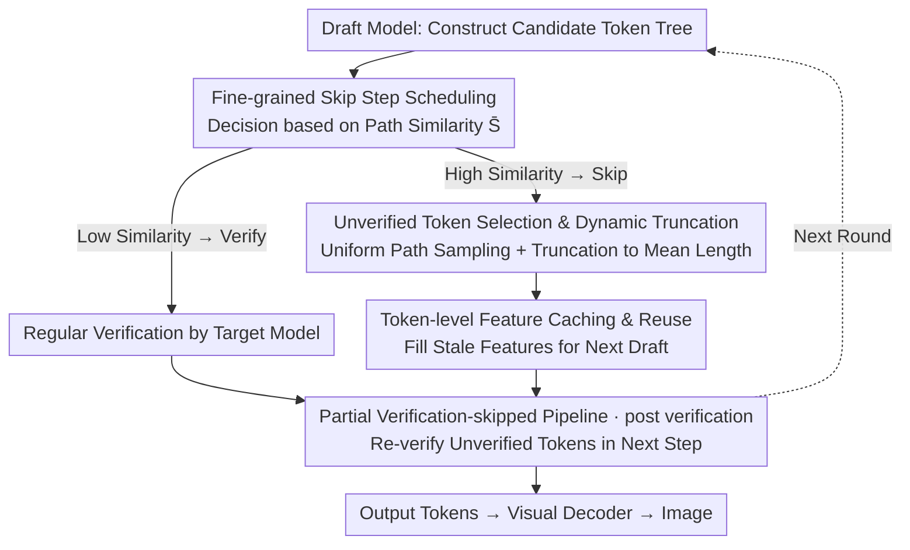

# VVS: Accelerating Speculative Decoding for Visual Autoregressive Generation via Partial Verification Skipping

**Conference**: CVPR2026  
**arXiv**: [2511.13587](https://arxiv.org/abs/2511.13587)  
**Code**: https://github.com/HyattDD/VVS (Available)  
**Area**: Model Compression / Inference Acceleration / Visual Autoregressive Generation  
**Keywords**: Speculative Decoding, Visual Autoregressions, Verification Skipping, Feature Caching, Inference Acceleration

## TL;DR
VVS introduces "partial verification skipping" to speculative decoding (SD) for visual autoregressive generation for the first time. By utilizing verification-free token selection, stale feature cache reuse, and similarity-driven skip scheduling, it reduces the number of target model forward passes by up to 2.86× and achieves an end-to-end acceleration of 1.76× with minimal loss in image quality. This breaks the ceiling of SD where the "one draft, one verification" paradigm could not explicitly reduce the number of forward passes.

## Background & Motivation

**Background**: Visual autoregressive (AR) generation models (e.g., LlamaGen) use "next token prediction" to generate images token by token. While their quality rivals diffusion models, generating a single image requires hundreds or thousands of forward passes, leading to high latency. Speculative Decoding (SD) is currently the mainstream acceleration method: a small draft model $M_d$ quickly proposes several candidate tokens, which are then verified and batch-accepted by a large target model $M_t$ in one parallel pass. To adapt to the vastly different distributions of visual and text tokens and the very low acceptance rates under strict verification, methods like LANTERN and GSD use "relaxed acceptance" (aggregating spatial neighbor token probabilities) or clustering to improve acceptance rates.

**Limitations of Prior Work**: All existing methods strictly adhere to the "one draft step followed by one verification step" paradigm—**every draft candidate must be verified by the target model**. Even if the acceptance rate increases, the number of target model calls (equal to forward passes, the main source of latency) is not explicitly reduced. Directly applying EAGLE-2 to visual AR even results in slowdowns (wall-clock 0.87×/0.92×).

**Key Challenge**: The speedup ceiling of SD is restricted by the "step-by-step verification" paradigm itself. Visual tokens are highly interchangeable, making exhaustive verification redundant. However, skipping verification has been avoided due to three critical problems: ① How to decide which tokens to accept without verification? ② If verification is skipped, there are no intermediate states produced by the target model—what features should the next draft step use? ③ If too many steps are skipped, the draft model becomes the primary generator, causing quality collapse. How should skip steps be allocated?

**Key Insight**: The authors performed two quantitative observations during the draft stage to address the first two concerns. **(i) Verification Redundancy**: Different paths in the candidate token tree are highly similar (cosine similarity >0.7 in 75% of SD iterations). Replacing the path selected by the target model with another path manually has almost no impact on image fidelity (FID fluctuates only by ~0.4 under equivalent acceleration), suggesting that the specific path selected by verification is often redundant. **(ii) Stale Feature Reuse**: The feature similarity of adjacent tokens reaches 0.68. Using stale features cached from the previous step for drafting allows the Mean Acceptance Length (MAL) to retain 73% of that achieved with fresh features. Furthermore, by alternating between fresh and stale features (50% each), the MAL retention rate increases from 73% to 85%.

**Core Idea**: Given verification redundancy and the reusability of stale features, Ours proposes to **partially skip verification**. This allows some SD steps to accept draft tokens directly without consulting the target model, using cached features to fill in missing intermediate states, thereby explicitly reducing target model forward passes.

## Method

### Overall Architecture
VVS is a speculative decoding framework for visual AR generation designed to **explicitly reduce target model forward passes**. It does not modify the draft or target models themselves but inserts a "skip switch" into the SD loop. In each step, a scheduler examines the path similarity of the candidate token tree to decide whether to perform conventional verification or skip it. In a skip step, a token selector samples and truncates an accepted sequence from candidate paths, and a feature cache module provides stale features for the next draft round. These "unverified tokens" are not ignored; they are bundled with new candidates in the next verification step for a one-time check (termed **post verification** by the authors) to restore precise AR conditions and KV-cache. To prevent error accumulation, a hard constraint is applied: **two consecutive steps cannot both skip verification**.

The four modules correspond to the execution flow in the SD loop as follows:

### Key Designs

**1. Fine-grained Skip Step Scheduling: Using Candidate Path Similarity to Decide When to Skip**

Excessive skipping makes the draft model the primary generator, causing quality collapse. Thus, "when to skip and how frequently" is the primary control for the quality-speed tradeoff. The authors provide two strategies. Rule-based (uniform, VVS-U): skip every $i$-th step after $i-1$ normal verification steps—zero overhead but ignores tree dynamics and lacks control. Dynamic-based (VVS-D): skip only when the weighted similarity of different paths in the candidate tree exceeds a threshold $\bar{S}$:

$$\bar{S}=\sum_{\ell=0}^{L-1} w_\ell \cdot S^{(\ell)},\quad w_\ell=\frac{\alpha^{\ell}}{\sum_{k=0}^{L-1}\alpha^{k}}$$

where $S^{(\ell)}$ is the cosine similarity of token representations at position $\ell$, and $\alpha$ is an exponentially decaying weight (giving higher weight to earlier positions). The intuition is: when candidates are highly similar, tokens selected by the draft model are likely close to what the target model would verify. To minimize the overhead of calculating similarity per iteration, the authors use `torch.jit` and path downsampling (stride=2) to reduce decision overhead to ~25%. A hard constraint ensures at least one verification step between skips to suppress error accumulation.

**2. Unverified Token Selection and Dynamic Truncation: How to Pick Tokens Without Verification Without Quality Collapse**

In skip steps, there is no target model alignment, so the choice of which path to accept must be made independently. The simplest approach is to trust the draft model and pick the path with the highest confidence. However, the draft tree is **greedily constructed**. Always picking the most confident path injects "greedy decoding artifacts," which significantly degrades image fidelity (greedy decoding is harmful in visual AR, unlike LLMs). VVS instead **samples a path uniformly** from the candidates to simulate decoding diversity at temperature=1.

Furthermore, as confidence decays along a path, keeping long paths erodes fidelity, and dynamic pruning leads to varying tree structures. Thus, the selected path is **dynamically truncated** to the first $\gamma$ tokens:

$$\gamma=\min\!\bigl(L_s,\ \lfloor\bar{L}\rfloor\bigr),\qquad \bar{L}=\frac{1}{|\mathcal{P}|}\sum_{P_i\in\mathcal{P}}|P_i|$$

where $L_s$ is the length of the selected path, and $\bar{L}$ is the average length of paths in the pruned token tree $\mathcal{P}$. Effectively, the number of accepted tokens in a skip step is capped by the average path length. Since draft confidence decreases as the path lengthens, limiting skip tokens stabilizes quality and smoothing acceptance length across iterations.

**3. Token-level Feature Caching and Reuse: Supplementing Intermediate Features for Drafting After Skipping**

Skip steps do not generate intermediate features from the target model, leaving the next draft stage without the hidden states needed to build the candidate tree. Based on "stale feature reuse," VVS caches **token-level features** (hidden states before the output head) into a buffer during every verification step. These are reused during the next unverified draft step. Since the number of accepted tokens $\gamma_i$ varies and involves truncation, the reused features may span multiple historical steps rather than just the most recent verification step. The latest features matching the count of $\gamma_i$ are retrieved from cache $f_{i-1}$. The pipeline thus operates on features with **mixed staleness**. Ablations show that mixing the latest cached features with fresh features performs best.

**4. Partial Verification-skipped Pipeline and Post Verification: Re-verifying Tokens in the Next Step to Constrain Error Accumulation**

This is the framework skeleton. When skipping is enabled at step $i$, the draft model produces candidates $\bm{c}_i$ based on stale cached features $\bm{h}_{i-1}$ and the previous token embeddings $\bm{e}_{i-1}$. A path is accepted immediately as tentative continuation $\bm{x}_i^\circ$ without target model check. In the next recovery step $i+1$, the unverified sequence $\bm{x}_i^\circ$ is concatenated before the new draft candidates $\bm{c}_{i+1}$ and fed into the target model in **one single forward pass**. This is **post verification**: old unverified tokens and new tokens are processed together, restoring missing KV-cache entries and rebuilding precise AR conditions. Combined with the constraint of no consecutive skips, this allows for fewer target model calls while maintaining controllable quality.

### Loss & Training
VVS is a **purely inference-time framework**. It requires no retraining or modification of standard draft model training (it uses existing EAGLE-2 draft checkpoints and LANTERN relaxed acceptance mechanisms). Thus, there are no new loss functions. All "learning" comes from existing models; VVS only performs selection, caching, and scheduling during decoding.

## Key Experimental Results

Setup: Evaluated on LlamaGen-XL Stage I / Stage II using 5000 captions from the MS-COCO validation set. Baselines: Vanilla AR, EAGLE-2, LANTERN (relaxed acceptance). VVS also integrates relaxed acceptance ($\delta$). Temperature fixed at 1.0; no greedy decoding. Speed metric $\mathrm{TPF}=\frac{\text{Generated Tokens}}{\text{Target Forward Passes}}$ (device-independent), wall-clock acceleration $l$ measured on an NVIDIA A40.

### Main Results

| Model | Method | Wall-clock $l$↑ | TPF↑ | FID↓ | CLIP↑ | Precision↑ | Recall↑ |
|------|------|------|------|------|------|------|------|
| LlamaGen-XL Stage I | Vanilla AR | 1.00× | 1.00 | 24.88 | 0.3220 | 0.5084 | 0.6684 |
| | EAGLE-2 | 0.87× | 1.22 | 25.28 | 0.3220 | 0.5094 | 0.6690 |
| | LANTERN ($\delta$=0.3) | 1.45× | 2.10 | 24.97 | 0.3223 | 0.5494 | 0.6438 |
| | **VVS-U** ($i$=4,$\delta$=0.2) | **1.63×** | **2.24** | 24.96 | 0.3210 | 0.5416 | 0.6486 |
| LlamaGen-XL Stage II | Vanilla AR | 1.00× | 1.00 | 48.23 | 0.2939 | 0.4028 | 0.5784 |
| | EAGLE-2 | 0.92× | 1.22 | 47.80 | 0.2937 | 0.4040 | 0.5594 |
| | LANTERN ($\delta$=0.2) | 1.26× | 1.83 | 50.23 | 0.2910 | 0.4458 | 0.5360 |
| | **VVS-U** ($i$=2,$\delta$=0.1) | **1.76×** | **2.86** | **47.19** | 0.2886 | 0.4856 | 0.4588 |

- VVS-U reduces target model forward passes to 1/2.86 on Stage II with 1.76× wall-clock speedup, outperforming LANTERN and EAGLE-2 in TPF with only light relaxation ($\delta$=0.1). FID 47.19 is actually better than Vanilla AR (48.23) and LANTERN (50.23).
- EAGLE-2 wall-clock is <1× (slower) on visual AR, confirming that text-domain SD does not directly translate.
- Dynamic skipping (VVS-D, $s$=0.65) with $\delta$=0.2 reaches **3.1× TPF** without visible quality degradation.
- On the Pareto front (FID–TPF), VVS dominates; dynamic skipping (VVS-D) provides finer control than uniform skipping (VVS-U), addressing inherent quality instability.

### Ablation Study

**Token Selection and Truncation** (uniform skip, interval=3):

| Strategy | Truncate | TPF | FID↓ | Precision | Recall |
|------|------|-----|------|------|------|
| Sample ($\delta$=0.1) | ✓ | 2.16 | **23.88** | 0.5498 | 0.6734 |
| Conf. ($\delta$=0.1) | ✗ | 2.42 | 26.24 | 0.5492 | 0.6300 |
| Conf. ($\delta$=0.1) | ✓ | 2.16 | 24.71 | 0.5426 | 0.6604 |
| Sample ($\delta$=0.2) | ✓ | 2.43 | **25.49** | 0.5376 | 0.6184 |
| Conf. ($\delta$=0.2) | ✗ | 2.69 | 27.41 | 0.5606 | 0.5988 |
| Conf. ($\delta$=0.2) | ✓ | 2.43 | 26.20 | 0.5458 | 0.6110 |

**Feature Staleness** (uniform skip, interval=3, $\delta$=0.2; $s$ denotes extra staleness: $-1$=freshest, $0$=latest cached, $3$=more stale):

| $s_1$ | $s_2$ | TPF | FID↓ | CLIP | Precision | Recall |
|------|------|-----|------|------|------|------|
| 0 | 0 | 2.23 | 32.63 | 0.3113 | 0.5296 | 0.5682 |
| -1 | 3 | 2.27 | 28.93 | 0.3152 | 0.5290 | 0.6360 |
| **-1** | **0** | **2.31** | **27.69** | 0.3179 | 0.5398 | 0.6088 |

### Key Findings
- **Uniform Sampling > Max Confidence**: At similar TPF, sampling paths yields much better FID (23.88) than greedy confidence selection (24.71 with truncation, 26.24 without). Since the draft tree is greedy, always choosing the most confident path injects greedy continuations and lacks diversity. Random sampling matches the required diversity.
- **Truncation is Indispensable**: Without truncation, TPF is higher (2.42), but FID degrades significantly (26.24 vs 24.71). Accepting too many tokens without verification destabilizes quality. Truncation trades speed for controllability.
- **Mixed "Fresh + Recent" Features**: Using only stale features ($s_1{=}s_2{=}0$) spikes FID to 32.63. Mixing fresh (-1) and latest cached (0) features achieves the highest TPF (2.31) and lowest FID (27.69), validating the "mixed staleness" observation.

## Highlights & Insights
- **Paradigm Innovation**: For the first time, the "SD must verify every step" rule is challenged. Making "verification skipping" controllable directly targets the main latency culprit: target model forward pass count. This shifts the focus from "increasing acceptance rate" to "decreasing call frequency." It is orthogonal to and stackable with relaxed acceptance.
- **Observation-Driven Design**: The two quantitative observations (path similarity >0.7 in 75% of steps, mixed feature MAL retention 85%) are directly translated into the three design modules, creating a clean logical chain.
- **Clever Post Verification**: Skipping verification is not a permanent omission. Post verification delays checking unverified tokens until the next step, where one forward pass restores KV-cache and AR conditions with almost zero extra cost, making the skip "reversible."
- **Transferability**: The combination of unverified selection + feature reuse + similarity scheduling can be transferred to any "draft-verify" acceleration (e.g., video AR, unified multimodal AR), where tokens are highly interchangeable.

## Limitations & Future Work
- **Dependency on Visual Token Interchangeability**: The method assumes that the specific path selected by verification has little impact on fidelity. This holds for visual AR but may fail for semantically sensitive modalities like code or strict layouts.
- **Quality Trade-offs**: While Stage II VVS-U has better FID, its Recall (0.4588) is noticeably lower than Vanilla (0.5784) and LANTERN (0.5360), and HPSv2 is also lower. Acceleration comes at the cost of diversity/coverage.
- **Limited Evaluation Scope**: Only validated on LlamaGen-XL + MS-COCO. Larger models, higher resolutions, or class-conditional generation are not yet covered. Thresholds like $\bar{S}$, $\delta$, and intervals require manual tuning for different models/tasks.
- **Future Work**: VVS does not modify draft model training. Future work could specifically optimize draft models for "partial verification skipping" to further boost speed.

## Related Work & Insights
- **vs. LANTERN**: LANTERN uses relaxed acceptance to increase acceptance rates but still **verifies every step**, resulting in no reduction in forward passes. VVS skips verification steps to cut forward passes and is orthogonal to LANTERN's mechanism. VVS achieves higher TPF/wall-clock speed at similar FID.
- **vs. EAGLE-2**: VVS reuses EAGLE-2's feature-level drafting, but EAGLE-2 itself is slow on visual AR (0.87×/0.92×). VVS revitalizes it through the skip-verification paradigm.
- **vs. GSD / SJD**: GSD (clustering) and SJD (Jacobi decoding) focus on improving acceptance within the "verify-then-accept" framework. VVS moves outside this framework with "partial verification skipping."
- **vs. Quantization/Pruning**: SD is orthogonal to quantization and token pruning. VVS, as a new SD paradigm, can be stacked with these compression methods for a more aggressive acceleration stack.

## Rating
- Novelty: ⭐⭐⭐⭐⭐ First to propose "partial verification skipping" in SD, breaking the paradigm-level ceiling of step-by-step verification.
- Experimental Thoroughness: ⭐⭐⭐⭐ Solid main results, core ablations, and Pareto analysis, though model/task coverage is somewhat narrow.
- Writing Quality: ⭐⭐⭐⭐⭐ Clear chain of observation → design → experiment; the three modules map perfectly to the three skip-related challenges.
- Value: ⭐⭐⭐⭐ Plug-and-play and orthogonal to existing methods. High direct engineering value for visual AR, though the Recall reduction limits universal adoption.

<!-- RELATED:START -->

## Related Papers

- [\[NeurIPS 2025\] Traversal Verification for Speculative Tree Decoding](../../NeurIPS2025/model_compression/traversal_verification_for_speculative_tree_decoding.md)
- [\[CVPR 2026\] Progressive Supernet Training for Efficient Visual Autoregressive Modeling](progressive_supernet_training_for_efficient_visual_autoregressive_modeling.md)
- [\[ICML 2026\] SPEED-Bench: A Unified and Diverse Benchmark for Speculative Decoding](../../ICML2026/model_compression/speed-bench_a_unified_and_diverse_benchmark_for_speculative_decoding.md)
- [\[ICLR 2026\] PTQ4ARVG: Post-Training Quantization for AutoRegressive Visual Generation Models](../../ICLR2026/model_compression/ptq4arvg_post-training_quantization_for_autoregressive_visual_generation_models.md)
- [\[ICCV 2025\] Bridging Continuous and Discrete Tokens for Autoregressive Visual Generation](../../ICCV2025/model_compression/bridging_continuous_and_discrete_tokens_for_autoregressive_visual_generation.md)

<!-- RELATED:END -->
