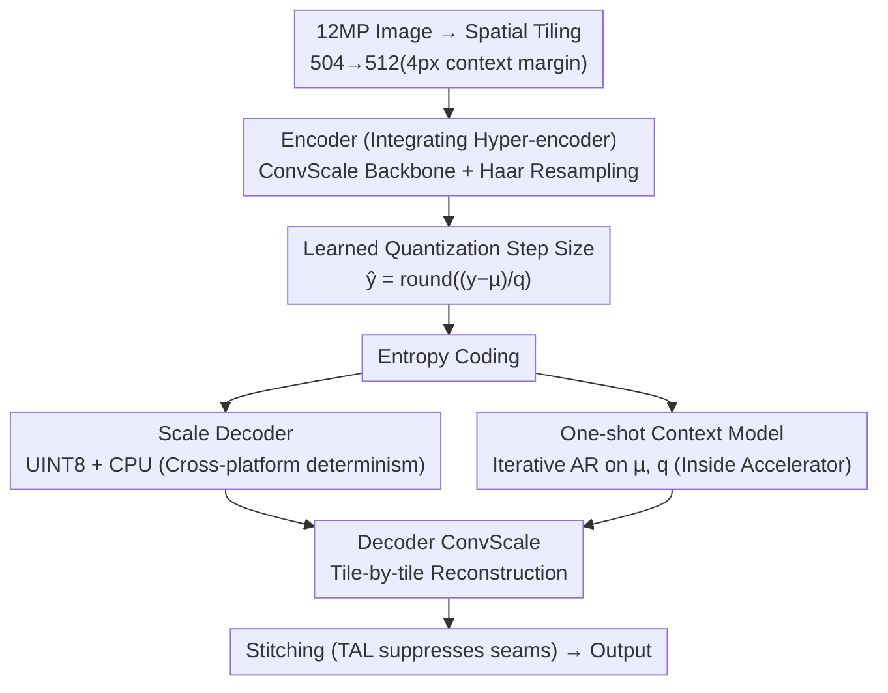

# What Matters in Practical Learned Image Compression

**Conference**: CVPR 2026  
**Paper**: [CVF Open Access](https://openaccess.thecvf.com/content/CVPR2026/html/Tatwawadi_What_Matters_in_Practical_Learned_Image_Compression_CVPR_2026_paper.html)  
**Code**: None (Apple, implementation not publicly released)  
**Area**: Model Compression  
**Keywords**: Learned Image Compression, Perceptual Quality, On-Device Deployment, Neural Architecture Search, Cross-Platform Determinism

## TL;DR
Apple systematically ablates every modeling choice in a learned image codec demanding "both high perceptual quality and fast on-device speed," and then performs performance-aware NAS over millions of backbone configurations. This yields PICO—encoding in 230ms and decoding in 150ms for a 12MP image on an iPhone 17 Pro Max, while saving 2.3–3x bitrate compared to AV1/VVC/JPEG-AI and 20–40% compared to the strongest learned codecs in subjective user studies.

## Background & Motivation

**Background**: The most significant differentiating advantage of learned image codecs over traditional handcrafted codecs (VVC, AV1, ECM, AV2) is the ability to optimize directly end-to-end for the goal of "human perceptual quality," rather than being strictly confined by heuristically designed components in traditional codecs. In recent years, this field has solved many deployment barriers—improving computational efficiency, achieving low-overhead fine-grained rate control, and ensuring reliable cross-platform decoding. The standardization of JPEG-AI further marks the transition of learned codecs from academia to industry.

**Limitations of Prior Work**: However, achieving "high perceptual quality" and "on-device practicality" simultaneously has remained elusive. One category of perceptually optimized works (HiFiC, MRIC, C3-WD, latent diffusion-based methods) indeed produces stunning visual quality, but their runtime is an order of magnitude slower than deployable requirements, and they often lack essential features of practical codecs such as cross-platform support and rate control. Another category of efficiency-focused works (DCVC-RT, JPEG-AI) falls back to PSNR/SSIM metrics, which do not align well with actual human perceptual quality.

**Key Challenge**: Perceptual quality relies on "expensive" techniques like heavyweight networks, autoregressive (AR) entropy models, and test-time optimization to enhance expressiveness/generative capabilities, whereas on-device practicality demands cutting down these overheads—expressiveness directly conflicts with speed. Additionally, there is a third constraint: entropy decoding is extremely sensitive to parameters; even a tiny discrepancy in floating-point computation between the encoder and decoder can cause the entire image to fail to decode, making cross-device determinism a hard barrier.

**Goal**: Instead of inventing a single isolated module, this work aims to answer "what actually matters in practical learned image compression." By systematically ablating all key modeling choices that define a practical codec, the authors squeeze out expressiveness without increasing computational complexity, and then use architecture search to find the model that meets on-device runtime targets while achieving the highest perceptual compression efficiency.

**Key Insight**: The authors observe that many "expensive" methods are simply used in the wrong place. For instance, the reason AR is slow is that it is applied to the scale parameter $\omega$ needed for entropy decoding, which causes repeated CPU-to-accelerator data transfers. If scale is decoded in a one-shot manner, AR can be freely applied only to $\mu, q$ and remain entirely on the accelerator. Similarly, many operations that enhance expressiveness (learned scaling, Haar wavelet resampling) can be incorporated with zero inference-time overhead through reparameterization.

**Core Idea**: Treat "perceptual quality" and "on-device speed" as a joint optimization problem. Through step-by-step ablation and million-scale NAS, identify "where adding expressiveness is free and where slow techniques can be moved out of the way," combining these findings into PICO.

## Method

### Overall Architecture
PICO's backbone follows the classic hyperprior architecture (comprising four subnetworks: encoder, decoder, hyper-encoder, and hyper-decoder), but introduces three crucial modifications for on-device deployment. First, the hyper-decoder is split into two independent subnetworks: the **scale decoder** and the **context decoder**. The scale decoder outputs only the scale parameter $\omega$ used for entropy coding, which must be bit-consistent between encoding and decoding, and is thus isolated for deterministic processing. The context decoder generalizes the location parameter $\mu$ of the original hyper-decoder, taking charge of richer context modeling. Second, the hyper-encoder is integrated into the encoder network, allowing the entire encoder to compile and execute as a single network. Third, three features are added for on-device deployment: cross-platform determinism, single-model rate control, and spatial tiling pipelines.

During inference, a 12MP image is sliced into non-overlapping $504\times504$ tiles (padded to $512\times512$ with a 4-pixel neighborhood context) and fed block-by-block into the encoder to obtain latent variables $y$. These are quantized into $\hat{y}$ using a learned quantization step size $q$. In the entropy coding step, the scale decoder on the CPU decodes $\omega$ in a one-shot manner, while the one-shot context model on the accelerator performs iterative AR on $\mu, q$. The two act in tandem to complete lossless coding. The decoder then reconstructs each tile using the ConvScale backbone and stitches them together. The CPU handles entropy coding/scale decoding, while the accelerator handles neural components, pipelining in parallel across different tiles.

### Key Designs

**1. Scale/Context Decoder Splitting: Isolate the "must-be-deterministic" parts while unlocking pipelining**

Entropy decoding is extremely sensitive to parameters; even a minor floating-point difference in scale $\omega$ between the encoder and decoder will cause decoding failure, representing a hard hurdle for cross-device deployment. PICO's approach is to isolate the scale decoder, which decides $\omega$, into a separate subnetwork and ensure its output is deterministic across all devices. Specifically, the model is quantized to UINT8 so that weights and activations are integers—but this is not enough, as floating-point operations still reside in the quantization scale factors, and different hardware platforms cannot guarantee identical handling of floating-point precision/rounding modes. Therefore, the authors run the scale decoder on the CPU to comply with the IEEE floating-point standard and achieve cross-platform determinism. Isolating the scale decoder yields a second benefit: because of its small footprint on the CPU, it can run in a pipelined fashion in parallel with the neural components on the accelerator (the entropy coding/scale decoding of one tile runs on the CPU while the neural computation of another tile runs on the accelerator), ensuring robustness while gaining extra speed. The context decoder carries the load of more flexible context modeling, unaffected by determinism constraints.

**2. Zero-Overhead Expressiveness: ConvScale Backbone + Conv+Haar Resampling**

Practical codecs are highly averse to "adding computation for visual quality." The core insight in PICO is that certain operations that enhance expressiveness can be folded during inference via reparameterization, resulting in zero extra overhead. The backbone uses an improved inverted residual block, ConvScale311, whose core is the ConvScale layer—adding two learned channel-wise scalings on top of regular convolution (weight $W$, bias $b$): input scale $s_{in}$ (shape $[1, C/G, 1, 1]$) and output scale $s_{out}$ (shape $[K,1,1,1]$), parameterized as $W' = s_{in} s_{out} W$ and $b' = \mathrm{squeeze}(s_{out}) b$. During inference, the scalings are folded into $W'$ and $b'$, making the computational cost identical to a regular convolution. The authors also add element-wise learned scaling at the end of each spatial resolution processing block to further modulate activations. Resampling is inspired by the Cosmos tokenizer, replacing all up/down-sampling with 2D Haar wavelets. Haar reversibly decomposes the input into partially decorrolated channels, effectively injecting an inductive bias of "multi-scale structured representation" into each learned resampling operation to increase model capacity. The authors also use reparameterization to incorporate Haar/iHaar with zero overhead. Ablations show that removing learned scaling increases the BD-rate by 9.58%, while reverting resampling to pixel shuffle increases it by 19.51% and to stride-2 convolution increases it by 8.90%, demonstrating the massive contribution of these two "free" capacity sources.

**3. One-Shot Context Model + Learned Quantization Step Size: Capturing AR Compression Gains with Almost Zero Speed Penalty**

AR entropy modeling significantly improves compression rates but is slow because entropy coding and prediction are interleaved, continually moving data between CPU and accelerator. The authors' key observation is that this slowness only stems from applying AR to the scale $\omega$ required for entropy decoding. PICO thus decodes $\omega$ in a one-shot manner, leaving AR to act only on $\mu, q$ and reside entirely inside the accelerator. The iterative prediction structure can be chosen as channel grouping, checkerboard, or $2\times2$ grids, similar to true AR. Accompanying this is the introduction of a learned quantization step size: the context decoder first produces a prior $p$, which is then mapped by the context model into a position $\mu$ and an element-wise, input-adaptive quantization step size $q>0$. The main latents are quantized as $\hat{y} = \mathrm{round}\!\left(\frac{y-\mu}{q}\right)$, and restored as $q\hat{y}+\mu$ after entropy decoding, allowing the quantization bin width to adapt to local content. In the ablation study: completely removing the one-shot context model increases the BD-rate by 10.28%, and removing the learned quantization step size increases it by 8.16%. For the AR structure, the $2\times2$ grid is the optimal anchor, while pure channel grouping yields only 3.10%, showing that spatial dependencies are more crucial than channel dependencies. (⚠️ Note: In Table 1, the checkerboard entry is 14.67%, which is unexpectedly higher than the 10.28% of "None". This presents slight tension with the text's claim that checkerboard brings a major improvement. Refer to the original text for accuracy.)

**4. Targeted Perceptual Losses: Surgical-grade Suppression of Text and Seam Artifacts**

PICO's training distortion loss is a multi-term combination: $D = \mathrm{MSE} + w_1\mathrm{LPIPS} + w_2\mathrm{MS\text{-}SSIM} + w_3\mathrm{TAL} + w_4\mathrm{TextFidelity} + w_5\mathrm{GAN}$. GAN significantly enhances realism but hallucinates details, while pixel-matching and perceptual terms (MSE/LPIPS/MS-SSIM) serve as regularizers so the GAN cannot exploit a single loss. However, the authors identify two types of artifacts to which the human eye is highly sensitive that require separate treatment. First is text: perceptual training tends to blur text, and even minor hallucination renders text unreadable. Thus, an off-the-shelf text detector is used to generate a saliency mask $m$, enforcing a heavy L1 loss on text regions while suppressing the local GAN loss in those regions (TextFidelityLoss). This reduces the error in text regions by half. Second is seams: PICO operates in tiles, and perceptual and GAN losses widely ignore low spatial frequency components, leading to color mismatch between adjacent tiles. The authors introduce TilingArtifactLoss (TAL), a multi-resolution L1 loss, imposing fidelity supervision across multiple spatial frequencies to reduce low-frequency errors across tile boundaries by more than half.

**5. Performance-Aware Neural Architecture Search: Selecting the Fast and Highest-Quality Backbone from 1.4 Million Configurations**

Building on top of these high-level modeling decisions, PICO performs NAS on backbone hyperparameters. The objective is to keep the neural network execution time for a 12MP image on the iPhone 16 Pro $\le100\text{ms}$ (a practically acceptable decoding speed) while maximizing compression performance. The cartesian product of hyperparameters for the decoder model family yields approximately 1.4 million candidates. The authors use a multi-step filter to narrow it down progressively: ① Coarse filtering using the fast-to-calculate kMACs/pixel, discarding those outside $[32.7, 48.0]$, reducing the count to ~500k; ② Since MACs are only loosely correlated with real runtime, randomly sample 10,000 models to measure actual runtime on iPhone 16 Pro, filtering out those deviating from the target by $>5\%$, reducing to ~1,000; ③ To save compute, perform phase-one training for only 30% epochs on these 1,000 models, selecting the Top 20 based on PSNR BD-rate; ④ Fully train the Top 20 and select the final champion based on perceptual metrics + human evaluation. The final encoder/decoder have 15.2M/9.6M parameters, disk sizes of 30.4MB/19.4MB, and on-device peak memory of 38.8MB/25.4MB.

### Loss & Training
Training is conducted in two phases. In the first phase, only MSE is used as the distortion loss to provide a reasonable initialization for subsequent GAN training. In the second phase (perceptual fine-tuning), all distortion terms from Eq.1 are added to optimize perceptual quality. The GAN uses a patch-wise discriminator but is made wider and deeper to enhance supervision, paired with a warm-up schedule for discriminator supervision weights (gradually increasing them) to prevent the lightweight decoder from being misled by the discriminator in the early stages, avoiding training instability. The data comprises approximately 90,000 generic images (ImageNet-like) + 2.3k text-heavy images + 28,000 Div2K/CLIC/Flickr2K high-resolution images, optimized using Adam. Rate control covers the entire range using a single model: conditioning both the codec and the loss definitions on a scalar quality level $l$ written into the bitstream (relying on and enhancing existing level embedding recipes), with virtually zero computational or model size overhead.

## Key Experimental Results

### Main Results
Evaluation is carried out on CLIC 2020 Test (428 images), Kodak, and DIV2K. Perceptual metrics used are CMMD/FID/LPIPS (PSNR is provided in the appendix, as it does not align with perceptual quality). The subjective study employs the independent platform Mabyduck for blind A/B tests, collecting 74,925 pairwise comparisons from 610 independently verified reviewers and calculating Bayesian Elo scores.

| Comparison Target | Type | PICO Relative Benefit (Subjective) |
|--------|------|------|
| HEIC / AV1 / VVC(VTM) | Best existing standardized codecs | BD-rate >60% → Over 2.5x bitrate savings for equal quality |
| BPG | Traditional | Over 3x bitrate savings |
| AV2 / ECM / JPEG-AI | Next-generation/Standardized | 2.3–3x overall bitrate savings |
| HiFiC / MRIC / C3-WD | Strongest learned + perceptual codecs | Under equal quality, their file sizes are 20–40% larger, and they are significantly slower |

On-device speed (iPhone 17 Pro Max, 12MP):

| Stage | PICO Runtime | Control |
|------|------|------|
| Encoding | Down to 230ms | — |
| Decoding | 150ms | Faster than most SOTA learned codecs on V100 GPU |

### Ablation Study
Backbone ablations (Table 1, CLIC 2020, anchor = final selected configuration, values represent CMMD-CLIP BD-Rate increase, lower is better):

| Ablated Attribute | Option | BD-Rate |
|------|------|------|
| One-shot Autoregression | None | 10.28% |
| | Channel grouping (4 groups) | 3.10% |
| | Checkerboard | 14.67% |
| | $2\times2$ Grid (Selected) | 0% |
| Learned Quantization Step Size | No | 8.16% |
| | Yes (Selected) | 0% |
| Learned Scaling | None | 9.58% |
| | ConvScale only | 3.76% |
| | Spatial-scale only | 1.21% |
| | ConvScale + Spatial-scale (Selected) | 0% |
| Resampling | Pixel reshuffle | 19.51% |
| | Stride-2 Conv/Deconv | 8.90% |
| | Haar Resampling (Selected) | 0% |
| All above | All off | 31.69% |
| | All on | 0% |

Artifact-specific loss ablations (Table 2, metrics custom-designed for each artifact):

| Metric | Loss | Off | On |
|------|------|------|------|
| Text region L1 error | TextFidelityLoss | 0.0093 | 0.0046 (≈2× reduction) |
| Cross-tile boundary low-freq error | TilingArtifactLoss | 0.0020 | 0.00097 (>2× reduction) |

### Key Findings
- Turning off all architectural enhancements simultaneously degrades the BD-rate by 31.69%—demonstrating that the combination of these "free" or "low-overhead" designs contributes significantly. Individually, the one-shot context model (10.28%), learned scaling (9.58%), and learned quantization step size (8.16%) represent the three largest contributors.
- The choice of resampling has the biggest impact: moving from Haar back to pixel shuffle immediately increases the BD-rate by 19.51%, showing that injecting reversible multi-scale inductive bias into resampling is highly cost-effective.
- Regarding AR, "spatial dependency > channel dependency": Pure channel grouping only brings a 3.10% improvement, while the $2\times2$ grid achieves the optimal anchor, suggesting that spatial correlations are more worthwhile to model.
- Both TextFidelityLoss and TAL cut their respective artifact-specific errors in half, validating the approach of targeting human-sensitive artifacts surgically rather than relying solely on general perceptual losses.

## Highlights & Insights
- **"Moving expensive techniques out of the way" is the most clever trick**: AR is not unusable; it simply should not be applied to the scale required for entropy decoding. Decoding scale in a one-shot manner and restricting AR only to $\mu, q$ captures the compression gains of AR almost for free. This mentality of "diagnosing the root cause of slowness and bypassing it" can be transferred to any "powerful but slow" component.
- **Reparameterization makes expressiveness free**: ConvScale's learned scaling and Haar wavelets both leverage inference-time folding to achieve zero overhead. This represents the paradigm of "stacking capacity during training while paying nothing during inference," which can be directly ported to other on-device networks.
- **Cross-platform determinism is resolved via "Isolation + CPU + UINT8"**: Separating the only subnetwork that requires bit-wise consistency for independent handling ensures robustness while unlocking pipeline parallelism, yielding a win-win design for both engineering and modeling.
- **The filter funnel of performance-aware NAS is highly practical**: kMACs coarse filtering → real-device runtime measurements → partial training → full training. Each step uses a progressively more accurate but expensive proxy to iteratively converge, establishing a standard paradigm for saving compute in massive search spaces.

## Limitations & Future Work
- **Heavy reliance on Apple's internal data and hardware**: The training data contains around 90,000 internal generic images, and the evaluation/optimization are deeply tied to the compilers and CPU/accelerator synergy of the iPhone 16/17 Pro. This makes external reproduction difficult, and codes are not open-sourced.
- **NAS is tailored to specific devices/runtime targets**: The search result for 100ms@iPhone 16 Pro might need to be run again for different hardware or resolutions, incurring high migration costs.
- **The subjective study, though large, remains restricted by the platform and methodology**: The Elo scores stem from pairwise comparisons on a single platform; caution should be exercised when comparing absolute magnitudes across different studies.
- **Anomalous checkerboard results in Table 1** (14.67%, which is higher than "None") exhibit a slight tension with the main text's description. The authors did not investigate this deeply; ⚠️ refer to the original text for accuracy.
- **Seam/context margin issues from tiling are only partially mitigated by losses**: TAL significantly reduces but does not eradicate cross-tile mismatches. More aggressive parallel granularities might reintroduce artifacts.

## Related Work & Insights
- **vs. Traditional Codecs (VVC/AV1/ECM/AV2/BPG)**: They rely on handcrafted pipelines and entropy coding to exploit redundancy, a structure that makes direct optimization for perceptual quality difficult and often requires dedicated hardware, leading to long update cycles. PICO is end-to-end differentiable, directly optimizes for human perception, and achieves 2.3–3x subjective bitrate savings.
- **vs. Perceptual Learned Codecs (HiFiC/MRIC/C3-WD/Diffusion-based)**: They achieve perceptual quality close to PICO, but rely on heavyweight networks, diffusion, or test-time optimization, making them an order of magnitude slower than PICO with 20–40% larger file sizes for the same quality, and lacking cross-platform/rate control features. PICO brings perceptual quality to practical speeds.
- **vs. Efficiency-focused Learned Codecs (DCVC-RT/JPEG-AI)**: They are fast but optimize for PSNR/SSIM, discounting perceptual quality. PICO demonstrates that using GAN/perceptual optimization combined with zero-overhead capacity enhancement can bridge this gap.
- **vs. JPEG-AI's Context Design**: JPEG-AI developed a similar local prediction component independently, but it only acts on $\mu$ and requires twice as many AR steps as PICO. PICO's one-shot context model is significantly more efficient.

## Rating
- Novelty: ⭐⭐⭐⭐ The individual innovations are not entirely disruptive, but the combination of "systematically answering what matters + multiple zero-overhead/repositioned clever designs" is highly valuable.
- Experimental Thoroughness: ⭐⭐⭐⭐⭐ 74,925 subjective comparisons + comprehensive architecture/loss ablations + real-device runtime measurements provide a solid chain of evidence.
- Writing Quality: ⭐⭐⭐⭐ Clear structure, close alignment between ablations and motivations, though some details (NAS architecture, level embedding) are compressed into the appendix.
- Value: ⭐⭐⭐⭐⭐ The first learned codec to achieve on-device real-time deployment alongside high perceptual quality, carrying strong industrial significance.

<!-- RELATED:START -->

## Related Papers

- [\[CVPR 2026\] Block-based Learned Image Compression without Blocking Artifacts](block-based_learned_image_compression_without_blocking_artifacts.md)
- [\[ICML 2026\] Efficient Learned Image Compression without Entropy Coding](../../ICML2026/model_compression/efficient_learned_image_compression_without_entropy_coding.md)
- [\[AAAI 2026\] DynaQuant: Dynamic Mixed-Precision Quantization for Learned Image Compression](../../AAAI2026/model_compression/dynaquant_dynamic_mixed-precision_quantization_for_learned_i.md)
- [\[CVPR 2025\] Learned Image Compression with Dictionary-based Entropy Model](../../CVPR2025/model_compression/learned_image_compression_with_dictionary-based_entropy_model.md)
- [\[ICCV 2025\] Learned Image Compression with Hierarchical Progressive Context Modeling](../../ICCV2025/model_compression/learned_image_compression_with_hierarchical_progressive_context_modeling.md)

<!-- RELATED:END -->
