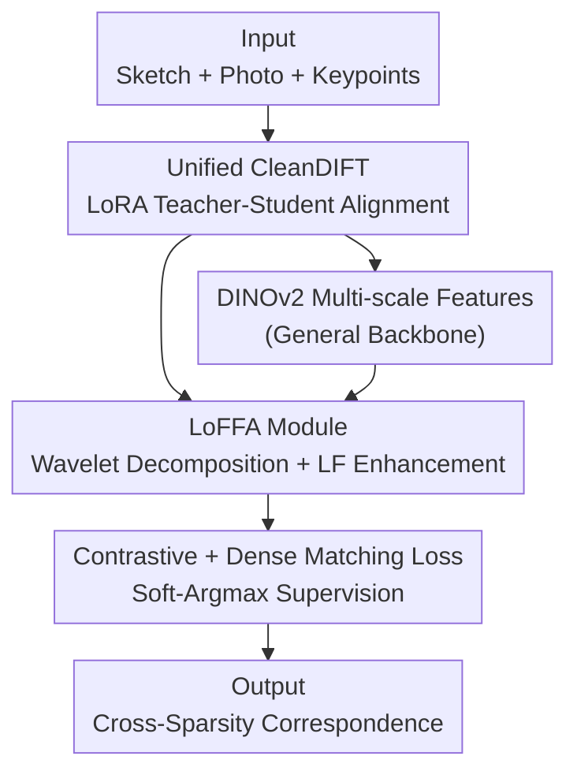

# When Lines Meet Textures: Spatial-Frequency Aligned Diffusion Features for Cross-Sparsity Correspondence

**Conference**: CVPR 2026  
**Paper**: [CVF Open Access](https://openaccess.thecvf.com/content/CVPR2026/html/Zhu_When_Lines_Meet_Textures_Spatial-Frequency_Aligned_Diffusion_Features_for_Cross-Sparsity_CVPR_2026_paper.html)  
**Code**: https://github.com/Mofr77/SFA-DIFT  
**Area**: Diffusion Features / Cross-Modal Semantic Correspondence  
**Keywords**: Sketch-Photo Correspondence, Diffusion Features, Wavelet Low-Frequency Aggregation, LoRA Fine-tuning, Keypoint Matching

## TL;DR
To address the difficulty of establishing semantic keypoint correspondences between "sparse line sketches" and "texture-rich photos," this paper proposes SFA-DIFT. It first fine-tunes CleanDIFT via LoRA into a cross-modally unified "clean diffusion feature" to align the spatial domain, then utilizes a wavelet-based Low-Frequency Feature Aggregation (LoFFA) module to align the frequency domain. It achieves a new SOTA for PCK on the self-constructed MS-PSC6K benchmark.

## Background & Motivation
**Background**: Finding semantic correspondence between two images with similar appearances is a well-studied field. Recent findings suggest that intermediate features of Stable Diffusion (SD) possess strong inherent semantics, leading to paradigms like DIFT and SD+DINO for correspondence tasks. Applying this to **cross-sparsity** scenarios—where one side consists of abstract sketches with a few contour lines and the other side contains realistic photos full of texture—serves as a testing ground that is both practically valuable (sketch retrieval, content editing, creative design) and capable of evaluating cross-modal understanding.

**Limitations of Prior Work**: Directly applying diffusion features fails in this context. SD features are heavily biased toward texture and appearance; when fed pure line sketches, they produce "feature holes" and noise artifacts, causing keypoint localization to collapse. In t-SNE visualizations, sketches and photos cluster separately with high modal discriminability, making cross-modal matching impossible. Existing remedies are incomplete: CleanDIFT uses denoising to smooth features and "completes" missing structures in sketches, but over-smoothing weakens semantic expressiveness. SketchFusion injects high-level semantics via CLIP to bridge spatial distributions, but this acts only as a "high-level patch," failing to resolve low-level frequency mismatch.

**Key Challenge**: The authors attribute failure to two orthogonal gaps. First, **spatial domain misalignment**: sketches are sparse abstractions of object structures where many textured regions have no counterparts, and line positions often deviate from actual boundaries, causing systematic spatial offsets. Second, **frequency domain inconsistency**: log-magnitude Fourier spectrum analysis reveals that texture image energy is distributed across all bands (low-frequency for macro-shape, mid-frequency for texture, high-frequency for detail), while sketch spectra exhibit a "low-frequency plateau + high-frequency spikes + nearly empty mid-frequency" pattern. Aligning only in the spatial domain (e.g., SketchFusion) cannot eliminate this frequency gap.

**Goal / Key Insight**: Since the gap is both spatial and frequency-based, alignment must be performed in both domains (dual-domain alignment). In the spatial domain, both modalities should be mapped into a shared "clean semantic subspace." In the frequency domain, shared low-frequency structures must be explicitly amplified while modality-specific high-frequency texture noise is suppressed.

**Core Idea**: A two-stage pipeline consisting of "unified clean diffusion features fine-tuned via LoRA (spatial alignment) + a wavelet-based low-frequency feature aggregation module (frequency alignment)" is used to pull sparse lines and dense textures into a comparable feature space. Robust correspondences are then trained using contrastive and dense matching losses.

## Method

### Overall Architecture
SFA-DIFT takes a pair of images (one sketch and one textured photo) and source keypoints on the photo as input, and outputs corresponding locations on the sketch. The pipeline consists of two serial stages: **Stage 1** uses unsupervised LoRA fine-tuning to transform pre-trained CleanDIFT into a "Unified CleanDIFT" extractor to resolve spatial domain misalignment. **Stage 2** freezes this extractor and feeds its features, along with multi-scale features from DINOv2, into the LoFFA module. This module enhances shared low-frequency components in the frequency domain using wavelet transforms, eventually training for correspondence via contrastive and dense matching losses.

### Key Designs

**1. Unified CleanDIFT: Bringing Sketches and Photos into a Shared Space via LoRA**

This step addresses spatial domain misalignment. While CleanDIFT can extract semantic features from clean (non-noisy) images, its understanding of sketches is limited. The authors insert LoRA into all linear projection layers of the U-Net. For each weight matrix $W$, a low-rank adaptation $W' = W + \alpha BA$ is applied, where $A\in\mathbb{R}^{r\times d}$ and $B\in\mathbb{R}^{d\times r}$ ($r\ll d$) are the only trainable parameters. This preserves the model's rich understanding of textures while adapting to sketch characteristics efficiently.

Training uses a teacher-student dual-forward pass: the **teacher** path adds noise to a sketch $x_0$ at a random timestep $t$ and extracts $F_{target}$ from the original frozen SD. The **student** path feeds the clean sketch $x_0$ into the LoRA model at a fixed timestep $t'=261$ (following CleanDIFT's optimal setting for clean images), passing it through timestep-conditioned projection heads to get $F_{proj}$. The loss is the negative cosine similarity:

$$\mathcal{L}_{ada}=\mathbb{E}_{x_0,\epsilon,t}\Big[-\sum_{k=1}^{K}\frac{F^{(k)}_{proj}(x_0,t')\cdot F^{(k)}_{target}(x_t,t)}{\lVert F^{(k)}_{proj}(x_0,t')\rVert\,\lVert F^{(k)}_{target}(x_t,t)\rVert}\Big]$$

By sampling across all timesteps, the model learns timestep-independent, cross-modally unified clean features, which allow sketches and photos to cluster by semantic category rather than modality in t-SNE space.

**2. LoFFA: Explicitly Enhancing Shared Low-Frequencies via Wavelet Decomposition**

This step bridges the frequency gap. LoFFA receives $L$ layers of multi-scale features $F^S, F^T$ from Unified CleanDIFT and DINOv2. Each layer undergoes convolution to reduce channels and uses AdaIN to align the photo feature distribution to the sketch distribution, forcing the texture-heavy side to approximate the line-sparse side.

The core is the LoFE (Low-Frequency Enhancement) sub-module: it applies **hierarchical two-level Discrete Wavelet Transform (DWT)**. The first level yields $F^{(1)}_{LL}$ and $F^{(1)}_{H}$. $F^{(1)}_{LL}$ is processed through a CBG block (Conv+BN+GELU) followed by a second DWT to obtain $F^{(2)}_{LL}$ and $F^{(2)}_{H}$. The lowest frequency component is modulated via sigmoid gating: $\tilde{F}^{(2)}_{LL}=F^{(2)}_{LL}\odot(1+M)$, where $M$ is an attention mask. An Inverse DWT (IDWT) then reconstructs the feature. The module is embedded in a scaling residual: $F^{S,out}_l=F^{S,in}_l+\beta\big(H(F^{S,in}_l)-F^{S,in}_l\big)$. This ensures both modalities receive equal low-frequency enhancement.

**3. Contrastive and Dense Matching Loss**

To supervise correspondence, a dual-objective is used: first, a CLIP-style symmetric contrastive loss $\mathcal{L}_{CL}$ pulls corresponding feature pairs together. Second, a dense matching loss $\mathcal{L}_{Dense}$ uses a differentiable Soft-Argmax on the similarity map $C_i=\hat{F}^S(k^S_i)^\intercal\hat{F}^T$ to obtain predicted coordinates $\hat{k}^T_i$. The loss is defined as: $\mathcal{L}_{Dense}=\sum_i\lVert\hat{k}^T_i-(k^T_i+\epsilon)\rVert_2$, where $\epsilon$ is small Gaussian noise for regularization.

**4. MS-PSC6K Benchmark and Robustness Ratio (RR)**

To evaluate generalization across styles, the authors expanded PSC6K by generating 5 texture styles (Abstract, Baroque, Realistic, Neo-Impressionism, Post-Impressionism) for each photo, creating MS-PSC6K with 7,500 texture images. They also introduced the Robustness Ratio $\mathrm{RR} = \frac{\text{Mean PCK on perturbed images}}{\text{Mean PCK on original images}}$. An RR near 1 indicates high stability against texture perturbations.

## Key Experimental Results

### Main Results
PCK@1/5/10 results on PSC6K (‡: supervised, *: zero-shot):

| Method | PCK@1 | PCK@5 | PCK@10 |
|------|-------|-------|--------|
| SD* | 3.02 | 38.66 | 69.77 |
| CleanDIFT+DINO* | 5.73 | 55.47 | 83.81 |
| CleanDIFT+DINO‡ | 9.44 | 70.25 | 90.99 |
| SketchFusion‡ | - | 70.31 | 89.86 |
| **SFA-DIFT‡ (Ours)** | **9.81** | **72.94** | **92.70** |

On MS-PSC6K across five styles, SFA-DIFT achieves an average PCK@1/5/10 of **8.70 / 69.21 / 91.02**, significantly outperforming baselines which show heavy performance drops under texture variations.

### Ablation Study
Averaged results on MS-PSC6K and PSC6K:

| Configuration | PCK@1 | PCK@5 | PCK@10 | Notes |
|------|-------|-------|--------|------|
| CleanDIFT* | 5.59 | 57.27 | 84.57 | Baseline |
| Unified CleanDIFT* | 5.94 | 58.69 | 85.57 | Spatial alignment only |
| DWT & IDWT → Conv‡ | 7.96 | 66.98 | 89.77 | Removing wavelet transforms |
| **SFA-DIFT‡ (Full)** | **8.89** | **69.83** | **91.32** | Full Model |

### Key Findings
- **Wavelet transform is critical**: Replacing DWT/IDWT with standard convolutions results in the largest performance drop (PCK@1 drops by ~0.93), proving that explicit frequency-domain processing is more effective than simply increasing depth.
- **Two-level decomposition is superior**: Two levels of DWT outperform a single level, as deeper decomposition better separates shared low-frequencies from modality-specific high-frequencies.
- **Spatial alignment is necessary but insufficient**: Unified CleanDIFT provides only a minor gain over CleanDIFT; the major leap comes from combining it with supervised LoFFA.

## Highlights & Insights
- **Dual-Domain Diagnosis**: Framing the failure as orthogonal spatial and frequency gaps allows for targeted solutions. This dual-domain alignment strategy is more fundamental than high-level semantic patches.
- **Wavelet Gating**: The use of two-level DWT to isolate and amplify low-frequency components is an elegant way to modify only the necessary parts of the spectrum while preserving structural integrity.
- **Robustness Benchmarking**: The RR metric and MS-PSC6K dataset provide a standardized way to measure a model's sensitivity to distribution shifts in texture.

## Limitations & Future Work
- **Inference Latency**: Relying on diffusion features makes the process slow (0.8s per pair), hindering real-time applications.
- **Trade-off in RR**: The full SFA-DIFT model has a slightly lower RR than the pure Unified CleanDIFT (0.87 vs 0.99 at PCK@1), suggesting that supervision may cause the model to slightly overfit to certain texture-structure correlations.
- **Absolute Accuracy**: PCK@1 remains relatively low (~10%), indicating that cross-sparsity correspondence remains an extremely challenging task.

## Related Work & Insights
- **Comparison with CleanDIFT**: While CleanDIFT suppresses noise for single-image extraction, SFA-DIFT adapts it via LoRA for cross-modal "unified" extraction and adds a frequency module.
- **Comparison with SketchFusion**: SketchFusion relies on CLIP for high-level spatial alignment. SFA-DIFT argues this is insufficient and introduces low-level frequency alignment via wavelets.
- **Comparison with SD+DINO**: These methods typically fail on sparse sketch inputs due to "feature holes." SFA-DIFT's spatial-frequency alignment explicitly targets this discriminability issues.

## Rating
- Novelty: ⭐⭐⭐⭐ Combination of spatial and frequency-domain alignment (especially via wavelet gating) provides deep insights, though individual components are established techniques.
- Experimental Thoroughness: ⭐⭐⭐⭐ Development of MS-PSC6K and the RR metric demonstrates strong evaluation rigor, though real-world sketch validation could be expanded.
- Writing Quality: ⭐⭐⭐⭐ Logical flow from diagnosis to methodology to experiments.
- Value: ⭐⭐⭐⭐ Provides a principled framework for cross-sparsity matching that could be applied to other modalities like point clouds or thermal images.

<!-- RELATED:START -->

## Related Papers

- [\[CVPR 2026\] Test-time Sparsity for Extreme Fast Action Diffusion](test-time_sparsity_for_extreme_fast_action_diffusion.md)
- [\[ECCV 2024\] Uncertainty-Driven Spectral Compressive Imaging with Spatial-Frequency Transformer](../../ECCV2024/model_compression/uncertainty-driven_spectral_compressive_imaging_with_spatial-frequency_transform.md)
- [\[ICLR 2026\] Gradient-Aligned Calibration for Post-Training Quantization of Diffusion Models](../../ICLR2026/model_compression/gradient-aligned_calibration_for_post-training_quantization_of_diffusion_models.md)
- [\[ICML 2026\] xKV: Cross-Layer KV-Cache Compression via Aligned Singular Vector Extraction](../../ICML2026/model_compression/xkv_cross-layer_kv-cache_compression_via_aligned_singular_vector_extraction.md)
- [\[ICCV 2025\] SDKD: Frequency-Aligned Knowledge Distillation for Lightweight Spatiotemporal Forecasting](../../ICCV2025/model_compression/frequency-aligned_knowledge_distillation_for_lightweight_spatiotemporal_forecast.md)

<!-- RELATED:END -->
