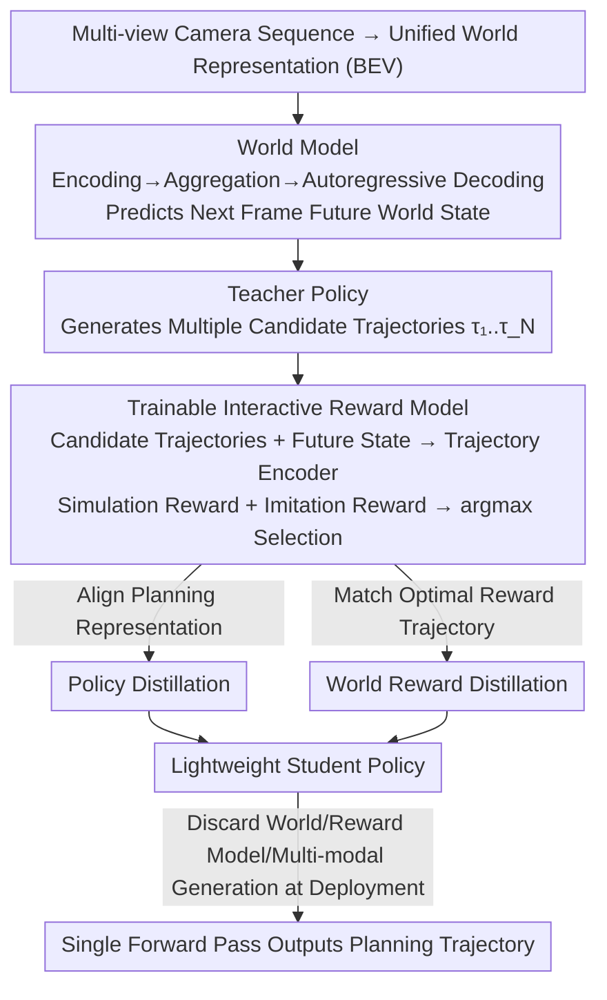

# WPT: World-to-Policy Transfer via Online World Model Distillation

**Conference**: CVPR 2026  
**arXiv**: [2511.20095](https://arxiv.org/abs/2511.20095)  
**Code**: None  
**Area**: Model Compression  
**Keywords**: World Model, Policy Distillation, Reward Model, Autonomous Driving, Online Distillation

## TL;DR
WPT proposes a world-to-policy transfer training paradigm. It injects future prediction knowledge from a world model into a teacher policy via a trainable reward model, and subsequently transfers this knowledge to a lightweight student policy through policy distillation and world reward distillation, achieving a 79.23 driving score (closed-loop) and a 4.9x inference speedup.

## Background & Motivation
1. **Background**: World models are utilized in autonomous driving to capture spatio-temporal dynamics and predict future scenarios; however, current methods suffer from tight runtime coupling or dependence on offline reward signals.
2. **Limitations of Prior Work**: Direct integration of world models leads to severe inference latency; methods treating world models as simulators rely heavily on simulator fidelity.
3. **Key Challenge**: World models provide valuable future prediction knowledge, but their computational overhead is unaffordable during deployment.
4. **Goal**: Utilize world model knowledge during training while employing only a lightweight policy network during deployment, achieving "train with world model, discard for deployment."
5. **Key Insight**: Use a reward model as a bridge to associate world model predictions with policy trajectory selection, which is then distilled into the student.
6. **Core Idea**: A trainable interactive reward model evaluates the consistency between candidate trajectories and world model predictions $\rightarrow$ the teacher policy learns future-aware planning $\rightarrow$ knowledge is transferred via policy distillation and world reward distillation to the student.

## Method

### Overall Architecture
WPT aims to achieve the "best of both worlds": benefitting from the world model's predictive power for future scenarios without incurring its high autoregressive inference cost at deployment. The workflow is divided into training and deployment phases. During training, the world model predicts the future world state of the next frame. An interactive reward model then takes multiple candidate trajectories and scores them against this predicted future. The teacher policy selects the optimal trajectory based on these scores, thereby acquiring "future-aware" planning capabilities. During deployment, heavy components—including the world model, reward model, and multi-modal candidate generation—are discarded. Only a lightweight student policy remains, which, having learned from the teacher through dual distillation, can output planning trajectories close to the teacher's performance in a single forward pass.

### Key Designs

**1. Trainable Interactive Reward Model: Transforming non-differentiable world knowledge into learnable reward signals**

Future predictions from world models are valuable, but they are inherently non-differentiable and cannot directly guide a policy on "which trajectory to choose." WPT addresses this by inserting a trainable reward model as a bridge. Each candidate trajectory $\tau_i$ and the predicted future state $F_{t+1}^w$ are concatenated and fed into a trajectory encoder. Two reward heads then provide scores: an imitation reward measures consistency with human driving preferences, and a simulation reward evaluates driving quality based on metrics like PDM. Crucially, this reward model is "trainable and interactive." It reads world model predictions while remaining differentiable with respect to trajectories, converting trajectory quality—which usually relies on offline signals or simulator fidelity—into an end-to-end optimizable objective for the teacher policy.

**2. Policy Distillation: Replicating teacher planning representations in a single forward pass**

The teacher policy is effective because it utilizes a heavy pipeline ("multi-modal candidates $\rightarrow$ reward scoring $\rightarrow$ selection"). However, the student policy must remain lightweight. Policy distillation focuses on the outcome rather than the process: it aligns the planning representations (features of planning queries after the decoder) between the teacher and the student. This forces the student to learn a direct end-to-end mapping, allowing it to produce planning results similar to those of the teacher without needing to generate multi-modal trajectories or interact with the world model.

**3. World Reward Distillation: Aligning decision logic for the best future trajectory**

Aligning only planning representations carries the risk that the student might learn similar intermediate features without truly inheriting the teacher's judgment on "which trajectory is best." World reward distillation complements this by encouraging the reward of the student's output trajectory, within the predicted future, to approach the reward of the teacher's optimal trajectory. Essentially, it ensures the student matches the teacher's highest-reward decision. Representation distillation ensures the student "looks" like the teacher, while reward distillation ensures it "decides" like the teacher.

### Loss & Training
Teacher training is driven by a combination of rewards: imitation reward (aligning with human driving preferences) and simulation reward (driving quality metrics). The distillation phase superimposes policy distillation loss (aligning planning representations) and world reward distillation loss (matching the teacher's optimal reward trajectory) to transfer the teacher's capabilities to the student.

## Key Experimental Results

### Main Results

| Benchmark | Metric | Ours | Prev. SOTA | Gain |
|------|------|-----|---------|------|
| Open-loop | L2 Error | 0.61m | - | Competitive |
| Open-loop | Collision Rate | 0.11% | - | SOTA |
| Closed-loop | Driving Score | 79.23 | - | SOTA |
| Inference Speed | Speedup | 4.9× | 1× | Significant |

### Ablation Study

| Configuration | Key Metric | Description |
|------|---------|------|
| Full WPT (Teacher) | Optimal | World model enhanced teacher |
| Full WPT (Student) | Near Teacher | Distillation retains most gains |
| w/o World Reward Distillation | Decrease | Reward distillation is critical |
| w/o Reward Model | Significant Decrease | Reward model is the core bridge |

### Key Findings
- The student policy retains most of the performance gains of the teacher while achieving a 4.9x increase in inference speed.
- World reward distillation provides an additional boost compared to pure policy distillation, indicating that the transfer of decision logic is essential.
- WPT is effective across different lightweight policy architectures, demonstrating strong framework generality.

## Highlights & Insights
- The **"train with world model, discard for deployment"** paradigm is highly attractive, providing the benefits of world models without the deployment costs.
- The **trainable reward model** is a clever design for knowledge transfer, transforming non-differentiable world knowledge into differentiable learning signals.
- The **dual distillation** (representation + reward) approach is more comprehensive than a single distillation method.

## Limitations & Future Work
- The framework depends on the quality of the pre-trained world model; low-fidelity predictions may lead to misleading rewards.
- The diversity of scenarios in closed-loop evaluation is currently limited.
- Future work could explore applying this paradigm to general robot decision-making tasks.

## Related Work & Insights
- **vs WoTE/DriveDPO**: These methods integrate world models directly into the policy, requiring autoregressive rollouts during inference. WPT shifts this overhead entirely to the training phase.
- **vs DriveWorld-like simulator methods**: These depend heavily on simulator fidelity and are primarily evaluated in synthetic environments. WPT is trained directly on real-world data.

## Rating
- Novelty: ⭐⭐⭐⭐ The training-deployment decoupled world model paradigm is novel.
- Experimental Thoroughness: ⭐⭐⭐⭐ Validated across open-loop, closed-loop, and multiple architectures.
- Writing Quality: ⭐⭐⭐⭐ Clear framework diagrams and complete process descriptions.
- Value: ⭐⭐⭐⭐⭐ Achieves a strong balance between efficiency and performance.

<!-- RELATED:START -->

## Related Papers

- [\[CVPR 2026\] Planning in 8 Tokens: A Compact Discrete Tokenizer for Latent World Model](planning_in_8_tokens_a_compact_discrete_tokenizer_for_latent_world_model.md)
- [\[CVPR 2026\] Memory-Efficient Transfer Learning with Fading Side Networks via Masked Dual Path Distillation](memory_efficient_transfer_learning_with_fading_side_networks.md)
- [\[AAAI 2026\] QuantVSR: Low-Bit Post-Training Quantization for Real-World Video Super-Resolution](../../AAAI2026/model_compression/quantvsr_low-bit_post-training_quantization_for_real-world_video_super-resolutio.md)
- [\[CVPR 2026\] TaskIT: Memory-Efficient Fine-Tuning of Multi-LoRA LLMs via Cross-Task Importance Transfer](taskit_memory-efficient_fine-tuning_of_multi-lora_llms_via_cross-task_importance.md)
- [\[ICML 2026\] Entropy-Aware On-Policy Distillation of Language Models](../../ICML2026/model_compression/entropy-aware_on-policy_distillation_of_language_models.md)

<!-- RELATED:END -->
