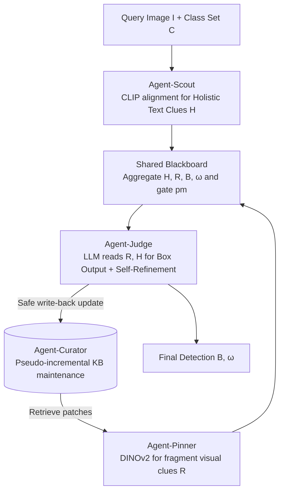

# AgentDet: A Shared-Blackboard Multi-Agent Framework for Zero-/Few-Shot Object Detection

**Conference**: CVPR 2026  
**Paper**: [CVF Open Access](https://openaccess.thecvf.com/content/CVPR2026/html/Li_AgentDet_A_Shared-Blackboard_Multi-Agent_Framework_for_Zero-Few-Shot_Object_Detection_CVPR_2026_paper.html)  
**Code**: None  
**Area**: Multi-Agent / Zero-Few-Shot Object Detection  
**Keywords**: Zero/Few-shot Detection, Multi-Agent, Shared Blackboard, Knowledge Base, Pseudo-incremental Learning

## TL;DR
AgentDet decomposes zero-/few-shot object detection into four LLM agents: Scout, Pinner, Curator, and Judge. These agents collaborate via a "Shared Blackboard" and a patch-level "Knowledge Base" (KB). The framework fragments visual evidence into the KB, assembles them into holistic textual clues for LLM-based box prediction, and trains only the Judge agent. It achieves competitive results on PASCAL VOC and COCO for both ZSOD and FSOD tasks.

## Background & Motivation
**Background**: Zero-shot and few-shot object detection (ZSOD/FSOD) aims to detect objects with zero or $K$ labeled images of novel classes. Traditional FSOD relies on transfer learning, meta-learning, metric learning, and data augmentation. Recent trends shift toward VLM/LLM-based methods (e.g., Grounding DINO, FM-FSOD, LLaFS) to leverage zero-shot capabilities of foundation models.

**Limitations of Prior Work**: Traditional methods suffer from **catastrophic forgetting** and unstable generalization when novel samples are extremely scarce or the base/novel gap is large; episodic training is often unstable. Foundation model approaches have their own drawbacks: VLMs like Grounding DINO rely on large-scale visual pre-training that conflicts with the "few-shot generalization" protocol (essentially "peeking" at answers). FM-FSOD treats LLMs as static classifiers without linguistic reasoning. LLaFS is tied to CodeLlama and requires polygon-level supervision, failing at zero-shot detection. Crucially, most works treat ZSOD and FSOD as separate tasks rather than a unified framework.

**Key Challenge**: LLMs possess rich linguistic priors and cross-modal reasoning but act like "blind expert" — they can describe an object in detail but cannot "see" specific instances in an image, making it difficult to output precise coordinates directly.

**Goal**: ① Provide a single architecture covering both ZSOD and FSOD that transitions smoothly from 0-shot to few-shot without structural changes; ② Continuously accumulate visual knowledge under realistic conditions where no box annotations exist for novel classes.

**Key Insight**: The authors use a cinematic analogy — when no photo of a target exists (e.g., the collage scene in *The Truman Show* or composite sketches), one can piece together eyes, a nose, and a mouth from magazines to form a face. Similarly in detection: **Accumulate fragment-level visual evidence → Assemble into credible holistic textual clues → Use LLM linguistic priors for box localization**.

**Core Idea**: Decouple detection into four collaborative agents centered around a "Shared Blackboard + Patch-level KB." Novel classes are handled via a **pseudo-incremental** approach: when no box labels exist, only high-consistency local evidence is written to the KB. When a few labels arrive, the system upgrades to FSOD without retraining the architecture.

## Method

### Overall Architecture
The input to AgentDet is a query image $I$ and a closed class set $C=C_b \cup C_n$ (base + novel). The output is the final set of boxes and confidence scores $(B,\omega)$. The system uses two types of memory: a **Knowledge Base (KB)** (persistent, stores patch-level visual evidence, supports retrieval) and a **Shared Blackboard (Board)** (transient, aggregates clues and control flags during a single inference pass). Four agents interact with these memories: Scout writes "holistic textual clues," Pinner pins "fragment-level clues" retrieved from the KB to the board, Curator maintains/updates the KB safely, and Judge reads the board to output final boxes. During training, **only the Judge is trained** (updating its image encoder and a LoRA-tuned LLM detection head), while other modules (CLIP, DINOv2) remain frozen.

The board state $M^{(t)}_{board}$ at time $t$ is denoted as $M^{(t)}_{board}=\{H^{(t)}, R^{(t)}, B^{(t)}, \omega^{(t)}, r^{(t)}_{scout}, r^{(t)}_{pinner}, pm^{(t)}\}$, where $H$ is the holistic textual clue, $R$ represents fragment references from the KB, $(B,\omega)$ are predictions, $r_{scout}, r_{pinner}\in\{0,1\}$ are readiness flags, and $pm\in\{0,1\}$ is a gate controlling KB write-access.

### Key Designs

**1. Shared Blackboard + KB: Decoupling "Fragment Evidence" from "Per-image Coordination"**

This design addresses the "blind expert" nature of LLMs and agent coordination. The KB ($\mathcal{K}$) is a persistent database where each entry stores $\langle p_k, \theta^{attr}_k, \theta^{rect}_k, s_k\rangle$ (visual patch, attribute embedding, box coordinates, CLIP score). The Board ($M_{board}$) is a low-latency state space surviving only for one episode. A **consistency gate** determines safe writing to the KB:

$$\text{cons}(k,c)=\mathbb{1}\!\left[\max_i M_{i,k}>\tau_{search}\right]\cdot\mathbb{1}\!\left[\max_i S_{i,c}>\theta\right]$$

Where $M$ is query-KB similarity and $S$ is crop-class similarity. "Safe write" ($pm=1$) occurs only if consistency requirements and attribute scores $s_{p,a}>\tau_{seg}$ are met, preventing KB contamination.

**2. Agent-Scout: CLIP-aligned "Holistic Textual Clues" for Search-Space Narrowing**

Scout identifies probable classes in the image. It performs multi-scale, multi-aspect ratio uniform cropping to generate region proposals $B$. Each patch is encoded by CLIP Visual Encoder, and class names $c_j$ are encoded via prompt templates. A similarity matrix $S$ is calculated with temperature scaling: $S=\tau\cdot\text{softmax}(\theta_{vis}\theta^\top_{txt})$. Classes exceeding a threshold $\theta$ form $C_{detected}$, which can optionally be verified by an LLM as $C_{target}$. This $H$ (holistic clue) is pinned to the board to guide subsequent retrieval.

**3. Agent-Curator: Crop-then-oversegment for Pseudo-incremental KB Maintenance**

Curator fragments visual evidence into the KB. It performs multi-scale over-segmentation $P_n$ to extract CLIP visual embeddings and coordinates. For each class, it generates text attribute lists $A_c$ and matches them to patches via CLIP similarity $s_{p,a}$. The "pseudo-incremental" essence lies in the **asymmetry** between training and inference: Training uses GT boxes to crop and over-segment, ensuring high-purity patches. Inference on novel classes (without boxes) over-segments the whole image, using the consistency gate to decide if an entry should be **submitted, delayed, or decayed**.

**4. Agent-Pinner: DINOv2 Retrieval for "Fragment Visual Clues"**

Pinner determines which KB fragments are relevant to the query image. It over-segments the query image $P_q$ and uses DINOv2 to compute similarity $M=QK^\top$ with the KB. Subset $R$ containing above-threshold fragments limits background noise. These spatial and semantic descriptors are projected into a reference sequence $\theta_{ref}$ for the Judge. Notably, Pinner uses DINOv2 for retrieval while Scout uses CLIP for alignment, providing complementary evidence.

**5. Agent-Judge: The Decision-maker and Sole Trained Agent**

The Judge consumes $C_{target}$ from Scout and $\theta_{ref}$ from Pinner. It encodes the query image via EVA-CLIP + Q-Former into tokens $V$. The LLM (LoRA-tuned) receives a prompt $P$ containing task descriptions and retrieved knowledge to output initial boxes $B_{init}$. A **prompt-based self-refinement** follows: the LLM re-processes initial results to produce $B_{final}$. Confidence $\omega$ is calculated from token sequence probabilities. Training uses a unified detection loss, updating only the image encoder and LLM LoRA.

### Loss & Training
Training utilizes a **single unified detection loss**. Parameters for Agent-Judge (image encoder and LLM LoRA) are updated, while CLIP, DINOv2, and the Q-Former core remain frozen. Backbones like Llama3.1-8B-Instruct and Qwen2.5-7B/8B were tested. This lightweight recipe is key to generalizing to unseen classes.

## Key Experimental Results

### Main Results
PASCAL VOC few-shot (mAP, Novel Split 1):

| Method | 1-shot | 3-shot | 5-shot | 10-shot |
|------|--------|--------|--------|---------|
| ICPE (AAAI23) | 54.1 | 62.5 | 65.3 | 66.3 |
| FM-FSOD† (CVPR24) | 41.6 | - | 55.8 | 61.2 |
| LLMdet† (CVPR25) | 39.9 | 51.7 | 56.1 | 60.8 |
| AgentDet-Qwen2.5-7b† | 55.3 | 63.2 | 68.3 | 69.3 |
| **AgentDet-Qwen3-8b†** | **56.5** | **64.2** | **68.5** | **69.6** |

COCO (AP, cross-shot):

| Method | 0 | 1 | 5 | 10 | 30 |
|------|---|---|----|----|----|
| FM-FSOD† (CVPR24) | - | 5.7 | 21.9 | 27.7 | **37.0** |
| LLMdet† (CVPR25) | 7.2 | 8.8 | 22.3 | 27.8 | 37.8 |
| AgentDet-Qwen3-8b† | **9.4** | **10.8** | **23.9** | 31.6 | 37.5 |

### Ablation Study
Module ablation (AgentDet-Qwen2.5/Llama, VOC 10-shot, mAP):

| Configuration | mAP | Note |
|------|-----|------|
| AgentDet-Qwen (Full) | 65.1 | Full model |
| w/o Q-Former tuning | 52.2 | -8.2% |
| w/o Knowledge Base (KB) | 41.3 | -19.1% |
| w/o LLM fine-tuning | 0.0 | Fails completely |
| w/o Agent-Scout | 30.2 | Significant drop |

### Key Findings
- **Knowledge Base is critical**: Removing the KB results in a 19.1% drop, the largest for any single module.
- **LLM Fine-tuning is mandatory**: Zero performance without fine-tuning proves that language priors alone cannot perform localization without LLM task-adaptation.
- **Low-shot Advantage**: AgentDet leads significantly at 0-shot and 1-shot, though the relative gain diminishes at 30-shot.
- **Parameter Efficiency**: Only a small fraction of parameters (LoRA + encoder) are trained; KB size is capped via "last-place elimination" to maintain efficiency.

## Highlights & Insights
- **"Blind Expert" metaphor realized**: Converts the LLM's inability to see instances into a process of feeding it "visual fragments" and "textual clues."
- **Shared Blackboard + Consistency Gate**: Recycles classic blackboard architecture for multimodal agents, treating current-state coordination and long-term knowledge as separate entities.
- **Asymmetric Training/Inference**: The "crop-then-oversegment" strategy ensures high-quality training samples while allowing the system to learn from unlabeled test flows via "safe write" rules.

## Limitations & Future Work
- **Plateauing at 30-shot**: Performance gains diminish as data increases, suggesting the framework is specialized for data-scarce regimes.
- **Heaviness of Pipeline**: Running four agents, two memories, multiple encoders, and LLM self-refinement likely incurs significant latency (inference time not detailed).
- **External Model Dependency**: Quality of "fragments" is capped by frozen CLIP/DINOv2 performance.

## Related Work & Insights
- **vs FM-FSOD (CVPR24)**: FM-FSOD uses LLM as a static classifier; AgentDet involves the LLM in the decision loop (self-refinement) and adds an explicit visual KB.
- **vs LLaFS (CVPR24)**: LLaFS requires polygon-level supervision; AgentDet operates on boxes and supports ZSOD via pseudo-incrementality.
- **Multi-Agent Paradigms**: AgentDet tailors general multi-agent concepts (ReAct, AutoGen) specifically for detection through the shared blackboard coordinator.

## Rating
- Novelty: ⭐⭐⭐⭐ Connects blackboard agents + patch KB + pseudo-incrementality under a unified ZSOD/FSOD view.
- Experimental Thoroughness: ⭐⭐⭐⭐ Strong results on VOC/COCO; clear ablation on components.
- Writing Quality: ⭐⭐⭐ Vivid analogies, though some formal threshold definitions are scattered.
- Value: ⭐⭐⭐⭐ A reusable multi-agent recipe for low-shot open-vocabulary detection.

<!-- RELATED:START -->

## Related Papers

- [\[AAAI 2026\] Learning to Generate and Extract: A Multi-Agent Collaboration Framework for Zero-shot Document-level Event Arguments Extraction](../../AAAI2026/multi_agent/learning_to_generate_and_extract_a_multi-agent_collaboration_framework_for_zero-.md)
- [\[ICML 2025\] Cross-environment Cooperation Enables Zero-shot Multi-agent Coordination](../../ICML2025/multi_agent/cross-environment_cooperation_enables_zero-shot_multi-agent_coordination.md)
- [\[ICML 2026\] Searching for Synergy in Shared Workspace Human-AI Collaboration](../../ICML2026/multi_agent/searching_for_synergy_in_shared_workspace_human-ai_collaboration.md)
- [\[NeurIPS 2025\] MAS-ZERO: Designing Multi-Agent Systems with Zero Supervision](../../NeurIPS2025/multi_agent/maszero_designing_multiagent_systems_with_zero_supervision.md)
- [\[CVPR 2026\] Visual Document Understanding and Reasoning: A Multi-Agent Collaboration Framework with Agent-Wise Adaptive Test-Time Scaling](visual_document_understanding_and_reasoning_a_multi-agent_collaboration_framewor.md)

<!-- RELATED:END -->
## Related Papers

- [\[CVPR 2026\] MOTOR-Bench: A Real-world Dataset and Multi-agent Framework for Zero-shot Human Mental State Understanding](motor-bench_a_real-world_dataset_and_multi-agent_framework_for_zero-shot_human_m.md)
- [\[CVPR 2026\] Agent4FaceForgery: Multi-Agent LLM Framework for Realistic Face Forgery Detection](agent4faceforgery_multi-agent_llm_framework_for_realistic_face_forgery_detection.md)
- [\[AAAI 2026\] Learning to Generate and Extract: A Multi-Agent Collaboration Framework for Zero-shot Document-level Event Arguments Extraction](../../AAAI2026/multi_agent/learning_to_generate_and_extract_a_multi-agent_collaboration_framework_for_zero-.md)
- [\[ICML 2025\] Cross-environment Cooperation Enables Zero-shot Multi-agent Coordination](../../ICML2025/multi_agent/cross-environment_cooperation_enables_zero-shot_multi-agent_coordination.md)
- [\[CVPR 2026\] Refer-Agent: A Collaborative Multi-Agent System with Reasoning and Reflection for Referring Video Object Segmentation](refer-agent_a_collaborative_multi-agent_system_with_reasoning_and_reflection_for.md)

<!-- RELATED:END -->
