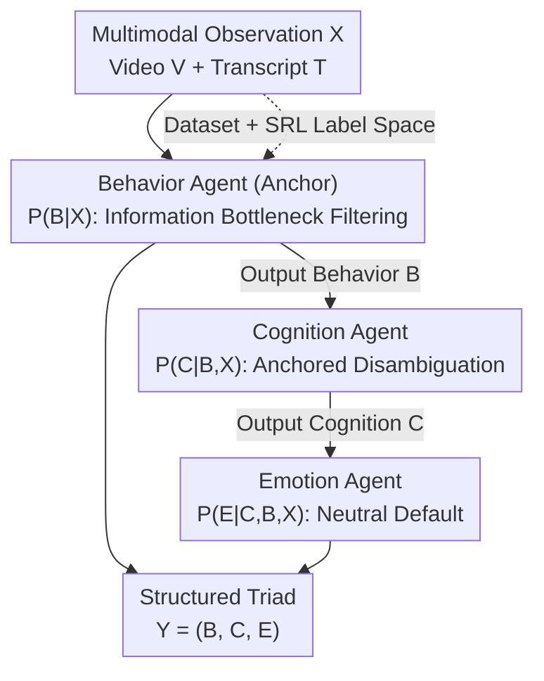

# MOTOR-Bench: A Real-world Dataset and Multi-agent Framework for Zero-shot Human Mental State Understanding

**Conference**: CVPR 2026  
**arXiv**: [2605.09703](https://arxiv.org/abs/2605.09703)  
**Code**: To be confirmed  
**Area**: Multi-Agent / Multimodal VLM / Affective Computing  
**Keywords**: Mental State Understanding, Collaborative Learning, Multi-agent, Self-Regulated Learning (SRL), Zero-shot Reasoning

## TL;DR
Addressing the gap in structured annotations for "inferring deep mental states from observable behaviors," this paper constructs a multimodal dataset, MOTOR-dataset, from real classroom collaborative learning scenarios (1,440 video clips with behavioral/cognitive/emotional labels). It proposes MOTOR-MAS, a reasoning-based multi-agent framework grounded in Self-Regulated Learning (SRL) theory. Three specialized agents perform cascaded reasoning in the order of "Behavior → Cognition → Emotion," using predictions from previous stages as anchors for subsequent stages. MOTOR-MAS achieves a Macro-F1 of 42.77 under zero-shot settings, outperforming the strongest single-model baseline by 15.93 points.

## Background & Motivation
**Background**: Current work on understanding human mental states from behavioral or multimodal signals mostly predicts **single isolated labels** (e.g., one emotion category or one sentiment polarity). Existing datasets (CMU-MOSEI, MELD, etc.) mainly target open-domain scenarios like movies or clinical interviews, which typically model only one dimension at a time.

**Limitations of Prior Work**: These settings are disconnected from real human interactions. Outer behavior does not always directly expose inner thoughts—for instance, someone might smile while saying "I really don't know what I'm thinking." While the surface cue (smile) appears positive, the speech expresses confusion and uncertainty, indicating a negative cognitive state. This **mismatch between signals** means single-label prediction cannot handle inconsistencies between behavior, cognition, and emotion.

**Key Challenge**: Behavior is relatively overt and observable, whereas cognition and emotion are more hidden and context-dependent. Predicting the three dimensions independently loses their inherent dependencies. Learning science (SRL theory) has long established that these three are **tightly coupled** rather than independent in collaborative learning, but this annotation framework has rarely been translated into an AI-ready benchmark and reasoning system.

**Goal**: (1) Provide a real-world dataset and benchmark with structured behavioral-cognitive-emotional triad annotations; (2) Design a zero-shot framework capable of structured reasoning from observable behaviors to deep mental states.

**Key Insight**: Position abstract, ill-defined "mental states" within a **specific context of collaborative learning interaction**—where students naturally express understanding, confusion, and intent—and use SRL theory to provide a clear label system, making abstract problems annotatable and reason-able.

**Core Idea**: Replace independent dimensional prediction with a "Anchor-and-Derive" structured cascade. Use the most overt **behavior** as an anchor, then sequentially perform conditional reasoning for **cognition** and **emotion**, using SRL domain knowledge to regulate information transfer between agents.

## Method

### Overall Architecture
The input to MOTOR-MAS is a collaborative learning video $V$ and its transcript $T$ (jointly denoted as multimodal observation $X=\{V,T\}$), and the output is a structured triad $Y=(B,C,E)$ (Behavior/Cognition/Emotion). The core mechanism is: since the three dimensions are not equally observable—behavior being the most overt while cognition and emotion are more hidden—the joint prediction is decomposed into **stage-wise sequential reasoning**, where intermediate predictions from earlier stages support later ones. Formally, this unfolds as $X\rightarrow B,\ \{X,B\}\rightarrow C,\ \{X,B,C\}\rightarrow E$, which is equivalent to the chain decomposition of the joint distribution:

$$P(C|X)=\sum_{B}P(C|B,X)\,P(B|X),\qquad P(E|X)=\sum_{B,C}P(E|C,B,X)\,P(C|B,X)\,P(B|X).$$

These three conditional probabilities are handled by three specialized agents: Behavior Agent, Cognition Agent, and Emotion Agent. Each agent is injected with SRL theory-based task instructions, ensuring the intermediate results passed between agents are **semantically structured** (rather than arbitrary outputs). All three agents share the same InternVL-3.5-8B backbone and run in a zero-shot manner.

### Key Designs

**1. MOTOR-dataset and Tri-lingual Label Space: Grounding Abstract Mental States in Collaborative Learning**

To address the pain point of abstract mental states being difficult to define and lacking structured labels, this paper chooses a specific context where students naturally express comprehension/confusion/intent: classroom collaborative learning. Data was collected from inquiry-based science experiments at a European university, involving 30 groups of secondary school students, totaling 1,440 video clips. Each clip lasts ~6.10 seconds and features 2–4 interacting students. Transcripts are in Finnish (using Whisper-large-finnish-v3, reaching a 14.26% WER on standard Finnish benchmarks). The label system is derived from the SRL coding framework, where each segment is labeled with a **Behavior-Cognition-Emotion triad**: Behavior $B\in\{\text{Monitoring},\text{Controlling},\text{Mixed}\}$; Cognition $C$ and Emotion $E$ are both $\{\text{Positive},\text{Negative},\text{Mixed},\text{Neutral}\}$. Consistency measured by Cohen's kappa on 25% of the data reached $\kappa=0.73$ for behavior. This dataset deliberately retains real-world challenges: natural class imbalance, visual noise, and domain-specific language.

**2. Anchor-and-Derive Structured Cascaded Reasoning: Using Overt Behavior to Infer Hidden States**

To solve the key challenge that hidden cognition/emotion are lost in independent prediction, MOTOR-MAS organizes reasoning into a $B\rightarrow C\rightarrow E$ chain. Behavior is most overt and predicted first; Cognition is conditioned on Behavior and input; Emotion is synthesized from Behavior, Cognition, and input. This corresponds to the probabilistic chain decomposition and aligns with the coupling of the three dimensions in SRL theory—observable behavior provides context for interpreting cognition, and emotion relates both to behavioral context and cognitive cues. Compared to black-box MLLMs that output three labels at once, this cascade **anchors hidden states on inferred, more reliable intermediate conclusions**, ensuring each step is consistent with prior predictions rather than hallucinating directly from raw visual input.

**3. SRL-grounded Agent Specialization: Regulating Information Flow with Domain Knowledge**

The key distinction from general multi-agent frameworks (e.g., CAMEL, MetaGPT) is that the latter rely on "task decomposition heuristics" where increasing agent count can reach saturation. MOTOR-MAS uses SRL domain knowledge to guide agent communication. Each agent receives task instructions grounded in SRL theory, encoding the theoretical role of its assigned dimension. The division of labor is clear: **The Behavior Agent acts as the anchor**, estimating $P(B|X)$ and acting as an **information bottleneck** by focusing on "directional intent" rather than surface linguistic features, thereby filtering transient visual noise. **The Cognition Agent** calculates $P(C|B,X)$, judging the polarity of metacognitive evaluation conditioned on the behavioral anchor to reduce ambiguity. **The Emotion Agent** calculates $P(E|C,B,X)$, adopting a "neutral-default" assumption—since collaborative learning is task-oriented, the default is overridden only when explicit emotional markers appear.

### Loss & Training
This framework is **zero-shot and training-free**, involving no parameter updates. All agents use InternVL-3.5-8B (bfloat16 + Flash Attention). 8 frames are sampled uniformly per clip and resized to $448\times448$. Finnish transcripts are injected into task prompts with SRL instructions. All agents use greedy decoding (temperature 0) with a maximum of 1024 tokens. Final labels are extracted from the generated text using regex based on the predefined label set. The primary metric is Macro-F1 (due to severe data imbalance), supplemented by Accuracy.

## Key Experimental Results

### Main Results
In the zero-shot setting, comparison models include open-source MLLMs (InternVL-2.5/3.5), closed-source frontier models (Gemini-1.5-Flash/Pro), domain-specific AffectGPT, and the general multi-agent framework CAMEL (using InternVL-3.5-8B as backbone for alignment). The metric is Macro-F1.

| Method | Behavior | Cognition | Emotion | Average |
|------|------|------|------|------|
| InternVL-2.5 | 24.71 | 16.60 | 31.19 | 24.17 |
| InternVL-3.5 (Strongest Single Model) | 25.89 | 19.21 | 35.43 | 26.84 |
| AffectGPT | 22.84 | 11.64 | 33.32 | 22.60 |
| Gemini-1.5-Flash | 24.59 | 20.27 | 23.21 | 22.69 |
| Gemini-1.5-Pro | 25.57 | 21.71 | 22.22 | 23.17 |
| CAMEL (2 Agents) | 41.99 | 24.83 | 28.70 | 31.84 |
| CAMEL (3 Agents) | 42.62 | 29.61 | 45.60 | 39.28 |
| **MOTOR-MAS (Ours)** | **45.23** | **39.81** | 43.27 | **42.77** |

- The average is 42.77, which is **15.93 points** higher than the strongest single model InternVL-3.5 (26.84) and 3.49 points higher than the best general multi-agent CAMEL-3 (39.28).
- The gain in the Cognition dimension is the most significant: MOTOR-MAS 39.81 vs. CAMEL-3 29.61 (**+10.2 points**), indicating that "simply adding agents is insufficient; how intermediate information is organized is key."
- A clear difficulty gradient exists: Behavior is easiest (45.23, overt cues), followed by Emotion (43.27), and Cognition is hardest (39.81, highly covert/context-dependent). Structured reasoning is most beneficial when target states are not directly observable.
- ⚠️ CAMEL-3 slightly outperforms MOTOR-MAS in the Emotion dimension (45.60 vs 43.27). The paper's advantage primarily stems from the Cognition dimension and overall average.

### Ablation Study
| Configuration | Behavior | Cognition | Emotion | Average | Δ |
|------|------|------|------|------|------|
| Full Model | 45.23 | 39.81 | 43.27 | 42.77 | - |
| w/o Multi-Agent (B→C→E sequential, single model) | 40.83 | 34.22 | 29.39 | 34.81 | −7.96 |
| w/o SRL (General task descriptions) | 39.65 | 32.73 | 29.32 | 33.90 | −8.87 |
| w/o Video (Text only) | 42.68 | 37.30 | 38.44 | 39.47 | −3.30 |

### Key Findings
- **Multi-agent structure and SRL priors contribute roughly equally** (~8–9% drop each) and are complementary.
- Removing multi-agent specialization causes Emotion to drop by 13.88 points and Cognition by 5.59 points, showing that specialization is crucial for **hidden state inference**. Even overt Behavior drops by 4.40 points, proving specialized reasoning is superior to single joint prediction.
- The contribution of vision is relatively small (average drop of 3.30), mainly impacting Emotion (-4.83). Transcripts carry most signals, likely due to high noise and low resolution in classroom videos.
- Qualitative analysis (Fig. 5): Baselines often misjudge "collaboration" as "Positive Emotion" or hallucinate "Mixed" emotion during monitoring + negative cognition; MOTOR-MAS correctly identifies "Neutral," though all models still struggle with fine-grained "Mixed" emotions.

## Highlights & Insights
- **Using Psychology Theory as Architectural Skeleton**: SRL theory defines the triad label space and dictates the cascading order (B→C→E) and agent roles. This is a concrete example of "domain knowledge guiding agent communication" rather than heuristic task decomposition, applicable to any structured prediction task with mature dimensional dependency theories.
- **Behavior Agent as an Information Bottleneck**: Fixing the most reliable, overt dimension as an anchor for subsequent hidden dimensions reduces ambiguity and suppresses hallucinations. This "anchoring the observable to derive the unobservable" approach is particularly valuable for noisy, real-world multimodal data.
- **Honest Dataset Design**: By deliberately retaining class imbalance and visual noise, the authors argue this is not collection bias but the nature of real classrooms (most interactions are task-oriented and emotionally neutral).
- The "neutral-default" assumption for the emotion agent is a lightweight way to hardcode domain priors (collaboration is task-centric) into prompts, preventing the model from over-interpreting neutral scenes.

## Limitations & Future Work
- **Zero-shot, Prompt-based Method**: Improvements come from backbone capability + SRL prompts + cascade structure without any training/fine-tuning. The performance ceiling is limited by the backbone's visual understanding.
- **Single Scenario and Language**: Data is restricted to Finnish secondary school collaborative learning. The label system is tightly coupled with the SRL framework; generalization to medical or social contexts or other languages is unverified.
- **Low Absolute Performance**: The best Macro-F1 for Cognition is only 39.81. The problem of "inferring deep mental states from observable behaviors" remains far from solved.
- **Error Propagation**: Mistakes in Behavior prediction contaminate subsequent Cognition/Emotion reasoning. This error propagation is not yet quantified.
- Future Work: Introduce few-shot adaptation, replace backbones with stronger video understanding models, or add confidence gating to intermediate predictions to mitigate error propagation.

## Related Work & Insights
- **vs. Single-label Multidmodal Datasets (CMU-MOSEI / MELD)**: These model one state dimension in open-domain videos; Ours treats behavioral-cognitive-emotional states as a **structured joint reasoning** problem in collaborative learning.
- **vs. CAMEL / MetaGPT (General Multi-Agent)**: The latter use heuristic decomposition where adding same-type agents reaches saturation. Ours uses SRL domain knowledge to regulate information flow and organizes results via cascaded conditional reasoning, outperforming CAMEL-3 by 10.2 points in cognition.
- **vs. Black-box MLLMs (InternVL / Gemini / AffectGPT)**: These generate labels directly from raw inputs and are prone to hallucinations during signal mismatch. MOTOR-MAS uses anchored cascading to ensure predictions are conditioned on reliable intermediate conclusions, leading to a 15.93-point average gain.
- Insight: Translating "mature domain theories" into "agent roles + information flow order" is a reproducible path to injecting structure into multi-agent systems and breaking the ceiling of heuristic decomposition.

## Rating
- Novelty: ⭐⭐⭐⭐ Uses SRL theory to drive both annotation and multi-agent architecture; the Anchor-and-Derive cascade is clear and specific, though individual modules have limited technical novelty.
- Experimental Thoroughness: ⭐⭐⭐⭐ Covers open/closed MLLMs, domain models, and general multi-agent baselines with clear ablation studies; however, it is validated only on one dataset and absolute performance is still low.
- Writing Quality: ⭐⭐⭐⭐ Motivation-theory-method-experiment logic is coherent, with clear mapping between probabilistic decomposition and agent roles.
- Value: ⭐⭐⭐⭐ Fills a gap in structured mental state annotation for real collaborative learning; the dataset and framework are of practical value to AIED and affective computing communities.

<!-- RELATED:START -->

## Related Papers

- [\[CVPR 2026\] AgentDet: A Shared-Blackboard Multi-Agent Framework for Zero-/Few-Shot Object Detection](agentdet_a_shared-blackboard_multi-agent_framework_for_zero-few-shot_object_dete.md)
- [\[ACL 2026\] Towards Robust Real-World Spreadsheet Understanding with Multi-Agent Multi-Format Collaboration](../../ACL2026/multi_agent/towards_robust_real-world_spreadsheet_understanding_with_multi-agent_multi-forma.md)
- [\[AAAI 2026\] Learning to Generate and Extract: A Multi-Agent Collaboration Framework for Zero-shot Document-level Event Arguments Extraction](../../AAAI2026/multi_agent/learning_to_generate_and_extract_a_multi-agent_collaboration_framework_for_zero-.md)
- [\[CVPR 2026\] Visual Document Understanding and Reasoning: A Multi-Agent Collaboration Framework with Agent-Wise Adaptive Test-Time Scaling](visual_document_understanding_and_reasoning_a_multi-agent_collaboration_framewor.md)
- [\[ICLR 2026\] UIS-Digger: Towards Comprehensive Research Agent Systems for Real-world Unindexed Information Seeking](../../ICLR2026/multi_agent/uis-digger_towards_comprehensive_research_agent_systems_for_real-world_unindexed.md)

<!-- RELATED:END -->
