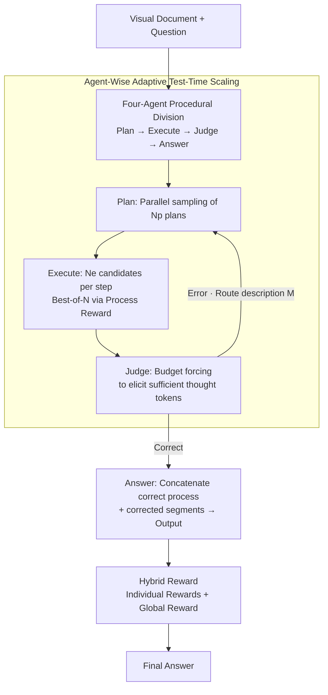

# Visual Document Understanding and Reasoning: A Multi-Agent Collaboration Framework with Agent-Wise Adaptive Test-Time Scaling

**Conference**: CVPR 2026  
**Paper**: [CVF Open Access](https://openaccess.thecvf.com/content/CVPR2026/html/Yu_Visual_Document_Understanding_and_Reasoning_A_Multi-Agent_Collaboration_Framework_with_CVPR_2026_paper.html)  
**Area**: Multi-Agent / Multimodal VLM  
**Keywords**: Visual Document Understanding, Multi-Agent Collaboration, Test-Time Scaling, Process Reward, Self-Correction

## TL;DR
MACT decomposes the "monolithic single-model" visual document QA into four agents with distinct roles: planning, execution, judging, and answering. It adaptively allocates test-time compute according to the cognitive load of each agent rather than uniformly increasing parameters. On 15 benchmarks, it consistently ranks in the top three with <30B parameters, achieving an average improvement of 9.9–11.5% over the base models.

## Background & Motivation
**Background**: Visual Document Understanding (DocVQA, ChartQA, table/webpage QA, etc.) is currently driven by "monolithic scaling"—increasing VLM parameters and training on more high-quality data, resulting in generalists like GPT-4o, Gemini-2.0-Pro, and Claude-3.7-Sonnet.

**Limitations of Prior Work**: On document-related tasks, the marginal returns of uniform parameter scaling are sharply diminishing. Open-source models show minimal performance gains despite exponential growth in compute. The authors identify three root causes: (1) **Procedural reasoning is flattened**—document analysis is inherently a multi-step process ("decompose problem → set strategy → locate information → synthesize answer"), but monolithic models attempt to solve this in a single forward pass, leading to unstable reasoning paths; (2) **Cognitive overload**—a single set of weights must simultaneously handle vastly different skills like layout parsing, fine-grained OCR, logical inference, and numerical calculation, leading to interference; (3) **Vulnerability to factual errors**—document semantics are highly sensitive to minor procedural errors (e.g., paragraph cutoff or table row misalignment), which propagate in forward-only monolithic models lacking internal verification/correction loops.

**Key Challenge**: Documents are not monolithic objects suited for "uniform scaling"; they inherently require procedural processing that is phased, verified, and correctable. Monolithic scaling packs all functions into one weight set without self-correction loops.

**Goal**: Transition from "monolithic scaling" to "procedural scaling"—decompose problems by document processing functional entities and apply customized test-time scaling to each.

**Core Idea**: Replace "monolithic model scaling" with "four-agent collaborative division of labor + agent-wise adaptive test-time scaling + hybrid rewards," allowing compute to be deployed based on the complexity and redundancy of each cognitive step.

## Method

### Overall Architecture
MACT explicitly maps the document understanding pipeline into four specialized, serially collaborating agents: **Planning Agent $A_{plan}$** (decomposes the problem, generates high-level execution plans) → **Execution Agent $A_{exe}$** (calls tool libraries to execute the plan step-by-step) → **Judging Agent $A_{judg}$** (decides correctness, locates error steps and routes back) → **Answering Agent $A_{ans}$** (synthesizes correct processes and corrected segments for the final answer). $A_{plan}$ and $A_{exe}$ utilize VLMs (for visual input), while $A_{judg}$ and $A_{ans}$ utilize LLMs (processing textual intermediate products). When $A_{judg}$ detects an error, it routes "where it failed + description" back to $A_{plan}$ or $A_{exe}$ for rework, for a maximum of $N_c=3$ corrections.

Two layers of enhancement are added to this framework: first, **agent-wise adaptive test-time scaling**, allocating different scaling strategies to agents based on function; second, **hybrid reward modeling**, optimizing "individual agent rewards + a global outcome reward" via GRPO to strengthen local capabilities while suppressing "selfish" tendencies of agents.

### Key Designs

**1. Four-Agent Procedural Division: From "One-Pass" to "Step-by-Step Experts"**

To address "flattened procedural reasoning" and "cognitive overload," MACT shifts from a single model doing everything to four specialized agents in a relay. $A_{plan}$ generates only **high-level plans**—using analogical prompting to generate $N_p$ similar instances and plans $P_{rel}=A_{plan}(Q,D)$, then generating the plan for the target question $P=A_{plan}(Q,P_{rel},D,M)$. Plans consist of steps $\{s_1,\dots,s_n\}$; crucially, it **describes step goals without execution details or tool binding**, allowing $A_{exe}$ flexibility in tool selection. $A_{exe}$ treats each step as a unit, selecting from tool library $T$ to produce execution $e_i=A_{exe}(Q,D,s_i,T,M)$. This eliminates cognitive overload as each agent masters one function. Ablations show that merging these into a single model (w/o multi-agent collaboration) drops the score from 74.8 to 58.6, demonstrating that monolithic integration is a bottleneck for document tasks.

**2. Independent Judging Agent: Decoupling "Judging" from "Correcting"**

While document tasks are sensitive to procedural errors, existing self-correction methods are suboptimal: (a) Internal self-correction by the same agent often fails due to cognitive blind spots; (b) "Judge-and-Correct" agents require larger parameters and complex rewards, often leading to conflicts between corrected and original correct parts. MACT's $A_{judg}$ acts **only as a referee**: $J=A_{judg}(Q,P,E)$, outputting $J=\{flag_{plan},flag_{exe},M\}$. The boolean flags indicate where the error occurred, and $M$ provides a description for $A_{plan}$ or $A_{exe}$ to revise. This "neutral referee" approach avoids vague phrasing used to bypass validation and simplifies reward design. This strategy outperforms integrated correction mechanisms by $\ge$ 2.6% and reaches optimum with fewer correction cycles ($N_c=3$ vs. $N_c=5$).

**3. Agent-Wise Adaptive Test-Time Scaling: Compute by Cognitive Load**

Standard test-time scaling (parallel/sequential/hybrid) is designed for single models and ignores functional specialization. MACT applies specific strategies: $A_{plan}$ uses **parallel scaling**—generating $N_p$ independent plans to ensure at least one aligns with document semantics; $A_{exe}$ uses **step-wise best-of-$N_e$**—sampling $N_e$ candidates per node and selecting the highest-scoring step via a pre-trained process reward model; $A_{judg}$ uses **budget forcing**—forcing a minimum number of thought tokens to ensure deep verification. $A_{ans}$ synthesizes information without additional scaling. This strategy outperforms uniform scaling by $\ge$ 1.8%, especially on document reasoning tasks where cognitive load is high.

**4. Hybrid Reward Modeling: Preventing Agent "Selfishness"**

Agents with different functions prefer different reward signals. Optimizing only local rewards can lead to agents ignoring the global outcome. MACT uses a hybrid approach: local rewards ($A_{plan}/A_{exe}$ use a multimodal **Process Reward Model** $R_{prm}$, while $A_{judg}/A_{ans}$ use an **Outcome Reward Model** $R_{orm}$) are combined with a **global reward** $r_{global}=R_{orm}(\{P,E,J,O\}\,|\,Q,D)$. The global reward reinforces the correct collaborative path and mitigates agent self-interest. Experiments show using only global rewards is worst (70.2), while the hybrid approach (74.8) outperforms individual rewards alone (72.7).

### Loss & Training
Two-stage pipeline. **Stage 1 (SFT)**: Fine-tune VLM (11B/7B/7B) on document and non-document data (with/without CoT) to enhance visual reasoning for $A_{plan}$/$A_{exe}$; fine-tune LLM (8B/7B/7B) using GPT-4o-generated labels for $A_{judg}$; fine-tune LLM (3B/3B/7B) for $A_{ans}$. **Stage 2 (RL)**: Optimize via GRPO. Process rewards use VisualPRM; outcome rewards use Skywork-VL-Reward. Three variants are assembled based on Qwen2.5-VL / MiMo-VL / InternVL3 series.

## Key Experimental Results

### Main Results
15 benchmarks (10 document-related + 5 general/math across text/web/chart/table). All three variants rank in the top three for average score, with MACT-MiMo-VL-28B leading on 13/15 benchmarks.

| Variant (Parameters) | Avg Score | vs Base | Remarks |
|----------------|--------|---------|------|
| MACT-MiMo-VL-Series (28B) | 77.2 | +9.9 | Highest avg, leader in 7 benchmarks |
| MACT-InternVL3-Series (28B) | 75.3 | +11.5 | Second place |
| MACT-Qwen2.5-VL-Series (24B) | 74.8 | +10.3 | Third place |
| Gemini-2.0-Pro (Closed-source ref) | 71.3 | — | Strongest generalist model |
| Qwen2.5-VL-72B-Instruct | 70.5 | — | Larger monolithic model in same series |

Highlights: MACT-MiMo-VL-28B outperforms the strongest open-source/closed-source models by 5.6% / 5.9% respectively. On long-context (MMLongBench-Doc) and math benchmarks, gains reach up to 10.6% compared to the runner-up.

### Ablation Study
(Based on MACT-Qwen2.5-VL-24B across MMLong, TabBench, MVision, and Total Avg)

| Config | MMLong | TabBen | MVision | Average |
|------|--------|--------|---------|------|
| Monolithic | 32.5 | 50.8 | 32.4 | 66.2 |
| w/o multi-agent | 24.7 | 44.4 | 26.0 | 58.6 |
| w/o adaptive scaling | 34.9 | 50.8 | 34.5 | 71.1 |
| w/o hybrid reward | 38.3 | 54.2 | 36.7 | 71.4 |
| **MACT (Full)** | **43.7** | **57.2** | **41.8** | **74.8** |

Agent Combination (Table 3): Only $A_{plan}+A_{exe}$ yields 68.4 (+3.9 vs base); adding $A_{judg}$ jumps to 73.9 (+5.5, the largest contribution); adding $A_{ans}$ completes it at 74.8.

### Key Findings
- **Cognitive overload is a major bottleneck**: Merging agent prompts into a single model (w/o multi-agent) results in a score of 58.6, lower than the base model. Specialized division is foundational.
- **Judging agent is the top contributor**: Adding $A_{judg}$ provides a +5.5% boost, significantly higher than $A_{ans}$'s +0.9%. Independent judging outperformed self-consistency and integrated judging.
- **Correction has diminishing returns**: $N_c=3$ is optimal; further cycles can lead to "over-correction" where agents miss the correct answer.
- **Hybrid rewards are essential**: Global rewards alone perform poorly, but they act as a "selfishness prevention" mechanism that adds 1.3% to the hybrid strategy.
- **Scaling benefits difficult tasks**: Adaptive scaling provides higher gains on complex document reasoning than on general tasks.

## Highlights & Insights
- **"Procedural vs. Monolithic Scaling" Comparison**: Beating 72B-78B monolithic models with <30B ensembles effectively proves that document tasks should not rely solely on parameter growth.
- **Decoupled Judging/Correcting is Transferable**: Using a neutral referee avoids "reward hacking" (vague generation to pass verification). This design is applicable to any agentic pipeline requiring self-validation (code, math).
- **Function-Specific Scaling**: Parallel for planning, best-of-N for execution, budget forcing for judgment—this "scaling recipe" approach is more efficient and accurate than uniform compute allocation.
- **Incorporating Error Context**: The answering agent $A_{ans}$ receives both the correct process and the original error segments, allowing the model to focus on subtle details that were previously misinterpreted.

## Limitations & Future Work
- **System Latency and Inference Cost**: Serial collaboration, multiple candidates, budget forcing, and correction loops result in higher end-to-end latency and token consumption compared to monolithic models.
- **Dependency on External RMs and LLM Annotators**: Judgment labels rely on GPT-4o, and rewards rely on specific pre-trained models, which introduces a dependency on external biases and increases reproduction barriers.
- **Hand-Crafted Pipelines**: The agent division and tool libraries are tailored for documents. Effectiveness in other visual reasoning domains remains untested.
- **GPT-4o Evaluation**: Using GPT-4o as a benchmark judge carries the risk of "evaluator bias" towards models using similar architectures or training data.

## Related Work & Insights
- **vs. Monolithic Scaling (GPT-4o, 72B-78B)**: While generalists are strong, they face diminishing returns in procedural reasoning. MACT's procedural scaling achieves higher performance with smaller parameters.
- **vs. Internal Self-Correction**: MACT's independent judge avoids the cognitive blind spots inherent in single-model generation and verification.
- **vs. Agentic Document Systems (e.g., MDocAgent)**: MACT achieves higher scores with fewer parameters by introducing independent judgment and adaptive test-time scaling.

## Rating
- Novelty: ⭐⭐⭐⭐ Systematizes "procedural scaling" through agent-wise allocation and hybrid rewards. The decoupling of judging/correcting is a notable insight.
- Experimental Thoroughness: ⭐⭐⭐⭐⭐ Extensive testing across 15 benchmarks, multiple base models, and comprehensive ablations.
- Writing Quality: ⭐⭐⭐⭐ Logical flow from motivation to paradigm shift is clear. Detailed but dense.
- Value: ⭐⭐⭐⭐ Provides strong evidence for multi-agent procedural scaling in document/reasoning domains.

<!-- RELATED:START -->

## Related Papers

- [\[ACL 2026\] Multi-Agent Reasoning Improves Compute Efficiency: Pareto-Optimal Test-Time Scaling](../../ACL2026/multi_agent/multi-agent_reasoning_improves_compute_efficiency_pareto-optimal_test-time_scali.md)
- [\[AAAI 2026\] Learning to Generate and Extract: A Multi-Agent Collaboration Framework for Zero-shot Document-level Event Arguments Extraction](../../AAAI2026/multi_agent/learning_to_generate_and_extract_a_multi-agent_collaboration_framework_for_zero-.md)
- [\[ACL 2026\] Scaling External Knowledge Input Beyond Context Windows of LLMs via Multi-Agent Collaboration](../../ACL2026/multi_agent/scaling_external_knowledge_input_beyond_context_windows_of_llms_via_multi-agent_.md)
- [\[CVPR 2026\] AgentDet: A Shared-Blackboard Multi-Agent Framework for Zero-/Few-Shot Object Detection](agentdet_a_shared-blackboard_multi-agent_framework_for_zero-few-shot_object_dete.md)
- [\[ICLR 2026\] PixelCraft: A Multi-Agent System for High-Fidelity Visual Reasoning on Structured Images](../../ICLR2026/multi_agent/pixelcraft_a_multi-agent_system_for_high-fidelity_visual_reasoning_on_structured.md)

<!-- RELATED:END -->
## Related Papers

- [\[ACL 2026\] Multi-Agent Reasoning Improves Compute Efficiency: Pareto-Optimal Test-Time Scaling](../../ACL2026/multi_agent/multi-agent_reasoning_improves_compute_efficiency_pareto-optimal_test-time_scali.md)
- [\[CVPR 2026\] Tackling Model Bias via Game-theoretic Multi-agent Collaboration Framework for Hateful Meme Classification](tackling_model_bias_via_game-theoretic_multi-agent_collaboration_framework_for_h.md)
- [\[AAAI 2026\] Learning to Generate and Extract: A Multi-Agent Collaboration Framework for Zero-shot Document-level Event Arguments Extraction](../../AAAI2026/multi_agent/learning_to_generate_and_extract_a_multi-agent_collaboration_framework_for_zero-.md)
- [\[CVPR 2026\] MOTOR-Bench: A Real-world Dataset and Multi-agent Framework for Zero-shot Human Mental State Understanding](motor-bench_a_real-world_dataset_and_multi-agent_framework_for_zero-shot_human_m.md)
- [\[ACL 2026\] Scaling External Knowledge Input Beyond Context Windows of LLMs via Multi-Agent Collaboration](../../ACL2026/multi_agent/scaling_external_knowledge_input_beyond_context_windows_of_llms_via_multi-agent_.md)

<!-- RELATED:END -->
