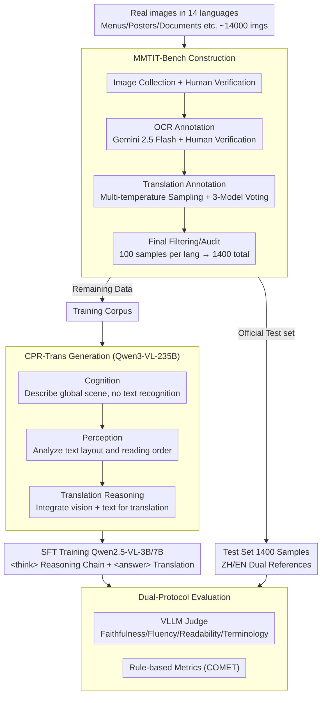

# MMTIT-Bench: A Multilingual and Multi-Scenario Benchmark with Cognition-Perception-Reasoning Guided Text-Image Machine Translation

**Conference**: CVPR 2026  
**arXiv**: [2603.23896](https://arxiv.org/abs/2603.23896)  
**Code**: None (MMTIT-Bench planned for release)  
**Area**: Multimodal VLM / Machine Translation  
**Keywords**: Text-Image Translation, Multilingual Benchmark, Chain-of-Thought, Cognition-Perception-Reasoning, VLLM Evaluation

## TL;DR

Constructed MMTIT-Bench, a multilingual and multi-scenario text-image machine translation benchmark covering 14 non-English and non-Chinese languages. Proposed the CPR-Trans data paradigm (Cognition → Perception → Translation Reasoning), which significantly improves end-to-end translation quality on 3B and 7B models, with the 7B model achieving performance competitive with a 235B model.

## Background & Motivation

1.  **Background**: Text-Image Machine Translation (TIMT) aims to directly translate text content within images. With the advancement of VLLMs, end-to-end TIMT has replaced traditional OCR+NMT cascade schemes. However, existing research primarily focuses on English-Chinese pairs and evaluations in simple scenarios like digital documents.
2.  **Limitations of Prior Work**: (1) Lack of a benchmark covering multiple languages and scenarios—existing datasets cover at most 4 languages (MTIT6) with limited scene diversity; (2) The Chain-of-Thought (CoT) reasoning paradigm for TIMT is underdeveloped—existing methods either cascade OCR and translation or perform pure linguistic reasoning, neglecting visual cognition.
3.  **Key Challenge**: VLLMs perform well on high-resource languages, but their robustness in low-resource languages and complex visual scenes (menus, posters, street views) remains unknown, and there is no suitable benchmark for systematic evaluation.
4.  **Goal**: (1) Construct a TIMT benchmark covering multiple languages and scenarios; (2) Design a reasoning data paradigm suitable for TIMT.
5.  **Key Insight**: Simulate the human translation process—understand the scene (Cognition) → recognize the text (Perception) → reason the translation (Reasoning), and design structured CoT supervision.
6.  **Core Idea**: Use a three-stage structured reasoning chain of Cognition-Perception-Reasoning to guide end-to-end text-image translation.

## Method

### Overall Architecture

The work consists of two parallel pipelines. One is **MMTIT-Bench construction**: collecting real images from 14 languages, followed by four steps: "Image Collection → OCR Processing & Annotation → Translation Annotation → Final Audit/Filtering." This results in 1400 high-quality evaluation samples (100 per language, with remaining annotated data used for training), supported by a **Dual-Protocol Evaluation** (VLLM Judge + COMET). The other is the **CPR-Trans data paradigm**: using Qwen3-VL-235B to generate a three-stage structured CoT ("Cognition → Perception → Translation Reasoning") on training data as SFT supervision for end-to-end TIMT models. The trained models are then evaluated on MMTIT-Bench.

### Key Designs

**1. MMTIT-Bench: A 14-Language, Rigorously Annotated Image Translation Benchmark**
Addressing the limited language/scenario coverage of existing benchmarks, the authors manually collected ~14,000 real-world images containing text across 14 languages (German, Turkish, Vietnamese, Korean, Malay, Russian, French, Indonesian, etc.). High-quality samples were obtained via a four-step pipeline: Gemini 2.5 Flash assisted OCR + human verification (supporting Markdown tables and LaTeX formulas) → multi-temperature sampling + three-model voting (Gemini, Seed1.6, Qwen3-VL) for translations → selection of 100 samples per language → final audit by language experts. Each image includes both English and Chinese translations to evaluate other→en and other→zh directions.

**2. CPR-Trans Data Paradigm: Decomposing Translation into Cognition → Perception → Translation**
This core training paradigm addresses supervision quality in end-to-end TIMT. Direct translation causes loss of OCR perception (the model cannot "see" its own recognition process), while Simple CoT lacks reasoning beyond OCR text. CPR-Trans mimics human cognition: `<cognition>` describes the global visual scene without recognizing text → `<perception>` analyzes spatial layout and reading order → `<trans>` integrates visual and textual understanding for translation reasoning. The chain is wrapped in `<think></think>`, and the final translation in `<answer></answer>`. For example, in a menu image, cognition recognizes it as a menu with appetizers/mains; perception locates items; and trans translates them sequentially, providing an interpretable visual basis.

**3. Dual-Protocol Evaluation: Model Judge + Rule-based Metrics**
To overcome the biases of single evaluation methods, the authors combine: (a) VLLM judging using Gemini 2.5 Flash and Qwen3-VL-235B across four dimensions: Faithfulness, Fluency, Readability, and Terminology consistency; (b) Rule-based evaluation using COMET. High consistency between these two protocols ensures reliability.

### Loss & Training

-   Training Data: 12,600 human-annotated samples + 70,000 SynthDog synthetic samples, totaling 165,200 aligned multimodal samples.
-   SFT based on Qwen2.5-VL-3B and 7B models.
-   CPR-Trans reasoning chains generated in stages by Qwen3-VL-235B.

## Key Experimental Results

### Main Results

Performance of various models on MMTIT-Bench (Gemini-Flash Judge, other→en / other→zh):

| Model | Params | Think | other2en | other2zh |
| :--- | :--- | :--- | :--- | :--- |
| Cascade (MinerU+Qwen3) | - | - | 48.32 | 49.70 |
| Qwen3-VL-Instruct | 235B | - | 64.39 | 69.67 |
| Qwen3-VL-Thinking | 235B | ✓ | 73.81 | 77.90 |
| Gemini 2.5 Flash | - | ✓ | **82.94** | **85.00** |
| **Ours (Qwen2.5-VL + CPR-Trans)** | **7B** | **✓** | **83.98** | **82.84** |

The 7B model + CPR-Trans exceeds Gemini 2.5 Flash in the other→en direction.

### Ablation Study

Comparison of different data paradigms (7B model, Gemini-Flash Judge):

| Paradigm | other2en | other2zh | Description |
| :--- | :--- | :--- | :--- |
| Origin (No Fine-tuning) | 53.98 | 46.89 | Baseline |
| Direct (Direct Translation) | 68.40 | 62.42 | Loses perception capability |
| Simple CoT (OCR+Trans) | 74.65 | 71.03 | Lacks reasoning |
| Distillation (VLLM) | 71.90 | 69.91 | Native chain of thought |
| **CPR-Trans** | **83.98** | **82.84** | Structured reasoning (Best) |

Ablation of reasoning components (7B, Gemini judge other2en):

| Cognition | Perception | Trans | Score |
| :--- | :--- | :--- | :--- |
| - | - | - | 74.65 (baseline) |
| ✓ | - | - | 76.91 |
| - | - | ✓ | 80.73 |
| ✓ | - | ✓ | 82.11 |
| - | ✓ | ✓ | 81.90 |
| **✓** | **✓** | **✓** | **83.98** |

### Key Findings

-   **Translation Reasoning (Trans) contributes most** (+6.08 vs baseline), indicating explicit translation reasoning is core to performance.
-   **Cognition component** improves performance by +2.26 when added alone, as global context helps disambiguate translations.
-   **Perception component** alone shows negligible impact (+0.22↓), but its value lies in providing structured text information for subsequent reasoning steps.
-   Thinking mode consistently outperforms non-thinking modes within the same model family, confirming the importance of explicit reasoning for TIMT.
-   Cascade solutions (OCR+LLM) are significantly inferior to end-to-end solutions due to severe error propagation in complex scenes.

## Highlights & Insights

-   **Small Model Beats Large Model**: The 7B CPR-Trans model outperformed Gemini 2.5 Flash in the other→en direction, suggesting that the value of high-quality reasoning data can outweigh model scale. This provides significant insight for resource-constrained scenarios.
-   **Generality of CPR Paradigm**: Decomposing complex tasks into cognition, perception, and reasoning is applicable not only to TIMT but also to document understanding, OCR error correction, and other tasks requiring joint vision-language reasoning.
-   **Benchmark Methodology**: The labeling pipeline (multi-model voting + human audit) and the dual-track evaluation provide a template for building future multimodal benchmarks.

## Limitations & Future Work

-   The 14 languages are still primarily mid-to-high resource; truly low-resource languages (e.g., Burmese, Swahili) are missing.
-   The statistical significance may be limited by having only 100 test samples per language.
-   The quality of CPR-Trans chains depends on the capability of the 235B teacher model used for distillation.
-   RL fine-tuning (e.g., GRPO/DPO) was not explored to further enhance reasoning quality.
-   Domain shift exists between synthetic data (SynthDog) and real-world scenarios.

## Related Work & Insights

-   **vs MTIT6**: Extends from 4 languages (1200 samples) to 14 languages (1400 samples), covering more scene types and longer text (160 words vs 7 words avg).
-   **vs DoTA/PATIMT**: These focus only on English-Chinese document translation, whereas MMTIT-Bench’s multi-scenario design (menus, posters) is closer to real-world usage.
-   **vs R1-style thinking**: While native long CoT is effective, it is often uncontrollable and redundant. The structured design of CPR-Trans provides precise guidance and avoids repetitive "reflection" loops.

## Rating

-   Novelty: ⭐⭐⭐⭐ The CPR-Trans paradigm is well-designed, and the benchmark construction is rigorous, though the core idea of structured CoT is not entirely new.
-   Experimental Thoroughness: ⭐⭐⭐⭐ Extensive model evaluations and detailed ablations, though fine-grained cross-lingual analysis is missing.
-   Writing Quality: ⭐⭐⭐⭐ Clear structure and informative charts, though handling both the benchmark and the method makes for a dense paper.
-   Value: ⭐⭐⭐⭐ Fills a gap in multilingual TIMT evaluation; the CPR-Trans paradigm has broad transferability.

<!-- RELATED:START -->

## Related Papers

- [\[CVPR 2026\] SEA-Vision: A Multilingual Benchmark for Document and Scene Text Understanding in Southeast Asia](sea-vision_a_multilingual_benchmark_for_comprehensive_document_and_scene_text_un.md)
- [\[ACL 2025\] CruxEval-X: A Benchmark for Multilingual Code Reasoning, Understanding and Execution](../../ACL2025/multilingual_mt/cruxeval-x_a_benchmark_for_multilingual_code_reasoning_understanding_and_executi.md)
- [\[ACL 2025\] Exploring In-Image Machine Translation with Real-World Background](../../ACL2025/multilingual_mt/exploring_in-image_machine_translation_with_real-world_background.md)
- [\[ACL 2026\] Why Do Multilingual Reasoning Gaps Emerge in Reasoning Language Models?](../../ACL2026/multilingual_mt/why_do_multilingual_reasoning_gaps_emerge_in_reasoning_language_models.md)
- [\[ACL 2026\] TransLaw: A Large-Scale Dataset and Multi-Agent Benchmark Simulating Professional Translation of Hong Kong Case Law](../../ACL2026/multilingual_mt/translaw_a_large-scale_dataset_and_multi-agent_benchmark_simulating_professional.md)

<!-- RELATED:END -->
