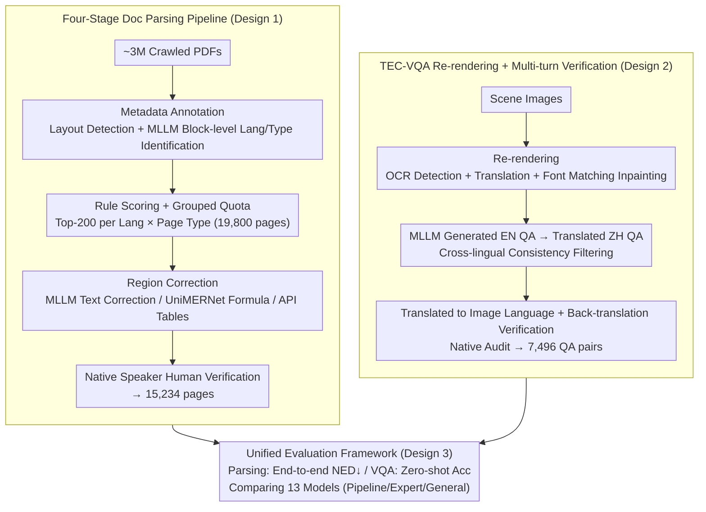

# SEA-Vision: A Multilingual Benchmark for Document and Scene Text Understanding in Southeast Asia

**Conference**: CVPR 2026  
**arXiv**: [2603.15409](https://arxiv.org/abs/2603.15409)  
**Code**: None  
**Area**: Multilingual Document Understanding  
**Keywords**: Multilingual Benchmark, Southeast Asia, Document Parsing, Text VQA, Low-resource Languages, MLLM Evaluation

## TL;DR

The authors introduce the SEA-Vision benchmark, which provides a unified evaluation for document parsing (15,234 pages) and text-centric VQA (7,496 QA pairs) across 11 Southeast Asian languages. By employing a re-rendering strategy to eliminate visual-text misalignment in multilingual VQA, the study reveals a 3–7x performance degradation in MLLMs when handling low-resource Southeast Asian languages.

## Background & Motivation

**Background**: Multilingual document and scene text understanding have become core capabilities in fields such as search, finance, and public services. While MLLMs like GPT-4o and the Qwen-VL series perform exceptionally well in English and Chinese, existing benchmarks (e.g., DocVQA, TextVQA, MTVQA) are heavily biased toward high-resource languages.

**Limitations of Prior Work**: (1) Document parsing and text-centric VQA are typically evaluated independently, making it impossible to unify the measurement of text recognition and reasoning; (2) Multilingual VQA datasets often adopt OCR/translation-based annotation strategies—where translated questions reference text that does not exist in the original image, causing severe visual-semantic misalignment; (3) The 11 Southeast Asian (SEA) languages span four major writing systems (Latin, Brahmic, Arabic, and Ideographic), yet existing benchmarks provide minimal coverage.

**Key Challenge**: Southeast Asia is one of the most linguistically diverse regions globally. Practical applications involve dense layouts, complex scripts, and heterogeneous document types. However, no existing benchmark covers major SEA languages while supporting cross-task and cross-script evaluation. MTVQA includes only 9 languages (2 low-resource) and focuses solely on VQA, while CC-OCR covers 10 languages but only 1 low-resource case.

**Goal**: (1) Construct the first unified Southeast Asian multilingual benchmark for document parsing and TEC-VQA; (2) Design an annotation methodology that resolves visual-text misalignment; (3) Quantify the actual capabilities of MLLMs in low-resource SEA languages.

**Key Insight**: A hybrid annotation pipeline (automatic filtering + MLLM-assisted annotation + native speaker verification) is designed. A re-rendering strategy is used to "paint" translated text back into images, eliminating visual-text misalignment at the source.

**Core Idea**: By using re-rendering to ensure consistent visual text and QA language, the authors build a high-quality benchmark covering 11 SEA languages for unified evaluation of document parsing and scene text VQA.

## Method

### Overall Architecture

SEA-Vision consists of two sub-tasks: (1) Document Parsing—structured content extraction from document images (15,234 pages across 9 types: academic papers, books, exam papers, magazines, newspapers, notes, research reports, slides, textbooks), with 243,643 hierarchical region annotations (page/block/line levels); (2) TEC-VQA—1,839 scene images and 7,496 QA pairs covering five reasoning dimensions (text recognition, numerical calculation, comparative analysis, logical reasoning, and spatial understanding). The 11 languages include EN, ZH, VI, TH, FIL, MS, ID, LO, KM, MY, and PT. The benchmark is produced via two parallel annotation pipelines (Document Parsing and TEC-VQA) and integrated into a unified evaluation framework to compare various model types.

### Key Designs

**1. Four-Stage Document Parsing Pipeline: Selecting Balanced and Reliable Pages from ~3M PDFs**

The difficulty with low-resource languages lies not in the lack of web documents, but in their inconsistent quality and messy layouts. SEA-Vision employs a four-stage pipeline to handle large-scale automatic annotation and linguistic balance simultaneously. Stage 1 involves metadata annotation: layout detection models segment pages into 10 region types, and MLLMs perform block-level language identification and page classification. Stage 2 uses rule-based scoring to calculate a weighted score for each page:

$$\text{Score} = 30 \cdot S_1 + 30 \cdot S_2 + 20 \cdot S_3 + 10 \cdot S_4 + 10 \cdot S_5$$

where $S_1$ is the number of blocks, $S_2$ is the text area ratio, $S_3$ is type diversity, and $S_4/S_5$ indicate the presence of images/tables. Crucially, the authors select the **Top-200 pages per Language × Page Type** (200 × 11 languages × 9 types = 19,800 pages), using grouped quotas to flatten the language distribution. Stage 3 performs region correction using MLLMs for OCR errors, UniMERNet for formulas, and Intsig APIs for table structures. The final stage involves native speaker verification of layout integrity, OCR reliability, sensitive content, and cross-validation of re-rendered tables/formulas, resulting in the final 15,234 pages.

**2. TEC-VQA Re-rendering + Multi-turn Cross-lingual Verification: Aligning QA References with Visual Text**

This design addresses a long-standing issue in multilingual VQA: typically, images remain unchanged while only QA text is translated, leading to misalignments where referenced text is absent from the original image. SEA-Vision's **re-rendering strategy** detects text regions via OCR, translates them, performs font matching, and uses inpainting to render the text back into the image. This ensures the visible text matches the QA language. To suppress hallucinations, MLLMs generate English QA pairs, which are translated into Chinese for independent answering. Only pairs passing this cross-lingual consistency check are translated into the final target language. Native speakers then perform back-translation and final audits to standardize numbers, units, and alignment.

**3. Unified Evaluation Framework: Measuring Recognition and Reasoning on a Single Scale**

Previously, text recognition and text-based reasoning were measured by separate benchmarks, making it difficult to determine if a model failed due to "reading" or "reasoning." SEA-Vision unifies these: document parsing is measured by end-to-end NED (Normalized Edit Distance, lower is better), comparing 13 models across three paradigms (Pipeline, Expert, General). TEC-VQA uses a standard zero-shot accuracy protocol. This allows for fair comparisons and precise localization of performance gaps across specific languages and capability dimensions.

### Loss & Training

This is a benchmark paper; no model training was performed. The authors provide a standardized evaluation protocol and public datasets for community use.

## Key Experimental Results

### Document Parsing (End-to-End NED ↓)

| Model Type | Model | EN | KM | LO | MY | Avg (11 Lang) |
|----------|------|-----|-----|-----|-----|------|
| Pipeline | PaddleOCR-VL | 0.108 | 0.634 | 0.648 | 0.456 | 0.238 |
| Expert | dots.ocr | 0.144 | 0.311 | 0.386 | 0.313 | **0.186** |
| General | Qwen3-VL-32B | 0.133 | 0.727 | 0.406 | 0.479 | 0.225 |
| General | Gemini2.5-Pro | 0.154 | 0.278 | 0.195 | 0.214 | **0.159** |
| General | GPT-4o | 0.197 | 0.611 | 0.610 | 0.423 | 0.313 |

### Cross-dimensional Analysis

| Dimension | Observation |
|----------|----------|
| High- vs. Low-resource | EN/ZH accuracy is ~60–70%, while KM/MY/LO is only 10–20% (**5–7× gap**) |
| Script Impact | Latin/Chinese script NED < 0.2; Brahmic/Burmese/Khmer script NED > 0.5 (**3–5× gap**) |
| Document Type | Newspapers (NED=0.313) are most difficult; Slides (0.159) are easiest |
| Capability Dimension | Spatial understanding and logical reasoning are significantly weaker than text recognition |

### Key Findings

- Gemini2.5-Pro performs best overall (Avg NED 0.159), showing a clear advantage in low-resource languages like LO/KM.
- Even the strongest closed-source models exhibit massive performance gaps in KM and MY.
- Models generalize well to Latin-script languages but show almost no effective generalization to unique writing systems.

## Highlights & Insights

- **First Unified SEA Multilingual Benchmark**: Covers 11 languages including 7 low-resource cases, filling a critical gap left by benchmarks like CC-OCR (only 1 low-resource language).
- **Methodological Contribution of Re-rendering**: Using font-matched inpainting to re-render translated text into images is a strategy that can be extended to other multilingual vision data construction tasks.
- **Multi-turn Cross-lingual Consistency Verification**: The filter-verification loop (EN-ZH consistency → Back-translation → Native audit) effectively suppresses MLLM hallucinations and translation errors.
- **Quantifying the Multilingual Bottleneck**: The 3–5× NED gap and 5–7× accuracy gap provide clear targets for future model improvements.

## Limitations & Future Work

- Sample sizes for ultra-low resource languages (LO/KM/MY) are ~100–200 pages per type, which may lack statistical precision.
- Re-rendering artifacts (font/layout differences) might introduce bias; this was not quantified.
- The benchmark covers 9 printed document types but ignores handwritten text, receipts, and invoices.
- As an evaluation benchmark, it lacks a training set for direct model fine-tuning.
- No specific model architectural improvements or data augmentation strategies for low-resource SEA languages are proposed.

## Related Work & Insights

- **vs MTVQA**: Covers 9 languages (2 low-resource) and 6,778 QA pairs for VQA only. SEA-Vision covers 11 languages (7 low-resource), 7,496 QA pairs, and 15,234 pages for dual-task evaluation.
- **vs CC-OCR**: Covers 10 languages but only 1 low-resource, with only 800 parsing pages.
- **vs OmniDocBench/Fox**: Limited to EN+ZH, with no low-resource language coverage.
- The re-rendering strategy provides inspiration for large-scale multilingual document pre-training—rendering English documents into multiple languages for continual pre-training.

## Rating

- Novelty: ⭐⭐⭐ (Benchmark-focused, innovation lies in the pipeline design).
- Experimental Thoroughness: ⭐⭐⭐⭐⭐ (Covers 13 models across 3 paradigms in 11 languages).
- Writing Quality: ⭐⭐⭐⭐ (Clear scoring mechanisms and pipeline descriptions).
- Value: ⭐⭐⭐⭐⭐ (Fills a major void in SEA multilingual evaluation).

<!-- RELATED:START -->

## Related Papers

- [\[CVPR 2026\] MMTIT-Bench: A Multilingual and Multi-Scenario Benchmark with Cognition-Perception-Reasoning Guided Text-Image Machine Translation](mmtit-bench_a_multilingual_and_multi-scenario_benchmark_with_cognition-perceptio.md)
- [\[ACL 2025\] CruxEval-X: A Benchmark for Multilingual Code Reasoning, Understanding and Execution](../../ACL2025/multilingual_mt/cruxeval-x_a_benchmark_for_multilingual_code_reasoning_understanding_and_executi.md)
- [\[ACL 2026\] IndoTabVQA: A Benchmark for Cross-Lingual Table Understanding in Bahasa Indonesia Documents](../../ACL2026/multilingual_mt/indotabvqa_a_benchmark_for_cross-lingual_table_understanding_in_bahasa_indonesia.md)
- [\[ACL 2025\] EXECUTE: A Multilingual Benchmark for LLM Token Understanding](../../ACL2025/multilingual_mt/execute_a_multilingual_benchmark_for_llm_token_understanding.md)
- [\[ACL 2025\] MTVQA: Benchmarking Multilingual Text-Centric Visual Question Answering](../../ACL2025/multilingual_mt/mtvqa_benchmarking_multilingual_text-centric_visual_question_answering.md)

<!-- RELATED:END -->
