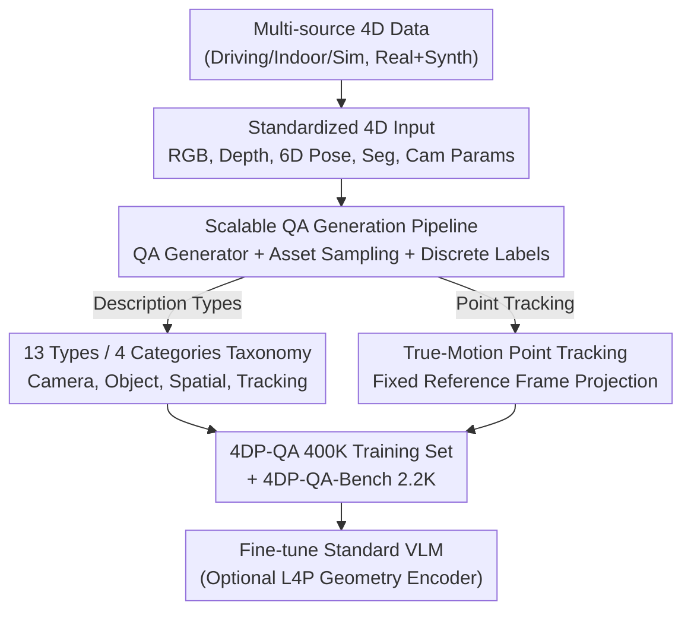

# 4DP-QA: Scalable QA for 4D Perception in Vision Language Models

**Conference**: CVPR 2026  
**Paper**: [CVF Open Access](https://openaccess.thecvf.com/content/CVPR2026/html/Cho_4DP-QA_Scalable_QA_for_4D_Perception_in_Vision_Language_Models_CVPR_2026_paper.html)  
**Code**: TBD  
**Area**: Multimodal VLM  
**Keywords**: 4D Perception, QA Dataset, True-Motion Point Tracking, Camera-Object Motion Decoupling, Spatiotemporal Reasoning  

## TL;DR
This paper designs a scalable spatiotemporal QA automatic generation pipeline, producing 400,000 training samples (4DP-QA) and a 2.2K benchmark (4DP-QA-Bench) from various real/synthetic 4D data sources. It introduces "true-motion point tracking" as a new perception task to decouple object motion from camera motion. By fine-tuning standard VLMs with this data, 4D perception accuracy increases from ~42% to ~84%, with generalization to the external benchmark VLM4D.

## Background & Motivation

**Background**: VLMs have achieved proficiency in semantic understanding of images/videos and even static 3D scene understanding. However, they struggle with "motion," a ubiquitous physical phenomenon.

**Limitations of Prior Work**: Two main issues exist. First, imaging challenges—the world is 4D (3D + motion), yet projected onto a 2D sensor that is often in motion itself. Depth cues are lost, and more critically, **absolute object motion and camera motion are entangled**: if a camera moves rapidly to the right, the pixel trajectory of a cat walking forward may appear "backward" (see Fig. 2 in the original paper). Second, data challenges—existing training sets mostly label "apparent motion" on the 2D image plane without decoupling camera and object motion, lacking explicit 3D geometric annotations. Specialized dynamic 3D datasets are either small-scale or restricted to specific scenarios like autonomous driving.

**Key Challenge**: To truly understand 4D, a model needs to know "how the object actually moves in the world," but it only observes "how the object appears to move when projected onto a moving camera." These two are fundamentally different during camera motion, and existing data fails to distinguish between them for the model.

**Goal**: (1) Build a large-scale 4D understanding QA dataset covering multiple scenarios that explicitly distinguishes camera and object motion; (2) Introduce a perception task to VLMs that directly expresses "true object motion"; (3) Verify whether standard VLM architectures can spontaneously develop 4D understanding capabilities given sufficient high-quality data.

**Key Insight**: The authors bet on scaling—since large models exhibit emergent capabilities with enough quality data, 4D understanding might emerge in "largely standard" VLM architectures. The key lies not in modifying the architecture but in **generating the right data**. Thus, focus is placed on a scalable pipeline that systematically translates continuous geometric quantities (camera poses, depth, 6D object poses) into natural language QA.

**Core Idea**: Use a pipeline to automatically convert precise geometric annotations into QA pairs at scale, and introduce the "true-motion point tracking" task—projecting 3D trajectories into a fixed reference frame to isolate object motion from camera motion.

## Method

### Overall Architecture

This work is a **data-driven** solution: it retains the VLM backbone and fosters 4D understanding through data generation and fine-tuning. The pipeline consists of three stages: first, diverse data sources (driving, indoor egocentric, physical simulation, real, and synthetic) are unified into a standard 4D format (RGB, depth, 6D object pose, instance segmentation, intrinsic/extrinsic camera parameters). Next, a QA generator samples these standardized data points, determines if the motion is "sufficient," discretizes continuous geometric quantities into categorical labels, and instantiates predefined templates across 13 question types and 4 major categories. The point tracking questions utilize the proposed "true-motion point tracking" representation. Finally, 400,000 training samples (4DP-QA) and 2.2K benchmark items (4DP-QA-Bench) are produced. Optionally, a pretrained geometry encoder (L4P) can be injected into the VLM to further boost performance.

### Key Designs

**1. True-Motion Point Tracking: Decoupling Object and Camera Motion via Fixed Reference Frame Projection**

As the most critical new concept, this addresses the "camera-object motion entanglement" issue. For a 3D point trajectory $\{X[t]\}$ within a time window $[0, T)$, with camera extrinsics $\{T[t]\}$ and intrinsics $K$, there are two ways to project the 3D trajectory into 2D. Traditional **visual point tracking** uses the respective camera of each frame for projection:

$$P_{2D} = \{p[t]\}_{t\in[0,T)} = \{\Pi(K, T[t], X(t))\}_{t\in[0,T)}$$

Since it is imaged by a "constantly moving camera," object and camera motions are entangled. The proposed **true-motion point tracking** projects all 3D points using **the camera from a single fixed reference time $t_q$**:

$$M_{2D} = \{m_{t_q}[t]\}_{t\in[0,T)} = \{\Pi(K, T[t_q], X(t))\}_{t\in[0,T)}$$

Note that in the formula, the camera extrinsic is fixed to $T[t_q]$ and no longer varies with $t$. The resulting trajectory is equivalent to "pretending a static camera is watching," thereby decoupling the true motion: background points remain stationary in $M_{2D}$, while the cat is shown moving forward (Fig. 2). When the camera is originally static ($T[t]=T[t_q]$), both trajectories are identical. This is effective because it provides the VLM with an intuitive motion representation that is **image-aligned yet eliminates camera interference**: the model only needs to read the trajectory in a fixed coordinate system to judge true object motion. The two trajectory types are complementary—visual tracking forces the model to capture dense correspondences tied to appearance changes, while true-motion tracking teaches it to reason about object motion in a stable frame.

**2. Scalable QA Generation Pipeline: Translating Continuous Geometry into Natural Language QA**

This acts as the engine for data scaling. After receiving standardized 4D input, the pipeline runs three components. The **QA Generator** is central: it samples from a set of predefined templates (slots for object references, time instances, coordinate systems, etc., with categorical or continuous answers) and uses an LLM (Gemini-2.5-Pro) to generate diverse phrasing to avoid monotony. The **Asset Sampling** component selects suitable video clips based on heuristic rules tuned for each data source (e.g., specific camera or object motion characteristics). **Discrete Label Generation** maps continuous geometric quantities into categories: 3D translation $\rightarrow$ combinations of (forward/backward, left/right, up/down), 3D rotation $\rightarrow$ (yaw, pitch, roll), 3D distance $\rightarrow$ (increasing, decreasing, constant). Thresholds are carefully tuned per data source. The benchmark portion also undergoes **multiple rounds of manual verification**.

**3. 13 Type / 4 Category Data Taxonomy and Anti-shortcut Design**

The taxonomy organizes questions into: **(I) Camera Motion** (translation/rotation, camera-object distance); **(II) Object Motion** (rotation from bird's eye view, translation relative to the first frame, agent motion in its own frame, distance comparison between objects); **(III) 3D Spatial Understanding** (depth comparison, intra-frame and cross-frame distance reasoning); **(IV) Point Tracking** (visual $P_{2D}$ and true-motion $M_{2D}$ with coordinates and visibility flags). To prevent models from using "autoregressive extrapolation shortcuts"—where the model predicts subsequent coordinates linearly without looking at the image—the authors **randomly shuffle the order of the trajectory frames** in the output and explicitly provide the required frame indices in the query.

**4. Geometry Encoder Injection (L4P) and Two-Stage Training (Optional)**

To further validate the value of geometric information, a "4D VLM" variant is created by injecting features from a universal geometry encoder, **L4P** (pretrained on depth, optical flow, and tracking tasks). Features are projected via an MLP and **interleaved** with visual tokens from the image encoder. Training is two-stage with **frozen visual and geometry encoders**: first, train the MLP projection head on 200K samples; second, unfreeze the LLM and both projection heads to train on the full dataset.

### Loss & Training
Standard VLMs (NVILA-Lite-8B, Qwen2.5-VL-3B/7B) are trained for 1 epoch with a batch size of 128, AdamW + cosine scheduler. NVILA uses a learning rate of $2\times10^{-5}$, and Qwen series use $1\times10^{-5}$. The visual encoder is frozen. 32 frames per video are sampled at $448\times448$ resolution. Coordinates are normalized to $[0,1]$ with three decimal places.

## Key Experimental Results

### Main Results

Performance on 4DP-QA-Bench (Accuracy %, Overall Avg.). Random baseline is 40.8%. Off-the-shelf open-source VLMs perform near random levels, but fine-tuning with 4DP-QA allows them to surpass the strongest closed-source model, Gemini-2.5-Pro:

| Model | Camera Motion | Object Motion | 3D Spatial | Overall |
|------|---------|---------|---------|---------|
| Random | 41.5 | 28.5 | 50.0 | 40.8 |
| GPT-4o | 52.1 | 41.7 | 65.2 | 53.8 |
| Gemini-2.5-Pro (Strongest Closed) | 63.2 | 50.8 | 82.2 | 66.8 |
| Qwen2.5-VL-3B (Baseline) | 47.1 | 36.9 | 54.4 | 46.7 |
| **+ 4DP-QA** | 81.3 | 73.9 | 86.8 | **81.3** (+34.6) |
| Qwen2.5-VL-7B (Baseline) | 39.5 | 45.1 | 56.1 | 46.6 |
| **+ 4DP-QA** | 84.4 | 79.6 | 88.1 | **84.3** (+37.7) |
| NVILA-Lite-8B (Baseline) | 42.4 | 26.0 | 55.4 | 42.3 |
| **+ 4DP-QA** | 83.5 | 81.6 | 88.6 | **84.4** (+42.1) |

Generalization on the external benchmark VLM4D (Accuracy %). Fine-tuning leads to significant gains; Qwen2.5-VL-7B+4DP-QA surpasses all off-the-shelf models:

| Model | Real | Synthetic | Overall |
|------|------|-----------|---------|
| Gemini-2.5-Pro | 62.7 | 62.9 | 62.8 |
| Qwen2-VL-7B $\rightarrow$ +4DP-QA | 52.9 $\rightarrow$ 60.6 | 50.6 $\rightarrow$ 73.0 | 52.3 $\rightarrow$ **63.6** |
| NVILA-Lite-8B $\rightarrow$ +4DP-QA | 43.2 $\rightarrow$ 56.4 | 41.4 $\rightarrow$ 73.3 | 42.8 $\rightarrow$ **60.5** |

### Ablation Study

Building on Std-4DP-QA (standard descriptive QA only), tracking tasks and the L4P geometry encoder are added. Results for NVILA-Lite-8B (%):

| Configuration | 4DP-QA Overall | VLM4D Real | VLM4D Synthetic |
|------|----------------|------------|------------------|
| (I) Baseline | 42.3 | 43.2 | 41.4 |
| (II) + Std-4DP-QA | 85.9 | 54.9 | 56.4 |
| (III) (II) + True-Motion TM | 84.4 | 56.4 | 73.3 |
| (IV) (II) + Visual Track PT | 84.5 | 54.4 | 63.6 |
| (V) (II) + PT + TM | 85.4 | 55.4 | 66.3 |
| (VI) (III) + Geometry Encoder L4P | 87.7 | 51.8 | **85.4** |

### Key Findings
- **Data is more critical than architecture**: Without changing the VLM backbone, fine-tuning only on 4DP-QA improved Overall scores by +34.6 to +42.1 points.
- **True-Motion (TM) tracking contributes most to 4D generalization**: On external VLM4D, **adding TM alone** yielded the best average results.
- **Geometry encoders provide gains with caveats**: L4P pushed the VLM4D synthetic score to 85.4% but caused a **drop on the real set** (56.4 $\rightarrow$ 51.8). This is attributed to the mismatch between the encoder's dense video training and the VLM's sparse 32-frame sampling.
- **Standard open-source VLMs suffer from systematic bias**: In many categories, baseline accuracy was **lower than random**, indicating a lack of true understanding of 3D structures.

## Highlights & Insights
- **"Fixed reference frame projection" is a simple yet effective decoupling strategy**: It separates object motion from camera motion in the representation layer without requiring a complex 3D reconstruction module in the VLM.
- **Converting perception tasks to QA for general VLMs**: Tasks like optical flow or point tracking are packaged as QA pairs, avoiding the complexity of stitching specialized models into the VLM.
- **Practical anti-shortcut design**: Shuffling output frames forces the model to actually process the image rather than performing linear extrapolation.
- **Small models can match large ones**: A 3B model fine-tuned on this data can match the performance of a 32B model, proving that "the right data > more parameters."

## Limitations & Future Work
- **Geometry encoder issues with long real videos**: Mismatched sampling rates led to performance drops on the real set.
- **Dependency on high-quality geometric labels**: The pipeline requires accurate depth and poses; scaling to "in-the-wild" videos depends on the noisy output of 4D reconstruction methods.
- **Manual thresholds for discrete labels**: Heuristics and thresholds are manually designed per data source, which may limit transferability to new domains.
- **Exact string matching for evaluation**: This may be sensitive to phrasing and underestimate semantically correct responses.

## Related Work & Insights
- **vs SpatialVLM**: While SpatialVLM proved quantitative spatial reasoning is possible with 2D input, it focuses on static relationships. 4DP-QA tackles **dynamic 4D**.
- **vs VLM-3R / 3D VLM**: These focus on static geometry via depth projection. 4DP-QA focuses on **motion**.
- **vs 4D tracking methods**: While dedicated trackers are accurate, they are specialized. 4DP-QA sacrifices some accuracy for the versatility of a general VLM.

## Rating
- Novelty: ⭐⭐⭐⭐⭐ True-motion point tracking via fixed frame projection is a clean and effective task definition.
- Experimental Thoroughness: ⭐⭐⭐⭐ Extensive model coverage and benchmarks, though "in-the-wild" generalization remains unquantified.
- Writing Quality: ⭐⭐⭐⭐ Clear explanations of the taxonomy and pipeline.
- Value: ⭐⭐⭐⭐⭐ Large-scale dataset and benchmark provide a scarce and valuable asset for the 4D VLM field.

<!-- RELATED:START -->

## Related Papers

- [\[CVPR 2026\] VKG-QA: Visual Knowledge Graph-based Question Answer for Large Multimodal Models](vkg-qa_visual_knowledge_graph-based_question_answer_for_large_multimodal_models.md)
- [\[CVPR 2026\] M3Grounder: Mask-Based Multi-Span and Multi-Granular Grounding for Document QA](m3grounder_mask-based_multi-span_and_multi-granular_grounding_for_document_qa.md)
- [\[CVPR 2026\] HanDyVQA: A Video QA Benchmark for Fine-Grained Hand-Object Interaction Dynamics](handyvqa_a_video_qa_benchmark_for_fine-grained_hand-object_interaction_dynamics.md)
- [\[CVPR 2026\] VinQA: Visual Elements Interleaved Long-form Answer Generation for Real-World Multimodal Document QA](vinqa_visual_elements_interleaved_long-form_answer_generation_for_real-world_mul.md)
- [\[CVPR 2026\] R4: Retrieval-Augmented Reasoning for Vision-Language Models in 4D Spatio-Temporal Space](r4_retrieval-augmented_reasoning_for_vision-language_models_in_4d_spatio-tempora.md)

<!-- RELATED:END -->
