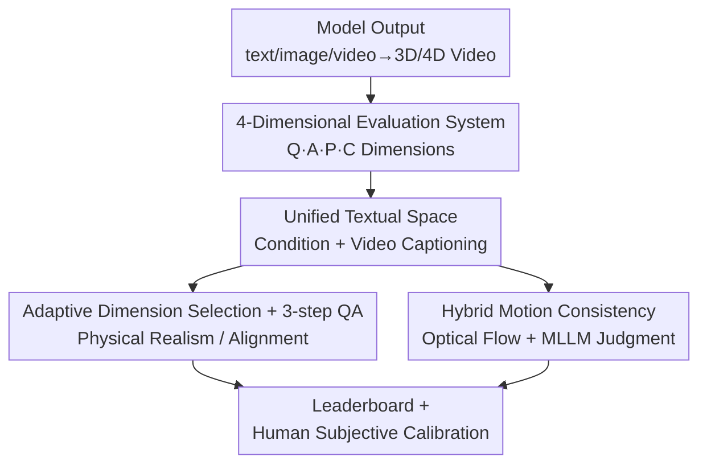

# 4DWorldBench: A Comprehensive Evaluation Framework for 3D/4D World Generation Models

**Conference**: CVPR 2026  
**Paper**: [CVF Open Access](https://openaccess.thecvf.com/content/CVPR2026/html/Lu_4DWorldBench_A_Comprehensive_Evaluation_Framework_for_3D4D_World_Generation_Models_CVPR_2026_paper.html)  
**Code**: https://yeppp27.github.io/4DWorldBench (Project Page)  
**Area**: World Generation Evaluation / 3D Vision / Multimodal Evaluation  
**Keywords**: World Generation Models, Evaluation Benchmark, Physical Realism, 4D Consistency, LLM-as-judge

## TL;DR
4DWorldBench proposes a unified, multimodal, physics-aware 4D world generation evaluation framework. By mapping text/image/video conditions into a unified textual space, it evaluates models across four dimensions: Perceptual Quality, Condition-4D Alignment, Physical Realism, and 4D Consistency. It employs an adaptive hybrid scoring strategy involving LLM-as-judge, MLLM-as-judge, and traditional metrics, validated by human subjective experiments to be more aligned with human judgment than existing benchmarks.

## Background & Motivation

**Background**: World generation models are becoming the foundation of next-generation multimodal intelligence. Beyond 2D frame fidelity, these models aim to generate 3D/4D worlds from text, image, or video prompts that are self-consistent in space, time, physics, and instruction control, serving applications in VR, autonomous driving, and embodied AI. Evaluation benchmarks are generally categorized into three types: video-centric (VBench, VBench2.0), world-generation-oriented (WorldScore, WorldSimBench), and physics-aware (PhyGenBench, VideoPhy, Physics-IQ).

**Limitations of Prior Work**: These three categories are fragmented and lack comprehensive coverage. Video benchmarks rely on manually predefined question templates, providing only coarse-grained assessment of physical realism and 4D consistency. World generation benchmarks lack fine-grained "condition-4D alignment" and physical realism coverage. Physics-aware benchmarks are often limited by manual rules and lack modality diversity, semantic richness, and scalability. As highlighted in Table 1, no single benchmark supports all four dimensions: Perceptual Quality (Q), Condition Alignment (A), Physical Realism (P), and 4D Consistency (C).

**Key Challenge**: Evaluation of world generation is essentially a Cartesian product of **multimodal conditions $\times$ multiple evaluation dimensions**. Conditions can be text, image, or video, while dimensions range from low-level image quality to high-level physical reasoning. Single scoring tools (whether feature similarity or specific MLLMs) cannot cover the full spectrum: feature similarity is easily "cheated" by videos with minimal motion; MLLMs excel at surface-level VQA but struggle with complex physical reasoning (fluids, forces); LLMs have strong reasoning but cannot process video directly.

**Goal**: To build a general-purpose, multimodal, physics-aware, and scalable **unified framework** that integrates evaluation across four dimensions and supports all task settings: Image-to-3D/4D, Video-to-4D, and Text-to-3D/4D.

**Key Insight**: Instead of designing separate tools for every condition and dimension, the framework **maps all modal conditions into a unified textual space**. Images and videos are first captioned into text to align heterogeneous conditions into a single representation. Subsequently, LLMs (best at abstract reasoning) handle physical judgment, MLLMs handle alignment requiring visual grounding, and traditional metrics handle low-level signals via adaptive task allocation.

**Core Idea**: Transforming "video evaluation" into a QA-based paradigm: "Convert conditions and generated results to text $\rightarrow$ LLM/MLLM adaptively generate and answer diagnostic questions $\rightarrow$ Score based on accuracy." This is combined with traditional metrics to create a cross-modal, scalable evaluation standard that closely aligns with human judgment.

## Method

### Overall Architecture
4DWorldBench is an **evaluation framework** rather than a generative model. It takes a "3D/4D video generated by a model under given conditions (text/image/video)" as input and outputs scores across four dimensions and a total rank. The pipeline consists of four serial steps: ① Providing evaluation conditions using a curated multimodal dataset covering physics and non-physics domains; ② Converting non-text conditions and generated videos into text captions to enter a unified textual space; ③ Applying specific evaluation tools across four dimensions (Quality, Alignment, Realism, Consistency), where Physics and Alignment follow the "Adaptive Dimension Selection + 3-step QA" process, and motion consistency in 4D Consistency uses a hybrid "Optical Flow Similarity + MLLM-as-judge" strategy; ④ Aggregating results into a leaderboard and calibrating reliability via human subjective experiments.

### Key Designs

**1. 4-Dimensional Evaluation System: Decomposing "World Realism"**

4DWorldBench defines four complementary dimensions. **Perceptual Quality** is subdivided into: Spatial Quality (CLIPIQA+ for technical quality and CLIP-Aesthetic for aesthetics); Temporal Quality (FastVQA for inter-frame stability); and 3D Texture (mPLUG-Owl3 scoring). **Condition-4D Alignment** measures how faithfully the result follows input conditions (events/motion/attributes/scene) via the QA pipeline. **Physical Realism** measures compliance with natural laws via the QA pipeline. **4D Consistency** evaluates spatio-temporal stability from three angles: 3D Consistency (dense differentiable SLAM reconstruction with reprojection error calculated on short segments); Motion Consistency (hybrid strategy); and Style Consistency (Gram matrix of deep features across frames). This allows for diagnostic analysis: identifying that while style and scene semantics are largely solved, motion control and physical realism remain common weaknesses.

**2. Unified Text Space + Hybrid Evaluation: Divider and Conquer**

To handle heterogeneous modalities, the framework uses Keye-VL 1.5 to caption both the condition $C$ and the generated 4D video $V$ into text captions $\hat{T}$. This aligns inputs into a **Unified Text Space**. Metrics are then categorized into four types: model-based scores, feature-based similarity, LLM-based QA, and MLLM-based QA. The key insight is that **LLM and MLLM have different strengths**: MLLMs are better at surface visual grounding (Condition Alignment); LLMs are superior at abstract/compositional reasoning (Fluid dynamics, force interactions) once provided with high-quality descriptions (Physical Realism).

**3. Adaptive Dimension Selection + 3-step QA: Quantifying Physics and Alignment**

Physical Realism and Condition Alignment are quantified using a **3-step QA framework**:
(1) **Captioning**: Convert condition $C$ and video $V$ into text $\hat{T}$.
(2) **Question Generation**: Generate diagnostic questions $\{Q_i\}_{i=1}^N$ based on the prompt and physical laws (e.g., "Does the can collapse inward after vacuuming?").
(3) **Scoring**: LLM predicts answers $\{\hat{A}_i\}$ based on caption $\hat{T}$, compared against expected answers $\{A_i^*\}$. The binary score is $s_i = \mathbb{1}(\hat{A}_i = A_i^*)$, with the final average:

$$S_{phy} = \frac{1}{N}\sum_{i=1}^{N} s_i, \quad S_{phy} \in [0,1]$$

The **AdaDimen (Adaptive Dimension Selection)** allows the LLM to select only **relevant** physical dimensions for a given input (e.g., mechanics for a vacuum can, thermal for a heating scene), which significantly improves alignment with human scores compared to fixed dimensions.

**4. Hybrid Motion Consistency: Closing the "Micro-motion" Loophole**

Feature-based optical flow similarity can be cheated by **videos with only subtle, unintentional motion**, leading to inflated scores. The framework adds an MLLM-as-judge component to perform yes/no QA on video-object motion reasonableness—evaluating continuity, interaction, and trajectory. This hybrid approach ensures low-level signal monitoring while using semantic judgment to filter out "static" deceptive samples.

## Key Experimental Results

### Main Results: 4D / 3D Generation Leaderboard
The framework evaluates various models. Representative total scores for 4D models (Table 2) and 3D models (Table 3) are shown below.

| Task Category | Model | Physical (Mech/Motion/Dyn) | 4D Consist (View/Motion/Style) | Overall |
| :--- | :--- | :--- | :--- | :--- |
| Image-to-4D | DiffusionAsShader | 0.781 / 0.688 / 0.850 | 0.874+0.750 / 0.918 | **0.763** |
| Image-to-4D | CamI2V | 0.756 / 0.650 / 0.738 | 0.553+0.816 / 0.887 | 0.697 |
| Video-to-4D | ReCamMaster | 0.796 / 0.680 / 0.714 | 0.859+0.834 / 0.985 | 0.685 |
| Text-to-4D | 4Dfy | 0.545 / 0.265 / 0.417 | 0.934+0.705 / 0.993 | 0.535 |

**Key Findings**: ① Regarding Physical Realism, video-based models (ReCamMaster) lead in dynamic/optic dimensions. Image-conditioned models like DiffusionAsShader perform best in their category, while text-conditioned models consistently lag, indicating that visual inputs provide much stronger physical grounding. ② Styles and scene-level semantics are largely mature, but **motion control, temporal reasoning, and physical realism** are common bottlenecks.

### Ablation Study: Metric Reliability vs. Human Judgment
Reliability was verified using PLCC/SRCC correlations with human scores.

| Setting | Judge | Dimension | #Questions | PLCC / SRCC |
| :--- | :--- | :--- | :--- | :--- |
| VBench2 | MLLM (Llava-Video) | FixDimen | 2 | 0.341 / 0.379 |
| Ours-v1 | LLM (GPT-5→GPT-5) | FixDimen | 10 | 0.351 / 0.402 |
| Ours-v2 | LLM (GPT-5→GPT-5) | **AdaDimen** | 10 | **0.452 / 0.461** |

Findings: ① **LLM-as-judge consistently outperforms MLLM-based judgment** (0.452 vs 0.341) for physics. ② **More questions** (2 $\rightarrow$ 10) improve reliability. ③ **AdaDimen significantly outperforms FixDimen** (0.452 vs 0.351) by focusing only on semantically relevant physical dimensions.

## Highlights & Insights
- **"Caption first, LLM later" bypasses MLLM physics weaknesses**: Converting the difficult task of "watching video" into "reading text + abstract reasoning" assigns the task to the most capable model type.
- **Hybrid Motion Consistency as a safeguard**: Explicitly addressing how feature similarity is tricked by micro-motions by adding an MLLM semantic check is a practical engineering insight.
- **Scalability of the Unified Framework**: The 4-dimensional system with a unified textual space allows new tasks (e.g., Image-to-3D) to be integrated into the leaderboard without re-designing the entire setup.
- **Training-free yet more reliable**: Outperforming training-based methods like VideoPhy2 on physical benchmarks demonstrates that high-quality prompting and role division can replace specialized training.

## Limitations & Future Work
- **Reliability on Caption Quality**: The physics and alignment evaluations depend entirely on Keye-VL 1.5's ability to translate video to text. If critical physical details are missed in captioning, the error propagates.
- **Binary Scoring Limitations**: Using $s_i = \mathbb{1}(\hat{A}_i = A_i^*)$ may be too coarse for "partially correct" physical behaviors.
- **Sample Size**: The dataset uses 50-76 conditions per subset and 100 videos for the human study, which could be expanded for higher statistical confidence.

## Related Work & Insights
- **vs. WorldScore**: WorldScore focuses on sequence generation with camera trajectories but lacks fine-grained alignment and physical realism. 4DWorldBench completes the missing physical dimension and demonstrates higher human correlation.
- **vs. VBench/VBench2.0**: VBench uses MLLM templates for attributes like identity/motion. 4DWorldBench replaces fixed templates with LLM reasoning via unified textual mapping, providing full support for physical realism.
- **vs. PhyGenBench/VideoPhy2**: These rely on manual rules or are modality-specific. 4DWorldBench's training-free AdaDimen approach is more scalable and achieves comparable or better correlation.

## Rating
- Novelty: ⭐⭐⭐⭐ The "Unified Text Space + Adaptive LLM Task Division" is a genuine innovation in evaluation paradigms.
- Experimental Thoroughness: ⭐⭐⭐⭐ Broad coverage of 3D/4D leaderboards and human correlation, though subjective sets are relatively small.
- Writing Quality: ⭐⭐⭐ Clear framework definitions, although some table formatting and outlier data points (Hybrid row) could be better explained.
- Value: ⭐⭐⭐⭐ Provides a unified standard for world generation, bridging the gap between visual fidelity and physical/spatial world understanding.

<!-- RELATED:START -->

## Related Papers

- [\[CVPR 2026\] SpatialScore: Towards Comprehensive Evaluation for Spatial Intelligence](spatialscore_towards_comprehensive_evaluation_for_spatial_intelligence.md)
- [\[ACL 2025\] FlagEvalMM: A Flexible Framework for Comprehensive Multimodal Model Evaluation](../../ACL2025/multimodal_vlm/flagevalmm_a_flexible_framework_for_comprehensive_multimodal_model_evaluation.md)
- [\[CVPR 2026\] HOG-Layout: Hierarchical 3D Scene Generation, Optimization and Editing via Vision-Language Models](hog_layout_hierarchical_3d_scene_generation_optimization_and_editing.md)
- [\[CVPR 2026\] 4DP-QA: Scalable QA for 4D Perception in Vision Language Models](4dp-qa_scalable_qa_for_4d_perception_in_vision_language_models.md)
- [\[CVPR 2026\] CAD-Refiner: A Unified Framework for CAD Generation and Iterative Editing](cad-refiner_a_unified_framework_for_cad_generation_and_iterative_editing.md)

<!-- RELATED:END -->
