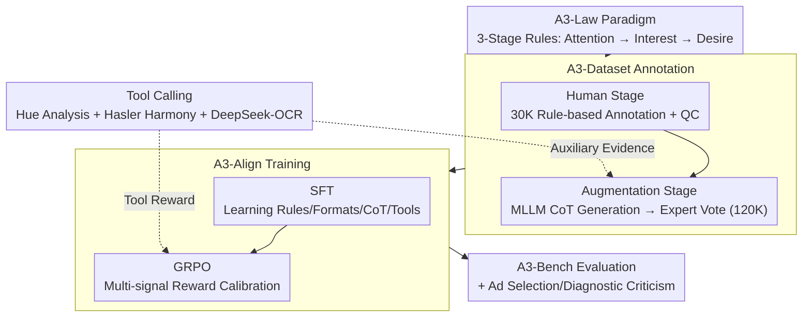

# A3: Towards Advertising Aesthetic Assessment

**Conference**: CVPR 2026  
**arXiv**: [2603.24037](https://arxiv.org/abs/2603.24037)  
**Code**: [https://github.com/euleryuan/A3-Align](https://github.com/euleryuan/A3-Align)  
**Area**: Multimodal VLM  
**Keywords**: Advertising Aesthetic Assessment, Multimodal Large Language Models, AIDA Model, Chain-of-Thought, GRPO

## TL;DR
The authors propose the A3 framework, which includes a theory-driven three-stage advertising aesthetic assessment paradigm A3-Law (Perceptive Attention → Formal Interest → Desire Impact), a dataset of 120,000 annotated samples (A3-Dataset), a model aligned via SFT and GRPO (A3-Align), and an evaluation benchmark (A3-Bench). It outperforms existing MLLMs in automated advertising aesthetic assessment.

## Background & Motivation

**Background**: Advertising images are critical for commercial conversion rates, but current assessment methods rely heavily on subjective human scoring, lacking scalability, standardized criteria, and interpretability. Automated systems are mostly restricted to simple threshold filtering and fail to provide diagnostic feedback.

**Limitations of Prior Work**: Although MLLMs possess strong vision-language understanding capabilities, they face three challenges in advertising aesthetic assessment: (1) performing only a single-step holistic scoring while ignoring the progressive human cognitive process; (2) unstable outputs and sensitivity to prompts; (3) frequent inconsistency between reasoning processes and final judgments.

**Key Challenge**: Advertising aesthetic assessment involves multi-level judgments ranging from low-level perception (image quality) to high-level cognition (emotional arousal and persuasiveness). Existing methods lack a methodology to translate abstract theories into executable assessment frameworks.

**Key Insight**: By drawing on the classic AIDA marketing model (Attention → Interest → Desire → Action), a multi-stage advertising aesthetic assessment framework can be constructed.

**Core Idea**: The advertising aesthetic assessment is decomposed into three levels (Perceptive Attention → Formal Interest → Desire Impact). Each level has a clear theoretical basis and operable assessment rules, supported by a CoT-guided dataset and GRPO alignment training.

## Method

### Overall Architecture
A3 is centered around the A3-Law theoretical paradigm, forming a pipeline of "Paradigm → Data → Model → Evaluation." A3-Law decomposes advertising aesthetics into three progressive stages: Perceptive Attention → Formal Interest → Desire Impact, with scoring rules assigned to each layer. A3-Dataset follows these rules through a two-stage annotation process: first, 30K advertising images are manually annotated as a foundation; then, MLLMs generate CoT reasoning chains to expand the dataset to 120K instruction-response pairs. A3-Align is trained on this data using SFT and GRPO to align with A3-Law. A3-Bench serves as a benchmark for evaluating MLLMs and supporting downstream applications. A suite of lightweight tool calls (Hue Analysis, Color Harmony, OCR) is integrated into data construction and GRPO training to anchor subjective judgments in objective measurements.

### Key Designs

**1. A3-Law: Decomposing AIDA Marketing Theory into Executable Assessment Stages**

Existing MLLMs typically provide a holistic score in one step, conflating distinct levels such as image clarity, color quality, and emotional impact. A3-Law leverages AIDA to split the assessment into three hierarchical layers, each tied to psychological principles and scoring rules. **Perceptive Attention** relates to Signal Detection Theory, where information must cross physiological thresholds before higher cognition occurs. This layer focuses on image signals: image fidelity (clarity/distortion), integration realism (consistency in lighting/shadow/perspective), and professional fineness (absence of artifacts). **Formal Interest** relates to Gestalt perceptual grouping, examining whether color and layout evoke interest. This is split into Color Construction (hue adaptability and color harmony quantified by Hasler metrics) and Spatial Construction (layout adaptability regarding hierarchy, focal points, and safe areas). **Desire Impact** relates to semiotics and emotional evaluation, assessing semantic and emotional value: copywriting tone, promotional icon identification (object detection), aesthetic attributes (intuitive pleasure), and advertising attributes (brand emotional connection and persuasiveness).

**2. A3-Dataset: Two-stage Annotation with Human Foundation and Model Scaling**

To enable models to learn these hierarchical rules, reliable and large-scale data with reasoning chains is required. A3-Dataset splits the process into two parts. In the human stage, 30K advertising images are collected and annotated according to A3-Law rules with quality control (objective accuracy >0.93, IoU >0.92, subjective SRCC >0.85). In the model augmentation stage, MLLMs generate CoT reasoning chains based on these annotations, expanding the 30K images into 120K instruction-response pairs as verified by a 5-expert panel with an 85% pass rate.

**3. A3-Align: Two-stage Training with SFT for Structure and GRPO for Behavior Calibration**

A3-Align uses a two-stage training approach to address format instability and reasoning-judgment inconsistency. The SFT stage focuses on learning A3-Law rules, output formats, and tool calling. The GRPO stage uses multi-signal rewards for fine calibration. Rewards include general rewards ($R_{format}$, $R_{nonrep}$) and rule-specific rewards ($R_{acc}$, $R_{tool}$, $R_{IoU}$). To align continuous scoring with human ratings, a Gaussian reward is used:

$$R_{score} = \exp\!\left(-\frac{(s-\hat{s})^2}{2\sigma^2}\right)$$

where $s$ is the predicted score and $\hat{s}$ is the human score. SFT ensures the model knows "how to write," while GRPO ensures "accuracy, evidence, and value alignment."

**4. Tool Calling: Anchoring Subjective Judgments in Objective Measurements**

Judgments on color harmony or copywriting tone can be subjective and sensitive to prompts. A3-Align incorporates three lightweight analytical tools: Hue Analysis, Color Harmony quantification (Hasler index), and DeepSeek-OCR. The model is trained to call these tools within the reasoning chain. Crucially, tool outputs serve as auxiliary evidence; the model retains the ability to make a synthesized judgment based on hierarchical rules rather than being mechanically overruled by a tool.

### Loss & Training
Normalized weighted total reward: $R_{total} = \frac{\sum_{i \in \mathcal{A}} \alpha_i R_i}{\sum_{i \in \mathcal{A}} \alpha_i}$, where subsets of rewards are activated based on the sample type.

## Key Experimental Results

### Main Results (Accuracy across A3-Bench Rules)

| Model | Image Fidelity | Integration Realism | Color Harmonization | Layout Adaptability | Aesthetic SRCC |
|------|:---:|:---:|:---:|:---:|:---:|
| Qwen3-VL-8B | 0.454 | 0.491 | 0.444 | 0.472 | 0.564 |
| Gemma-3-27B | 0.648 | 0.574 | 0.583 | 0.694 | 0.677 |
| GPT-4o | - | - | - | - | - |
| **A3-Align** | **Best** | **Best** | **Best** | **Best** | **Best** |

(In the full 10-dimensional evaluation, A3-Align significantly outperforms open-source and closed-source MLLMs across nearly all rules.)

### Ablation Study (Training Strategy)

| Configuration | Binary Rules Avg Acc | Aesthetic SRCC | Advertising SRCC |
|------|------|------|------|
| SFT Only | Baseline | Baseline | Baseline |
| SFT + GRPO (No Tools) | +Gain | +Gain | +Gain |
| SFT + GRPO (Full) | **Best** | **Best** | **Best** |

### Key Findings
- Even the strongest closed-source models (e.g., GPT-4o-thinking) perform poorly on A3-Law's hierarchical assessment, proving the necessity of domain alignment.
- Multi-signal rewards in the GRPO stage significantly improve performance across dimensions compared to SFT alone.
- Tool-calling mechanisms provide clear benefits for color and copywriting assessment.
- A3-Align demonstrates high practical value in downstream tasks like advertising selection and diagnostic criticism.

## Highlights & Insights
- **Theory-driven Assessment Framework**: Translating AIDA marketing theory into an executable three-stage computational paradigm is an excellent example of engineering cognitive psychology.
- **CoT + GRPO Alignment Strategy**: Using SFT for structure and GRPO for fine-grained calibration is a valuable reference for any scenario requiring LLM alignment with domain-specific standards.
- **Tool-augmented Reasoning**: Allowing models to invoke quantitative tools within reasoning chains anchors subjective judgments in objective measurements.

## Limitations & Future Work
- The Desire Impact stage of A3-Law is currently treated as a culturally universal framework, but advertising aesthetics are highly dependent on cultural contexts.
- Currently, only static images are handled; video and interactive advertising assessment remain unexplored.
- The diversity of the 30K images may be limited in specific vertical categories (e.g., luxury goods, FMCG) which might require finer rules.
- The choice of $\sigma$ in the Gaussian reward function impacts training stability and precision.

## Related Work & Insights
- **vs. AVA/AADB**: Traditional aesthetic datasets provide only single-dimension scores; A3-Dataset provides multi-level, multi-dimensional annotations with CoT.
- **vs. General MLLMs**: General models lack rule-consciousness in advertising aesthetics; A3-Align achieves domain alignment through specialized data and GRPO.
- **Application Inspiration**: The three-stage framework of A3-Law can inspire hierarchical assessment designs for other tasks, such as UI design or interior design evaluation.

## Rating
- Novelty: ⭐⭐⭐⭐ First systematic framework for ad aesthetic assessment.
- Experimental Thoroughness: ⭐⭐⭐⭐ Extensive comparisons, though ablation could be more detailed.
- Writing Quality: ⭐⭐⭐⭐ Clear descriptions, though some details are moved to appendices.
- Value: ⭐⭐⭐⭐ High practical value for the advertising industry.

<!-- RELATED:START -->

## Related Papers

- [\[CVPR 2026\] Venus: Benchmarking and Empowering Multimodal Large Language Models for Aesthetic Guidance and Cropping](venus_benchmarking_and_empowering_multimodal_large_language_models_for_aesthetic.md)
- [\[CVPR 2026\] FluoCLIP: Stain-Aware Focus Quality Assessment in Fluorescence Microscopy](fluoclip_stain-aware_focus_quality_assessment_in_fluorescence_microscopy.md)
- [\[CVPR 2026\] Probabilistic Prompt Adaptation for Unified Image Aesthetics and Quality Assessment](probabilistic_prompt_adaptation_for_unified_image_aesthetics_and_quality_assessm.md)
- [\[CVPR 2026\] UARE: A Unified Vision-Language Model for Image Quality Assessment, Restoration, and Enhancement](uare_a_unified_vision-language_model_for_image_quality_assessment_restoration_an.md)
- [\[CVPR 2026\] VITAL: Vision-Encoder-centered Pre-training for LMMs in Visual Quality Assessment](vital_vision-encoder-centered_pre-training_for_lmms_in_visual_quality_assessment.md)

<!-- RELATED:END -->
