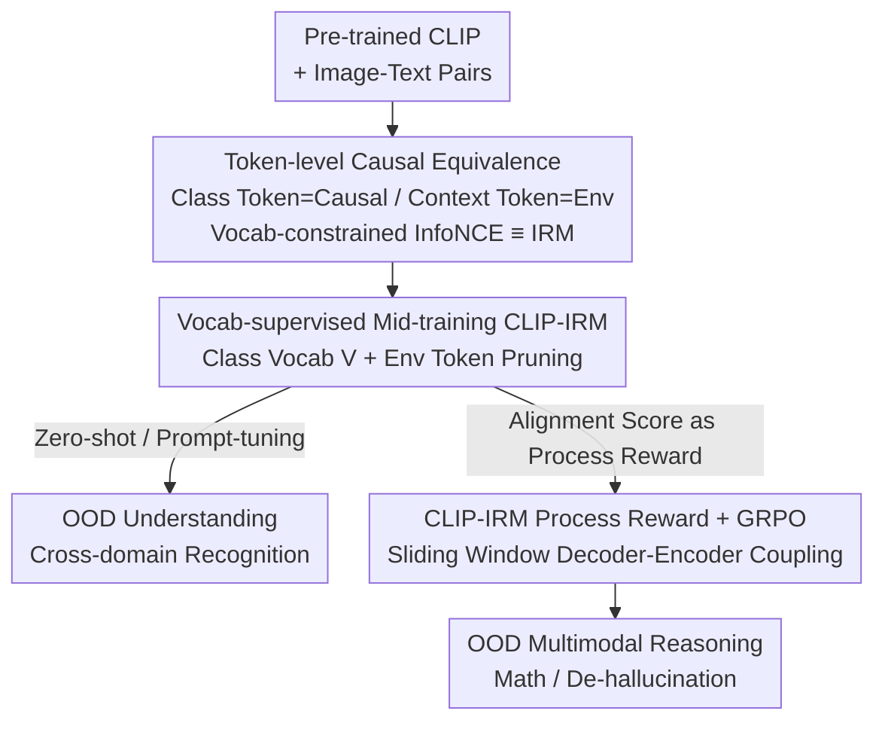

# A Causal Marriage between VLM and IRM from Understanding to Reasoning

**Conference**: CVPR 2026  
**Paper**: [CVF Open Access](https://openaccess.thecvf.com/content/CVPR2026/html/Chen_A_Causal_Marriage_between_VLM_and_IRM_from_Understanding_to_CVPR_2026_paper.html)  
**Code**: TBD  
**Area**: Multimodal VLM  
**Keywords**: CLIP, Invariant Risk Minimization (IRM), Causal Representation, OOD Generalization, Process-based Reward Reinforcement Learning

## TL;DR
Starting from token-level causal representations, this paper proves that a "vocabulary-constrained InfoNCE" is formally equivalent to the invariance principle of IRM. Based on this, it proposes CLIP-IRM, a mid-training paradigm that enhances OOD understanding without architectural changes, and transfers the OOD guarantees of IRM to multimodal reasoning by using its invariant alignment score as a process-level reward for GRPO.

## Background & Motivation
**Background**: Vision-Language Models (VLMs) like CLIP exhibit remarkable out-of-distribution (OOD) generalization in zero-shot/few-shot scenarios, becoming the de facto standard for open-vocabulary recognition. However, the understanding of "why it is so robust" remains largely phenomenological, lacking a theoretical framework for predictive analysis and improvement.

**Limitations of Prior Work**: Invariant Risk Minimization (IRM) is a rigorous paradigm designed specifically for OOD generalization—it requires predictors to depend only on features causally related to labels and remain invariant across environments with spurious correlations. Intuitively, CLIP's robustness aligns with IRM's goals, but the two are structurally different: CLIP uses dual-tower encoders with a contrastive objective on unstructured data, while IRM is typically a bi-level optimization problem requiring explicit "environment" partitions. This mismatch in architecture and objective has kept the connection between CLIP and IRM at an analogical level.

**Key Challenge**: To truly connect the two, a common causal language must be found. The authors' key insight is that the semantic alignment of image-text pairs conceals a latent causal structure where "modality-invariant variables" determine the content. Text prompts can naturally be decomposed into **class-related tokens (causal factors)** and **context-related tokens (environmental factors)**—this token-level perspective is the key to unifying CLIP and IRM.

**Goal**: (1) Prove the formal equivalence between a vocabulary-constrained InfoNCE objective and the IRM objective under a token-level causal representation framework; (2) Design a mid-training paradigm that injects invariance signals into pre-trained CLIP without altering the dual-tower architecture; (3) Transfer this invariant alignment to multimodal RL-based reasoning.

**Core Idea**: Implement IRM by "reconstructing InfoNCE supervision and batches according to token roles" instead of solving difficult bi-level optimizations. Use the invariant alignment score calculated by CLIP-IRM as a process-level reward for RL, moving OOD guarantees from "understanding" to "reasoning."

## Method

### Overall Architecture
The paper follows a chain of "Theoretical Equivalence → OOD Understanding → OOD Reasoning." First, it proves under token-level causal representation (block identifiability, Theorem 2 / Corollary 3) that an optimal CLIP encoder recovers modality-invariant causal blocks at word-phrase granularity. Then, by splitting prompts into class tokens (causality) and context tokens (environment), it proves that "vocabulary-constrained InfoNCE with environment tokens pruned" (Theorem 5) is equivalent to the IRM objective. In practice, this equivalence is implemented in two steps: ① **Mid-training CLIP-IRM**: Retain InfoNCE but reconstruct supervision and batches using a class vocabulary $V$ and environment vocabulary $E$, forcing the encoder to align only along "class-related, environment-independent" causal coordinates; ② **Process Reward Reasoning**: Couple the MLLM decoder and CLIP text encoder via a sliding window, using CLIP-IRM's vocabulary-constrained alignment score as a process reward to optimize the strategy via GRPO.

### Key Designs

**1. Token-level Causal Equivalence: Proving "Vocab-constrained InfoNCE" as IRM**

This is the theoretical foundation. The authors assume an SCM (Assumption 1) where image-text pairs are generated by a modality-invariant variable $z_{inv}$ plus private components via non-linear mixing. Block identifiability (Theorem 2) guarantees that optimal encoders $f^*, g^*$ recover $z_{inv}$ under invertible mapping by minimizing the modality alignment functional $L_{MMAlign}$. Corollary 3 states that this is achieved if and only if bi-directional InfoNCE is minimized. 

The key step is decomposing $z_{inv}$ by token roles. Definition 4 provides bridging conditions: class set consistency $\mathcal{Y}=V$, context tokens disjoint from the class set, and $z_{inv}=(z^{(env)}, z^{(cls)})$ being decomposable. Under these, the alignment objective is modified to a "vocabulary-supervised" version that retains class tokens and removes environment tokens:

$$L_{SMMAlign}(f,g;V,E) := \mathbb{E}\big[\,\|f(x^{(img)}) - g(X^{(tex)}_{y/e})\|\,\big] - H(f(x^{(img)})) - H(g(X^{(tex)}_{V/E}))$$

Theorem 5 proves that minimizing this constrained objective is equivalent to the IRM bi-level objective, as it forces alignment in the "class-related subspace" while remaining invariant in the environment subspace.

**2. Vocabulary-supervised Mid-training CLIP-IRM: Implementing IRM via Data Reconstruction**

Instead of solving bi-level optimization, the authors **retain InfoNCE and reconstruct supervision signals and batches**. Using LAION data, they identify a class vocabulary $V$ and an environment vocabulary $E$. They synthesize environment-invariant pairs by swapping captions of the same class but removing environment tokens, resulting in an augmented batch $D^{(K)}_V$. The mid-training objective is a weighted sum:

$$\min_{f,g}\ \mathbb{E}_{D^{(K)},D^{(K)}_V}\Big[L^{img\to tex}_{InfoNCE}(D^{(K)}_V) + L^{tex\to img}_{InfoNCE}(D^{(K)}_V)\Big] + \lambda\Big[L^{img\to tex}_{InfoNCE}(D^{(K)}) + L^{tex\to img}_{InfoNCE}(D^{(K)})\Big]$$

The first term performs "environment-independent" alignment, while the second (weight $\lambda$) preserves the coverage and diversity of standard CLIP pre-training. This **single-stage** objective is equivalent to IRM under Theorem 5, avoiding bi-level optimization while maintaining invariant prediction guarantees.

**3. CLIP-IRM Process Reward + GRPO: Transforming Invariant Alignment into Step-wise Reward**

To transfer invariance to reasoning, the authors use a **sliding window-coupled decoder-encoder**. An MLLM decoder $\pi_\theta$ generates tokens autoregressively. At step $k$, a window $t_{k-w+1:k}$ is fed into the CLIP text encoder $g$ to get $h^{(tex)}_k$, which is then used to calculate a vocabulary-constrained InfoNCE score against image features $v^{(img)}=f(x^{(img)})$ as a process reward:

$$r^{(proc)}_k \triangleq \ell_{InfoNCE}(v^{(img)}, h^{(tex)}_k; V) - \alpha\,\ell_{env}(t_{k-w+1:k}; E)$$

The first term encourages tokens to fall into the class-related subspace and align with the image, while the second penalizes overlap with environment tokens. By maximizing $r^{(proc)}_k$ via GRPO, the policy is guided to satisfy IRM-style invariance. The total reward $R(\tau)$ combines this with task rewards $r^{(task)}_k$.

### Loss & Training
- **Understanding**: Eq. 11 dual-path InfoNCE (Vocab-supervised path $D^{(K)}_V$ + standard path $D^{(K)}$). CLIP-IRMv1 uses ViT-B/16; CLIP-IRMv2 uses ViT-L/14.
- **Reasoning**: Base Qwen2.5-VL-7B-Instruct, optimized via GRPO. Rewards include $r^{(task)}_k$ (accuracy/format) and $\lambda_{proc}r^{(proc)}_k$. Training sets include Geometry3K and MMK12, converted to free-response to prevent reward hacking.

## Key Experimental Results

### Main Results: Zero-shot OOD Generalization (Table 1, Accuracy)
Comparison on five domain generalization benchmarks:

| Method | PACS | VLCS | OfficeHome | NICO++ | DomainNet | Avg |
|------|------|------|-----------|--------|-----------|-----|
| ERM | 85.8 | 78.4 | 68.0 | 79.6 | 47.4 | 71.8 |
| IRM | 84.7 | 78.1 | 68.2 | 79.7 | 47.3 | 71.6 |
| CLIP | 97.7 | 73.4 | 85.4 | 88.7 | 76.7 | 83.4 |
| GPT-4V | 96.9 | 87.2 | 84.8 | 88.0 | 74.8 | 86.3 |
| Gemini | 98.7 | 83.2 | 89.7 | 89.7 | 75.9 | 87.4 |
| **CLIP-IRMv1** | 95.1 | 78.8 | 83.9 | 87.7 | 72.7 | 83.6 |
| **CLIP-IRMv2** | 98.6 | 83.3 | 88.3 | **91.8** | **78.1** | **88.0** |

- CLIP-IRMv2 outperforms all foundation models, leading non-closed-source models by >4.6%, and surpassing GPT-4V/Gemini on difficult sets like NICO++ and DomainNet.

### Ablation Study (Prompt-tuning & Reasoning)
- **Base-to-New Generalization**: CLIP-IRM improves new-class accuracy across all 5 prompt-tuning baselines (CoOp, MaPLe, etc.).
- **Cross-dataset Transfer**: Gains in target domains are larger than in source domains, suggesting true robustness rather than memorization.
- **Multimodal Reasoning**: GRPO with CLIP-IRM process rewards shows consistent gains across MathVerse, MathVision, and MathVista. HallusionBench scores also improve, indicating reduced hallucination.

### Key Findings
- **Invariance gains are most significant on difficult distributions**: The advantage of CLIP-IRM grows as the test distribution deviates further from the training distribution.
- **Environment pruning reduces hallucination**: Process rewards make the model more faithful to the image content.
- **Architecture Agnostic**: Improving the representation base benefits multiple downstream tuning methods.

## Highlights & Insights
- **Proving InfoNCE as IRM**: The realization that prompt token roles correspond to IRM's causal/environment split allows replacing bi-level optimization with simple data reconstruction.
- **Transferable Theoretical Guarantees**: Using the same invariant alignment score for both training (understanding) and rewards (reasoning) unifies the IRM→IPO pipeline.
- **Sliding Window Coupling**: A practical engineering trick to bridge autoregressive decoders with bidirectional encoders for step-wise invariance supervision.

## Limitations & Future Work
- **Dependency on Vocabulary Quality**: The method relies on accurately identifying class and environment vocabularies from large-scale data; noise here could weaken invariance.
- **Strong Theoretical Assumptions**: The conditions for Theorem 5 (e.g., decomposable $z_{inv}$) are idealized and may not strictly hold in all open-world scenarios.
- **Backbone Sensitivity**: Gains for CLIP-IRMv1 (small backbone) are marginal, suggesting the paradigm is more effective for larger models.

## Related Work & Insights
- **vs IRM / IPO**: Unlike original IRM which requires explicit environment labels, this work uses data reconstruction and "vocab-supervised InfoNCE" to achieve equivalence.
- **vs Standard CLIP Tuning**: Instead of just tuning embeddings, this work addresses the causal source of OOD robustness to provide a better initialization base.
- **vs R1-style Multimodal RL**: Moves beyond "accuracy-only" rewards by injecting a theoretically grounded process reward to ensure the reasoning path remains visually grounded.

## Rating
- Novelty: ⭐⭐⭐⭐⭐ 
- Experimental Thoroughness: ⭐⭐⭐⭐ 
- Writing Quality: ⭐⭐⭐⭐ 
- Value: ⭐⭐⭐⭐⭐ 

<!-- RELATED:START -->

## Related Papers

- [\[CVPR 2026\] Beyond Perceptual Shortcuts: Causal-Inspired Debiasing Optimization for Generalizable Video Reasoning in Lightweight MLLMs](beyond_perceptual_shortcuts_causal-inspired_debiasing_optimization_for_generaliz.md)
- [\[CVPR 2026\] RE-VLM: Event-Augmented Vision-Language Model for Scene Understanding](re-vlm_event-augmented_vision-language_model_for_scene_understanding.md)
- [\[ICML 2026\] Seeing is Understanding: Unlocking Causal Attention into Modality-Mutual Attention for Multimodal LLMs](../../ICML2026/multimodal_vlm/seeing_is_understanding_unlocking_causal_attention_into_modality-mutual_attentio.md)
- [\[CVPR 2026\] MindPower: Enabling Theory-of-Mind Reasoning in VLM-based Embodied Agents](mindpower_enabling_theoryofmind_reasoning_in_vlmba.md)
- [\[CVPR 2026\] BiomedCCPL: Causal Conditional Prompt Learning for Biomedical Vision-Language Models](biomedccpl_causal_conditional_prompt_learning_for_biomedical_vision-language_mod.md)

<!-- RELATED:END -->
