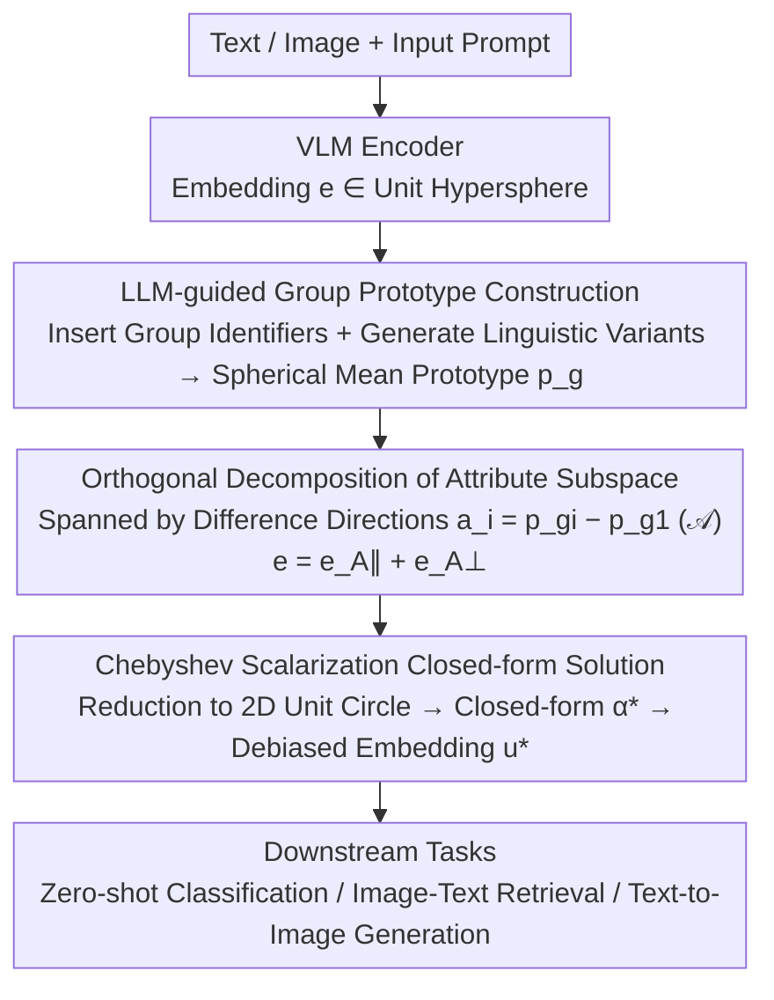

# A Closed-Form Solution for Debiasing Vision-Language Models with Utility Guarantees Across Modalities and Tasks

**Conference**: CVPR 2026  
**arXiv**: [2603.12998](https://arxiv.org/abs/2603.12998)  
**Code**: [Yes](https://github.com/Supltz/Debias_VLM)  
**Area**: Multimodal VLM  
**Keywords**: VLM Debiasing, Closed-form Solution, Pareto Optimal Fairness, Training-free & Label-free, Cross-modal Embedding Space

## TL;DR

A closed-form solution for VLM debiasing is proposed, achieving Pareto optimal fairness and bounded utility loss through orthogonal decomposition of the attribute subspace in the cross-modal embedding space and Chebyshev scalarization. It is training-free and label-free, uniformly covering zero-shot classification, text-to-image retrieval, and text-to-image generation tasks.

## Background & Motivation

**Background**: VLMs (e.g., CLIP) achieve exceptional cross-modal understanding through contrastive learning on massive web-scraped image-text pairs, widely used in zero-shot classification, image-text retrieval, and image generation. However, research indicates VLMs inherit social biases from training data—for instance, in CLIP’s text embeddings, "nurse" is abnormally close to "female" while "doctor" is close to "male," reflecting gender stereotypes in web corpora. These biases propagate to all downstream applications through embeddings.

**Limitations of Prior Work**: Existing debiasing methods suffer from several drawbacks: (a) many methods (DeAR, FairerCLIP, PromptArray) require training additional debiasing networks, increasing computational and model complexity; (b) some methods (SFID, CLIP-clip) require annotated data for sensitive attributes, which is difficult to obtain at scale due to privacy and ethical concerns; (c) most methods handle only a single downstream task (e.g., PRISM/RoboShot for classification only, SANER for retrieval and generation only); (d) methods that only debias the text modality while ignoring the image modality (Orth-Proj, Orth-Cali, SANER) show limited effectiveness because biases are encoded into both modalities during contrastive learning.

**Key Challenge**: There is a fundamental trade-off between debiasing and utility preservation. Debiasing inevitably loses some semantic information, leading to performance degradation in downstream tasks. Existing methods either do not explicitly handle utility preservation (BiasedPrompt) or maintain it indirectly via reconstruction loss (DeAR, SANER), but reconstructed embeddings do not equate to maintaining cross-modal alignment. No existing method provides a theoretical upper bound for utility loss. Furthermore, existing methods focus only on group fairness, neglecting intersectional fairness (e.g., combinations of gender × age).

**Goal**: Propose a unified VLM debiasing framework that simultaneously satisfies five requirements: training-free, label-free, joint dual-modality debiasing, coverage of multiple downstream tasks, and providing theoretical guarantees for utility loss. Intersectional fairness is also systematically evaluated for the first time in VLM debiasing.

**Key Insight**: It is observed that VLM embedding spaces are unit hyperspheres $\mathbb{S}^{d-1}$, where any embedding can be decomposed into attribute-related components and neutral content components via the orthogonal decomposition theorem. Unlike previous methods (PRISM-mini, Orth-Proj) that project onto a subspace $\mathcal{S}$ spanned by group prototypes—which removes semantic information (e.g., "doctor") along with the bias—this work projects only onto the attribute subspace $\mathcal{A}$ spanned by attribute difference directions, precisely removing bias while preserving semantics.

**Core Idea**: By performing orthogonal decomposition of the attribute subspace in the cross-modal embedding space, the debiasing problem is reduced to a 2D unit circle. A closed-form optimal solution is then derived using the Chebyshev minimax method, achieving both Pareto optimal fairness and bounded utility loss.

## Method

### Overall Architecture

The paper addresses a major challenge in VLM debiasing: debiasing often inadvertently removes semantics and damages downstream utility, and no theoretical upper bound for utility loss has been provided. The breakthrough observation is that since VLM embeddings reside on the unit hypersphere $\mathbb{S}^{d-1}$, any embedding can be orthogonally decomposed into an "attribute-related component" and a "neutral content component." Debiasing thus involves precisely removing the former while preserving the latter. The inference-time pipeline is: Text/Image $\to$ VLM Encoder $\to$ Embedding $\vec{e} \in \mathbb{S}^{d-1}$ $\to$ LLM-guided construction of group prototypes $\vec{p}_g$ $\to$ Spanning of attribute subspace $\mathcal{A}$ by $\vec{a}_i = \vec{p}_{g_i} - \vec{p}_{g_1}$ $\to$ Orthogonal decomposition $\vec{e} = \vec{e}_{\mathcal{A}_\parallel} + \vec{e}_{\mathcal{A}_\perp}$ $\to$ Closed-form derivation of optimal debiased embedding $\vec{u}^*$ $\to$ Downstream tasks. The process is entirely training-free, label-free, and operates purely at inference time.

The following diagram illustrates this training-free inference pipeline:

### Key Designs

**1. LLM-guided Group Prototype Construction: Using Spherical Means of Linguistic Variants**

Previous methods (PRISM, Orth-Proj) used a single prompt as a group prototype. However, an attribute group is not linguistically monolithic—"man," "gentleman," and "boy" all refer to males but differ semantically. A single prompt lacks representativeness. While SANER built a vocabulary, it lacked constraint from the input prompt, leading to semantic drift. This work takes an input prompt (e.g., "a photo of a doctor"), uses an LLM (GPT-5) to insert group identifiers $T_g$ ("a photo of a male doctor"), generates multiple linguistic variants $\mathcal{T}_g$, and takes the spherical mean of all variant embeddings as the group prototype:

$$\vec{p}_g = \frac{\vec{e}_g + \sum_i \vec{e}_g^{(i)}}{\big\| \vec{e}_g + \sum_i \vec{e}_g^{(i)} \big\|}$$

The LLM ensures variants fit the context, and the spherical mean ensures the prototype is optimally representative on the hypersphere.

**2. Orthogonal Decomposition of Attribute Subspace: Targeting Difference Directions $\mathcal{A}$ without affecting Shared Semantics $\mathcal{S}$**

Utility loss in debiasing stems from projecting onto the group prototype subspace $\mathcal{S} = \text{span}\{\vec{p}_{g_1}, \vec{p}_{g_2}, \dots\}$, which contains shared semantics (e.g., the meaning of "doctor"). This work projects instead onto the attribute subspace $\mathcal{A} = \text{span}\{\vec{a}_2, \dots, \vec{a}_n\}$ (where $\vec{a}_i = \vec{p}_{g_i} - \vec{p}_{g_1}$), containing only differences. Using projection operators $P_{\mathcal{A}_\parallel} = A(A^\top A)^{-1}A^\top$ and $P_{\mathcal{A}_\perp} = I - P_{\mathcal{A}_\parallel}$, the embedding is split into $\vec{e} = \vec{e}_{\mathcal{A}_\parallel} + \vec{e}_{\mathcal{A}_\perp}$. The fairness goal is equivalent to making the debiased embedding equidistant from all group prototypes, i.e., $\langle \vec{u}, \vec{a}_i \rangle = 0$. Since the dimension $r \leq n-1 \ll d$, this "surgical" removal is narrow, minimizing semantic damage.

**3. Chebyshev Scalarization Closed-form Solution: Pareto Optimal Robustness without Downstream Task Knowledge**

The method is task-agnostic and does not assume knowledge of downstream tasks to tune fairness/utility weights. Lemma 1 reduces the search on the hypersphere to a 2D unit circle in $\text{span}\{\vec{e}_{\mathcal{A}_\parallel}, \vec{e}_{\mathcal{A}_\perp}\}$. Lemma 2 constrains the search to the first quadrant where $\alpha \in [0, \|\vec{e}_{\mathcal{A}_\parallel}\|]$. Chebyshev minimax is then used between fairness $L(\alpha)=\alpha$ and utility $V(\alpha)$:

$$\min_\alpha \sup_{w_1,w_2} \{w_1 L(\alpha) + w_2 V(\alpha)\}$$

Yielding the closed-form solution:

$$\alpha^* = \frac{E - \|\vec{e}_{\mathcal{A}_\perp}\|\sqrt{E^2 - \|\vec{e}_{\mathcal{A}_\parallel}\|^2}}{E^2 + \|\vec{e}_{\mathcal{A}_\perp}\|^2}, \quad E = \|\vec{e}_{\mathcal{A}_\parallel}\| + \frac{1-\|\vec{e}_{\mathcal{A}_\perp}\|}{\|\vec{e}_{\mathcal{A}_\parallel}\|}$$

Chebyshev guarantees the objective is minimized even under the worst-case weight combination, ensuring robustness across tasks. The closed-form avoids iterative optimization overhead and convergence issues.

### Loss & Training

The method is entirely training-free, utilizing a pure inference-time closed-form transformation. Its core value lies in transforming utility loss into a provable upper bound: Proposition 1 reduces cross-modal utility loss to uni-modal self-utility, giving $\ell_{cross} \leq \sqrt{2\ell_{self}^{(I)}} + \sqrt{2\ell_{self}^{(T)}}$. Theorem 1 further provides the self-utility loss $V(\alpha^*) = (1 - \|\vec{e}_{\mathcal{A}_\perp\|}) \cdot \alpha^* / \|\vec{e}_{\mathcal{A}_\parallel}\|$ at the optimal solution and proves a tighter bound for cross-utility loss.

## Key Experimental Results

### Main Results

**Table 1: Zero-shot Image Classification Results** (CLIP ViT-L/14, values × 100)

| Method | CelebA F1↑ | CelebA ΔEO_Avg(G×A)↓ | CelebA ΔEO_Max(G×A)↓ | FACET F1↑ | FACET ΔEO_Avg(G)↓ |
|------|-----------|----------------------|----------------------|----------|-------------------|
| Baseline CLIP | 54.0 | 25.1 | 45.0 | 70.8 | 8.9 |
| FairerCLIP | 53.1 | 24.0 | 41.4 | 69.8 | 9.2 |
| RoboShot | 52.3 | 23.3 | 40.0 | 69.3 | 8.5 |
| Orth-Proj | 49.3 | 26.0 | 42.1 | 68.6 | 9.0 |
| **Ours** | **56.5** | **23.6** | **40.1** | **70.7** | **8.3** |

**Table 2: Image-Text Retrieval and Generation Results** (values × 100)

| Method | COCO R@5↑ | COCO MS@1000(G×ST)↓ | Flickr30K R@5↑ | Flickr30K MS@1000(G)↓ | SD v2.1 SP↓ | SD v2.1 AccG↑ |
|------|----------|---------------------|---------------|----------------------|------------|--------------|
| Baseline | 83.8 | 13.4 | 91.0 | 20.3 | 47.9 | 75.4 |
| SFID | 77.4 | 13.2 | 86.8 | 13.6 | 41.1 | 67.2 |
| CLIP-clip | 76.1 | 9.9 | 87.7 | 11.7 | - | - |
| Orth-Proj | 74.5 | 13.6 | 84.4 | 14.1 | 39.6 | 53.4 |
| **Ours** | **81.1** | **10.1** | **90.4** | **11.8** | **39.7** | **74.6** |

### Ablation Study

**Table 3: Ablation and LLM Sensitivity Analysis** (Flickr30K MS@1000↓ / CelebA ΔEO_Max↓)

| Configuration | MS@1000 | ΔEO_Max |
|------|---------|---------|
| Baseline | 20.3 | 45.0 |
| Anchor embedding only for prototype | 13.4 | 41.1 |
| Mean embedding only for prototype | 14.1 | 41.8 |
| Image-only debiasing $\vec{u}_I$ | 13.4 | 41.7 |
| Text-only debiasing $\vec{u}_T$ | 13.3 | 41.1 |
| Using DeepSeek v3.2 | 12.0 | 40.1 |
| Using Gemini 2.5 Pro | 11.8 | 40.4 |
| **Full Method** | **11.8** | **40.1** |

### Key Findings

- **Utility preservation significantly outperforms existing methods**: On CelebA classification, F1 reaches 56.5 (baseline 54.0), whereas other debiasing methods fall below the baseline. In retrieval, R@5 loss is only 2.7 (vs. 6.4 for SFID and 7.7 for CLIP-clip). In generation, AccG reaches 74.6 (near baseline 75.4), far exceeding Orth-Proj’s 53.4.
- **Label-free methods perform better**: Systematic RQ analysis reveals that label-dependent methods (SFID, FairerCLIP) are limited by their annotation domain (e.g., FairFace) and generalize poorly to full-body datasets (FACET, COCO, Flickr30K).
- **Dual-modality debiasing is essential**: Debiasing only image or only text is inferior to joint debiasing, showing significant gaps in fairness metrics.
- **LLM choice has minimal impact**: The debiasing effect of group variants generated by GPT-5, DeepSeek v3.2, and Gemini 2.5 Pro is nearly identical.

## Highlights & Insights

- Closed-form solution = Determinism + Efficiency + Interpretability. This is the first method in VLM debiasing with theoretical utility guarantees, pioneering the "bounded debiasing" paradigm.
- The distinction between attribute subspace $\mathcal{A}$ and group prototype subspace $\mathcal{S}$ is a core insight: $\mathcal{S}$ contains shared semantics, while $\mathcal{A}$ contains only difference directions, allowing for precise debiasing.
- Task-agnostic robustness is achieved through Chebyshev scalarization, avoiding the need for per-task parameter tuning.
- Systematic analysis across three RQs provides clear design principles for VLM debiasing: Label-free, training-free, and dual-modality are required.

## Limitations & Future Work

- Utility guarantees are in the embedding space (cosine similarity) rather than the task metric space (F1/R@K); the gap between them may become significant in extreme scenarios.
- The closed-form solution relies on a linear assumption of the attribute subspace; non-linear bias patterns may not be captured.
- Only encoder-side embeddings are processed; expansion to decoders (like Stable Diffusion’s U-Net) is needed, as generation debiasing remains indirect.
- Currently considers limited attributes (gender/age/skin tone); scalability to more complex intersectional combinations remains to be verified.

## Related Work & Insights

- **vs. PRISM/Orth-Proj**: Projecting onto the full group subspace $\mathcal{S}$ loses semantics; this work projects only onto the attribute difference directions $\mathcal{A}$, which is a the more refined operation.
- **vs. SANER/DeAR**: These require training extra networks without theoretical utility guarantees; the closed-form solution here entirely avoids training and tuning.
- **vs. FairerCLIP**: Relies on annotated data (FairFace), showing poor generalization in non-facial scenes; this work is entirely label-free.
- **Insight**: The approach of using orthogonal decomposition as a "surgical" removal of specific attributes in the embedding space can be generalized to other scenarios requiring attribute-specific removal from embeddings.

## Rating

⭐⭐⭐⭐ The theoretical derivation is rigorous and complete (closed-form + Pareto optimality + utility bound proofs). The experiments cover three major tasks, multiple datasets, and various backbones including human evaluation. However, the core mathematical tools (orthogonal decomposition/Chebyshev scalarization) are mature; the innovation lies primarily in the problem formulation and clever application.

<!-- RELATED:START -->

## Related Papers

- [\[CVPR 2026\] Interpretable Debiasing of Vision-Language Models for Social Fairness](interpretable_debiasing_of_vision-language_models_for_social_fairness.md)
- [\[CVPR 2026\] Bias Is a Subspace, Not a Coordinate: A Geometric Rethinking of Post-hoc Debiasing in Vision-Language Models](bias_is_a_subspace_not_a_coordinate_a_geometric_rethinking_of_post-hoc_debiasing.md)
- [\[ACL 2025\] Vision-Language Models Struggle to Align Entities across Modalities](../../ACL2025/multimodal_vlm/vision-language_models_struggle_to_align_entities_across_modalities.md)
- [\[CVPR 2026\] CrossHOI-Bench: A Unified Benchmark for HOI Evaluation across Vision-Language Models and HOI-Specific Methods](crosshoi-bench_a_unified_benchmark_for_hoi_evaluation_across_vision-language_mod.md)
- [\[ACL 2025\] Performance Gap in Entity Knowledge Extraction Across Modalities in Vision Language Models](../../ACL2025/multimodal_vlm/performance_gap_in_entity_knowledge_extraction_across_modalities_in_vision_langu.md)

<!-- RELATED:END -->
