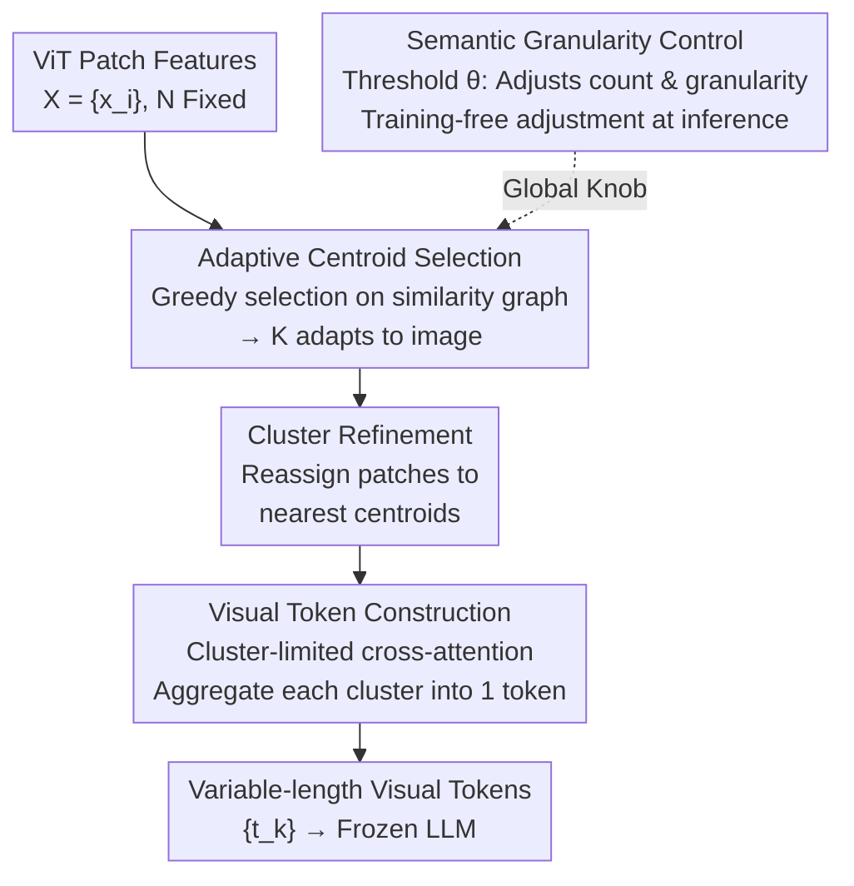

# A More Word-like Image Tokenization for MLLMs

**Conference**: CVPR 2026  
**Paper**: [CVF Open Access](https://openaccess.thecvf.com/content/CVPR2026/html/Lee_A_More_Word-like_Image_Tokenization_for_MLLMs_CVPR_2026_paper.html)  
**Code**: https://github.com/snuviplab/DiVT  
**Area**: Multimodal VLM  
**Keywords**: Visual projector, visual token compression, semantic clustering, dynamic token budget, MLLM

## TL;DR
DiVT replaces the MLP projector in LLaVA with a clustering-based visual projector, grouping ViT patch features into "visual words" based on semantics. Each cluster generates a single token, with the token count adaptively varying based on image complexity. Trained solely on language modeling objectives, it matches or exceeds full-resolution baselines across 8 multimodal benchmarks using 1/4 or even 1/40 of the visual tokens.

## Background & Motivation
**Background**: Mainstream MLLMs (e.g., LLaVA) freeze the LLM and train a visual projector to map image patch features into the LLM embedding space, allowing images to "pretend" to be a sequence of text tokens. Early methods used linear layers (MLP) for patch-wise mapping. Recently, to save computation, researchers have used grid-wise aggregation based on spatial proximity or global attention summarization via learnable queries (Resampler).

**Limitations of Prior Work**: These visual tokens differ significantly from real text tokens. The authors conducted a toy experiment to quantify this: the cosine similarity between any two patches in the same image is 0.15~0.25 in shallow ViT layers but exceeds 0.4 in deep layers—repeated self-attention and image-level pre-training (contrastive/classification) make patches within the same image highly homogeneous. After mapping to the LLM space, the mutual similarity of visual tokens produced by an MLP projector is $0.3823$, whereas it is only $0.0378$ for language tokens. Thus, visual tokens are long sequences of nearly redundant entries that bloat the KV cache and scatter attention.

**Key Challenge**: The authors decompose the "visual tokens are unlike text" issue into three structural differences: ① **Semantic Entanglement**: Patch features are cut by a fixed grid and mixed by multi-layer self-attention, making them naturally entangled; in contrast, text tokens are independent units from BPE. ② **Fixed Length**: A fixed number of tokens is produced regardless of image information density, causing redundancy for simple images and detail loss for complex ones. ③ **Uncontrollable Granularity**: Text has subword/word levels to balance expressiveness and length, whereas vision only has rigid spatial operations without a principled "granularity" knob.

**Key Insight**: Instead of grid-based or spatial proximity aggregation, patches should be grouped into semantically consistent clusters based on feature similarity. Each cluster becomes a token—naturally decoupled, variable-length, and with controllable granularity. Furthermore, the tokenizer is trained end-to-end using only the language modeling objective without external supervision, letting the LLM decide how to organize semantics.

**Core Idea**: Reformulate visual tokenization as "feature space clustering"—each cluster = a semantically coherent "visual word." The cluster count adapts to the image, and a single similarity threshold $\theta$ controls both token count and granularity, adjustable during inference without retraining.

## Method

### Overall Architecture
DiVT (Disentangled Visual Tokenization) is a **plug-and-play visual projector**: it takes ViT outputs $X=\{x_i\}_{i=1}^{N}$ ($N$ fixed, e.g., 576) and outputs a variable-length sequence of visual tokens $\{t_k\}_{k=1}^{K}$ ($K$ varying by image) for the frozen LLM. The pipeline consists of three sequential stages and one global knob: **Adaptive Centroid Selection** chooses representative patches from a similarity graph (determining $K$); **Cluster Refinement** reassigns each patch to the most similar centroid for decoupling; and **Visual Token Construction** uses cluster-limited cross-attention to aggregate patches into one token per cluster. The threshold $\theta$ acts as the **Semantic Granularity Control** knob across the process.

### Key Designs

**1. Adaptive Centroid Selection: Letting token count grow with image complexity**

Addressing Limitations of Prior Work ②. Standard clustering like k-means requires a fixed $k$, imposing a uniform budget. The authors observe that patches in **dense regions** (many neighbors above a threshold) correspond to semantic subjects, while **sparse regions** represent fine-grained details. Centroids are derived from the similarity structure: given a similarity matrix $S\in\mathbb{R}^{N\times N}$, patches with similarity $>\theta$ are treated as neighbors. The algorithm greedily selects the **node with the maximum degree** as the first centroid $c_1$, removes its neighborhood, and repeats (Algorithm 1). This ensures centroids are at least $\theta$ apart, guaranteeing semantic independence. Content-rich images naturally yield more clusters; simple images yield fewer. No visual content is "swallowed"—isolated patches become their own clusters.

**2. Cluster Refinement: Decoupling via reassignment**

Addressing side effects of greedy selection. A patch might be close to multiple centroids, but Algorithm 1 assigns it to the "most connected" one. Ideally, it should belong to the **most similar** centroid. After selecting indices $\{c_k\}_{k=1}^{K}$, patches are reassigned:
$$\mathcal{C}_k=\{x_i \mid k=\arg\max_{j}\cos(x_i, x_{c_j})\}.$$
This ensures each $\mathcal{C}_k$ is a semantically coherent group in feature space.

**3. Visual Token Construction: Cluster-constrained aggregation**

To compress without losing detail, cross-attention is used with **centroids as queries**:
$$Q_k=W^Q x_{c_k},\quad K_i=W^K x_i,\quad V_i=W^V(x_i+P_i),$$
where $P_i$ is a learnable positional embedding injected **only into the value branch** to provide structural cues without disrupting attention scores. A **cluster-limited attention mask** ensures tokens only aggregate within their cluster:
$$M_{k,i}=\begin{cases}0,& i\in\mathcal{C}_k,\\ -\infty,& \text{otherwise}.\end{cases}$$
The final token is $t_k=\mathrm{MLP}\big(\sum_i \mathrm{softmax}(Q_k K_i^\top + M_{k,i})V_i\big)$.

**4. Semantic Granularity Control: Training-free adjustment**

The threshold $\theta$ determines the scale of visual grouping. High $\theta$ yields more fine-grained tokens (high budget, high detail); low $\theta$ yields fewer coarse tokens (compact budget). This mirrors text tokenization from characters to words. Notably, $\theta$ can be **adjusted at inference time without training**: using a lower $\theta$ than during training directly reduces token count and inference cost with minimal performance loss.

## Key Experimental Results

### Main Results
Using LLaVA-1.5 7B as the backbone, replacing the MLP projector with DiVT. `†` denotes the average token count over the test set.

| Method | # Tokens | MMB | VQAv2 | GQA | MME | MM-Vet | POPE |
|------|----------|-----|-------|-----|-----|--------|------|
| MLP (Full) | 576 | 64.3 | 78.5 | 62.0 | 1510.7 | 31.1 | 85.6 |
| TokenPacker (Trained) | 144 | 65.1 | 77.9 | 61.9 | - | 33.0 | 87.0 |
| **Ours** $\theta=0.75$ | 136.5† | **66.7** | 78.2 | 62.0 | 1457.6 | 30.2 | 86.2 |
| TokenPacker | 64 | 64.1 | 77.2 | 61.1 | - | 31.7 | 86.3 |
| **Ours** $\theta=0.62$ | 63.7† | 64.3 | 77.7 | 61.6 | 1463.0 | 30.6 | 86.2 |
| TokenPacker | 36 | 62.8 | 75.0 | 59.6 | - | 29.6 | 86.2 |
| **Ours** $\theta=0.5$ | 35.7† | **65.0** | **77.0** | **60.6** | 1458.2 | 31.7 | 85.8 |
| **Ours** $\theta=0.3$ | 13.5† | 64.2 | 75.3 | 59.2 | 1462.8 | 28.0 | 84.3 |

Observations: (1) With 136.5 tokens, DiVT matches or exceeds the 576-token baseline. (2) Advantages are more pronounced at low budgets—at ~36 tokens, DiVT (MMB 65.0) significantly outperforms TokenPacker (62.8).

### Key Findings
- **Superior Efficiency**: Performance gains are most significant at low token budgets. While grid-based methods discard core information during compression, DiVT preserves the most informative semantics.
- **Inference Flexibility**: Models can switch to coarser granularity at inference time by lowering $\theta$ with minimal loss.
- **Interpretability**: Attention visualization shows DiVT tokens focus tightly on specific objects, unlike the scattered attention of MLP projectors.

## Highlights & Insights
- **Quantifying the Intuition**: The paper quantifies why visual tokens should be more like text (similarity 0.38 vs 0.04), providing a data-driven motivation.
- **Unifying Knob**: $\theta$ controls count, granularity, and inference cost simultaneously, creating a continuous spectrum for visual tokenization.
- **Zero Information Loss**: The cluster-limited mask ensures every patch contributes to a token, making "compression" and "detail preservation" compatible.

## Limitations & Future Work
- **Engineering Complexity**: Variable-length sequences complicate batching and KV-cache management in real-world deployments.
- **Encoder Dependency**: Quality depends on the feature structure of the vision encoder (e.g., performance varies between CLIP and DINOv2).
- **Heuristic Nature**: The greedy selection is a non-parametric heuristic; future work could explore more optimized one-step clustering.

## Related Work & Insights
- **vs. Pruning**: Methods like FastV prune tokens at inference, which may cause train-test mismatch. DiVT generates compact tokens from the start, supervised by the LLM.
- **vs. Grid/Query Projectors**: Methods like Resampler preserve spatial proximity but not semantic independence. DiVT constructs disentangled "visual words."

## Rating
- Novelty: ⭐⭐⭐⭐⭐ 
- Experimental Thoroughness: ⭐⭐⭐⭐ 
- Writing Quality: ⭐⭐⭐⭐⭐ 
- Value: ⭐⭐⭐⭐⭐ 

<!-- RELATED:START -->

- **LLaVA**: Large Language-and-Vision Assistant, Visual Projectors.
- **TokenPacker**: Efficient visual projector via coarse-to-fine selection.
- **Chat-UniVi**: Unified visual representation for image and video.

<!-- RELATED:END -->

## Related Papers

- [\[CVPR 2026\] HouseMind: Tokenization Allows MLLMs to Understand, Generate and Edit Architectural Floor Plans](housemind_tokenization_mllm_floor_plan.md)
- [\[CVPR 2026\] CLIP-like Model as a Foundational Density Ratio Estimator](clip-like_model_as_a_foundational_density_ratio_estimator.md)
- [\[CVPR 2026\] Conan: Progressive Learning to Reason Like a Detective over Multi-Scale Visual Evidence](conan_progressive_learning_to_reason_like_a_detective_over_multi-scale_visual_ev.md)
- [\[CVPR 2026\] Asking like Socrates: Socrates helps VLMs understand remote sensing images](asking_like_socrates_socrates_helps_vlms_understand_remote_sensing_images.md)
- [\[CVPR 2026\] Select Less, Reason More: Prioritizing Evidence Purity for Video Reasoning](select_less_reason_more_prioritizing_evidence_purity_for_video_reasoning.md)

<!-- RELATED:END -->
