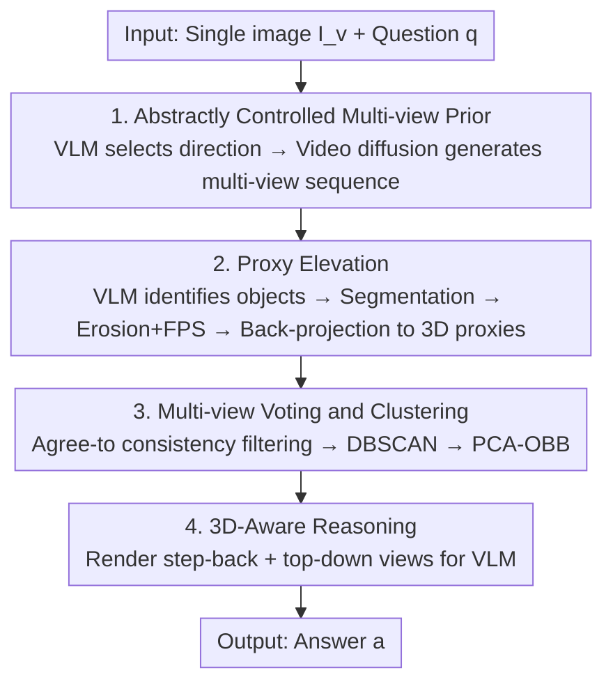

# Abstract 3D Perception for Spatial Intelligence in Vision-Language Models

**Conference**: CVPR 2026  
**Paper**: [CVF Open Access](https://openaccess.thecvf.com/content/CVPR2026/html/Liu_Abstract_3D_Perception_for_Spatial_Intelligence_in_Vision-Language_Models_CVPR_2026_paper.html)  
**Code**: None  
**Area**: Multimodal VLM / Spatial Intelligence  
**Keywords**: Spatial Reasoning, Abstract Perception, 3D bounding box, Video Diffusion Prior, Training-free  

## TL;DR
To address the deficiencies of VLMs in 3D spatial reasoning, this paper proposes the training-free SandboxVLM: it utilizes a video diffusion prior to generate multi-view sequences from a single 2D image, lifts key objects into sparse "abstract 3D bounding boxes," and renders them back to the VLM. This enables zero-shot understanding of 3D structures, achieving a 17.4% improvement over the baseline on SAT-Real.

## Background & Motivation

**Background**: Large VLMs such as GPT-5, Gemini, and Qwen3-VL have demonstrated strong capabilities in image-text understanding. However, since they are primarily trained on 2D images and 1D text, their understanding of the world remains at the "projection" level, lacking grounding in the essential 3D structure of the physical world.

**Limitations of Prior Work**: When tasks require genuine spatial understanding—such as reasoning under viewpoint changes, estimating relative positions, or predicting object interactions—these models fail. Existing works like 3D-LLM, Cube-LLM, and ShapeLLM inject 3D capabilities into VLMs but rely on dense 3D supervision, meticulously constructed datasets, or specialized architectures. This creates two issues: first, they are difficult to scale; second, they can only modify open-source models and cannot leverage evolving closed-source VLMs like GPT-5. More recent approaches like MindJourney and world models use video diffusion/generative models to provide 3D or temporal priors, but they ultimately operate on 2D or sequential representations.

**Key Challenge**: Effectively "training" 3D capabilities into VLMs faces the dilemma of 3D data scarcity versus catastrophic forgetting. Conversely, attempting to provide 3D information to VLMs in a training-free manner falls into another dilemma: either the information is too sparse (single-view ambiguity) or too "dirty" (dense point cloud noise that misleads the model).

**Key Insight**: The authors draw inspiration from human spatial cognition—humans do not construct millimeter-precise geometric models yet easily catch balls or navigate crowded rooms. Human spatial understanding is essentially **abstract**, relying on coarse-grained relative positions, orientations, and interaction relationships rather than detailed reconstruction. This inspired the authors to propose "abstract perception": intelligent 3D reasoning does not require full geometric recovery, only an understanding of the scene's abstract structure.

**Core Idea**: Represent the scene using a compact set of **abstract 3D bounding boxes** instead of dense geometry. 2D cues are lifted into 3D via a lightweight "proxy elevation" and rendered back into symbolic scene graphs, allowing off-the-shelf VLMs to perform spatial reasoning without any training.

## Method

### Overall Architecture
SandboxVLM aims to solve the following: given one (or several) RGB images $I=\{I_v\}$ and a natural language question $q$, enable the VLM to correctly answer 3D relationship-related questions zero-shot without training. The core of the pipeline is "reconstructing structure, not appearance"—compressing the scene into a small cluster of task-relevant abstract 3D boxes and rendering them from the most informative viewpoints for the VLM.

The pipeline consists of four serial stages: ① Use the VLM to select an abstract motion direction most relevant to the question, driving a **video diffusion prior** to expand the single image into a multi-view sequence; ② **Proxy Elevation** identifies task-relevant objects via the VLM in each view, performs segmentation, and uses depth back-projection to lift them into sparse 3D proxy points; ③ **Multi-View Voting & Clustering** uses cross-view consistency voting to filter noise, followed by clustering and fitting an oriented bounding box (OBB) for each object to form the "3D Sandbox"; ④ **3D-Aware Reasoning** renders these abstract boxes from step-back and top-down perspectives, feeding them back to the VLM along with the original image and question for Chain-of-Thought reasoning.

### Key Designs

**1. Abstractly Controlled Multi-view Prior: Guiding video diffusion with question direction to hallucinate useful perspectives**

A single 2D image contains insufficient information about a 3D scene, leading to severe 3D ambiguity for VLMs. This work utilizes a video diffusion prior $G_\theta$ to expand the single image $I_v$ into a multi-view sequence $\{X_v^{(m),t}\}_{t=0}^{T-1}$ simulating camera motion. The key is not to hallucinate all directions blindly but to mimic human "mental exploration": the VLM first processes $q$ and $I_v$ to choose the most relevant direction $c^*$ from a predefined set of abstract camera motions $T=\{\text{left, fwd-left, fwd, fwd-right, right}\}$. The selected direction is instantiated into $M$ candidate trajectories $\{\hat{T}_v^{(m),t}\}$ to conditionally drive the diffusion model: $\{X_v^{(m),t}\}=G_\theta(I_v,\{\hat{T}_v^{(m),t}\})$. Focusing computation on task-relevant viewpoints is more efficient and ensures the subsequent 3D reasoning receives the right observations. Removing this multi-view prior (Single Image Sandbox, Setting 7) leads to a 6.5% drop in performance, demonstrating that the implicit 3D prior in generative world models successfully compensates for the VLM's lack of spatial knowledge.

**2. Proxy Elevation: Lifting sparse 3D proxy points of task-relevant objects instead of dense appearance**

Reconstructing dense geometry (like NeRF or 3D Gaussian Splatting) is slow and introduces irrelevant details. This paper takes the opposite approach: extracting sparse but sufficient 3D proxies only for objects involved in the question. The process involves: let the VLM analyze $q$ and $I_v$ to provide relevant object categories and center pixel coordinates $\hat{O}_{v,i}=(\hat{o}_i,[x_i,y_i])$ (leveraging the VLM's inherent common sense and 2D VQA capabilities); these are used as prompts for a 2D segmentation model $S_\theta$ to obtain binary masks $M_{v,i}$. Since masks and depth are error-prone at object edges, the authors apply morphological **erosion** to obtain $M_{v,i}^{erode}$, retaining only internal points, and then use Furthest Point Sampling (FPS) to select a fixed number of pixels (30 points per object per view) as 2D proxies: $S_{v,i}=\text{FPS}(M_{v,i}^{erode},N_{pts})$. Finally, a pre-trained depth model $D_\theta$ estimates the depth map, intrinsic matrix $K$, and extrinsic matrix $R_t$ to back-project each 2D proxy point into 3D. The "Erosion + FPS" step specifically handles edge noise, ensuring lifted points fall within the object's body rather than floating outside the silhouette.

**3. Multi-View Voting & Clustering: Filtering noise via cross-view consensus and fitting OBBs**

3D proxy points lifted from a single view inevitably contain depth errors and mask flaws; direct clustering would be skewed by noise. This work uses a "voting" mechanism to leverage multi-view consensus. An "Agree-to" relationship is defined: a point $p$ is agreed to by another view $X_v^{(m),t}$ if there exists a proxy point $p'$ in that view such that $\|p'-p\|_2<\delta$. A point is considered reliable only if it is agreed to by $N$ views. This filters out isolated noise that appears in only one view due to depth/mask errors. After filtering, DBSCAN is used to cluster points by category to distinguish between multiple instances (e.g., multiple chairs). PCA is used to fit an Oriented Bounding Box (OBB) for each cluster: the principal axes are the eigenvectors of the covariance matrix, dimensions are the min/max of points in the PCA coordinate system, and the center is the midpoint projected back to world coordinates. This results in a set of instance boxes $B=\{b_i\}$, representing the "Sandbox" that preserves only the task-relevant spatial structure. This step is crucial for mitigating error propagation in modular pipelines.

**4. 3D-Aware Reasoning: Rendering the two most informative views to the VLM for reasoning**

The abstract boxes must be fed back in a format the VLM can understand. Instead of using numerous viewpoints, the authors select two complementary views to render $B$: (1) **Step-back view**—retreating 2 meters from the original camera to see the overall spatial layout; (2) **Top-down view**—providing a bird's-eye view of horizontal arrangements. The rendered images $\{\tilde{I}_k\}$, original images $\{I_v\}$, and question $q$ form the final prompt. The VLM performs textual reasoning within `<thinking>...</thinking>` before providing the `<answer>`. Ablations show that directly rendering proxy points (Setting 6) is inferior to providing box coordinates as text (Setting 5). Rendering can obscure precise details, but abstract box rendering (Setting 8) achieves the best results by balancing "informativeness" and "interpretability," providing vivid spatial cues while filtering out irrelevant details.

### A Complete Example
Using the example in Figure 2: Given an image of a piano room and the question "If someone sits on the piano bench, is the audience on their left or right?". ① The VLM determines the "fwd-right" direction is most relevant; the diffusion model hallucinates a multi-view sequence turning forward and right. ② The VLM identifies "piano" and "audience" as relevant objects; after segmentation, erosion, and FPS sampling, they are back-projected as 3D proxy points. ③ Multi-view voting filters out points appearing only in specific frames, DBSCAN clusters the audience points into one instance, and PCA fits OBBs for both the audience and the piano. ④ The boxes are rendered from step-back and top-down views. The VLM sees "the audience block is to the right of the piano" in both views, reasons in `<thinking>`, and outputs `<answer> Right`. The entire process is training-free, providing the VLM with a 3D abstract context it can comprehend.

## Key Experimental Results

### Main Results
Evaluating zero-shot on 4 spatial/physical reasoning benchmarks, SandboxVLM (test-time scaling) outperformed general VLMs and training-based models:

| Method | Type | Spatial-Avg | SAT-Real | PhysBench |
|------|------|------|------|------|
| GPT-5-mini | General VLM | 78.5 | 75.4 | 47.1 |
| Gemini-2.5-Pro | General VLM | 80.3 | 79.3 | - |
| RoboBrain2.0-32B | Training-based | 81.0 | 80.3 | - |
| MindJourney | test-time scaling | 79.1 | 78.7 | 54.9 |
| **Ours (SandboxVLM)** | test-time scaling | **81.4** | **84.1** | **58.3** |

Highlights: On SAT-Real, Ours is 8.3% higher than the closest test-time scaling method, MindJourney; on PhysBench, it is 3.4% higher. It even outperforms RoboBrain2.0-32B, which was specifically fine-tuned for spatial understanding—proving that injecting 3D abstraction at test-time is more efficient than retraining.

Under different backbones (SAT-Real, Table 2): GPT-4o baseline 60.3 → SandboxVLM 77.7 (+17.4%); GPT-5-mini 75.4 → 84.1; GPT-5 80.1 → 84.3 (+4.2%). GPT-4o with this method (77.7) approaches vanilla GPT-5 (80.1), and gains remain stable as the backbone strengthens.

### Ablation Study
Using SAT-Real + GPT-5-mini, 8 variants isolate design choices (Table 3, average accuracy):

| Configuration | Average | Description |
|------|---------|------|
| (1) Vanilla VLM | 75.4 | Baseline GPT-5-mini |
| (2) Scene-Graph Text | 77.0 | Scene graph JSON from expert models fed as text |
| (3) Multi-view Only | 78.7 | Diffusion multi-view without 3D lifting |
| (4) Rendered Point Cloud | 73.7 | VGGT dense reconstruction (leads to performance drop) |
| (5) 3D Coordinate Text | 80.8 | Box centers/dimensions fed as text |
| (6) Rendered Proxy Points | 77.0 | Direct rendering of proxy points |
| (7) Single Image Sandbox | 77.6 | No video generation, single image only |
| (8) Full SandboxVLM | **84.1** | Complete model |

### Key Findings
- **Multi-view priors provide complementary information**: (1)→(3) adds the multi-view prior, gaining 3.3%; (8) is 6.5% higher than (7), indicating that generative world models compensate for the spatial knowledge VLM lack.
- **VLMs remain language-centric**: With equal information, 2D images are only 1.7% better than text descriptions, and 3D box coordinate text (5) even surpasses rendered proxy points (6)—indicating current VLMs cannot yet fully exploit visual information for complex reasoning.
- **3D information is beneficial but must be "abstract"**: Injecting 3D consistently improves performance ((5) is 3.8% higher than (2)); however, rendering dense point clouds (4) falls below the vanilla baseline, suggesting noisy/unstructured raw 3D input is harmful—abstract boxes are more suitable for VLMs.

## Highlights & Insights
- **The "Abstract Perception" perspective is the most valuable**: Translating the human cognitive style of "focusing on structure rather than precise reconstruction" into "abstract 3D bounding boxes" bypasses the training difficulties of 3D data scarcity and forgetting.
- **Training-free + Plug-and-play**: No architectural changes or 3D supervision required; purely test-time 3D capability injection for any VLM (including closed-source ones), with benefits scaling with backbone strength.
- **Ablations reveal counter-intuitive conclusions**: Dense point cloud rendering causes performance drops, and text coordinates often outperform rendered images—this suggests the bottleneck for feeding 3D info to VLMs is not the volume of information, but whether the representation is abstracted to a level the VLM can understand.

## Limitations & Future Work
- **Reliance on cascaded modules**: Serializing video diffusion, depth estimation, segmentation, and VLM pointing introduces the risk of error propagation; while multi-view voting mitigates this, failure modes are not fully analyzed in the main text.
- **Abstract representation loses detail**: Bounding boxes preserve only coarse structure, which might be insufficient for physical interaction questions requiring fine appearance or texture; the 58.3% on PhysBench remains relatively low.
- **Lags behind training-based models on BLINK / EmbSpatial**: Attributed to simpler question styles where task-specific training has an advantage.
- **Reliability of generative priors**: If multi-view hallucinations deviate significantly from true geometry, the back-projected proxies will be inaccurate. ⚠️ The paper does not quantify the impact of diffusion prior quality on final accuracy.

## Related Work & Insights
- **vs. 3D-LLM / ShapeLLM / Cube-LLM**: These inject point cloud/multi-view features and perform 3D instruction tuning, relying on dense supervision and open-source models. Ours is training-free and leverages closed-source VLMs at the cost of being limited by the backbone's inherent reasoning ceiling.
- **vs. MindJourney / World Models**: Also test-time scaling, but they operate on 2D or sequential representations. Ours explicitly abstracts information into discrete 3D bounding boxes, outperforming MindJourney on SAT-Real (+8.3%) by arguing that a unified 3D representation is superior to a sequence of 2D frames.
- **vs. Rendered Point Clouds / Scene Graphs**: Directly compared in ablations; abstract boxes balance informativeness and interpretability better than noisy dense point clouds or geometry-deficient relation graphs.

## Rating
- Novelty: ⭐⭐⭐⭐⭐ "Abstract Perception + Abstract 3D Bounding Boxes" effectively translates cognitive priors into a training-free framework.
- Experimental Thoroughness: ⭐⭐⭐⭐ 4 benchmarks × multiple backbones + 8 ablation settings is thorough, though some details are relegated to the supplement.
- Writing Quality: ⭐⭐⭐⭐ Clear logic across motivation, method, and ablation; explains counter-intuitive findings well.
- Value: ⭐⭐⭐⭐⭐ Plug-and-play 3D reasoning for any VLM has direct value for embodied AI and robotics.

<!-- RELATED:START -->

## Related Papers

- [\[CVPR 2026\] Scaling Spatial Intelligence with Multimodal Foundation Models](scaling_spatial_intelligence_with_multimodal_foundation_models.md)
- [\[CVPR 2026\] HiSpatial: Taming Hierarchical 3D Spatial Understanding in Vision-Language Models](hispatial_taming_hierarchical_3d_spatial_understanding_in_vision-language_models.md)
- [\[CVPR 2026\] Grounded 3D-Aware Spatial Vision-Language Modeling](grounded_3d-aware_spatial_vision-language_modeling.md)
- [\[CVPR 2026\] SpatialScore: Towards Comprehensive Evaluation for Spatial Intelligence](spatialscore_towards_comprehensive_evaluation_for_spatial_intelligence.md)
- [\[CVPR 2026\] SpatialTree: How Spatial Intelligence Branches Out in MLLMs](spatialtree_how_spatial_intelligence_branches_out_in_mllms.md)

<!-- RELATED:END -->
