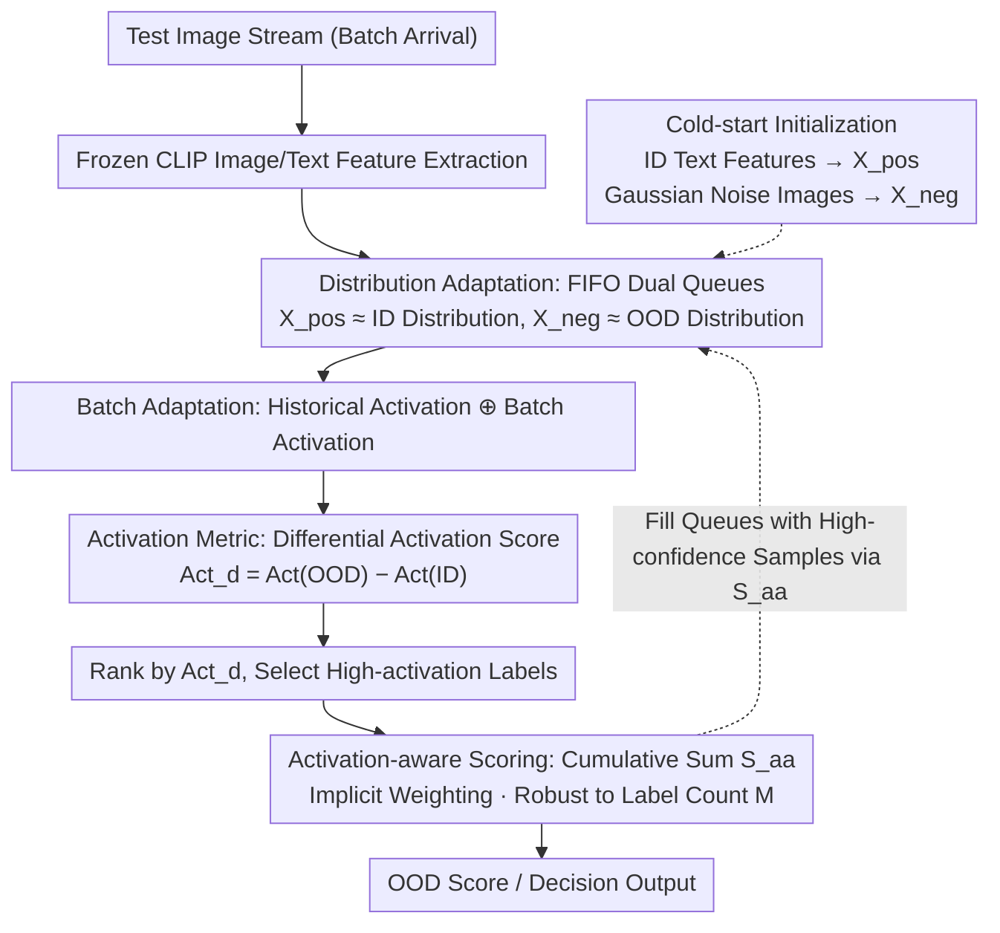

# Activation Matters: Test-time Activated Negative Labels for OOD Detection with Vision-Language Models

**Conference**: CVPR 2026  
**arXiv**: [2603.25250](https://arxiv.org/abs/2603.25250)  
**Code**: [GitHub](https://github.com/YBZh/OpenOOD-VLM)  
**Area**: Multimodal VLM / AI Safety  
**Keywords**: OOD Detection, Vision-Language Models, Negative Labels, Test-time Adaptation, Activation Metrics

## TL;DR
This paper introduces TANL (Test-time Activated Negative Labels), which dynamically evaluates the "activation level" of negative labels on OOD samples during test-time to mine the most effective labels. Combined with an activation-aware scoring function, it significantly reduces FPR95 from 17.5% to 9.8% on ImageNet benchmarks while remaining training-free and computationally efficient at inference.

## Background & Motivation
**Background**: OOD detection is a core problem in AI safety. Methods based on VLMs (e.g., CLIP) detect OOD samples by introducing "negative labels" (text labels semantically distant from ID categories)—samples with high similarity to negative labels are more likely to be OOD.

**Limitations of Prior Work — "Low-activation Negative Labels"**:
   - Methods like NegLabel select words furthest from ID labels in the corpus as negative labels.
   - However, these labels are selected based only on ID labels and **do not consider the test distribution**.
   - Consequently, many negative labels exhibit extremely low activation (similarity) on actual OOD data, sometimes even lower than on ID data (see Fig.1a).
   - These "low-activation" labels are not only ineffective but also introduce noise that degrades detection performance.

**Key Insight**: A few high-activation negative labels are sufficient for effective OOD detection (Fig.1b), whereas a large number of low-activation labels are counterproductive.

**Core Idea**: Dynamically evaluate label activation during test-time to select negative labels that are genuinely "activated by OOD samples."

## Method

### Overall Architecture
The paper addresses the issue of "incorrectly selected negative labels." Methods like NegLabel pick labels solely based on being "distant from ID labels," resulting in words that are rarely activated by real OOD samples. TANL shifts the determination of "which negative labels are truly useful" to test-time. As it processes the test stream, it uses two FIFO queues to accumulate high-confidence samples into approximations of ID and OOD distributions. It then calculates the activation difference for each candidate negative label across these distributions to select labels that are "activated by OOD but not by ID." Finally, an activation-aware cumulative scoring function calculates the OOD score. The entire pipeline freezes CLIP and performs no backpropagation. Notably, the scoring function $S_{aa}$ serves as both the final output and the criterion for routing test samples into the queues, creating a test-time feedback loop: scores determine queues → queues determine label selection → selected labels recalculate scores.

### Key Designs

**1. Activation Metric: Quantifying Label Usefulness**

Previous methods selected negative labels purely based on "semantic distance from ID labels" without considering if they are actually triggered by data. TANL defines an activation metric to measure the average classification probability of a label $y_i$ across a set of samples:

$$Act(\mathcal{X}, \hat{y}_i) = \frac{1}{|\mathcal{X}|}\sum_{\mathbf{x} \in \mathcal{X}} \frac{\exp(\mathbf{v}\hat{\mathbf{t}}_i)}{\sum_j \exp(\mathbf{v}\mathbf{t}_j) + \sum_j \exp(\mathbf{v}\hat{\mathbf{t}}_j)}$$

An ideal negative label should have high activation on OOD data and low activation on ID data. The differential activation score $Act_d(\hat{y}_i) = Act(\mathcal{X}_{ood}, \hat{y}_i) - Act(\mathcal{X}_{id}, \hat{y}_i)$ directly quantifies this discriminative power. High scores indicate labels that can effectively separate OOD from ID samples, which is more precise than distance metrics.

**2. Distribution Adaptation: Approximating Unknown OOD Distributions at Test-time**

Differential activation requires $\mathcal{X}_{ood}$ and $\mathcal{X}_{id}$, but the OOD distribution is unknown at test-time and may drift. TANL maintains two FIFO queues of length $L$, $\mathcal{X}_{pos}$ and $\mathcal{X}_{neg}$, for online approximation. Incoming samples are assigned based on the current score $S_{aa}(\mathbf{v})$: samples with scores above $\gamma + (1-\gamma)g$ enter the positive queue (ID proxy), while those below $\gamma - \gamma g$ enter the negative queue (OOD proxy). To handle cold-starts, the positive queue is initialized with ID text features, and the negative queue uses Gaussian noise image features (which act as a natural OOD proxy). This allows label activation to adapt to the actual test distribution rather than being fixed pre-training.

**3. Batch Adaptation: Fusing History with Instant Information**

While FIFO queues capture long-term trends, the current batch contains immediate features. TANL fuses both during activation calculation:

$$Act_b(\mathcal{X}_{pos}, \hat{y}_i) = \alpha Act(\mathcal{X}_{pos}, \hat{y}_i) + (1-\alpha) Act(\mathcal{X}^b_{pos}, \hat{y}_i)$$

Here, $\mathcal{X}^b_{pos}$ represents samples from the current batch identified as ID. The parameter $\alpha$ balances stability and responsiveness, allowing the system to react more quickly to distribution fluctuations.

**4. Activation-aware Scoring Function: Weighting and Robustness**

Not all negative labels are equal; high-activation labels are the primary contributors to detection. TANL ranks negative labels by activation and uses a cumulative sum for the OOD score:

$$S_{aa}(\mathbf{v}) = \frac{1}{M}\sum_{m=1}^{M}\sum_{i=1}^{C}\frac{\exp(\mathbf{v}\mathbf{t}_i)}{\sum_j \exp(\mathbf{v}\mathbf{t}_j) + \sum_{j=1}^m \exp(\mathbf{v}\tilde{\mathbf{t}}_j)}$$

The inner summation over $m$ ensures that top-ranked high-activation labels appear repeatedly in the denominator, effectively receiving higher weights. Conversely, low-activation labels at the end of the ranking have minimal impact. This design makes the score $S_{aa}$ naturally robust to the total number of labels $M$, eliminating the need for sensitive hyperparameter tuning.

### Loss & Training
Ours is entirely training-free (zero-shot). The CLIP encoders are frozen throughout, and no backpropagation is required. Only four hyperparameters are involved: $\gamma$ (ID/OOD threshold), $g$ (confidence gap), $L$ (queue capacity), and $\alpha$ (fusion weight).

## Key Experimental Results

### Main Results (ImageNet-1k, CLIP ViT-B/16)

| Method | Type | INaturalist FPR95↓ | Sun FPR95↓ | Places FPR95↓ | Textures FPR95↓ | Average FPR95↓ |
|------|------|-----|-----|-----|-----|-----|
| NegLabel | Training-free | 1.91 | 20.53 | 35.59 | 43.56 | 25.40 |
| CSP | Training-free | 1.54 | 13.66 | 29.32 | 25.52 | 17.51 |
| AdaNeg | Test-time Adaptation | 0.59 | 9.50 | 34.34 | 31.27 | 18.92 |
| OODD | Test-time Adaptation | 0.85 | 12.94 | 30.68 | 30.67 | 18.79 |
| **Ours (TANL)** | **Test-time Adaptation** | **0.42** | **3.53** | - | - | **9.8** |

*Note: TANL reduces the average FPR95 from 25.4% (NegLabel) to 9.8% (a 61% reduction), and is 44% lower than the state-of-the-art CSP.*

### Ablation Study

| Configuration | Metric | Description |
|------|---------|------|
| NegLabel (Distance selection) | FPR95: 25.4% | Does not consider activation |
| + Activation Selection | FPR95 drops significantly | High-activation labels are core contributors |
| + Activation-aware Scoring | Further improvement | Weighting effect is significant |
| + Batch Adaptation | Optimal performance | Real-time information helps |
| Robustness to $M$ | $S_{aa}$ robust to $M$ | Traditional methods are highly sensitive to $M$ |

### Key Findings
- Activation-aware selection is critical: a few high-activation labels outperform many low-activation ones.
- FPR95 dropped from 25.4% to 9.8% compared to NegLabel, a 15.6 percentage point improvement.
- Outperformed the previous SOTA (CSP) by 7.7 percentage points.
- $S_{aa}$ is inherently robust to the number of negative labels $M$, simplifying deployment.
- Initialization strategy is effective: ID features for positive samples and noise images for negative samples provide a stable starting point.
- Consistently effective across diverse CLIP backbones (ViT-B/16, ViT-L/14), near-OOD, full-spectrum OOD, and medical OOD settings.

## Highlights & Insights
- **"Activation" is a simple yet powerful concept**: It quantifies the overlooked problem of label utility in test-time distributions.
- **The cumulative sum scoring function** is elegant: It simultaneously achieves implicit weighting and robustness to noise.
- **Training-free and test-efficient**: Practical utility is high as it only maintains FIFO queues without requiring backpropagation.
- **Using noise images** as an OOD proxy for initialization is an interesting and effective intuition.

## Limitations & Future Work
- Dependent on high-confidence samples to initialize/update queues; poor initial detection could lead to error accumulation.
- The queue length $L$ is a hyperparameter and may be insufficient in extreme cases.
- In scenarios where ID and OOD distributions are extremely close (near-OOD), high-confidence samples may be scarce.
- Theoretical analysis relies on specific distribution assumptions that may not always hold.
- Adaptation to VLMs other than CLIP remains to be explored.

## Related Work & Insights
- Directly improves upon NegLabel by recognizing that the "selection strategy" is more important than the "number of labels."
- Expands the scope of Test-time Adaptation (TTA) from parameter updates to dynamic label selection, offering a novel perspective.
- The activation metric could likely be generalized to other label-based zero-shot learning methods.
- Complements AdaNeg (which uses image proxies) by focusing on label activation.

## Rating
- Novelty: ⭐⭐⭐⭐ The concept of activation metrics is fresh, and the scoring function is cleverly designed.
- Experimental Thoroughness: ⭐⭐⭐⭐⭐ Comprehensive evaluation across OOD types, backbones, and theoretical verification.
- Writing Quality: ⭐⭐⭐⭐⭐ Motivation is clearly visualized, and the algorithm logic is intuitive.
- Value: ⭐⭐⭐⭐⭐ Simple and effective improvements that provide immediate utility for VLM-based OOD detection.

<!-- RELATED:START -->

## Related Papers

- [\[CVPR 2026\] TTL: Test-time Textual Learning for OOD Detection with Pretrained Vision-Language Models](ttl_test-time_textual_learning_for_ood_detection_with_pretrained_vision-language.md)
- [\[CVPR 2026\] STAR: Test-Time Adaptation Can Enhance Universal Prompt Learning for Vision-Language Models](star_test-time_adaptation_can_enhance_universal_prompt_learning_for_vision-langu.md)
- [\[CVPR 2026\] UNI-OOD: Unified Object- and Image-level Out-of-Distribution Detection via Cross-Context Attentive Vision-Language Modeling](uni-ood_unified_object-_and_image-level_out-of-distribution_detection_via_cross-.md)
- [\[CVPR 2026\] Mind the Way You Select Negative Texts: Pursuing the Distance Consistency in OOD Detection with VLMs](mind_the_way_you_select_negative_texts_pursuing_the_distance_consistency_in_ood_.md)
- [\[AAAI 2026\] Cross-modal Proxy Evolving for OOD Detection with Vision-Language Models](../../AAAI2026/multimodal_vlm/cross-modal_proxy_evolving_for_ood_detection_with_vision-lan.md)

<!-- RELATED:END -->
