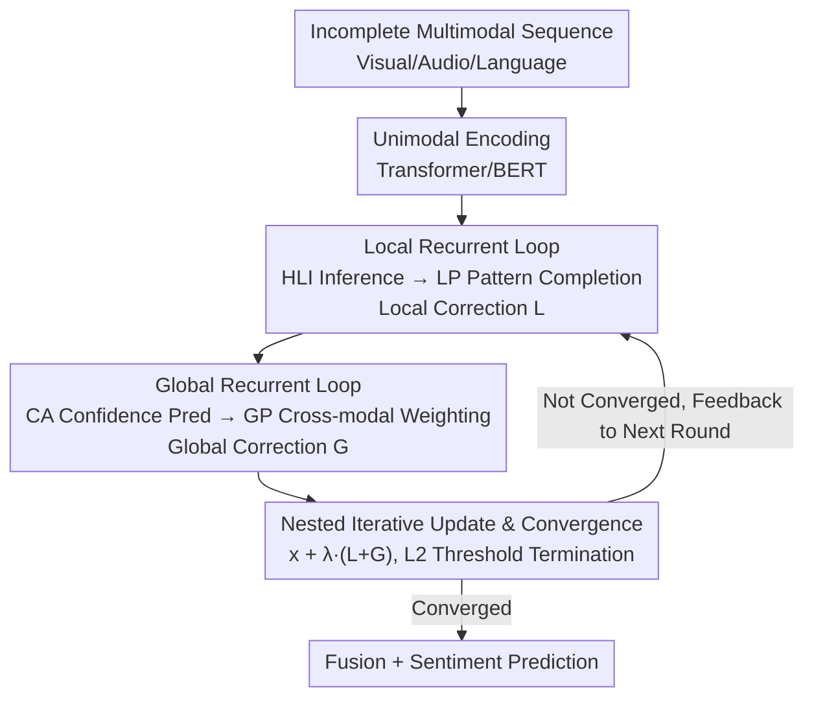

# Active Perceptual Inference: A Corticothalamic-Inspired Dynamic Nested Recurrent Network for Multimodal Sentiment Analysis with Incomplete Data

**Conference**: CVPR 2026  
**Paper**: [CVF Open Access](https://openaccess.thecvf.com/content/CVPR2026/html/Zhang_Active_Perceptual_Inference_A_Corticothalamic-Inspired_Dynamic_Nested_Recurrent_Network_for_CVPR_2026_paper.html)  
**Code**: To be confirmed  
**Area**: Multimodal VLM  
**Keywords**: Multimodal Sentiment Analysis, Frame-level Missingness, Brain-inspired, Recursive Inference, Corticothalamic Circuit  

## TL;DR
To address the "random frame-level missingness" problem in Multimodal Sentiment Analysis (MSA), this paper incorporates the human brain's "active perceptual inference" mechanism into the network. It proposes a dual-layer nested recurrent network, DNRNet: a local loop simulates intra-cortical pattern completion for intra-modality self-correction, while a global loop simulates the corticothalamic circuit to perform cross-modal weighted completion based on modality confidence. Two corrective signals are iteratively fed back into the input, upgrading "one-pass feedforward passive completion" to "multi-round active inference completion," achieving an average improvement of 1.5%–2.0% across various missing rates on MOSI/MOSEI/SIMS.

## Background & Motivation

**Background**: Multimodal Sentiment Analysis (MSA) integrates linguistic, acoustic, and visual information to understand human emotions. However, real-world data often suffers from missingness due to occlusion, noise, or transmission interruptions. Missingness falls into two categories: modality-level (an entire modality is unavailable) and frame-level (some frames/segments within a modality are missing). Frame-level missingness is finer-grained, more random, and can coexist across modalities, leading to fragmented emotional cues and cross-modal inconsistency, making it more challenging to handle.

**Limitations of Prior Work**: Current mainstream frame-level completion methods rely on cross-modal consistency. For example, P-RMF maps single modalities to a Gaussian latent space to extract core features and uses a unidirectional feedforward injection mechanism to enhance representations. These methods have two critical flaws: first, they focus only on cross-modal commonalities and **ignore modality-specific information**, making it difficult to recover fine-grained local semantics within a modality; second, they generally use **one-pass feedforward for "passive completion"**—information moves in one direction only, lacking adaptive error-correction capabilities, thus failing to eliminate redundancy and noise introduced during completion.

**Key Challenge**: Passive unidirectional completion $\neq$ active inference completion. The former is a one-shot decision that cannot be corrected; true "completion" should be a process of simultaneous inference and calibration.

**Key Insight**: Neuroscience indicates that when faced with incomplete or ambiguous information, the brain does not receive it passively but performs **active perceptual inference** based on prior expectations. This process is supported by two mechanisms: ① Intra-cortical recurrent pattern completion—lower-order cortices send incomplete information bottom-up to higher-order cortices for inference and prediction generation, which is then fed back top-down to activate pattern completion; ② Corticothalamic circuits—the thalamus acts as a relay hub to regulate and integrate multi-sensory information. Completed features are then sent back to the higher-order cortex for the next round of inference, creating a cycle that allows the brain to recognize inputs quickly and accurately despite incompleteness.

**Core Idea**: Implement this "nested cycle" as a network—using a **local recurrent loop** to simulate intra-cortical pattern completion for recovering intra-modality semantics, and a **global recurrent loop** to simulate the corticothalamic circuit for confidence-driven cross-modal completion. Two corrective signals are iteratively fed back into the input, realizing a paradigm shift from "passive completion" to "active perceptual inference." This is the first work to introduce recursive inference into the missing data completion task.

## Method

### Overall Architecture

DNRNet runs a nested recurrent network for each modality $m \in \{v, a, l\}$ (visual/audio/language) for $n$ iterations. The input is a frame-level incomplete multimodal sequence $X_m$ (zero vectors for missing visual/audio frames, `[UNK]` for missing language frames), and the output is the completed features used for sentiment regression.

The flow of a single iteration $t$ consists of three steps: ① **Local Recurrent Loop**—The High-level Inference (HLI) module receives the current feature $x_m^{(t)}$ for deep intra-modality inference to generate an inference signal, which the Local Perception (LP) module captures to produce a local corrective feature $L_m^{(t)}$; ② **Global Recurrent Loop**—The Confidence Awareness (CA) module estimates the reliability of each modality, and the Global Perception (GP) module dynamically aggregates information from other modalities based on confidence to produce a global corrective feature $G_m^{(t)}$; ③ **Iterative Update**—$L_m^{(t)}$, $G_m^{(t)}$, and $x_m^{(t)}$ are fused as the input $x_m^{(t+1)}$ for the next round, with a convergence criterion deciding whether to stop early. This nested structure, where local loops are embedded in global loops and the whole system iterates, allows features to be continuously refined and adaptively corrected while suppressing redundancy and noise.

### Key Designs

**1. Local Recurrent Loop: Recovering intra-modality fine-grained semantics via "bottom-up inference + top-down feedback"**

Addressing the weakness of prior methods that "focus only on cross-modal commonalities and lose modality-specific information," the local loop performs semantic self-correction specifically for the modality **itself**. It consists of two modules corresponding to the high- and low-order division of labor in the cortex. The High-level Inference (HLI) module (a two-layer Transformer encoder, simulating the higher-order cortex) performs deep inference on the current feature after feedforward projection to generate a local inference signal $g_m^{(t)} = E_m^{HLI}(\mathrm{FF}_m(x_m^{(t)}))$; subsequently, the Local Perception (LP) module (two-layer MLP + Tanh, simulating the lower-order cortex) receives the signal via feedback projection to produce the local corrective feature $L_m^{(t)} = E_m^{LP}(\mathrm{Feedback}_m(g_m^{(t)}))$. $L_m^{(t)}$ represents what the modality is "expected" to be completed into, and it also serves as the Query for the global loop's attention. This is effective because the "feedforward + feedback" closed loop of high-level inference followed by low-level completion is the core of brain pattern completion, allowing the modality to actively recover missing local details based on its own prior expectations rather than passively waiting for other modalities.

**2. Global Recurrent Loop: Cross-modal consistency calibration via corticothalamic circuits based on confidence**

Relying solely on intra-modality self-inference can lead to local semantic ambiguity and lacks cross-modal calibration. The global loop simulates the corticothalamic circuit to address this. The key is the Confidence Awareness (CA) module (simulating thalamic regulatory functions): it uses a Transformer to perceive the sequence and a linear classifier with Sigmoid to output a modality confidence $w_m^{(t)} \in [0,1]$. To ensure meaningful confidence learning, a confidence awareness loss $\mathcal{L}_{ca}$ is introduced, using MSE between the prediction $w_m^k$ and the soft label $\hat{w}_m^k = 1 - r_m^k$ (where $r_m^k$ is the missing rate)—higher missingness should lead to lower confidence, with supervision signals derived directly from the missing ratio. Then, the Global Perception (GP) module performs cross-modal attention: other modalities are first aggregated into a cross-modal context $C_m^{(t)} = \sum_{i \ne m} w_i^{(t)} x_i^{(t)}$ weighted by confidence. Then, using local correction $L_m^{(t)}$ as the Query and $C_m^{(t)}$ as the Key/Value for retrieval, scaled by the residual weight $(1 - w_m^{(t)})$, the global correction is obtained:

$$G_m^{(t)} = (1 - w_m^{(t)}) \cdot \mathrm{Attention}(L_m^{(t)},\, C_m^{(t)},\, C_m^{(t)})$$

The design of $(1 - w_m^{(t)})$ is ingenious: the less reliable the current modality is (the more it is missing), the more information it borrows from other modalities, achieving "cross-modal help on demand" rather than mindless fusion.

**3. Nested Iterative Update + Convergence Mechanism: Continuous refinement with a "stop when sufficient" approach**

With local and global corrections, how are they applied back to the input without infinite iteration and wasted computation? This paper sums the two corrective signals into a unified signal and injects it into the current feature using a trainable scaling factor $\lambda$ followed by LayerNorm:

$$x_m^{(t+1)} = \mathrm{LayerNorm}_m\!\left(x_m^{(t)} + \lambda \cdot \left(L_m^{(t)} + G_m^{(t)}\right)\right)$$

This is "nested recursion"—the products of the local and global loops are iteratively fed back, refining the features round by round. To prevent uncontrollable iteration, a convergence criterion is designed: at the end of each round, the average relative L2 change of all modality features is calculated: $\Delta_{rel}^{(t+1)} = \frac{1}{N_b}\sum_k \frac{\|S_k^{(t+1)} - S_k^{(t)}\|_2}{\|S_k^{(t)}\|_2 + \xi}$, where $S^{(t)}$ is the aggregated state vector of concatenated flattened modality features, and $\xi$ prevents division by zero. Once $\Delta_{rel}^{(t+1)} < \epsilon$ (the paper uses $\epsilon = 0.0001$), it stops, ensuring the minimum necessary rounds are run when the feature space is stable, balancing efficiency and stability.

### Loss & Training

Finally, the completed features of each modality are summed $H = x_v^{(final)} + x_a^{(final)} + x_l^{(final)}$, and global average pooling is used to form a fixed-length vector followed by a linear classifier for sentiment prediction $\hat{y}$. The total loss is a weighted sum of three terms:

$$\mathcal{L}_{total} = \mathcal{L}_{task} + \alpha \cdot \mathcal{L}_{ca} + \beta \cdot \mathcal{L}_{rec}$$

Where $\mathcal{L}_{task}$ is the MSE between the predicted score and the ground truth; $\mathcal{L}_{ca}$ is the confidence awareness loss mentioned earlier; and $\mathcal{L}_{rec}$ is the feature reconstruction loss—each modality has an independent reconstructor $E_m^{Rec}$ (two-layer Transformer) that minimizes the L2 distance between reconstructed features $\hat{x}_m$ and complete input features $u_m = \mathrm{Enc}_m(U_m)$, serving as auxiliary supervision to pull completed features closer to the true complete features. Weights are tuned per dataset: MOSI $(\alpha,\beta)=(0.5, 0.1)$, MOSEI $(0.9, 10)$, SIMS $(0.9, 0.1)$. Trained for 200 epochs using AdamW, with warmup, cosine annealing, and early stopping. Hidden dimension is 128, batch size is 64, learning rate is 1e-4, averaged over three seeds.

## Key Experimental Results

### Main Results

Average results across various missing rates (0–0.9) on three benchmarks show DNRNet achieves SOTA on most metrics (lower MAE is better):

| Dataset | Metric | DNRNet | Sub-optimal (P-RMF/LNLN) | Description |
|--------|------|--------|------------------|------|
| MOSI | Acc-2 / F1 | 74.22 / 74.24 | 72.81 / 72.93 (P-RMF) | Acc-2 +1.66%, F1 +1.59% |
| MOSI | MAE | **1.036** | 1.038 (P-RMF) | Lowest MAE |
| MOSEI | Acc-7 / Acc-5 | **46.89 / 47.84** | — | Highest in both 7/5-class |
| MOSEI | MAE / Corr | 0.655 / 0.590 | 0.658 / 0.589 (P-RMF) | Slightly superior |
| SIMS | Acc-5 / Acc-3 | **35.71 / 59.54** | 34.83 / 57.14 | Leading in most metrics on Chinese set |
| SIMS | MAE / Corr | **0.498 / 0.416** | 0.500 / 0.414 (P-RMF) | Optimal |

> Trend analysis (Fig. 3): As the missing rate increases, the performance of all baselines drops sharply, while DNRNet maintains significant advantages and stability at high missing rates, verifying the robustness of the nested recursive mechanism.

### Ablation Study

Component-wise and loss-wise ablation on MOSI/SIMS (excerpt from MOSI):

| Configuration | Acc-2 | F1 | MAE↓ | Description |
|------|-------|-----|------|------|
| **DNRNet (Full)** | 74.22 | 74.24 | 1.036 | Full model |
| w/o multi-round recurrence | 73.95 | 73.68 | 1.058 | Single round only; most significant drop |
| w/o Local Perception | 73.66 | 73.72 | 1.049 | Removes local loop; loses intra-modality correction |
| w/o Global Perception | 73.29 | 73.46 | 1.059 | Removes global loop; loses cross-modal calibration |
| w/o $\mathcal{L}_{ca}$ | 72.88 | 72.91 | 1.072 | Removes confidence loss; largest MAE degradation |
| w/o $\mathcal{L}_{rec}$ | 73.43 | 73.28 | 1.051 | Removes reconstruction loss; lower completion fidelity |

### Key Findings
- **Multi-round recurrence is critical**: Removing multi-round recurrence (degrading to single feedforward) leads to significant drops, proving that "multi-step iterative pattern completion" cannot be replaced by a single feedforward pass—this is the core Gain from shifting to "active inference."
- **Prominent contribution of confidence awareness loss**: Without $\mathcal{L}_{ca}$, the MAE on MOSI increases from 1.036 to 1.072, the largest degradation among all ablations, showing that dynamic perception of reliability differences is vital for robust fusion.
- **Resistance to "collapse" at high missing rates**: The confusion matrix (Fig. 4) shows that at a missing rate of 0.9, the baseline LNLN predicts almost all samples as the neutral class (semantic separability collapse), whereas DNRNet's predictions remain distributed across multiple classes, maintaining discriminability in the semantic space through continuous local+global calibration.

## Highlights & Insights
- **Precise mapping from brain mechanisms to network structure**: High/low-order cortex ↔ HLI/LP, Thalamus ↔ CA, Corticothalamic loop ↔ Global loop, overall circulation ↔ Nested iteration. Neuroscience concepts are mapped to modules one-to-one, creating a brain-inspired design that is both interpretable and effective.
- **Confidence residual $(1-w_m)$ as a cross-modal help switch**: Modalities borrow more information the more they are missing, turning "whether and how much to fuse" into an adaptive decision based on data missingness, which is more reasonable than unconditional cross-modal fusion and transferable to any multi-source fusion task with reliability estimation.
- **Convergence criterion for efficient recursion**: Using a relative L2 change threshold to dynamically control iteration counts avoids waste or insufficiency from fixed depths. This "on-demand iteration" strategy is applicable to all iterative completion/denoising networks.

## Limitations & Future Work
- The performance Gains are modest (average 1.5%–2.0%), and some metrics (e.g., SIMS F1, MOSEI Acc-5/F1) are not leading comprehensively. The multiple forward passes from recursion also imply higher inference overhead than one-pass methods (⚠️ the paper does not provide time/FLOPs comparisons with baselines).
- Idealized missingness simulation: Visual/audio filled with zeros, language with `[UNK]`, and random masking via Bernoulli distribution. Whether it remains effective for structured or bursty missingness in real scenarios needs verification; the soft label $\hat{w}_m = 1 - r_m$ depends on knowing the missing rate during training, and the transferability of confidence supervision is questionable if the missing rate is unknown during testing.
- Modality loss weights $(\alpha, \beta)$ require per-dataset tuning (MOSEI's $\beta$ is as high as 10), indicating hyperparameter sensitivity and high tuning costs.
- Future directions: Introducing more realistic missing distributions, making $\lambda$ or iteration counts sample-adaptive, and exploring confidence estimation without missing-rate supervision.

## Related Work & Insights
- **vs. P-RMF / LNLN (Cross-modal consistency completion)**: These use unidirectional feedforward for passive completion and emphasize cross-modal commonalities; Ours uses dual-layer nested recursion for active inference and explicitly preserves modality-specific info (Local loop), making it more stable at high missing rates.
- **vs. BIG-FUSION and other brain-inspired fusion**: Existing brain-inspired methods mostly focus on cross-modal integration or attention modulation (static fusion); Ours further leverages corticothalamic circuits for **iterative inference**, introducing "active perceptual inference" to missing data completion as a new entry point for brain-inspired research.
- **vs. Tensor completion / Feature reconstruction (EMT-DLFR, etc.)**: Those methods approach missing segments from mathematical optimization or reconstruction perspectives; Ours is end-to-end recursive inference, where reconstruction loss is auxiliary rather than the backbone.

## Rating
- Novelty: ⭐⭐⭐⭐⭐ First to introduce recursive active inference into missing completion; brain mapping is complete and self-consistent.
- Experimental Thoroughness: ⭐⭐⭐⭐ Three datasets + all missing rates + component/loss ablations + visualization; lacks efficiency comparison.
- Writing Quality: ⭐⭐⭐⭐ Clear storyline, complete formulas, and neuroscience analogies are well-integrated.
- Value: ⭐⭐⭐⭐ Modest gains but generalizable logic; confidence residuals and on-demand iteration are transferable to multi-source fusion.

<!-- RELATED:START -->

## Related Papers

- [\[CVPR 2026\] Factorize, Reconstruct, Enhance: A Unified Framework for Multimodal Sentiment Analysis](factorize_reconstruct_enhance_a_unified_framework_for_multimodal_sentiment_analy.md)
- [\[CVPR 2026\] Conflict-Aware Adaptive Cross-Reconstruction for Multimodal Sentiment Analysis](conflict-aware_adaptive_cross-reconstruction_for_multimodal_sentiment_analysis.md)
- [\[CVPR 2026\] Prototype-as-Prompt: Multimodal Sentiment Prototypes Endowing Large Language Models the Capability to Perform Multimodal Sentiment Analysis](prototype-as-prompt_multimodal_sentiment_prototypes_endowing_large_language_mode.md)
- [\[CVPR 2026\] Enhance-then-Balance Modality Collaboration for Robust Multimodal Sentiment Analysis](enhance-then-balance_modality_collaboration_for_robust_multimodal_sentiment_anal.md)
- [\[CVPR 2026\] EBMC: Enhance-then-Balance Modality Collaboration for Robust Multimodal Sentiment Analysis](ebmc_multimodal_sentiment_analysis.md)

<!-- RELATED:END -->
