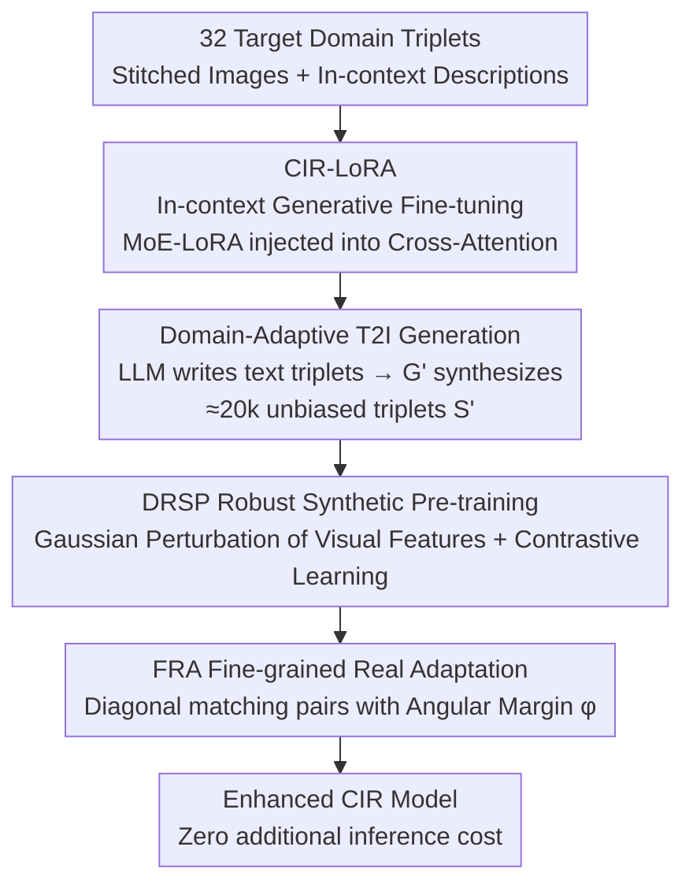

# Adapting In-context Generation for Enhanced Composed Image Retrieval

**Conference**: CVPR 2026  
**Paper**: [CVF Open Access](https://openaccess.thecvf.com/content/CVPR2026/html/Li_Adapting_In-context_Generation_for_Enhanced_Composed_Image_Retrieval_CVPR_2026_paper.html)  
**Code**: https://github.com/JThuge/DAIG  
**Area**: Multimodal VLM / Image-Text Retrieval  
**Keywords**: Composed Image Retrieval, Few-shot, T2I Fine-tuning, Synthetic Triplets, Domain Adaptation

## TL;DR
This paper proposes DAIG: using 32 target domain samples to perform in-context fine-tuning (CIR-LoRA) on a pre-trained T2I model (Flux). This allows the model to synthesize "unbiased, domain-aligned" Composed Image Retrieval (CIR) triplets in batches. A two-stage training framework (feature-perturbed pre-training DRSP + angular margin fine-tuning FRA) is then used to feed these synthetic data into any off-the-shelf CIR model, achieving significant performance gains on CIRR/FashionIQ in a plug-and-play manner with zero additional inference cost.

## Background & Motivation

**Background**: The input for Composed Image Retrieval (CIR) is a dual-modality query consisting of a "reference image $I_r$ + a relative description $T_c$." The goal is to retrieve a target image $I_t$ from a gallery that matches the user's modification intent. Supervised CIR methods (CLIP4CIR, BLIP4CIR, SPRC, etc.) perform well due to cross-modal alignment in VLMs but rely heavily on human-annotated $(I_r, T_c, I_t)$ triplets.

**Limitations of Prior Work**: Annotating triplets is extremely expensive, making supervised CIR difficult to scale. Zero-shot CIR (ZS-CIR) attempts to bypass annotation, but three mainstream routes have flaws: inversion networks (mapping images to pseudo-tokens), training-free LLM inference (slow and complex), and triplet synthesis (CompoDiff/VISTA/CoAlign). Triplet synthesis has the most potential, but synthesized data **lacks target domain knowledge**, leading to a hard-to-eliminate domain gap.

**Key Challenge**: The work most relevant to this paper, CoAlign, uses a frozen T2I model for zero-shot in-context generation—where an LLM writes text triplets, fills them into a layout template, and the T2I generates "two semantically related sub-images" in one forward pass. However, it has two fundamental issues: (1) high distribution drift between generated images and the real target domain; (2) a lack of task priors, leading to overly similar backgrounds in sub-images, which introduces bias when used as $I_r/I_t$. In other words, freely generated triplets are **biased and noisy**, yielding limited effectiveness despite filtering.

**Goal**: To generate clean, unbiased CIR training triplets that align with the target domain using only a few annotations (few-shot), even as few as 32 samples, and to enhance any existing CIR model with these samples.

**Key Insight**: The authors found that LoRA inherently possesses the attribute of "capturing and aligning with target domain distributions from minimal samples," while in-context descriptions can inject CIR task objectives into T2I models. Thus, the approach shifts from "generation with a frozen model" to "generation with a few-shot fine-tuned model."

**Core Idea**: Use 32 target domain samples for parameter-efficient in-context fine-tuning of a T2I model (CIR-LoRA) to inject domain and task priors simultaneously, generating unbiased domain-adaptive triplets. A two-stage framework (robust pre-training on synthetic data + fine-grained fine-tuning on real data) is then used to enhance off-the-shelf CIR models.

## Method

### Overall Architecture

DAIG consists of three serial components: **(i) In-context Generative Fine-tuning** → **(ii) Domain-Adaptive In-context Generation** → **(iii) Two-stage CIR Training Framework**.

Input for the first part is 32 target domain triplets, outputting a T2I model $G'$ that "understands" the domain and the CIR task. Each triplet is combined into a stitched image + in-context description to fine-tune Flux with CIR-LoRA. The second part uses $G'$ with an LLM for batch data creation: the LLM generates ~20k text triplets based on `(object, edit)` templates, which are fed to $G'$ to synthesize synthetic triplet set $S'$ (~20k). The third part utilizes $S'$ and real annotations $S$ in two stages: distribution robust synthetic pre-training (DRSP) on synthetic data, followed by fine-grained real adaptation (FRA) with angular margins on real annotations.

### Key Designs

**1. CIR-LoRA: Simultaneous Injection of Domain and Task Priors**

To address the bias of frozen T2I models, the authors perform parameter-efficient fine-tuning with 32 samples. Each target domain triplet's $I_r$ and $I_t$ are stitched horizontally. A captioner generates descriptions $T_r, T_t$ for both, which along with $T_c$ are put into a template to get an in-context description $T_{ic}$. During fine-tuning, the backbone is frozen while a learnable CIR-LoRA is integrated into the cross-attention layers:

$$\text{Attention}(Q,K,V)=\text{Softmax}\!\left(\frac{QK^{T}}{\sqrt{d}}\right)V,\quad K=W_k\,\tau_{txt}(T_{ic}),\ V=W_v\,\tau_{txt}(T_{ic})$$

The key is using a MoE (Mixture of Experts) for each projection weight $W$. A routing function $r$ assigns weights to experts $B_i, A_i$ based on description characteristics. This allows the model to handle diverse edit operations (add/delete/replace/viewpoint) by assigning optimal experts.

**2. DAIG Generation Pipeline: LLM Scripting + G' Image Synthesis**

To scale data, LLMs are driven by templates $P(\text{object}, \text{edit})$ to output $(T_r, T_c, T_t)$ in JSON, constrained by target domain examples. These are converted to in-context descriptions for $G'$ to synthesize $S'=\{I_r^i, T_c^i, I_t^i\}_{i=1}^M$. This ensures diversity and high fidelity without the need for additional filtering like in CoAlign.

**3. DRSP: Distribution Robust Synthetic Pre-training**

Synthetic T2I images often form a **sparse distribution** relative to the real domain. The authors model the statistics (mean $\mu(v)$, std $\sigma(v)$) of the visual features $v$ as a multivariate Gaussian and apply reparameterized perturbations:

$$\tilde v=\tilde\sigma(v)\,\frac{v-\mu(v)}{\sigma(v)}+\tilde\mu(v)$$

Then $\tilde v$ replaces $v$ for alignment. This "stretches" the sparse synthetic distribution to improve generalization with **zero additional inference cost**.

**4. FRA: Fine-grained Real Adaptation**

FRA fine-tunes on real annotations $S$ by adding an angular margin $\varphi$ to the matching pairs (diagonal elements) in the similarity matrix:

$$p_{i,j}=\frac{e^{cos(\theta_{i,j}/\tau)}}{\sum_{k\in B} e^{cos(\theta_{i,k}/\tau)}},\quad \theta_{i,j}=\arccos\big(\text{sim}(f_q^i, f_t^j)\big)+\varphi\cdot\mathbb{I}(i=j)$$

This forces the model to learn more discriminative representations to bridge the final domain gap.

## Key Experimental Results

### Main Results

On the CIRR test set, DAIG acts as a plug-and-play enhancement for three base models across 32-shot, 1%, and 100% data rates.

| Setting | Method | R@1 | R@5 | R@10 | Avg. |
|------|------|-----|-----|------|------|
| 32-shot | CLIP4CIR† | 22.87 | 52.12 | 64.63 | 52.12 |
| 32-shot | + DAIG | 31.02 | 63.71 | 75.81 | 61.51 |
| 32-shot | SPRC† | 29.88 | 57.61 | 69.25 | 62.46 |
| 32-shot | + DAIG | 42.05 | 72.41 | 82.00 | 71.87 |
| 100% | SPRC† | 52.05 | 82.22 | 89.98 | 81.27 |
| 100% | + DAIG | **53.88** | **84.10** | 90.60 | **82.40** |

### Synthesis Dataset Comparison

Using only 20k synthetic triplets (DAIG-DRSP) outperforms existing datasets with millions of samples.

| Dataset | Scale | CIRR Avg. | FashionIQ Avg@10 |
|--------|------|-----------|------------------|
| ST18M | 18M | 62.47 | 30.97 |
| **DAIG-DRSP (Ours)** | **20k** | **71.68** | **44.74** |

### Ablation Study

| Stage | Configuration | CIRR R@5 | FashionIQ Avg@10 |
|------|------|----------|------------------|
| DRSP | ZSIG (Zero-shot Gen) | 66.10 | 39.66 |
| DRSP | + CIR-LoRA | 71.01 | 43.89 |
| DRSP | + Feature Perturbation | 72.02 | 45.02 |
| FRA | w/ Angular Margin φ | **75.52** | **45.51** |

## Highlights & Insights

- **Shifting from "Frozen" to "Few-shot Fine-tuned" Generation**: A small change that addresses both domain bias and task prior deficiency.
- **MoE for Task Diversity**: MoE routing handles the wide range of editing operations in relative descriptions better than a single LoRA.
- **Zero-cost Gain via DRSP**: Perturbing feature statistics to broaden sparse distributions is a clean, plug-and-play regularization for any "train on synthetic, test on real" scenario.

## Limitations & Future Work

- **Computational Dependency**: Relies on heavy T2I (Flux) and LLM (Qwen2.5) models for the generation pipeline.
- **Object/Edit Set Construction**: These sets currently require manual or heuristic definition, which introduces a new dependency.
- **Benchmark Coverage**: Validated primarily on FashionIQ and CIRR; performance on more open-domain or long-tail datasets remains to be explored.

## Related Work & Insights

- **vs CoAlign**: By fine-tuning instead of freezing the model, DAIG generates unbiased domain-adaptive data that outperforms CoAlign's 534k triplets with only 20k samples.
- **vs PromptCLIP / PTG**: DAIG demonstrates that "generating high-quality data" is more effective than "prompt tuning" in few-shot CIR settings.

## Rating
- Novelty: ⭐⭐⭐⭐
- Experimental Thoroughness: ⭐⭐⭐⭐⭐
- Writing Quality: ⭐⭐⭐⭐
- Value: ⭐⭐⭐⭐

<!-- RELATED:START -->

## Related Papers

- [\[CVPR 2026\] ReCALL: Recalibrating Capability Degradation for MLLM-based Composed Image Retrieval](recall_recalibrating_capability_degradation_for_mllm-based_composed_image_retrie.md)
- [\[CVPR 2026\] Self-guided Semantic Inspection for Zero-Shot Composed Image Retrieval](self-guided_semantic_inspection_for_zero-shot_composed_image_retrieval.md)
- [\[CVPR 2026\] ConeSep: Cone-based Robust Noise-Unlearning Compositional Network for Composed Image Retrieval](conesep_cone-based_robust_noise-unlearning_compositional_network_for_composed_im.md)
- [\[CVPR 2026\] Air-Know: Arbiter-Calibrated Knowledge-Internalizing Robust Network for Composed Image Retrieval](air-know_arbiter-calibrated_knowledge-internalizing_robust_network_for_composed_.md)
- [\[CVPR 2026\] STiTch: Semantic Transition and Transportation in Collaboration for Training-Free Zero-Shot Composed Image Retrieval](stitch_semantic_transition_and_transportation_in_collaboration_for_training-free.md)

<!-- RELATED:END -->
