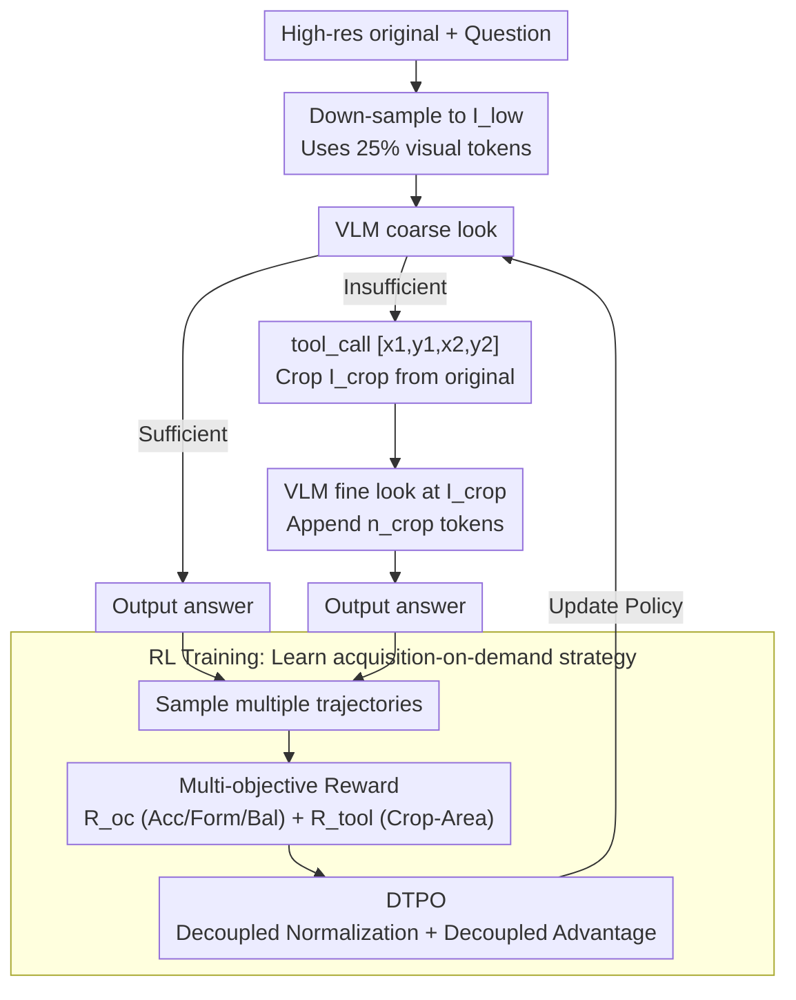

# AdaptVision: Efficient Vision-Language Models via Adaptive Visual Acquisition

**Conference**: CVPR2026  
**arXiv**: [2512.03794](https://arxiv.org/abs/2512.03794)  
**Code**: [github.com/adaptvision/adaptvision](https://github.com/adaptvision/adaptvision)  
**Area**: Multimodal VLM  
**Keywords**: Visual token compression, Adaptive visual acquisition, Reinforcement learning, Tool calling, Efficient VLM

## TL;DR
AdaptVision is proposed to enable VLMs to autonomously determine the minimum number of visual tokens required for each sample through a coarse-to-fine active vision mechanism and reinforcement learning. Combined with Decoupled Turn Policy Optimization (DTPO), it achieves an optimal balance between efficiency and accuracy.

## Background & Motivation
1. VLMs rely on a massive number of visual tokens (e.g., Qwen2.5-VL generates 2678 tokens for a 2048×1024 image), leading to significant computational and memory overhead.
2. Existing efficient VLM methods typically compress visual tokens at a fixed ratio (e.g., 50% pruning), lacking adaptability to varying task requirements.
3. Cognitive neuroscience reveals that the human visual system operates via "active vision"—capturing coarse low-frequency information first, followed by fine-grained analysis of key regions.
4. Recent "thinking with images" paradigms (e.g., zoom/crop operations in DeepEyes, Mini-o3) demonstrate the potential of active visual reasoning.
5. The application of "thinking with images" for visual token compression remains under-explored—allowing the model to decide how many visual tokens are sufficient.
6. Training such dual-objective policies with standard GRPO faces challenges in credit assignment ambiguity and optimization imbalance.

## Method

### Overall Architecture

AdaptVision addresses the resource waste of VLMs "feeding on maximum visual tokens regardless of image complexity" by letting the model decide the required visual input. It implements a coarse-to-fine active vision pipeline: first, it processes a 1/4 resolution image $I_{low}$, consuming only 25% of visual tokens for a global preview. Based on this, the model decides whether to answer directly or utilize a `<tool_call>[x1,y1,x2,y2]</tool_call>` to crop a key region $I_{crop}$ from the high-resolution original for detailed inspection before responding. The final visual tokens used for a sample is $n_{img} = n_{low} + \mathbf{1}_{tool} \cdot n_{crop}$—stopping if the first look is sufficient, or appending tokens for the zoomed area if not. The challenge lies in training this "acquisition-on-demand" strategy, addressed via specific reward signals and optimization algorithms.

### Key Designs

**1. Multi-objective Reward: Jointly rewarding accuracy, penalizing inefficiency, and compressing area**

The model must trade off between "accuracy" and "token savings." As a single accuracy reward is insufficient, the reward comprises five components across outcome rewards $\mathcal{R}_{oc}$ and tool rewards $\mathcal{R}_{tool}$:

- **Accuracy Reward** $\mathcal{R}_{acc}$: LLM-as-judge evaluates correctness (1/0).
- **Format Reward** $\mathcal{R}_{form}$: Ensures compliance with `<think>`, `<answer>`, and `<tool_call>` tags (0.5/0).
- **Balance Reward** $\mathcal{R}_{bal}$: Penalizes "answering correctly only after tool use" by 0.1, and "lucky direct guesses with low probability" by 0.1 to discourage gambling.
- **Crop Reward** $\mathcal{R}_{crop}$: GPT-4o assesses whether the cropped region contains information necessary for the answer.
- **Area Penalty** $\mathcal{R}_{area}$: Penalizes larger cropped areas to force the model to minimize the zoom window.

These components ensure the model neither avoids zooming at the cost of accuracy nor indiscriminately uses tools, binding the token budget and accuracy within a unified optimization objective.

**2. DTPO: Decoupling gradients of tool and answer turns to prevent training collapse**

Standard GRPO training for such two-turn strategies often fails; tool tokens (turn 1) in long sequences are overwhelmed by gradients from answer tokens (turn 2), causing blurry credit assignment. Decoupled Turn Policy Optimization (DTPO) introduces two decoupling mechanisms: First, **Decoupled Learning Objectives**, which categorize generated tokens by function (tool vs. answer) and normalize gradient signals independently to prevent tool token under-optimization. Second, **Decoupled Advantage Estimation**, which calculates independent advantage values $A^{tool}$ and $A^{oc}$ for tool and outcome rewards, respectively. This clearly distinguishes whether a step is credited to tool proficiency or answer correctness. Together, these decouplings stabilize the tool usage rate, preventing collapse into either extreme of direct answering or excessive calling.

### Loss & Training

Based on the PPO-style clipping loss of GRPO, but employing distinct normalization factors and advantage values for tool and answer tokens:

$$\mathcal{J}_{DTPO} = \mathcal{J}_{tool} + \mathcal{J}_{answer}$$

Each part is normalized independently to prevent the dilution of gradient signals in two-turn sequences.

## Key Experimental Results

### Main Results: Comparison with Existing Efficient VLM Methods

| Method | #Token↓ | ChartQA | OCRBench | DocVQA | MME | MathVista | Avg.↑ |
|------|---------|---------|----------|--------|-----|-----------|-------|
| Vanilla (Qwen2.5-VL-7B) | 100% | 79.8 | 81.5 | 95.1 | 2316 | 68.2 | 100% |
| Down-Sample | 25% | 62.9 | 68.8 | 94.3 | 2270 | 62.2 | 92.1% |
| FastV (50%) | 50% | 72.6 | 75.8 | 93.6 | 2308 | 63.7 | 95.8% |
| VisionZip (50%) | 50% | 71.5 | 70.5 | 93.8 | 2209 | 64.1 | 94.8% |
| **AdaptVision** | **<50%** | **Superior** | **Superior** | **Superior** | **Superior** | **Superior** | **Highest** |

### Ablation Study: Contribution of DTPO Components

| Setting | Avg. Performance | Token Usage |
|------|-----------------|-------------|
| GRPO baseline | Lower, unstable | Tool use collapses to over-usage |
| + Decoupled Normalization | Significant gain | Stable tool usage rate |
| + Decoupled Advantage | Best | Optimal token efficiency |

### Key Findings
- AdaptVision achieves performance superior to SOTA efficient VLM methods while consuming significantly fewer visual tokens.
- Direct training with GRPO leads to instability, where tool usage initially favors direct answering before collapsing into excessive calling.
- Both decoupling designs in DTPO are critical for stabilizing training and improving performance.

## Highlights & Insights
- Integrates the coarse-to-fine mechanism of human active vision into VLM efficiency optimization.
- The proposed DTPO algorithm is generic and applicable to any multi-turn RL training involving tool calls.
- The multi-layered reward design (accuracy, format, balance, crop, area) reflects a deep understanding of practical training dynamics.

## Limitations & Future Work
- Currently supports only a single tool call (one-turn crop) without exploring multi-turn iterative refinement.
- Crop rewards rely on GPT-4o evaluation, incurring high training costs.
- Experiments are based on Qwen2.5-VL-7B; effectiveness on larger-scale models remains to be validated.

## Related Work & Insights
- Comparison with VisionThink: VisionThink only switches between coarse/fine resolutions, whereas AdaptVision supports region-level adaptive cropping, offering greater flexibility.
- Contrast with fixed compression methods like FastV/SparseVLM: Represents a paradigm shift from passive to active compression.
- DTPO's decoupling strategy can inspire solutions for gradient conflicts in multi-objective RL training.

## Rating
- Novelty: ⭐⭐⭐⭐ (New perspective on active vision + RL for token compression; DTPO is innovative)
- Experimental Thoroughness: ⭐⭐⭐⭐ (9 VQA benchmarks, comprehensive ablation studies)
- Writing Quality: ⭐⭐⭐⭐ (Clear motivation, rigorous derivation)
- Value: ⭐⭐⭐⭐ (Practical direction for efficient VLMs; DTPO is generalizable)

<!-- RELATED:START -->

## Related Papers

- [\[CVPR 2026\] LLMind: Bio-inspired Training-free Adaptive Visual Representations for Vision-Language Models](llmind_bio-inspired_training-free_adaptive_visual_representations_for_vision-lan.md)
- [\[CVPR 2026\] SEATrack: Simple, Efficient, and Adaptive Multimodal Tracker](seatrack_multimodal_tracker.md)
- [\[ACL 2025\] AVG-LLaVA: An Efficient Large Multimodal Model with Adaptive Visual Granularity](../../ACL2025/multimodal_vlm/avg-llava_an_efficient_large_multimodal_model_with_adaptive_visual_granularity.md)
- [\[CVPR 2026\] Proxy3D: Efficient 3D Representations for Vision-Language Models via Semantic Clustering and Alignment](proxy3d_efficient_3d_representations_for_vision-language_models_via_semantic_clu.md)
- [\[CVPR 2026\] Aligning What Vision-Language Models See and Perceive with Adaptive Information Flow](aif_adaptive_information_flow_vlm.md)

<!-- RELATED:END -->
