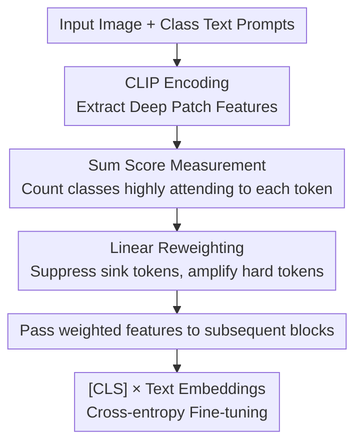

# Addressing Exacerbated Attention Sink for Source-Free Cross-Domain Few-Shot Learning

**Conference**: CVPR2026  
**arXiv**: [2605.25799](https://arxiv.org/abs/2605.25799)  
**Code**: https://github.com/shuaiyi308/TIR (Available)  
**Area**: Multimodal VLM  
**Keywords**: Cross-domain Few-shot, attention sink, CLIP Fine-tuning, token reweighting, source-free

## TL;DR
The authors observe that in source-free cross-domain few-shot learning (CDFSL) scenarios, standard few-shot fine-tuning on the target domain **significantly exacerbates the attention sink of CLIP**. The model concentrates attention on "simple tokens" that are inherently associated with all classes, leading to a loss of inter-class discriminability. To address this, TIR (Token Importance Recalibration) is proposed. It linearly reweights tokens between deep layers of the CLIP vision encoder based on their "cross-class activation" (Sum score). This suppresses sink tokens and amplifies discriminative tokens, achieving new SOTA results across four CDFSL benchmarks.

## Background & Motivation

**Background**: Cross-domain few-shot learning (CDFSL) aims to transfer models pre-trained on source domains like ImageNet to specialized target domains (e.g., medical imaging, satellite imagery) with extremely few labeled samples. As large-scale models become prevalent, **source-free** settings (where source data is unavailable during fine-tuning) have become more practical. Vision-Language Models (VLMs) like CLIP, with their strong generalization, are natural candidates for this task—typically achieved via few-shot fine-tuning on the support set.

**Limitations of Prior Work**: Attention sink (where a few tokens absorb most of the attention and exhibit abnormally large norms) is a recurring phenomenon in VLMs, aiding in information aggregation but also causing hallucinations. However, **its behavior during CDFSL fine-tuning remains unstudied**. The authors visualize that **before** fine-tuning, while visual tokens favored by different classes overlap significantly (existing sink), subtle differences remain. **After** fine-tuning, these high-attention tokens become **identical** across different classes—the sink is severely amplified, resulting in almost no inter-class discriminability and impaired classification.

**Key Challenge**: Why does few-shot fine-tuning worsen the sink problem? The authors explain this through probe experiments as a **shortcut** taken by the model to bridge the massive domain gap. Since the target domain differs significantly from CLIP’s pre-training data and samples are scarce, the model struggles to learn truly useful discriminative patterns. Consequently, it aligns with **simple tokens that were initially close to all class texts** (i.e., sink tokens with Sum=5), as these are the easiest to align. Large amounts of domain information are then crammed into these few tokens, causing norms to spike and the sink to intensify, while **hard tokens (Sum=1) that are initially further from class texts—harder to learn but more discriminative—are sacrificed**.

**Goal**: To shift the model's learning focus from simple/sink tokens back to hard/discriminative tokens, ensuring the token distribution after target domain fine-tuning resembles the source domain's state where "tokens specific to a few classes are highly activated."

**Core Idea**: During fine-tuning, **dynamically reweight** each visual token based on its correlation with target domain class texts—assigning low weights to simple tokens and high weights to hard tokens to explicitly block the model's shortcut-learning path.

## Method

### Overall Architecture
TIR (Token Importance Recalibration) is a lightweight module **inserted between the deep transformer blocks of the CLIP vision encoder**, requiring no backbone changes or source data. An image (and its corresponding class text prompt) is first encoded by CLIP to obtain patch features and text embeddings. After several intermediate blocks (specifically layer 8 and layer 10, where the sink is most prominent), TIR projects visual tokens into the text space, calculates their cosine similarity with each class text, and assigns a **Sum score** (how many classes "highly attend" to it). A linear rule is applied to suppress sink tokens (high Sum) and amplify discriminative tokens (low Sum). The recalibrated features are then passed forward, and finally, the [CLS] token and text embeddings are used for cross-entropy calculation. The pipeline is as follows:

### Key Designs

**1. Sum score: Quantifying sink and discriminative tokens via "cross-class activation patterns"**

To perform reweighting, one must identify which tokens are sinks and which are discriminative. Rather than relying on indirect signals like norms, the authors look at the **activation patterns at the class level**. For deep visual features $\mathbf{V}\in\mathbb{R}^{B\times M\times D_v}$, they are projected into the text space using CLIP's vision-to-text projection matrix $\mathbf{W}_p$ as $\mathbf{V}'=\text{LayerNorm}(\mathbf{V})\mathbf{W}_p$. The cosine similarity $s_{b,i,j}$ between each token $i$ and each class text $\mathbf{t}_j$ is calculated. For **each class**, the top-$k$ ($k=0.3$) tokens with the highest similarity are set to 1 in a binary matrix $\mathbf{S}^{\text{binary}}_{b,i,j}$, which is then summed along the class dimension:

$$\text{Sum}_{b,i}=\sum_{j=1}^{K}\mathbf{S}^{\text{binary}}_{b,i,j}$$

$\text{Sum}=K$ (e.g., 5 in a 5-way setting) indicates that the token is highly attended to by **all classes**—it is "relevant" to everything, losing inter-class discriminability, thus identifying it as a sink token. $\text{Sum}=1$ indicates the token is attended to by only a **single class**, making it a class-specific discriminative token. This score transforms "sink" from a vague norm phenomenon into a computable, actionable discrete metric. Probe experiments using CKA similarity support this: masking Sum=5 tokens increases source-target domain similarity (indicating these tokens store domain-specific information). In 5-way fine-tuning and 7-way testing, the model continued to attend to tokens highly favored by classes **outside** the training set, proving it learns "the entire domain" rather than the specific 5 classes—a shortcut for domain information absorption.

**2. Conditional Linear Reweighting: Suppressing sinks and amplifying hard tokens simultaneously**

With the Sum score, how can the model be steered toward hard tokens? The authors use a simple conditional linear rule to calculate weights for each token:

$$w_{b,i}=\begin{cases}1-\beta\times(\text{Sum}_{b,i}-\alpha)&\text{if }\text{Sum}>0\\1&\text{otherwise}\end{cases}$$

Where $\alpha=3$ is a neutral threshold and $\beta=0.5$ controls the intensity. The logic is elegant: for $\text{Sum}=5$ (sink), $w=1-0.5\times(5-3)=0$, cutting the token off entirely; for $\text{Sum}=1$ (discriminative), $w=1-0.5\times(1-3)=2$, doubling its weight. Tokens with $\text{Sum}=3$ remain at weight 1. Weighted features $\mathbf{V}^{\text{weighted}}=\mathbf{w}\odot\mathbf{V}$ are element-wise multiplied along the token dimension. This intervention prevents gradients from flowing through sink tokens (multiplied by 0), forcing the model to favor harder, more discriminative tokens. A simplified version—setting Sum=$K$ token weights to 0 and Sum=1 token weights to a value $>1$—yields similar results and is easy to implement across various $K$-way $N$-shot configurations.

**3. Fixed Insertion in Deep Layers: Targeted intervention**

TIR is not added to every layer but is inserted between **deep layers** of the vision encoder (specifically layers 8 and 10). This choice stems from layer-wise analysis: in shallow layers (e.g., layer 3), tokens across different Sum scores have similar norms and weak semantic awareness; the sink has not yet formed. By the deep layers (e.g., layer 10), while the source model assigns high norms to discriminative tokens (Sum=1), the target-domain fine-tuned model does the opposite, stacking high norms on non-discriminative Sum=5 tokens. Targeted insertion at deep layers addresses the issue at its root with minimal overhead.

### Loss & Training
The objective is standard CLIP image-text contrastive cross-entropy $\mathcal{L}_{\text{cross}}$ (with temperature $\tau=0.01$), using the similarity between the recalibrated [CLS] feature and class text embeddings. The backbone is CLIP ViT-B/16, with CLIP-LoRA-Vision as the baseline. No source data is used. Hyperparameters are $k=0.3$, $\alpha=3$, $\beta=0.5$, with insertions at layers 8 and 10. Training lasts 100 epochs with data augmentation on the support set. Results reflect 800 trials for 1-shot and 400 trials for 5-shot.

## Key Experimental Results

### Main Results
Across four large-gap CDFSL benchmarks (ISIC2018 skin lesion, EuroSAT remote sensing, CropDiseases agriculture, ChestX chest X-ray), CLIP-LoRA-Vision + TIR achieved new SOTA in 1-shot / 5-shot mean accuracy:

| Setting | Method | ISIC | EuroSAT | CropDiseases | ChestX | Mean |
|------|------|------|---------|--------------|--------|------|
| 5-way 1-shot | REAP (ICML-25, Prev. SOTA) | 38.67 | 75.97 | 85.33 | 24.17 | 56.04 |
| 5-way 1-shot | CLIP-LoRA-Vision (baseline) | 35.23 | 81.41 | 85.32 | 21.73 | 55.92 |
| 5-way 1-shot | **+ TIR (Ours)** | **39.38** | **82.53** | **86.91** | 23.98 | **58.20** |
| 5-way 5-shot | ReCIT (ICML-25, Prev. SOTA) | 54.91 | 91.58 | 96.85 | 28.88 | 68.06 |
| 5-way 5-shot | CLIP-LoRA-Vision (baseline) | 51.10 | 92.52 | 96.21 | 24.13 | 65.99 |
| 5-way 5-shot | **+ TIR (Ours)** | **56.73** | **93.49** | **97.42** | 26.12 | **68.44** |

In 1-shot, TIR outperforms the previous SOTA (REAP 56.04) by **+2.16** and its own baseline by **+2.28**. In 5-shot, it reaches 68.44, surpassing ReCIT's 68.06.

> ⚠️ Note: TIR does not achieve the highest score on ChestX (extreme domain gap)—its 1-shot 23.98 and 5-shot 26.12 are lower than some DINO-based methods (e.g., ReCIT 28.88). TIR's advantage is driven by ISIC, EuroSAT, and CropDiseases.

### Ablation Study
5-way 5-shot results with CLIP-LoRA-Vision as baseline, adding "Inhibit sink" and "Enhance discriminative" mechanisms individually (mean across four datasets):

| Inhibit | Enhance | Mean Accuracy | Description |
|---------|---------|---------|------|
| - | - | 65.99 | baseline |
| ✓ | - | 67.66 | Only inhibit sink tokens, +1.67 |
| - | ✓ | 67.23 | Only enhance discriminative tokens, +1.24 |
| ✓ | ✓ | **68.44** | Full TIR, +2.45 |

### Key Findings
- **Inhibiting sinks is more effective than enhancing discriminative tokens alone**: Inhibit-only (+1.67) outperformed Enhance-only (+1.24), indicating that "cutting off the shortcut" is the primary factor.
- **CKA verifies the shift in focus**: CKA analysis shows that after TIR fine-tuning, masking Sum=5 sink tokens reduces domain similarity (proving they are no longer the primary domain information carriers), while enhancing Sum=1 tokens decreases domain similarity (indicating discriminative tokens now carry domain information).
- **Improved visualization alignment**: Standard fine-tuning yields identical high-attention tokens across classes; with TIR, the model attends to class-specific semantic regions.
- **Greater gains on large-gap domains**: ISIC (skin lesion) saw the largest 5-shot gain (+5.63), indicating TIR is most effective where domain gaps are large and sink issues are most severe.

## Highlights & Insights
- **Framing "worse fine-tuning" as a shortcut story**: The authors do not stop at observing the intensified sink; they use 7-way testing and CKA to prove sink tokens store domain info as a lazy shortcut. This "phenomenon → mechanism → solution" chain is the paper's strongest aspect.
- **Sum score as an actionable discrete metric**: Using the frequency of top-30% attention hits across classes defines token discriminability simply, interpreted without extra training. This "cross-class activation count" can be generalized to other VLM tasks (e.g., attention diagnostics in detection or segmentation).
- **Dual-purpose linear formula**: $w=1-\beta(\text{Sum}-\alpha)$ uses one threshold and one slope to zero out sinks and double discriminative focus. It is nearly zero-cost, parameter-efficient, and plug-and-play.

## Limitations & Future Work
- **Underperformance on ChestX**: On the most extreme domain gap, TIR lags behind several competitors. This suggests that if the target domain is so distant from CLIP’s pre-training that almost no "discriminative tokens" exist to begin with, reweighting yields limited gains.
- **Empirical hyperparameters and placement**: Values for $\alpha$, $\beta$, $k$, and target layers were selected empirically. The sensitivity across different datasets or backbones remains unclear.
- **Dependency on text embeddings**: Sum score reliability depends on the quality of semantic labels and class prompts. Future work could explore learnable soft thresholds or joint text-side optimization.

## Related Work & Insights
- **vs. Standard CLIP Few-Shot / CLIP-LoRA-Vision (baseline)**: These allow sinks to grow in deep layers; TIR inhibits them explicitly, providing stable +2pt gains in a plug-and-play manner.
- **vs. DINO-based CDFSL (ReCIT, REAP, etc.)**: Many such methods use DINO backbones or require source data. TIR achieves superior 1-shot performance within a source-free CLIP framework.
- **vs. Prior Attention Sink Research**: Previous work viewed sinks as information aggregators or sources of hallucinations in general tasks. This work is the first to identify their negative role in CDFSL fine-tuning and link them to domain adaptation shortcuts.

## Rating
- Novelty: ⭐⭐⭐⭐⭐ First to reveal that CDFSL fine-tuning exacerbates attention sinks and provides a mechanism-level explanation via "domain adaptation shortcuts."
- Experimental Thoroughness: ⭐⭐⭐⭐ Solid results across four benchmarks and comprehensive visualizations, though ChestX performance is weaker and hyperparameter sensitivity analysis is limited.
- Writing Quality: ⭐⭐⭐⭐⭐ Clear causal logic from phenomenon to mechanism to solution.
- Value: ⭐⭐⭐⭐ Simple, plug-and-play method with low reproduction barriers; valuable for both CDFSL and VLM attention diagnostics.

<!-- RELATED:START -->

## Related Papers

- [\[ICML 2026\] ATHA: Improving CLIP Adaptation on Source-Free Cross-Domain Few-Shot Learning by Breaking Tail Alignment](../../ICML2026/multimodal_vlm/improving_clip_adaptation_by_breaking_tail_alignment_for_source-free_cross-domai.md)
- [\[CVPR 2026\] Vision-Language Model Guided Source-Free Domain Adaptation via Optimal Transport](vision-language_model_guided_source-free_domain_adaptation_via_optimal_transport.md)
- [\[CVPR 2026\] Towards Multimodal Domain Generalization with Few Labels](towards_multimodal_domain_generalization_with_few_labels.md)
- [\[ICLR 2026\] Exploring Cross-Modal Flows for Few-Shot Learning](../../ICLR2026/multimodal_vlm/exploring_cross-modal_flows_for_few-shot_learning.md)
- [\[CVPR 2026\] Pointing at Parts: Training-Free Few-Shot Grounding in Multimodal LLMs](pointing_at_parts_training-free_few-shot_grounding_in_multimodal_llms.md)

<!-- RELATED:END -->
