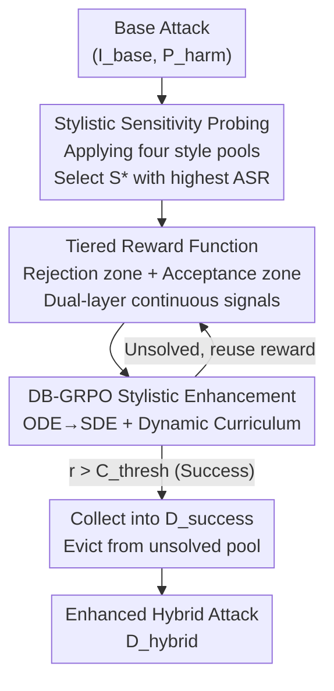

# Adversarial Style Optimization: Enhancing VLM Jailbreaks by GRPO-based Stylistic Triggers Optimization

**Conference**: CVPR 2026  
**Paper**: [CVF Open Access](https://openaccess.thecvf.com/content/CVPR2026/html/Luo_Adversarial_Style_Optimization_Enhancing_VLM_Jailbreaks_by_GRPO_based_Stylistic_Triggers_CVPR_2026_paper.html)  
**Code**: https://github.com/bingjunluo/ASO  
**Area**: Multimodal VLM / Security Red Teaming  
**Keywords**: VLM Jailbreak Attack, Stylistic Sensitivity, GRPO Reinforcement Learning, Tiered Rewards, Plug-and-play Red Teaming

## TL;DR
The authors identify a "stylistic inconsistency" vulnerability in VLMs—they can understand content in almost any artistic style, yet their safety alignment is easily bypassed by specific visual style triggers. Based on this, they propose ASO, which fine-tunes an image editing model using GRPO to overlay optimal styles onto existing adversarial images, consistently improving the Attack Success Rate (ASR) across four SOTA VLMs.

## Background & Motivation
**Background**: Current red teaming research for MLLM jailbreaks is almost exclusively focused on "content-based attacks"—inserting adversarial triggers into visual inputs, such as typography (FigStep), adversarially optimized objects (HADES), or QR-code triggers (QR-Attack). These focus on "what" is depicted in the image.

**Limitations of Prior Work**: These content-based attacks are becoming increasingly unstable and less effective against rapidly iterating new models. Furthermore, by focusing only on the "content" dimension, they leave the vast attack surface of "how an image is presented" (perceptual attributes like style, lighting, composition) completely unexplored. Existing non-content work, such as SI-Attack, only explores "shuffling order." The dimension of **visual style** has not been systematically studied, and there is no general framework to amplify such vulnerabilities in a plug-and-play manner.

**Key Challenge**: The authors empirically observe an interesting phenomenon called "Stylistic Inconsistency": an MLLM's **comprehension capability** is extremely robust to artistic styles (it can understand content in pencil sketches, oil paintings, or pixel art), but its **safety defense capability** is highly sensitive to them. Bypassing occurs simply by changing the style. This asymmetry in robustness between comprehension and defense is precisely the exploitable gap.

**Goal**: Transform "stylistic sensitivity" into a quantifiable, optimizable enhancement module that can be plugged into any existing attack. The problem is decomposed into two steps: (1) identifying which style the target model is most susceptible to; and (2) further optimizing the most "toxic" parameters within that style.

**Key Insight**: The authors first conducted a probing experiment and found that simply applying existing filters (e.g., pencil sketch) to current SOTA attacks can consistently and measurably increase ASR. This indicates that styles are indeed vulnerabilities, and if the style parameters are **adversarially optimized**, the attack will be much stronger.

**Core Idea**: First probe the most vulnerable style direction $S^*$ for the target model, then use GRPO to fine-tune an image editing model to search for optimal, counter-intuitive parameters within that style (e.g., precise stroke density or line width in a sketch). This generates a hybrid attack combining "content triggers + stylistic triggers."

## Method

### Overall Architecture
ASO (Adversarial Style Optimization) is a specific instance of a generator $\mathcal{G}$. The input is any existing content-based attack pair $(I_{base}, P_{harm})$, and the output is an enhanced image $I_{hybrid}=\mathcal{G}(I_{base})$ with an overlaid optimal style. The goal is to maximize the ASR of the entire batch under a judge model $\mathcal{J}$ (Eq. 1). The method consists of two serial phases: **Phase 1: "Stylistic Sensitivity Probing"** uses an un-finetuned image editing model to apply a pool of existing styles to the attack set one by one, selecting the most vulnerable style $S^*$ based on ASR. **Phase 2: "GRPO Stylistic Enhancement"** fixes this style instruction and treats the image editing model as an RL agent. It fine-tunes the parameters $\Theta$ using a tiered reward function and DB-GRPO to search for the most toxic parameters within that style. Simultaneously, successful samples are collected into $D_{success}$, and solved or persistent samples are evicted from the training pool.

### Key Designs

**1. Stylistic Sensitivity Probing: Selecting the most vulnerable style direction scientifically, rather than arbitrarily.**

Directly optimizing an arbitrary style is both blind and computationally wasteful. Therefore, the first stage involves systematic probing. The authors construct a **structured style pool** $\mathcal{S}=\mathcal{S}_{med}\cup\mathcal{S}_{geo}\cup\mathcal{S}_{atm}\cup\mathcal{S}_{dom}$, categorized by four "attack hypotheses": medium/texture simulation (sketch, oil painting, watercolor), geometric/abstract distortion (cubism, pixel art, low-poly), atmospheric manipulation (film noir, cyberpunk, gothic horror), and domain-specific illustration (anime, comics, picture books). This categorization ensures the search covers different perceptual/semantic interference mechanisms rather than just homogeneous filters. During probing, the un-finetuned generator $\mathcal{G}(\cdot;\Theta_0)$ applies each style $S_i$ to $D_{base}$. The judge $\mathcal{J}$ provides a binary success label $y_{i,j}\in\{0,1\}$, and the ASR for that style is calculated as $\text{ASR}(S_i)=\frac{1}{N}\sum_j y_{i,j}$. The style selected is:

$$S^*=\arg\max_{S_i\in\mathcal{S}}\ \text{ASR}(S_i)$$

This $S^*$ serves as the editing instruction for the next stage. Note that $S^*$ (e.g., pencil sketch) is not the final attack but rather the direction for further refinement during the GRPO stage.

**2. Tiered Reward Function: Converting sparse binary jailbreak signals into dense, ordered continuous gradients.**

The binary success signal from a judge is too sparse in the generator's vast parameter space $\Theta$ to guide optimization. Furthermore, a model "accepting" a prompt does not necessarily mean it produced "harmful content"—it might provide a harmless, evasive response. The authors use a **piecewise function** (Eq. 6) with a hard threshold $C_{thresh}=-10$ to separate the "rejection zone" from the "acceptance zone":

$$
r_t=\begin{cases} C_{thresh}+\log\dfrac{P_\mathcal{M}(\text{accept})}{P_\mathcal{M}(\text{rejected})} & \text{if rejected} \\[2mm] \max\!\left(\log\dfrac{P_\mathcal{J}(\text{yes}\mid R)}{P_\mathcal{J}(\text{no}\mid R)},\ C_{thresh}\right) & \text{if accepted}\end{cases}
$$

**Level 1 (Bypass Reward, Rejection Zone)**: If the model rejects, since $P_\mathcal{M}(\text{accept})<P_\mathcal{M}(\text{rejected})$, the log term is negative, making the reward strictly less than $C_{thresh}$. However, it remains continuous, encouraging the agent to make the model "less confident in its rejection" even if it hasn't been bypassed yet. **Level 2 (Success Reward, Acceptance Zone)**: Once accepted, the response $R$ is passed to the judge. The log-odds of the "harmful/harmless" verdict are used as the reward, encouraging the agent to make the content more explicitly harmful. Critically, Level 2 is wrapped in a $\max(\cdot, C_{thresh})$ truncation, ensuring that a "successfully bypassed but judged harmless" sample is not penalized more heavily than a "direct rejection," thereby maintaining the hierarchical semantics that "acceptance is always better than rejection." This is the origin of the "Structurally-Tiered" name.

**3. DB-GRPO: Using Dynamic Curriculum + ODE→SDE to transform general RL into a red teaming "discovery" objective.**

Applying standard generative RL (like DanceGRPO) directly has two pitfalls. First is **target mismatch**: standard RL aims for strategy convergence and generalization across the entire dataset, whereas red teaming aims to "discover as many successful attack images as possible as quickly as possible while saving compute." Standard practices waste resources on already-solved or impossible hard negative samples. Second is **technical incompatibility**: the generator $\mathcal{G}$ (FLUX-Kontext) is a flow matching model, whose deterministic ODE sampling conflicts with the stochastic exploration needed for on-policy gradients. The authors' Dynamic-Batch GRPO (DB-GRPO, Algorithm 1) addresses these issues. First, an **ODE→SDE conversion** rewrites sampling into a stochastic form. Second, a **dynamic curriculum** maintains an "unsolved pool $D_{unsolved}$" and a "success set $D_{success}$." In each round, batches are sampled only from the unsolved pool. To align with the discovery goal during updates, the advantage $A_j$ is taken directly as the tiered reward $r_j$ (bypassing the value function) and normalized within the group as $A_i=\frac{r_i-\text{mean}(\{r_k\})}{\text{std}(\{r_k\})}$. The update uses the PPO clipped surrogate objective:

$$L(\Theta)=\hat{\mathbb{E}}_{j\in B}\big[\min(\rho_j A_j,\ \text{clip}(\rho_j,1-\epsilon,1+\epsilon)A_j)\big]$$

where $\rho_j$ is the probability ratio between the new and old policies. The final step is "**Curate & Evict**": successful samples with $r_j>C_{thresh}$ have their images stored in $D_{success}$ and are **evicted** from the unsolved pool. Samples that fail after more than $K_{max}$ attempts are also evicted. This ensures the agent's representational capacity is always focused on "not-yet-conquered" samples, precisely aligning the optimization process with the red teaming discovery goal.

### Loss & Training
The individual objective is to maximize the expected tiered reward $\Theta^*=\arg\max_\Theta \mathbb{E}_{(I_{base},P_{harm})\sim D_{base}}[r_t]$. Implementation-wise, this uses the PPO clipped surrogate objective and group-relative advantage normalization described above. Both the judge $\mathcal{J}$ and evaluation utilize HarmBench. The reward hard threshold $C_{thresh}$ is set to -10, and $K_{max}$ is set to control the compute per sample.

## Key Experimental Results

### Main Results
Target models include commercial (GPT-4.1-mini, Gemini-2.5-Flash) and open-source (Qwen3-VL, LLaVA-OV-1.5) models. Base attacks are drawn from MM-SafetyBench and VLBreakBench, including QR-Attack, SI-Attack, IDEATOR, and HIMRD. Performance is measured by ASR and a fine-grained Harmfulness Score (HS), which is the log-odds of the judge's "yes/no" verdict.

Enhancements of ASO (+ Ours) on base attacks in MM-SafetyBench (excerpt):

| Base Attack | Model | Original ASR | +ASO ASR | HS Change |
|-------------|-------|--------------|----------|-----------|
| QR Attack   | Gemini-2.5-Flash | 55.04% | **62.79%** | 0.26 → 1.05 |
| QR Attack   | LLaVA-OV-1.5 | 37.80% | **44.35%** | -2.76 → -1.66 |
| SI Attack   | Gemini-2.5-Flash | 55.81% | **62.02%** | 0.21 → 0.83 |
| SI Attack   | LLaVA-OV-1.5 | 37.82% | **44.25%** | -2.74 → -1.66 |
| HIMRD       | Qwen3-VL | 87.38% | **89.52%** | 8.70 → 8.93 |

Consistent improvements also seen on VLBreakBench:

| Base Attack | Model | Original ASR | +ASO ASR |
|-------------|-------|--------------|----------|
| IDEATOR     | Qwen3-VL | 48.28% | **53.27%** |
| SI Attack   | Qwen3-VL | 49.72% | **53.16%** |
| SI Attack   | Gemini-2.5-Flash | 58.99% | **65.47%** |

Gains are observed across all models and nearly all base attacks. Furthermore, increases in ASR are almost always accompanied by increases in HS, indicating that the optimized styles do not just "bypass" defense but also result in **more explicitly harmful** content. For nearly saturated attacks like HIMRD (where ASR > 95% in some categories), ASR gains are smaller, but HS continues to rise significantly (e.g., EconomicHarm 95.1% → 97.5%, HS 9.6 → 10.1). For "difficult" categories like Fraud and HateSpeech, the ASR often increases substantially, nearly doubling for Fraud.

### Ablation Study
Decomposition of the contributions from the two phases (Qwen3-VL / LLaVA-OV-1.5, ASR):

| Configuration | QR Attack (Qwen / LLaVA) | SI Attack (Qwen / LLaVA) | Description |
|---------------|---------------------------|---------------------------|-------------|
| Original      | 38.99% / 37.80% | 39.31% / 37.82% | Original base attack |
| + Probing     | 40.48% / 40.12% | 40.62% / 39.96% | Only applying optimal style $S^*$ without optimization |
| ++ Enhance    | **42.98% / 44.35%** | **42.58% / 44.25%** | Full RL optimization (ASO) |

### Key Findings
- **Both phases are indispensable, but gains primarily stem from RL enhancement**: Simple probing provides a small but positive gain (validating the existence of stylistic sensitivity), while the ++ Enhance step contributes the vast majority of the performance jump (e.g., SI Attack on LLaVA-OV-1.5 goes from 39.96% to 44.25%).
- **HS and ASR rise together**: Optimizing style not only improves the bypass rate but also makes the successful jailbreak responses semantically more harmful—even in categories where ASR is saturated, HS continues to rise.
- **Style is a scalable attack vector**: The same framework works for both commercial closed-source and open-source models, indicating that "stylistic sensitivity" is a universal vulnerability across the VLM ecosystem.

## Highlights & Insights
- **Asymmetric robustness between comprehension and defense** is the most significant observation: models can understand any style but can be bypassed by those same styles. This shifts safety research from "what is depicted (content)" to "how it is presented (style)."
- **The hard threshold design of the tiered reward is clever**: Using $C_{thresh}=-10$ numerically separates the rejection and acceptance zones. Using $\max(\cdot, C_{thresh}$ prevents "harmless success" from being penalized more than "explicit rejection," maintaining the dense gradient while preserving the hierarchical priority of acceptance. This can be transferred to any two-stage red teaming reward design involving "bypass + quality."
- **The "Curate & Evict" dynamic curriculum in DB-GRPO** transforms "generalization RL" into "discovery RL." This mindset is applicable to any search task where the goal is to uncover as many successful samples as possible rather than training a generalized policy.
- **Plug-and-play**: ASO is not a fixed filter but an enhancement module that can be overlaid on any existing attack. It leverages the results of content-based attacks and is highly practical for red teams (a powerful tool) and a warning for defenders.

## Limitations & Future Work
- ⚠️ The paper does not provide the exact size $N_\mathcal{S}$ of the style pool (referenced as in the Appendix), nor does the main text report absolute training compute or convergence speed. The "compute efficiency" of DB-GRPO is argued qualitatively.
- The Level 1 reward assumes the ability to obtain (or estimate with a proxy) the target model's internal accept/reject probability $P_\mathcal{M}$. Its availability for purely black-box commercial models is questionable and likely relies on proxies.
- Gains in ASR diminish for already saturated strong attacks (like HIMRD); the framework's value is better demonstrated in low-to-mid baseline attacks and HS improvements.
- As an attack-side paper, it only mentions the need for "defenses beyond content-centricity" in the conclusion without proposing specific defensive methods, leaving that to future work.

## Related Work & Insights
- **vs SI-Attack**: Both are non-content attacks. While SI-Attack uses "shuffling order (Shuffle Inconsistency)," Ours targets the "visual style" vector and provides an adversarial optimization framework to amplify vulnerabilities. Notably, SI-Attack itself can be further enhanced by ASO, as shown by consistent gains in experiments.
- **vs Content-based Attacks (FigStep / QR-Attack / IDEATOR / HIMRD)**: These optimize "what is drawn," while ASO optimizes "how it is presented." They are orthogonal and complementary. ASO treats them as base attacks to generate hybrid triggers.
- **vs Standard Generative RL (DanceGRPO, etc.)**: Standard methods seek strategy convergence on the entire dataset. DB-GRPO in ASO is "discovery-oriented," using dynamic curriculum and direct tiered rewards as advantages to avoid wasting compute on solved or impossible samples.

## Rating
- Novelty: ⭐⭐⭐⭐⭐ First to systematically define "visual stylistic sensitivity" as an exploitable non-content vulnerability with a plug-and-play optimization framework.
- Experimental Thoroughness: ⭐⭐⭐⭐ Coverage of 4 SOTA VLMs, 2 benchmarks, multiple base attacks, and 13 fine-grained categories, though missing some quantitative details on compute and pool size.
- Writing Quality: ⭐⭐⭐⭐ Clear motivation, well-explained rewards and algorithms, though a few symbols ($N_\mathcal{S}$, $P_\mathcal{M}$ availability) were not fully elaborated.
- Value: ⭐⭐⭐⭐⭐ Reveals a new "how vs what" attack surface in VLM safety, significant for both red teaming and defense.

<!-- RELATED:START -->

## Related Papers

- [\[CVPR 2026\] Dynamics-Aware Preference Optimization for Vision-Language Models](dynamics-aware_preference_optimization_for_vision-language_models.md)
- [\[CVPR 2026\] HiconAgent: History Context-aware Policy Optimization for GUI Agents](hiconagent_history_context-aware_policy_optimization_for_gui_agents.md)
- [\[CVPR 2026\] CodeV: Code with Images for Faithful Visual Reasoning via Tool-Aware Policy Optimization](codev_code_with_images_for_faithful_visual_reasoning_via_tool-aware_policy_optim.md)
- [\[CVPR 2026\] SketchVL: Policy Optimization via Fine-Grained Credit Assignment for Chart Understanding and More](sketchvl_policy_optimization_via_fine-grained_credit_assignment_for_chart_unders.md)
- [\[CVPR 2026\] SPOT: Spatiotemporal Prompt Optimization for Motion-Stabilized MLLM-Guided Video Segmentation](spot_spatiotemporal_prompt_optimization_for_motion-stabilized_mllm-guided_video_.md)

<!-- RELATED:END -->
