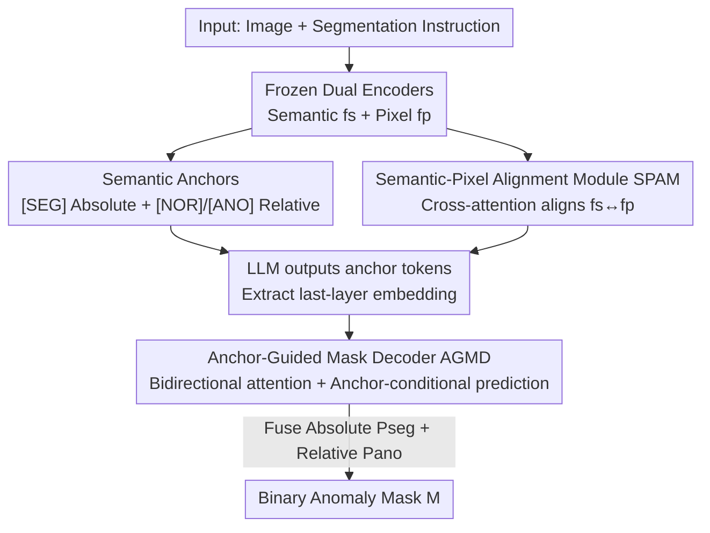

# AG-VAS: Anchor-Guided Zero-Shot Visual Anomaly Segmentation with Large Multimodal Models

**Conference**: CVPR 2026  
**Paper**: [CVF Open Access](https://openaccess.thecvf.com/content/CVPR2026/html/Qu_AG-VAS_Anchor-Guided_Zero-Shot_Visual_Anomaly_Segmentation_with_Large_Multimodal_Models_CVPR_2026_paper.html)  
**Code**: https://github.com/xiaozhen228/AG-VAS  
**Area**: Multimodal VLM / Anomaly Segmentation  
**Keywords**: Zero-shot Anomaly Segmentation, Large Multimodal Models, Semantic Anchors, Instruction Segmentation, Industrial/Medical Defects

## TL;DR
AG-VAS introduces three learnable "semantic anchor" tokens into the Large Multimodal Model (LMM) vocabulary: an absolute anchor `[SEG]` that translates abstract "anomalies" into concrete visual entities (e.g., holes, scratches), and relative anchors `[NOR]`/`[ANO]` that model contrastive contexts between normal and anomalous regions. Combined with a Semantic-Pixel Alignment Module (SPAM) and an Anchor-Guided Mask Decoder (AGMD), the model directly outputs binary anomaly masks for unseen categories, achieving new zero-shot SOTA performance across six industrial and medical benchmarks.

## Background & Motivation

**Background**: Zero-shot visual anomaly segmentation (ZSAS) aims to segment defect areas in unseen categories without retraining, which is crucial for data-scarce and privacy-sensitive industrial inspection and medical imaging. Prevailing methods are largely built on CLIP (e.g., AnomalyCLIP, Bayes-PFL), utilizing "normal/anomalous" text prompts aligned with patch-level image embeddings for localization.

**Limitations of Prior Work**: The CLIP-based paradigm faces two main hurdles. First, the limited representation and reasoning capabilities of CLIP have led to a performance bottleneck in ZSAS. Second, CLIP does not natively produce binary masks, requiring heuristic thresholds or manual tuning for binarization, which complicates deployment. Recently, LMMs (e.g., Anomaly-OV) have been explored, but they mostly focus on image-level text descriptions or classification rather than pixel-level binary masks.

**Key Challenge**: Directly applying LMMs for segmentation (e.g., LISA's embedding-as-mask paradigm) often fails on industrial/medical anomalies, sometimes even confusing foreground and background. The authors attribute this to: ① "Anomaly" is a highly abstract concept without a stable visual prototype (it could be a hole, crack, or scratch), making it difficult to map text descriptions to specific visual entities. ② Misalignment between the pixel-level features of the segmenter and the vision-language embedding space of the LMM leads to inaccurate localization.

**Goal**: To build an end-to-end ZSAS framework based on pre-trained LMMs that can interpret complex segmentation instructions and directly output binary masks.

**Key Insight**: The authors draw inspiration from two complementary reasoning paths used by human inspectors: using prior world knowledge of "what defects look like and where they occur" (holes, cracks), and identifying inconsistencies by comparing candidate areas with surrounding normal regions. These paths are implemented as two types of learnable anchors.

**Core Idea**: Extend the LMM vocabulary with absolute semantic anchors `[SEG]` (injecting world knowledge of defect appearance/structure/location) and relative semantic anchors `[NOR]`/`[ANO]` (modeling cross-category context contrast between normal and anomalous states). These three tokens serve as a semantic bridge between the LMM and the segmenter for instruction-driven anomaly segmentation.

## Method

### Overall Architecture

AG-VAS is an anchor-guided end-to-end pipeline: given an image $x_{img}$ and a text instruction $x_{txt}$, it outputs a binary anomaly mask $M$. The pipeline consists of four components: a frozen semantic image encoder $\mathcal{F}_s$ (SigLIP), a frozen pixel image encoder $\mathcal{F}_p$ (SAM-ViT-H), an LLM (default: LLaVA-OneVision-7B, fine-tuned with LoRA), a Semantic-Pixel Alignment Module (SPAM), and a lightweight Anchor-Guided Mask Decoder (AGMD).

The workflow is as follows: the encoders extract semantic features $f_s$ and pixel features $f_p$. SPAM uses cross-attention to align them into $f_{align}$, which is fed into the LLM along with text embeddings. The LLM output includes the three anchor tokens `[NOR]`, `[ANO]`, and `[SEG]`. Their last-layer embeddings are projected into the decoder space via a Token Refiner. AGMD then takes these anchor embeddings and learnable queries to perform bidirectional cross-attention with pixel features $f_p$. Finally, the absolute anchor generates a foreground probability map, while relative anchors generate a normal-vs-anomalous contrast map. These are fused and thresholded to obtain the mask. Both implicit (direct segmentation) and explicit (description-then-segmentation) reasoning modes are supported.

### Key Designs

**1. Semantic Anchors: Anchoring Abstract "Anomalies" to Segmentable Visual Entities**

This design addresses the lack of a stable visual prototype for anomalies. Instead of standard prompt tuning, the authors introduce three special tokens in the LMM vocabulary to learn task-specific embeddings. The absolute anchor `[SEG]` acts as an "absolute semantic reference," translating abstract anomalous semantics into explicit visual entities by encoding world knowledge of appearance and location. The relative anchors `[NOR]`/`[ANO]` serve as "relative references," modeling the contrast between normal and anomalous patterns, mimicking how inspectors compare regions with their surroundings. These tokens are generated by the LLM in the sequence `[NOR][ANO][SEG]`, allowing for flexible switching between implicit and explicit reasoning modes.

**2. Semantic-Pixel Alignment Module (SPAM): Re-aligning High-level Semantics to Pixels**

High-level LMM embeddings often lack spatial coherence with low-level pixel features, which is a primary reason for the poor localization in LISA-like methods. SPAM first linearly projects both features to the same dimension: $f_s = \mathrm{Linear}_s(\mathcal{F}_s(x_{img}))$ and $f_p = \mathrm{Linear}_p(\mathcal{F}_p(x_{img}))$. It then employs Multi-Head Cross-Attention (MHCA) where semantic features act as queries to attend to pixel features:

$$f_{align} = \mathrm{MHCA}(\mathbf{Q}=f_s,\ \mathbf{K}=f_p,\ \mathbf{V}=f_p)$$

The aligned embedding $f_{align}$ is concatenated with $f_s$ and text embeddings $f_{txt}$ before entering the LLM. This ensures anchor tokens learn representations already grounded in pixel-level spatial information.

**3. Anchor-Guided Mask Decoder (AGMD): Fusing Absolute and Relative Maps**

AGMD refines the LLM anchor embeddings into $h_{nor}, h_{ano}, h_{seg}$ via a Token Refiner and combines them with learnable queries to form the decoder input $\mathbf{Z}_0 = [t_{nor}, t_{ano}, t_{seg}, h_{nor}, h_{ano}, h_{seg}]$. $\mathbf{Z}_0$ and pixel embeddings $f_p$ undergo $L$ layers of bidirectional cross-attention (based on the SAM design). The refined absolute anchor query $t'_{seg}$ produces the foreground probability map $P_{seg} = \sigma(t'_{seg} f_p'^{\top})$, while the relative anchor queries $[t'_{nor}, t'_{ano}]$ produce the normal-anomalous map $[P_{nor}, P_{ano}] = \mathrm{Softmax}([t'_{nor}, t'_{ano}] f_p'^{\top})$. The final prediction is a weighted fusion:

$$P = \alpha \cdot P_{seg} + (1-\alpha) \cdot P_{ano},\quad \alpha = 0.5$$

This dual-path approach combines direct localization with contrastive cues, significantly reducing over-segmentation on normal images.

**4. Anomaly-Instruct20K: Injecting Structured Defect World Knowledge**

To ensure anchors learn precise semantics, the authors used the Inter-S1-241B model to construct Anomaly-Instruct20K. Unlike previous datasets, it organizes defect knowledge into five structured fields: **Expectation** (ideal state), **Observation** (visual deviations), **Diagnosis** (why it violates consistency), **Summary** (concise segmentation instruction), and **Explanation** (coherent reasoning). During training, these are used to generate four types of instructions (e.g., Direct Segmentation, Segment-then-Explain) across 20k samples, effectively injecting the "what and where" of defects into the anchors.

### Loss & Training

The model is optimized via two objectives: ① **Autoregressive Text Loss**: Standard cross-entropy $\mathcal{L}_{txt}$ for all target tokens including anchors. ② **Segmentation Loss**: A combination of BCE and Dice loss for AGMD predictions, $\mathcal{L}_{seg} = \sum_{c}\big(\lambda_{bce}\mathrm{BCE}(P_c, M_c) + \lambda_{dic}\mathrm{Dice}(P_c, M_c)\big)$, where $c \in \{SEG, NOR, ANO\}$. The normal anchor `[NOR]` uses the complement of the anomaly mask as its ground truth. The model is trained multi-task: general semantic segmentation (ADE20K), anomaly segmentation (Anomaly-Instruct20K + Anomaly-Seg20K), and VQA (LLaVA-150K). Fine-tuning uses LoRA (rank 16) with AdamW on 4×A100 GPUs for approximately 30 hours.

## Key Experimental Results

### Main Results

Evaluated across 6 benchmarks (Industrial: MVTec-AD, KSDD2, RSDD; Medical: ISIC, ColonDB, ClinicDB) using pixel-level metrics (AP, F1-Max, IoU_ano).

| Method | Base | MVTec-AD (AP/F1/IoU) | ColonDB (AP/F1/IoU) | ClinicDB (AP/F1/IoU) |
|------|------|------|------|------|
| Bayes-PFL* (CLIP-based) | ViT-L-14 | 50.3 / 50.4 / 29.9 | 30.5 / 38.1 / 27.7 | 47.6 / 50.7 / 34.4 |
| LISA* | LLaVA-OneVision-7B | 41.0 / 44.1 / 32.3 | 67.2 / 62.9 / 43.8 | 81.0 / 74.1 / 59.8 |
| **AG-VAS** | LLaVA-OneVision-7B | **51.0 / 52.7 / 44.8** | **70.7 / 66.2 / 58.2** | **86.6 / 79.2 / 69.5** |

AG-VAS outperforms baselines across all datasets. Notably, while CLIP-based methods (e.g., Bayes-PFL) achieve decent AP, their **IoU_ano is significantly lower**, indicating blurry localization. AG-VAS shows zero-shot generalization on medical datasets despite no medical training data, leveraging its internal world knowledge.

**Rejection of Normal Samples** (MVTec-AD, IoU_nor = 1 for empty mask on normal images, else 0):

| Method | Base | IoU_ano | IoU_nor | Average |
|------|------|---------|---------|---------|
| LISA | LLaVA-OneVision-7B | 32.2 | 4.0 | 18.1 |
| LISA* | LLaVA-OneVision-7B | 32.3 | 80.9 | 56.6 |
| **AG-VAS** | LLaVA-OneVision-7B | **44.8** | **87.7** | **66.3** |

AG-VAS successfully rejects normal samples (IoU_nor 87.7%), demonstrating the robustness provided by the relative anchors.

### Ablation Study

Impact of modules and data (MVTec-AD):

| Configuration | AP | F1-Max | IoU_nor | IoU_ano |
|------|----|--------|---------|---------|
| Full AG-VAS | 51.0 | 52.7 | 87.7 | 44.8 |
| w/o `[SEG]` | 49.1 | 50.9 | 85.6 | 42.1 |
| w/o `[NOR][ANO]` | 47.2 | 49.7 | **52.1** | 39.5 |
| w/o SPAM | 46.5 | 48.0 | 70.6 | 41.4 |
| w/o General Seg. | **36.1** | **36.5** | 70.2 | **34.9** |

### Key Findings
- **Universal segmentation data is critical**: Removing it results in the largest AP drop (51.0 to 36.1), proving that multi-domain joint training is essential for aligning anchors to visual features.
- **Relative anchors enable rejection**: Removing `[NOR][ANO]` causes IoU_nor to plummet, confirming that the normal-anomalous contrast is the primary mechanism for avoiding false positives.
- **Zero-shot Generalization**: LMM-based AG-VAS demonstrates superior generalization from industrial to medical domains compared to CLIP-based methods.

## Highlights & Insights
- **Tokenizing abstract "anomalies"**: Since anomalies lack a fixed prototype, creating learnable "absolute + relative" semantic anchors allows the model to ground abstract concepts into visual segmentation. This "dual-anchor" design is transferable to other abstract segmentation tasks (e.g., disease lesions, change detection).
- **Rejection as a priority**: By including IoU_nor as a key metric and optimizing for it with relative anchors, the model addresses one of the most critical deployment issues: over-segmentation/false alarms.
- **Structured Instruction Data**: The automated generation of five-field structured labels effectively explicitizes the reasoning chain of a quality inspector, providing a reusable methodology for custom domain adaptation.

## Limitations & Future Work
- The framework relies on a 241B closed-source/large model (Inter-S1) for generating Anomaly-Instruct20K, which may limit reproducibility and data scaling ⚠️.
- Explicit reasoning modes (e.g., Describe-then-Segment) may introduce text-based noise that slightly degrades segmentation precision compared to direct segmentation.
- Robustness to multi-defect scenarios, extremely small defects, and extreme distribution shifts needs further validation; the fusion weight $\alpha$ remains fixed at 0.5 ⚠️.

## Related Work & Insights
- **vs. LISA**: While LISA uses a single `[SEG]` token for general objects, AG-VAS uses a triple-anchor system with SPAM and AGMD to solve the abstraction and misalignment problems specific to anomalies.
- **vs. AnomalyCLIP**: CLIP-based methods are limited by frozen patch embeddings and non-binary outputs; AG-VAS leverages LMM world knowledge and direct mask generation for significantly higher IoU_ano.
- **vs. Anomaly-OV**: Previous LMM-based anomaly works were limited to text-level descriptions; AG-VAS pushes LMM capabilities to pixel-level binary segmentation.

## Rating
- Novelty: ⭐⭐⭐⭐⭐ Tokenizing anomalies into "absolute + relative" anchors is a highly effective abstraction.
- Experimental Thoroughness: ⭐⭐⭐⭐ Solid results across 6 benchmarks with comprehensive ablations.
- Writing Quality: ⭐⭐⭐⭐ Clear motivation and well-explained anchor design.
- Value: ⭐⭐⭐⭐⭐ A practical solution for ZSAS with direct binary output and strong rejection capabilities.

<!-- RELATED:START -->

## Related Papers

- [\[CVPR 2026\] Metric-Guided Feature Fusion of Visual Foundation Models for Segmentation Tasks](metric-guided_feature_fusion_of_visual_foundation_models_for_segmentation_tasks.md)
- [\[CVPR 2026\] DSS: Discover, Segment, and Select for Zero-shot Camouflaged Object Segmentation](discover_segment_and_select_a_progressive_mechanism_for_zero-shot_camouflaged_ob.md)
- [\[NeurIPS 2025\] PARTONOMY: Large Multimodal Models with Part-Level Visual Understanding](../../NeurIPS2025/segmentation/partonomy_large_multimodal_models_with_part-level_visual_understanding.md)
- [\[CVPR 2026\] SGMA: Semantic-Guided Modality-Aware Segmentation for Remote Sensing with Incomplete Multimodal Data](sgma_semantic-guided_modality-aware_segmentation_for_remote_sensing_with_incompl.md)
- [\[CVPR 2026\] MV3DIS: Multi-View Mask Matching via 3D Guides for Zero-Shot 3D Instance Segmentation](mv3dis_multi-view_mask_matching_via_3d_guides_for_zero-shot_3d_instance_segmenta.md)

<!-- RELATED:END -->
