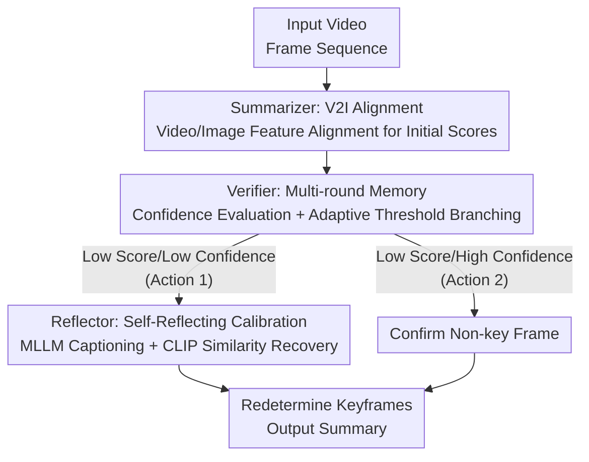

# Agentic Video Summarization via Self-Reflecting Multimodal Understanding

**Conference**: CVPR 2026  
**Paper**: [CVF Open Access](https://openaccess.thecvf.com/content/CVPR2026/html/Guo_Agentic_Video_Summarization_via_Self-Reflecting_Multimodal_Understanding_CVPR_2026_paper.html)  
**Code**: None  
**Area**: Multimodal VLM / Video Understanding  
**Keywords**: Video Summarization, Agentic Workflow, MLLM, Self-Reflection, Importance Scoring

## TL;DR
Reinterprets video summarization from a "one-time importance score regression" into a "predict-verify-reflect" closed-loop workflow composed of three MLLM agents: Summarizer, Verifier, and Reflector. This allows the model to self-correct and retrieve missed keyframes, outperforming previous SOTA on SumMe and TVSum in Kendall's $\tau$ and Spearman's $\rho$.

## Background & Motivation
**Background**: The mainstream approach for video summarization is regressing an "importance score" for each frame and selecting keyframes based on these scores. Early methods used CNN / LSTM for frame-level feature regression (e.g., CSTA), while recent approaches leverage Multimodal Large Models (MLLMs) for "abstractive summarization"—LLMVS uses LLaVA to generate captions followed by Llama-2 encoding, and Kim et al. use VideoLLaMA to extract visual embeddings directly.

**Limitations of Prior Work**: Both categories have inherent flaws. Pure regression methods lack high-level semantics and global temporal reasoning; if a prediction is wrong, it can only be "forced" back through retraining, lacking self-correction capabilities. Methods using MLLMs as passive features or scorers rely on manually crafted textual prompts to define "what counts as an important frame"—a process that is subjective, laborious, and poor in reproducibility and scalability.

**Key Challenge**: Traditional models provide a "one-time output," where the process ends after prediction. There is no mechanism to verify the accuracy of the prediction or to salvage missed segments. Conversely, when humans summarize videos, they perceive event transitions, re-watch segments, and iteratively refine their understanding. This gap between "passive single prediction" and "active iterative correction" is the root cause of inaccuracy in existing methods.

**Goal**: To enable MLLMs to autonomously complete a "predict → verify → reflect" closed loop, decomposing complex importance assessment into several interpretable sub-steps without relying on retraining or ultra-long manual prompts.

**Key Insight**: Instead of designing new feature extraction or regression architectures, the authors directly reuse the existing understanding and reflective reasoning capabilities of MLLMs. By drawing inspiration from the "sequential decision-making + self-feedback" logic of video agents like VideoAgent, the summarization task is assigned to a group of atomic agents with clear divisions of labor.

**Core Idea**: Replace "single-model one-time regression" with a "three-agent self-reflection workflow"—where the Summarizer produces initial scores, the Verifier assesses confidence, and the Reflector uses self-reflection to retrieve missed keyframes.

## Method
AgenticVS is the first method to introduce an agentic workflow into video summarization. Given a video $F=[f_1,\dots,f_N]\in\mathbb{R}^{N\times3\times H\times W}$, traditional methods map each frame to features using frozen visual encoders and then use a VS model (e.g., CSTA) to regress importance scores $S\in\mathbb{R}^N$. AgenticVS maintains this "initial scoring" backbone but attaches two train-free MLLM agents around it, transforming "one-time prediction" into a closed-loop "predict-verify-reflect" process.

### Overall Architecture
The entire pipeline consists of three atomic agents connected in a looped chain: the **Summarizer** first produces initial frame-wise scores using aligned visual features; the **Verifier** re-examines these scores through a multi-round memory mechanism, providing confidence levels and branching the flow—frames with low scores and low confidence are judged as "likely misjudged, needing salvage," while those with low scores but high confidence are confirmed as non-key frames and passed through; frames needing salvage are handed to the **Reflector**, which generates a textual video summary via MLLM and then uses CLIP to compute "frame-summary" similarity as a precise calibration score, replaces the unreliable initial scores, and finally re-determines the keyframe positions.

### Key Designs

**1. Summarizer and V2I Alignment: "Injecting" Fine-grained Image Semantics into Video Features**

The pain point is specific: previous works mostly used image-level encoders to extract features from static frames, losing temporal event transition information; meanwhile, pure video models are relatively weak in fine-grained semantic discrimination despite having temporal dynamics. The Summarizer uses both an image encoder (GoogLeNet, outputting $v_{img}\in\mathbb{R}^{d_i}$) and a video encoder (VideoMAEv2, using $2\times16\times16$ spatio-temporal cubes as tokens for segments of $\omega$ frames, outputting $v_{vid}\in\mathbb{R}^{\frac{\omega}{2}\times d_v}$). It then aligns video features into the image feature space via V2I Alignment. Specifically, **Temporal Attention Pooling** based on multi-head attention is used to compress the temporal dimension $\frac{\omega}{2}$ for shape consistency, followed by an AdaptMLP adapter with LayerNorm + GELU that learns a mapping $F_{v2i}:\mathbb{R}^{\frac{\omega}{2}\times d_v}\to\mathbb{R}^{d_i}$ to produce integrated embeddings $v_{v2i}$ containing both intra- and inter-frame information. The training uses a composite loss: $L_{v2i}=\frac{1}{T}\sum_t\lVert\hat v_{vid}^t-v_{img}^t\rVert_2^2+\lambda\frac{1}{T}\sum_t\lVert\hat v_{vid}^t-v_{vid}^t\rVert_2^2$ (with $\lambda=10^{-3}$). The first term pulls mapped features toward the image space, while the second term acts as a residual constraint to prevent excessive deviation from original video embeddings. Notably, image features are **only used as targets during training**; during inference, only video-side features are used, removing the need to run the image encoder.

**2. Verifier Multi-round Memory: Using MLLM to "Assign Confidence" and Branch Initial Scores**

Even with local temporal information, the Summarizer may still miss key segments due to its lack of global understanding of the video content. The Verifier compensates for this with a train-free MLLM (Qwen2.5-VL-7B-Instruct) using a multi-round memory prompt. In the "learning phase," the MLLM learns human scoring standards and patterns; in subsequent rounds, it **specifically reviews positions with low initial scores**, providing a confidence level $c_t$ based on learned rules. An adaptive threshold $\theta_s=\text{mean}(s_t)-0.5\cdot\text{std}(s_t)$ is used to identify "low-score" frames. For each frame, a binary decision is made: if $s_t$ and $c_t$ are both low (Action 1), the score is likely a misjudgment, and the frame is sent to the Reflector for recovery; if $s_t$ is low but $c_t$ is high (Action 2), the low score is deemed credible. The value of this step is that it avoids modifying the Summarizer's network, using the MLLM's memory and reasoning as an "auditor" to spend expensive reflection only on truly suspicious frames.

**3. Reflector Self-Reflecting Calibration: MLLM Summary Generation + CLIP Scoring to Salvage Missed Frames**

Upon receiving Action 1 from the Verifier, the Reflector corrects the errors. Unlike the Verifier directly asking for results, the Reflector follows a "understand then score" two-step process: it first instructs the MLLM to understand and summarize the video focusing on content, event transitions, and scene changes to generate a caption. For the frames marked for recalibration $\{\hat f_t\}$, each frame is fed alongside the caption into CLIP, using cosine similarity as the calibration score: $\hat s_t=\cos(E_v(\hat f_t),\,E_t(F_{MLLM}(V)))$. Since initial scores $\{s_t\}$ and CLIP similarities $\{\hat s_t\}$ have different scales, the authors normalize both and rescale the CLIP scores to the range of the initial scores before redetermining keyframe positions. A key insight is: why not let Qwen-VL output scores directly? Because MLLM-generated scores resemble "human response" styles with low frame-wise discriminability, which are unsuitable for ranking metrics like $\tau$ and $\rho$; CLIP scores are stable and provide clear inter-frame differentiation. Thus, Qwen-VL "understands" and CLIP "scores."

### Loss & Training
The Verifier and Reflector are train-free; **only the V2I Alignment module and the VS model are trained**. V2I uses the composite MSE + residual regularization loss (Eq. 3). The VS model is trained using the squared error between initial scores and ground truth: $L=\frac{1}{T}\sum_t(s_t^*-s_t)^2$ (Eq. 4). Implementation uses VideoMAEv2 with an 8-frame sliding window ($\omega=8$), CSTA as the VS backbone, Qwen2.5-VL-7B-Instruct as the MLLM, and CLIP ViT-B/32 for the Reflector. Training uses a learning rate of $1\times10^{-4}$, weight decay of $1\times10^{-4}$, and batch size of 1 on a V100.

## Key Experimental Results

### Main Results
Evaluation was conducted on SumMe (25 YouTube videos) and TVSum (50 videos) using Kendall's $\tau$ and Spearman's $\rho$ (F1 is omitted as it is biased toward short clips by length constraints).

| Dataset | Metric | AgenticVS | Best Pure Visual (CSTA) | Best Visual+Text (LLMVS) |
|--------|------|-----------|------------------|----------------------|
| SumMe | $\tau$ | **0.274** | 0.246 | 0.253 |
| SumMe | $\rho$ | **0.308** | 0.274 | 0.282 |
| TVSum | $\tau$ | **0.220** | 0.194 | 0.211 |
| TVSum | $\rho$ | **0.290** | 0.255 | 0.275 |

All four metrics outperform all non-agentic methods (both pure visual and visual+text) and significantly exceed human baselines (SumMe $\rho=0.213$, TVSum $\rho=0.204$).

### Ablation Study
Components added sequentially (baseline is image/video embeddings concatenated and reshaped for CSTA without agentic workflow):

| Baseline | V2I | V | R | SumMe $\tau/\rho$ | TVSum $\tau/\rho$ | Description |
|----------|-----|---|---|-----------|-----------|------|
| ✓ | ✗ | ✗ | ✗ | 0.230 / 0.257 | 0.178 / 0.232 | Pure concatenation baseline |
| ✓ | ✓ | ✗ | ✗ | 0.265 / 0.296 | 0.215 / 0.278 | With V2I alignment |
| ✓ | ✓ | ✓ | ✓ | **0.274 / 0.308** | **0.220 / 0.290** | Full workflow |

Design choices within V2I Alignment (on SumMe):

| Configuration | $\tau$ | $\rho$ | Description |
|------|---|---|------|
| $E_{img}$ only | 0.228 | 0.254 | Single image encoder |
| $E_{vid}$ only | 0.220 | 0.245 | Single video encoder |
| Concat both | 0.230 | 0.257 | Direct concat without alignment |
| I2V alignment | 0.238 | 0.265 | Alignment in reverse direction |
| **V2I alignment** | **0.265** | **0.296** | Video aligned to image space |
| Mean pooling | 0.243 | 0.270 | Mean pooling |
| **Temporal Attention Pooling** | **0.265** | **0.296** | Temporal Attention Pooling |

### Key Findings
- **V2I Alignment provides the largest contribution**: Adding it improves $\tau/\rho$ by ~15.2% on SumMe and by ~20.8%/19.8% on TVSum, far exceeding the incremental gains from Verifier+Reflector. This identifies fine-grained image semantic alignment as the primary performance engine.
- **Alignment direction matters**: V2I (video to image space) is significantly better than I2V (0.265 vs 0.238 $\tau$), indicating that fine-grained semantics from the image side should be the target; Temporal Attention Pooling also outperforms mean pooling by adaptively weighting frames/regions.
- **Verifier must be paired with Reflector**: The Verifier itself is only an "audit and branch" bridge and does not produce corrections; gains only materialize when paired with the Reflector to rescore suspicious frames.
- **Train-free Reflector alone beats early supervised methods**: On SumMe, CLIP calibration scores alone (without Summarizer/Verifier) achieve $\tau=0.116$ and $\rho=0.128$, exceeding early fully supervised methods like DMASum, iPTNet, and A2Summ. Direct Qwen-VL scoring only yields $\tau=0.073$, validating the "MLLM understanding + CLIP scoring" division of labor.

## Highlights & Insights
- **Decoupling "scoring" and "understanding" across models**: Reflector assigns Qwen-VL the task of caption generation/video understanding and CLIP the task of producing stable fine-grained scores, avoiding the "low discriminability" issue of direct MLLM scoring. This division can be transferred to any task requiring continuous/ranking scores from MLLMs.
- **Train-free agents as "external auditors"**: Verifier and Reflector require no training, adding a self-correction loop to a pre-trained VS model via prompts and memory mechanisms. They only consume compute on suspicious frames (via $\theta_s$), providing a paradigm for extending the lifespan of legacy models.
- **V2I over I2V direction**: Aligning video features to image space (preserving fine-grained image priors) is superior; this choice of "alignment target" serves as a valuable reference for cross-modal alignment.

## Limitations & Future Work
- **Dependency on CSTA as VS backbone**: The Summarizer is still built on a traditional regression model, meaning the initial score quality is bounded by the backbone's limit; only CSTA's generalizability was tested.
- **Absolute metrics remain relatively low**: Even with SOTA results, TVSum $\rho$ is only 0.290. This indicates the task is inherently difficult with high label subjectivity.
- **Evaluation limited to small SumMe/TVSum datasets**: SumMe has only 25 videos. The scalability of agentic workflows on long-form or multi-scene videos remains unverified.
- **Prompt and multi-round interaction costs**: Running MLLM dialogues + CLIP for every suspicious segment increases inference overhead and latency compared to one-time regression; the paper lacks a time-consumption analysis.

## Related Work & Insights
- **vs LLMVS**: LLMVS treats MLLMs as passive caption/embedding generators (LLaVA for captions, Llama-2 for encoding) in a one-time process; AgenticVS uses MLLMs as active "verify-reflect" agents in a loop capable of self-correction, outperforming LLMVS across both datasets.
- **vs CSTA (Pure Visual Regression)**: CSTA only performs feature concatenation and regression without semantic reflection. AgenticVS reuses CSTA as a backbone and wraps it in an agentic workflow, raising $\rho$ from 0.274 to 0.308, proving gains stem from the "workflow" rather than the architecture.
- **vs VideoAgent**: VideoAgent models long video understanding as sequential decision-making with self-feedback for VQA. AgenticVS adopts the "self-feedback" philosophy but applies it to the more structured task of video summarization using a controlled "agentic workflow" rather than a fully autonomous agent.

## Rating
- Novelty: ⭐⭐⭐⭐ First to introduce a "predict-verify-reflect" agentic loop to video summarization with a clear division of labor.
- Experimental Thoroughness: ⭐⭐⭐ Main tables and ablations are consistent, but limited to two small datasets with no efficiency analysis.
- Writing Quality: ⭐⭐⭐⭐ Motivation and three-agent logic are clearly explained; figures align well with text.
- Value: ⭐⭐⭐⭐ The "train-free agent plugin + MLLM/CLIP scoring decoupling" paradigm is transferable and provides inspiration for adding self-correction to legacy models at low cost.

<!-- RELATED:START -->

## Related Papers

- [\[CVPR 2026\] EvoGraph-R1: Self-Evolving Multimodal Knowledge Hypergraphs for Agentic Retrieval](evograph-r1_self-evolving_multimodal_knowledge_hypergraphs_for_agentic_retrieval.md)
- [\[CVPR 2026\] Chain-of-Frames: Advancing Video Understanding in Multimodal LLMs via Frame-Aware Reasoning](chain-of-frames_advancing_video_understanding_in_multimodal_llms_via_frame-aware.md)
- [\[CVPR 2026\] See What I Mean: Aligning Vision and Language Representations for Video Fine-grained Object Understanding](see_what_i_mean_aligning_vision_and_language_representations_for_video_fine-grai.md)
- [\[CVPR 2026\] ReMoRa: Multimodal Large Language Model based on Refined Motion Representation for Long-Video Understanding](remora_multimodal_large_language_model_based_on_refined_motion_representation_fo.md)
- [\[CVPR 2026\] REVISOR: Beyond Textual Reflection, Towards Multimodal Introspective Reasoning in Long-Form Video Understanding](revisor_beyond_textual_reflection_towards_multimodal_introspective_reasoning_in_.md)

<!-- RELATED:END -->
